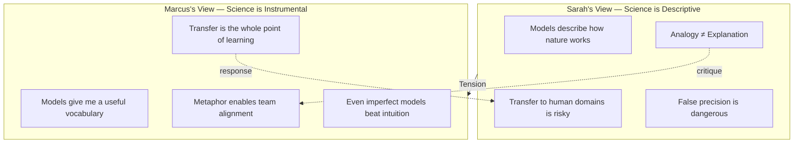

## 🎙️ Introduction

Welcome to BookAtlas. Today: *The Great Mental Models Volume 2: Physics,
Chemistry and Biology* by Shane Parrish and Rhiannon Beaubien. Published
2019, republished 2024 by Portfolio. 304 pages. If you read Volume 1 and
wished it went deeper into actual science — or if you are a Charlie Munger
fan wondering where to start with the latticework idea — this book is for
you.

To wrestle with this one, we have Dr. Sarah Chen, a physicist at MIT who
studies complex systems, and Marcus Webb, founder of a B2B SaaS company
that went through Y Combinator. Let's hear what they make of it.

---

## 🎙️ The Debate: Useful Framework or Intellectual Cosplay?

**Marcus:** Okay, I'll start. I loved this book. It gave me a vocabulary for
things I already sensed. Like friction — I knew our approval process was
killing momentum, but calling it "friction" made it concrete. I could
measure it, name it, fix it.

**Sarah:** I get that, but I have a problem. Friction in physics is a
specific force with a precise definition — it's proportional to the normal
force and independent of surface area. When you say "bureaucratic friction,"
you are using a metaphor, not a model. The question is whether the metaphor
is doing genuine cognitive work or just sounding impressive.

**Marcus:** Feels like genuine work to me. My team understood "let's reduce
friction" immediately. They wouldn't have understood "let's streamline our
approval process" — that's vague. Friction gives you a mechanism: you can
ask what's causing resistance and where to lubricate.

**Sarah:** Fair point. But here's where I worry — you said your team
understood it immediately. That is because friction maps easily onto
ordinary experience. You do not need Newton to tell you that some things
are harder to push than others. So what does the physics actually add?

**Marcus:** It adds precision. Once you name it as friction, you stop
thinking "we need to push harder" and start thinking "what is creating
resistance?" That shift — from force-thinking to friction-thinking — is
genuinely useful. I saw my leadership team make that exact pivot after
reading the book.

**Sarah:** Okay, I concede that point. Let me push back on something else —
evolution. The book applies evolutionary concepts to business competition,
which makes me deeply uncomfortable. Evolution has no direction, no goal,
no ethics. It is a blind process. When you say a company "adapted" or
"failed to evolve," you are smuggling moral judgment into a description
that should be neutral. Blockbuster did not "fail to evolve" — it made the
wrong bet. The difference matters for learning.

---

## 🎙️ Activation Energy & Personal Change

**Marcus:** Here is one I think we will agree on — activation energy. The
book argues that the hardest part of any change is crossing the initial
energy barrier. Once the reaction starts, it can sustain itself. This
matches everything I've seen in product adoption and personal behavior.

**Sarah:** Yes. This is my favorite model in the book, and I think it
transfers cleanly. Activation energy is a real concept in chemistry, and
the mapping to human behavior is strong. You lower the barrier to starting
a habit, you make it easier to stop a bad one. The book's insight that
"lasting change requires more activation energy than superficial change" is
genuinely valuable.

**Marcus:** We applied it at my company. We had a feature that users
wanted, but adoption was zero. We realized it required three clicks through
two menus to activate. That is activation energy. We moved it to the home
screen with one click — adoption went from zero to 40% in a month.

**Sarah:** Perfect example. And notice: you did not need the chemical
definition to solve that problem. You just needed the concept that the
barrier to starting matters as much as the quality of the destination. The
book gave you a name for it, which helped you prioritize it.

**Marcus:** Right. And that is what I love about this book. It does not
give you new facts. It gives you new *categories*. Once you categorize
something as an activation energy problem, you stop treating it as a
motivation problem or a quality problem. The category itself suggests the
solution.

---

## 🎙️ The Red Queen Effect

**Sarah:** Let me ask you about the Red Queen. The book uses Lewis Carroll's
character who has to keep running just to stay in place. Biologically, this
describes co-evolutionary arms races — predators and prey both getting
faster. The book applies it to business: you have to keep innovating just
to maintain your position.

**Marcus:** This is brutally true in SaaS. Our competitors ship features
every two weeks. If we slow down, we lose ground. But here is the paradox
the book does not fully address — the Red Queen effect means everyone is
running, but no one is getting ahead. It is a collective action problem.
Maybe the smart move is to stop running and find a different race.

**Sarah:** That is exactly the insight the biological version gives you.
In nature, the Red Queen explains why sex evolved — genetic recombination
creates variety that helps stay ahead of parasites. The "solution" to the
Red Queen is not to run faster but to change the game. In business terms,
maybe that means platform play, ecosystem thinking, or finding a niche
where the arms race is slower.

**Marcus:** The niche concept! The book argues that specialists own their
space but are vulnerable to disruption, while generalists survive
disruption but struggle to dominate. We debated this endlessly at our
last strategy offsite. Do we go deep (specialist) or broad (generalist)?

**Sarah:** And what did you decide?

**Marcus:** Both. We picked a core niche where we dominate, but we build
generalist capabilities around the edges. It is the biological equivalent
of a species that is specialized for its current environment but maintains
genetic diversity for when conditions change.

**Sarah:** That is actually more sophisticated than the book gets. The book
presents specialist vs generalist as a trade-off. The real world is more
like a portfolio — you can be both at different scales. But credit to the
book: it gave you the vocabulary to have that conversation at all.

---

## 🎙️ Where the Book Falls Short

**Marcus:** My biggest frustration: the book does not show models
interacting. Munger always talks about the "latticework" — models
supporting each other. Volume 2 presents them in isolation. I would love a
chapter on how velocity + friction + activation energy work together.

**Sarah:** Agreed. And the book lacks a warning label. These are models,
not truth. They are useful fictions. A physicist would never confuse a
model with reality, but a general reader might. When you say "evolution
rewards adaptation," a biologist hears "evolution is a blind process with
no reward system." A CEO hears "the market will reward me if I adapt." That
is a dangerous gap.

**Marcus:** So what is your final take? Is this book worth reading?

**Sarah:** Yes. With caveats. It is a great *introduction* to thinking with
scientific concepts. But treat it as a starting point. For every model that
resonates, go read the original science. Feynman's lectures on physics.
Darwin's Origin of Species. E.O. Wilson on ecosystems. The book is a menu,
not the meal.

**Marcus:** I agree. I have gifted this book to my entire leadership team.
But I also tell them: use the models as lenses, not as truth. Try them on.
If a model helps you see something new, keep it. If it obscures more than
it reveals, discard it. The goal is not to be a scientist — it is to be a
better thinker.

---

## 🎙️ Final Thoughts

**Marcus:** The book's real value is not the models themselves. It is the
attitude: that the laws of nature are the most reliable patterns we have,
and that understanding them makes you a better decision-maker. That is a
powerful philosophy.

**Sarah:** And the danger is the same. Natural laws describe what *is*, not
what *ought to be*. The moment you start using "survival of the fittest" to
justify layoffs or "ecosystem dynamics" to excuse inequality, you have
stepped from science into ideology. The book warns against this, but the
warning is too brief for the risk it represents.

**Marcus:** Bottom line: read Volume 2. Read Volume 1. Read Taleb. Read
Munger. Read the original scientists. Build your own latticework. And never
forget that a model is a tool, not an answer.

---

*Next time: Volume 3 — Systems and Mathematics.*
