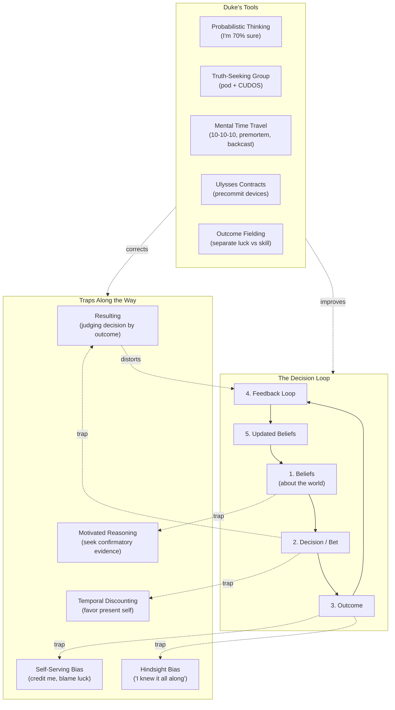
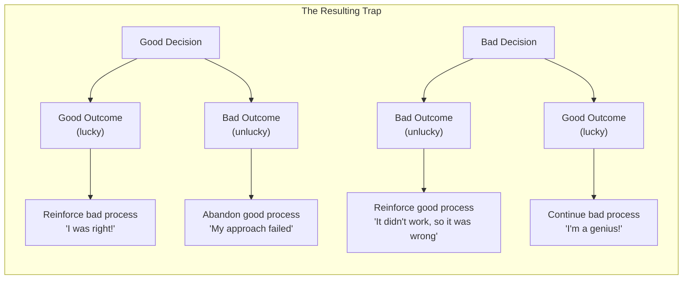

---

## Core Concepts

### Resulting

The tendency to equate the quality of a decision with the quality of its
outcome. Duke's central concept and the primary error she aims to correct.

**Poker example:** You go all-in with pocket aces pre-flop (a mathematically
correct decision). A player calls with 7-2 offsuit (a terrible decision).
The flop comes 7-7-2. You lose. Resulting says you made a bad decision.
But you didn't — you got unlucky. The decision was correct; the outcome was
bad. Conversely, the player who called with 7-2 made a terrible decision
and got lucky. Resulting would tell them they played well.

**Real-life example:** Pete Carroll's call to pass on the second-down goal
line in Super Bowl XLIX. The pass was intercepted; Seattle lost. Carroll was
widely roasted. But the statistics show the pass was the correct call —
intercepted less than 2% of the time. The outcome was bad; the decision was
good. The Monday morning quarterbacking was pure resulting.

---

### Expected Value (EV)

In poker, every decision has an expected value — the average outcome you'd
expect if the same situation repeated many times. Duke argues all decisions
have an expected value; the challenge is estimating it accurately under
uncertainty.

**Poker example:** Facing a $100 bet into a $300 pot, you need to win 25% of
the time to break even. If your hand will win 35% of the time, calling has
positive expected value. You might lose this hand (the 65% happens), but
over many such calls you come out ahead.

**Real-life example:** Choosing between a stable job and a startup offer.
The startup has a 20% chance of 10x returns and an 80% chance of failure.
Expected value: (0.2 × 10x) + (0.8 × 0) = 2x. The expected value favors the
startup, but you might still pick the stable job if you can't absorb the loss
or if the non-quantifiable factors (stress, lifestyle, family) tilt the
calculation. EV is a guide, not an oracle.

---

### Bet-Sizing

In poker, how much you bet communicates confidence and shapes opponents'
behavior. In life, bet-sizing means calibrating the resources you commit to
a decision based on your confidence level and the potential upside/downside.

**Poker example:** With a strong hand, you bet big to extract value. With a
marginal hand, you check or bet small. If you bet the same amount every time,
you leak information. Your bet size should match your assessment of the
situation.

**Real-life example:** Deciding how much to invest in a new business
venture. If you're 90% confident, you might bet big — quit your job, raise
capital. If you're 60% confident, you might bet smaller — side project,
evening hours. If you're 20% confident, you might pass or place a tiny
option bet. Bet-sizing forces you to match resource commitment to confidence.

---

### Red Teaming

A structured process of challenging your own plans by arguing the opposing
case. Red teaming institutionalizes doubt.

**Poker example:** Before a big hand, Duke would force herself to articulate
the strongest case for why her opponent might have a better hand. What does
his betting pattern suggest? What's he representing? What am I missing? This
is internal red teaming.

**Real-life example:** Before launching a product, a company assigns a "red
team" to argue why the launch will fail. What are the top five reasons?
What data would prove the strategy wrong? Red teaming is built into military
planning (opposing force exercises) and intelligence analysis. Duke argues
it should be built into every significant decision.

---

### Backcasting

Imagine a desired future has already happened, then work backward to
identify the steps that led there.

**Poker example:** A player imagines winning a tournament, then works
backward: I made tight folds in early levels, I accumulated chips in middle
stages through aggressive play against weak players, I got lucky in a key
coin flip at the final table, and I made good reads heads-up. This reveals
what the player needs to execute at each stage.

**Real-life example:** You want to retire at 55. Backcast: start with the
goal, identify what needs to be true (net worth target, paid-off mortgage,
passive income stream), then map the intermediate milestones (savings rate
each year, investment returns, side business revenue). Backcasting is more
motivating and concrete than simply stating a goal, because it reveals the
path.

---

### Premortem

A technique developed by psychologist Gary Klein. Imagine a future where
your project has failed catastrophically, then explain what went wrong.
Unlike a standard risk assessment, the premortem removes the social stigma
of raising concerns — everyone is expected to imagine failure.

**Poker example:** Before a major tournament, imagine you busted out on Day
1. Why? Possible answers: you played too loose early, you chased a draw with
bad odds, you got tilted after a bad beat, you misread an opponent. By
identifying these failure modes in advance, you can prepare countermeasures.

**Real-life example:** A software team about to launch a new feature runs a
premortem. "It's six months from now and the feature failed. What happened?"
Answers: we didn't test edge cases, the API rate limits killed us, we
launched without user research, marketing didn't understand the value prop.
Each risk gets a mitigation plan. Premortems surface problems that optimistic
planning hides.

---

### Learning from Mistakes

Duke emphasizes that learning from outcomes is itself a bet. We must field
outcomes — decide what to learn and what to discard — knowing we'll get it
wrong sometimes.

**Poker example:** You lose a big pot. Was it a bad beat (correct decision,
bad luck) or a bad play? Maybe you called when the pot odds didn't justify
it, or you misread the opponent's range. The honest player reviews the hand
in detail, ideally with a trusted group. The dishonest player blames luck
and learns nothing.

**Real-life example:** A salesperson loses a major deal. Possible causes:
the product wasn't right (skill issue — poor qualification), the buyer had
a budget freeze (luck), the competitor had a better relationship
(skill issue — relationship management), or random chance. Fielding the
outcome requires honestly weighing each factor. The self-serving bias pushes
toward "it was bad luck" — which means no learning occurs.

Duke's key insight: the feedback loop only works if you accurately attribute
outcomes. Every attribution is itself a bet. Write down your reasoning
before you know the outcome, so you can compare later.

---

### Group Decision Making (Truth-Seeking vs. Social)

Most groups optimize for social harmony: people agree to get along,
dissent is suppressed, and motivated reasoning is amplified. Duke argues
for truth-seeking groups that optimize for accuracy.

**Poker example:** In Duke's poker study group, players would analyze hands
together. The focus was on decision quality, not outcomes. A player could
say "I raised here and got called and lost" and the group would say "that
was a good raise regardless of the result." The group rewarded process, not
results. This is almost impossible to do alone.

**Real-life example:** A product team that practices truth-seeking: team
members present decisions along with their confidence levels. "I'm 60% sure
this feature will increase retention." Others challenge the reasoning, offer
counterevidence, and suggest alternative interpretations. The goal is not to
be nice but to be right. Duke recommends forming a regular "decision pod"
with explicit rules: focus on accuracy, hold each other accountable, and
seek diverse viewpoints.

The CUDOS framework (from Robert Merton's scientific norms):
- **C**ommunism: Share all data, not just data that supports your view
- **U**niversalism: Judge ideas on merit, not on who said them
- **D**isinterestedness: Check your biases; you have a conflict of interest
  in being right
- **O**rganized **S**kepticism: Default to questioning; don't accept claims
  at face value

---

### Time Travel (Counterfactuals)

Duke's umbrella term for techniques that counteract temporal discounting —
our tendency to overweight present rewards and underweight future
consequences.

**Poker example:** "Night Me" wants to stay up late playing cash games after
a tournament day. "Morning Me" will regret this — tired play is losing play.
Duke recommends a Ulysses contract: precommit to a bedtime, tell a friend,
or leave the casino. Tie yourself to the mast.

**Real-life example:** The Seinfeld strategy (from Duke's book): "Night
Jerry" wants to stay up late; "Morning Jerry" has to deal with the
consequences. The 10-10-10 framework: how will I feel about this decision
in 10 minutes? 10 months? 10 years? This simple shift in perspective can
override short-term impulses.

Other time-travel tools:
- **Zoom lens**: When overwhelmed by a short-term problem, zoom out to the
  10-year view. When procrastinating on a big decision, zoom in on what
  happens if you delay.
- **Ulysses contracts**: Precommit to a course of action during a moment of
  rationality. Set up automated savings, block distracting websites, or
  schedule a deadline with real consequences.
- **Decision swear jar**: Any time you or a team member says something with
  100% certainty ("this will definitely work," "that will never happen"),
  contribute to a jar. The penalty trains probabilistic language.

---

### Belief Updating

Duke treats beliefs as hypotheses held with quantified confidence. When new
evidence arrives, update — ideally using Bayes' rule in spirit if not in
math.

**Poker example:** You believe an opponent only raises with premium hands.
Then he raises from early position and shows down a marginal hand. Do you
abandon your belief? No — you adjust. Maybe he raises premium 80% of the
time and mixes in some marginal hands 20% of the time. Your confidence in
the original belief shifts from 95% to 80%.

**Real-life example:** You believe remote workers are less productive. Then
your company goes remote and productivity increases 15%. Belief updating
means adjusting your confidence: "I was 80% sure remote hurt productivity;
now I'm 40% sure." It does not mean flipping to "remote is always better."
The goal is calibrated beliefs, not ideological purity.

Duke emphasizes: being smart makes belief updating *harder*, not easier,
because you're better at rationalizing away disconfirming evidence. The
solution is to express beliefs as bets — put something at stake.

---

## Key Lessons

1. **Resulting is the root of most decision errors.** Break the habit by
   separating process from outcome. Judge your decisions (and others') by
   what you knew at the time, not by what happened.

2. **"I'm not sure" is a superpower.** The most accurate statement about
   most futures is "I don't know with certainty." Expressing uncertainty
   makes you more credible, more open to new information, and less
   devastated when things go wrong.

3. **Bet against yourself.** If you strongly believe something, imagine you
   have to bet real money on it. What odds would you demand? This mental
   exercise reveals whether your confidence is justified.

4. **You can't field outcomes alone.** Self-serving bias is automatic and
   unconscious. A truth-seeking group is essential for honest outcome
   evaluation.

5. **Write down your reasoning before you know the outcome.** This
   eliminates hindsight bias and gives you a record to compare against
   actual results.

6. **Skill and luck are a spectrum, not a binary.** Most outcomes involve
   both. The skill is in estimating the ratio, and the estimate is itself
   a bet.

7. **Use the future to discipline the present.** Premortems, backcasting,
   10-10-10, and Ulysses contracts are proven techniques for making your
   present self serve your future self.

8. **The long game compounds.** A single decision almost never matters.
   What matters is the quality of your process across hundreds of
   decisions. Play the long game.

---

## Action Plan

### Week 1: Awareness

1. Start listening for resulting in your own thinking. When something goes
   wrong, ask: "Was this a bad decision or bad luck?" Journal every
   evening for 7 days, noting one decision and whether you're judging it
   by process or outcome.

2. Practice probabilistic language. Replace "I'm sure" with "I'm X% sure."
   Replace "that will never work" with "that has a Y% chance of working."
   Notice how this changes conversations.

### Week 2: Calibration

3. For one significant decision per day, write down: (a) what you decide,
   (b) your confidence level (0-100%), (c) your reasons, and (d) the range
   of outcomes you expect. File it away.

4. Before checking the outcome of a decision, write down your prediction
   and confidence. Compare later. This is the most effective calibration
   exercise in the book.

### Week 3: Group

5. Form a truth-seeking pod. Recruit 2-4 people who are committed to
   improving their decisions. Set ground rules: focus on accuracy, reward
   admitting mistakes, challenge each other's reasoning.

6. Run a premortem on one upcoming project or decision. Spend 30 minutes
   imagining the failure scenario and listing what went wrong.

### Week 4: Integration

7. Establish a precommitment (Ulysses contract) for one area where your
   present self consistently undermines your future self — could be
   screen time, spending, exercise, or work habits.

8. Review your decision journal from Weeks 1-2. Compare predictions to
   outcomes. For each mismatch, estimate the luck/skill ratio. Share one
   honest self-assessment with your pod.

9. Implement the 10-10-10 frame as a mental habit. Before any
   emotionally charged decision, ask: consequences in 10 minutes? 10
   months? 10 years?

10. Keep going. The point is not perfection — it's gradual calibration.
    Track your calibration accuracy over months, not days. The long game
    wins.
