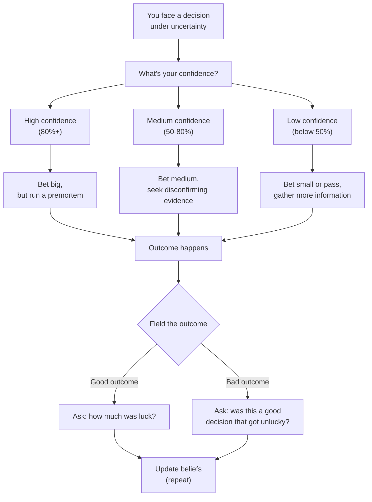

## Introduction

Welcome to BookAtlas Voices. Today we're debating *Thinking in Bets: Making
Smarter Decisions When You Don't Have All the Facts* by Annie Duke. I'm
joined by two guests. On my left, Marco Reyes — former professional poker
player who studied under Annie Duke at the University of Decision Education.
On my right, Priya Sharma — CEO of a mid-market SaaS company, skeptic of the
poker analogy, and someone who has made a few too many "bad decisions that
worked out" to trust her own judgment. Marco, Priya — welcome.

---

---

## On Resulting

**Marco:** Annie's central point is that we judge decisions by outcomes, and
that's broken. In poker, I've made the mathematically perfect play and lost
a $100,000 pot. I've made stupid plays and won. If I judged by results, I'd
learn all the wrong lessons. The question is never "did I win?" It's "did I
make the right decision given what I knew at the time?"

**Priya:** I get the logic, I really do. But in business, outcomes are all we
have. I can't tell my board "we lost the quarter but it was a good decision
— the probabilities just didn't break our way." They'd fire me. And honestly,
would they be wrong? If your decisions keep producing bad outcomes, at some
point "bad luck" stops being a credible explanation.

**Marco:** That's exactly the trap Duke warns about! You're confirming her
thesis in real time. The problem is that boards, CEOs, and Monday morning
quarterbacks *always* demand outcomes. And because they do, everyone reverse-
engineers narratives to explain why outcomes were inevitable — when they
weren't.

Let me ask you: how many of your best outcomes were partly luck, and how many
of your worst outcomes were partly circumstance?

**Priya:** ...More than I'd like to admit, on both sides.

**Marco:** Exactly. That's the point. Resulting isn't wrong because outcomes
are irrelevant. It's wrong because it's not a reliable signal of decision
quality in any single case. In the long run, good process produces better
results. But in the short run? Noise.

---

## On the Poker-Limitation

**Priya:** Here's my problem. Poker is a game. It has fixed rules. It's
zero-sum. I win, you lose. Real life has moral dimensions, relationships,
systemic inequality. Can you really say that thinking of a layoff decision
as "a bet" is useful? Those are people's lives.

**Marco:** Duke is very explicit about this — she says "this isn't a poker
book" in the first chapter. The betting frame is a tool, not a philosophy of
life. The point isn't that everything reduces to a wager. The point is that
the *structure* of a poker decision — incomplete information, probabilistic
outcomes, luck interfering with skill — is the same structure as most real
decisions.

When you're deciding whether to lay people off, you're betting that the
cost savings will keep the company alive. That's a real bet with real
consequences. The framework helps you be honest about the uncertainty you
face. It doesn't tell you what to value.

**Priya:** I'll accept that. But does it help me *make* the decision, or
just make me feel better about it afterward?

**Marco:** Both, actually. Before: you estimate probabilities, you run a
premortem, you seek disconfirming evidence. After: you field the outcome
more honestly. If the layoffs save the company, was it the right call? Maybe.
Maybe you got lucky and the market turned a week later. The framework keeps
you humble in success and analytical in failure.

---

## On Practical Exercises

**Priya:** Okay, give me something I can actually use. What's the single
most impactful exercise from the book?

**Marco:** The decision journal. Before you make any significant decision,
write down: (a) what you're deciding, (b) your confidence level as a
percentage, (c) the specific reasons you believe what you believe, and (d)
the range of outcomes you expect. File it. Don't look at it again until the
outcome is known.

Then, when you know the outcome, read what you wrote. How was your
calibration? Were you overconfident? Did you miss key variables? Did you
accurately predict the range of outcomes?

**Priya:** I can do that. What else?

**Marco:** The premortem. Before starting any major project, gather the team
and say: "It's six months from now and this project has failed
catastrophically. Why?" Let everyone list their fears. The psychological
safety is built in — the exercise *requires* you to imagine failure, so no
one is being negative by raising risks.

**Priya:** We actually do that already, but we call it a "premortem." I
didn't know it came from this book.

**Marco:** It doesn't — it came from Gary Klein. But Duke popularizes it
well and connects it to the overall framework. She also has backcasting,
which is the positive version: imagine you've succeeded brilliantly, then
work backward to map how you got there. Most teams are better at one or the
other. You want both.

---

## On Group Decision Making

**Priya:** You mentioned the decision pod. Duke spends a lot of time on this.
Is it really necessary?

**Marco:** Duke would say it's the most necessary thing. Individual
rationality is a myth. You cannot accurately field your own outcomes because
self-serving bias is automatic. You cannot effectively challenge your own
beliefs because motivated reasoning is unconscious. You need other people.

**Priya:** But groups can be terrible. Groupthink, consensus bias, politicking
...

**Marco:** That's why the pod has rules. Focus on accuracy, not social
harmony. Share all data, not just the data that makes you look good. Evaluate
ideas on merit, not on who proposed them. Default to questioning. If your
group doesn't have these norms, it'll amplify bias rather than correct it.
The pod is only useful if it's structured correctly. Duke borrows the CUDOS
framework from the sociology of science — these are the norms that make
science work. They make decision pods work too.

**Priya:** How do I start one?

**Marco:** Find 2-4 people who genuinely want to improve their decisions.
Pitch it as a monthly or weekly meeting where the agenda is: bring one recent
decision and one upcoming decision. For the recent decision, the group helps
you field the outcome honestly. For the upcoming one, they challenge your
reasoning. No hierarchy. No judgment. The goal is accuracy, not being right.

---

## On the Stakes of Getting This Wrong

**Priya:** Final question. Let's say I adopt this framework and it becomes
part of how I lead. What's the actual upside? And what's the downside?

**Marco:** Upside: you make better decisions over time because you're
actually learning from experience rather than reinforcing your biases. Your
team becomes more intellectually honest because you model uncertainty and
reward admitting mistakes. You avoid catastrophic outcomes because
premortems surface risks before they materialize. And you're less
emotionally devastated by bad outcomes because you understand that good
decisions sometimes lose.

Downside: some people will interpret your "I'm 70% sure" language as
weakness. In cultures that reward confident overconfident leadership, this
can be a career liability. Also, over-thinking is real — not every
decision needs a probability estimate and a premortem. The framework is
most valuable for high-stakes decisions. For low-stakes ones, just decide.

**Priya:** That's fair. I think the journal and the premortem are worth
trying. I'm not sold on calling everything a bet, but the underlying
discipline — separate decision from outcome, think in probabilities, use
groups for calibration — I can get behind.

**Marco:** That's exactly where Duke hopes you'll land. The poker is the
metaphor. The discipline is the point.

---

## Closing

**Host:** Priya, Marco — thank you. *Thinking in Bets* is not a perfect
book, but it delivers on its promise: a memorable framework for making
better decisions when you don't have all the facts. If you take one thing
from this conversation, let it be this: the next time something goes wrong,
ask not "what happened?" but "what did I know when I decided, and was my
process sound?" The answer will teach you more than the outcome ever could.

This has been BookAtlas Voices. Thanks for listening.
