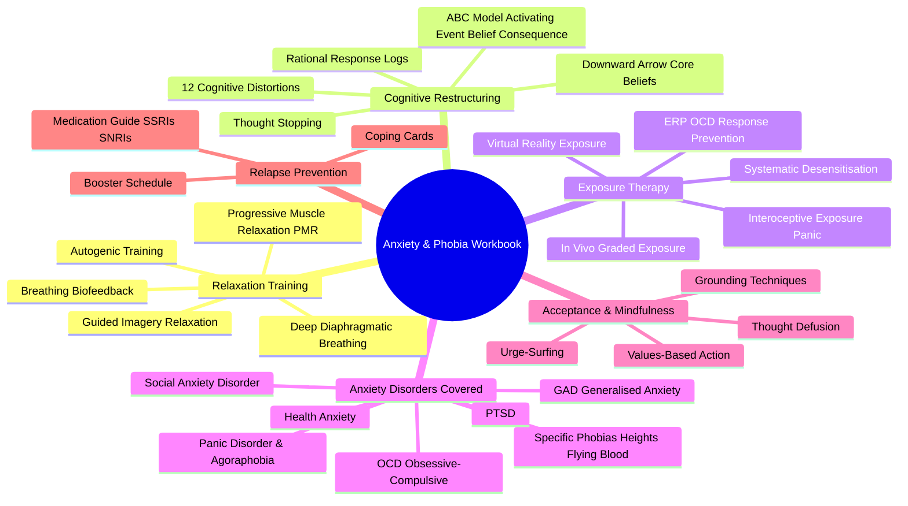

import Callout from '../../components/Callout.astro';

## Part I — Core Content

---

## Author Context

**Edmund J. Bourne, PhD** earned his BA in Philosophy from **Colgate University** and his PhD in Behavioral Sciences from **The University of Chicago**. He completed a postdoctoral fellowship at **Michael Reese Medical Center** in Chicago. For more than three decades he specialised in the treatment of anxiety, panic, phobias, and other stress-related disorders. He was director of the **Anxiety Treatment Center** in San Jose and Santa Rosa, California, before relocating to San Diego, California, where he remains partly retired and continues brief telephone therapy (www.helpforanxiety.com).

Bourne has authored or co-authored several dozen peer-reviewed journal articles and book chapters, and his self-help books have reached more than a million people in many languages. His integration of CBT, acceptance-based strategies, and holistic lifestyle approaches marks his work from earlier, more narrowly CBT-focused anxiety manuals.

---

## Part I — Understanding and Assessing Your Anxiety

### Chapter 1: Agoraphobia and Panic Disorder

The book opens by giving readers a clinical vocabulary for the most severe and debilitating form of anxiety. Bourne defines:

- **Panic attack** — a sudden surge of intense fear peaking within minutes, accompanied by at least four of 13 classic symptoms: palpitations, sweating, trembling, shortness of breath, choking, chest pain, nausea, dizziness, derealisation/depersonalisation, fear of losing control, fear of dying, paraesthesias, chills or hot flushes.
- **Agoraphobia** — fear of situations from which escape might be difficult, embarrassing, or where help might not be available during a panic attack. It is a **consequence** of panic disorder (not a separate phobia per se), most commonly manifesting as avoidance of public transport, open spaces, crowds, or being outside the home alone.
- **Panic Disorder** — characterised by recurrent unexpected panic attacks, followed by at least one month of persistent worry about additional attacks or maladaptive behavioural changes (avoidance, safety behaviours).

> <Callout type="info">
> The key insight of Chapter 1 is that **fear of the fear itself** — anticipatory anxiety — is what drives the disorder's chronicity, not the panic attacks alone. Breaking this secondary fear is the primary target of the workbook programme.
> </Callout>

---

### Chapter 2: Generalised Anxiety Disorder (GAD) and Worry

GAD is framed as a disorder of **excessive, uncontrollable worry** about multiple life domains occurring more days than not for at least six months. Bourne distinguishes:

- **Productive vs. unproductive worry**: The only worry that is useful is worry that leads directly to actionable problem-solving. All other worry is, by definition, unproductive — and the chapter provides exercises to identify and defuse both.
- The **GAD cycle**: trigger → worry cascade → physical symptoms (muscle tension, restlessness, fatigue) → more worry. The cycle sustains itself without any external stimulus once established.
- **Worry exposure**: a structured technique where the reader mentally rehearses worst-case scenarios in a controlled way, reducing the emotional power of those imagined futures through habituation.

---

### Chapter 3: Obsessive-Compulsive Disorder (OCD)

Bourne explains the two components of OCD clearly:

- **Obsessions**: intrusive, unwanted thoughts, images, or impulses that cause significant anxiety or distress. Common themes include contamination, harm to self or others, symmetry/ordering, and forbidden or aggressive thoughts.
- **Compulsions**: repetitive behaviours or mental acts (checking, washing, counting, repeating, praying) performed to neutralise or reduce the distress caused by obsessions.

The chapter introduces **Exposure and Response Prevention (ERP)** as the gold-standard CBT treatment for OCD, and provides structured homework worksheets mapping obsessions to compulsions, rating anxiety levels on a 0–10 scale before, during, and after exposures, and gradually increasing difficulty.

---

### Chapter 4: Social Phobia

Social phobia (social anxiety disorder) is reframed not as "shyness" but as a disorder where the **fear of negative evaluation** by others creates substantial avoidance and impairment.

- The **anticipatory anxiety phase** (before the event) is often more distressing than the event itself.
- **Safety behaviours** (avoiding eye contact, rehearsing what to say, standing at the edge of a room) paradoxically reinforce the anxiety by preventing disconfirmatory evidence.
- Bourne introduces **social exposure hierarchies** and the concept of **dropping safety behaviours** as both separate and simultaneous treatment tasks.

---

### Chapter 5: Specific Phobias

Specific phobias differ from other anxiety disorders in that the feared stimulus is **clearly identifiable** and the fear response is **narrowly circumscribed** (blood-injection-injury, natural environment, situational, animal, other). This makes them particularly amenable to:

- **Systematic desensitisation (imaginal + in vivo)**
- **Flooding** (for highly motivated individuals with fewer competing demands)
- **Virtual reality exposure** (where available)

Step-by-step rated exposure hierarchies are a central workbook output in this chapter.

---

### Chapter 6: Evaluating Your Anxiety

Before moving into the intervention chapters, Bourne provides structured **self-assessment tools** so readers can quantify their anxiety and track progress:

| Assessment | Purpose |
|---|---|
| Fear Questionnaire (FQ) | Measures agoraphobia, social phobia, and blood/injury phobia avoidance |
| Penn State Worry Questionnaire (PSWQ) | Quantifies trait worry for GAD |
| Social Phobia and Anxiety Inventory (SPAI) | Social anxiety severity |
| Yale-Brown Obsessive Compulsive Scale (Y-BOCS) self-report | OCD symptom severity |
| Panic and Agoraphobia Scale (PAS) | Panic disorder tracking |
| Personal Anxiety Scale | Reader-created baseline measure for all covered domains |

These tools establish a **baseline** against which all subsequent exercises are measured, reinforcing the book's empirical, progress-tracked methodology.

---

## Part II — Foundational Skills for Managing Anxiety

### Chapter 7: The Mastery of Your Anxiety and Panic (MAP) Programme

Bourne introduces his flagship structured programme, adapted from the evidence-based MAP protocol developed at the **State University of New York at Albany**. The programme has four treatment phases:

1. **Psychoeducation** — understanding anxiety, the anxiety cycle, and the role of avoidance
2. **Cognitive restructuring** — identifying, challenging, and replacing anxious thoughts
3. **Exposure** — graded in vivo and imaginal exposure to feared situations and sensations
4. **Relapse prevention** — consolidating skills and planning for setbacks

The clear four-phase structure gives readers a roadmap across the entire book; subsequent chapters expand on skills taught in each phase.

---

### Chapter 8: Relaxation and Breathing Techniques

This is the physiological foundation of the entire workbook. Bourne dedicates significant space to **five core relaxation methods**, each accompanied by fill-in exercises:

#### Progressive Muscle Relaxation (PMR)

Developed by **Edmund Jacobson (1929)**, PMR involves systematically tensing and then releasing each major muscle group. The workbook provides:

- A 16-muscle-group sequence
- Scripted tensing (5–7 seconds) and releasing (20–30 seconds) instructions
- A **modified PMR** version requiring only 5–6 muscle groups for daily use
- A **relaxation practice log** for tracking daily sessions

#### Deep Abdominal (Diaphragmatic) Breathing

Shallow chest breathing activates the sympathetic nervous system. Diaphragmatic breathing counteracts this. The chapter provides:

- **Breathing rate biofeedback**: an exercise to slow breathing toward the optimal 6 breaths per minute (0.1 Hz resonance frequency)
- Step-by-step instruction in abdominal breathing posture
- A **breathing practice sheet** to track rate and session duration

#### Letting-Go (Visualisation-Based) Meditation

A guided imagery exercise that systematically releases tension from body regions while breathing. Bourne provides a script and asks readers to record which body regions they hold the most tension.

#### Autogenic Training

Borrowed from German psychiatrist **Johannes Schultz (1932)**, autogenic training uses six standard formulas ("My right arm is heavy… warm…") to induce vasodilation and deep relaxation through autosuggestion. Bourne presents a simplified 6-step autogenic sequence for readers to practice twice daily.

#### Guided Imagery for Relaxation

Creating a "safe place" visualisation that readers can return to during or after high-anxiety moments. This is flagged as a skill particularly suited to **intrusive thoughts and ruminations**, giving readers an immediate cognitive-emotional refuge.

> <Callout type="warning">
> Bourne cautions that **relaxation techniques can paradoxically increase anxiety** in some individuals — particularly those who fear "losing control" or find the quiet of relaxation amplifies intrusive thoughts. He advises a **gradual approach** (starting with 5-minute sessions) and reassures readers that discomfort at first is normal and temporary.
> </Callout>

---

### Chapter 9: Panic Attack Management

Bourne's panic chapter is the most frequently cited section of the book. Key techniques include:

#### Panic Psychoeducation

Readers are taught to identify **which of the 13 panic symptoms** they most commonly experience, and to demystify the physical sensations that typically trigger catastrophic misinterpretations (e.g., "this chest pressure means I'm having a heart attack" → "it is hyperventilation-induced chest tightness; it will pass").

<Gallery images={[
  { src: '/books/anxiety-phobia-workbook-edmund-bourne/panic-cycle.png', alt: 'The Panic Cycle Diagram', caption: 'The fear-of-fear feedback loop that sustains panic disorder' }
]} />

#### Controlled Breathing During a Panic Attack

Bourne provides a **step-by-step in-the-moment protocol** (breathe in for 4 counts, hold 1, out for 6 counts) specifically designed to be recalled quickly during a high-arousal state.

#### Interoceptive Exposure

The reader is systematically exposed to the physical sensations that they fear (hyperventilation, spinning, breath-holding) in a safe, controlled context to break the association between those sensations and catastrophe. The workbook provides a **symptom induction hierarchy** where readers rate the feared intensity of each symptom and gradually approach them.

#### Thought-Stopping and Cognitive Interruption

A practical (if debated) technique where the reader practices saying "STOP!" (sometimes accompanied by snapping a rubber band on the wrist) at the first onset of catastrophic thoughts, followed immediately by substituting a rational alternative thought from a prepared **rational responses list**.

---

### Chapter 10: Cognitive Restructuring and the ABC Model

Cognitive restructuring is the cognitive backbone of the workbook. Bourne draws directly from **Albert Ellis's ABC model** (Activating Event → Belief → Consequence) and adapts it for self-help use:

- **A (Activating Event)**: The external trigger or situation
- **B (Belief)**: The automatic thought or underlying belief
- **C (Consequence)**: The emotional and behavioural outcome

The workbook teaches readers to identify **cognitive distortions** adapted from **Aaron T. Beck's** original list:

| Distortion | Example | Restructuring Prompt |
|---|---|---|
| All-or-nothing thinking | "If I'm not perfect, I'm a failure" | Is there a middle ground? |
| Overgeneralisation | "This one date was awkward; I'll always be alone" | Is this one event representative? |
| Mental filter | Focuses only on the one rude comment at the party | What did I miss? What went well? |
| Disqualifying the positive | "They only said nice things out of politeness" | Can positive evidence be genuine? |
| Jumping to conclusions (mind reading) | "They think I'm boring" | What is the actual evidence? |
| Jumping to conclusions (fortune telling) | "I will definitely fail this presentation" | How certain is this prediction really? |
| Catastrophising / magnification | "If I faint in public, my life is ruined" | What is the realistic worst case? |
| Emotional reasoning | "I feel anxious, therefore something bad is happening" | Are feelings evidence of fact? |
| Should statements | "I should never feel anxious" | Where does this absolute rule come from? |
| Labelling | "I am an anxious person" | Is this a behaviour or a permanent identity? |
| Personalisation | "The meeting went badly; it must be my fault" | What other factors were involved? |
| Blaming | "My anxiety is my partner's fault" | What within my control contributed? |

Bourne provides a **7-column thought record** worksheet: Situation | Emotions (rated 0–100) | Automatic Thoughts | Distortions Present | Rational Response | Outcome Emotions | Alternate Belief. Readers fill this in for real anxiety-provoking events across the week.

---

### Chapter 11: Self-Talk and Core Beliefs

Beyond surface-level automatic thoughts, Bourne addresses the **schema-level beliefs** — the deep, often childhood-formed rules about the self and the world — that maintain chronic anxiety:

- **"I must be perfect to be accepted"**
- **"The world is a dangerous place"**
- **"I cannot cope on my own"**
- **"Negative emotions are dangerous and must be avoided"**

Bourne guides readers through identifying their own core beliefs using:
- A **"Downward Arrow" technique** — asking "If that thought were true, what would that mean about me?" repeatedly to reach the underlying schema
- A **life history timeline exercise** to trace when each core belief first developed
- A **belief modification worksheet** that generates a well-evidenced alternative belief backed by specific counterexamples

---

### Chapter 12: Imagery Desensitisation and Exposure Therapy

This chapter bridges the relaxation skills (Chapter 8) into a structured exposure programme. It covers:

#### Systematic Desensitisation

The classical three-step protocol:
1. Learn deep relaxation (independently of anxiety)
2. Construct an **anxiety hierarchy** — a ranked list of the feared situation from least to most anxiety-provoking, each rated on a 0–10 SUDS (Subjective Units of Disturbance Scale)
3. Work through the hierarchy: visualise each scene while remaining relaxed; proceed to the next only when current anxiety is ≤ 2/10

Bourne provides examples across phobia types and a **blank hierarchy worksheet**.

#### Virtual Reality Exposure

The 6th edition acknowledges **VRET (Virtual Reality Exposure Therapy)** as an emerging adjunct for specific phobias (particularly flying, heights, and public speaking), noting Homepage.com and Psious VR platforms as examples.

#### In Vivo ("Real-Life") Exposure

The reader is guided to move in vivo from imaginal exposure to real-world practice: identifying the first manageable step in approaching a real feared situation, executing it while using learned relaxation and coping skills, then recording the outcome in a **exposure log**.

---

### Chapter 13: Stress Management, Lifestyle, and Nutrition

Bourne extends the CBT programme into the broader context of **whole-person health**:

**The Stress–Anxiety Connection**:
Cortisol, the HPA axis, sympathetic arousal, and allostatic load are reviewed. Chronic stress is shown to lower the threshold for anxiety escalation — making it both a trigger and amplifier.

**Exercise as Anxiety Treatment**:
Multiple RCTs are cited demonstrating that 30 minutes of moderate aerobic exercise (walking, jogging, swimming) 3–5 times per week produces anxiolytic effects comparable to low-dose benzodiazepines in short-term studies, with superior long-term maintenance and zero tolerance or withdrawal concerns. Bourne recommends exercise as a **non-negotiable pillar** of the recovery programme.

**Nutrition**:
- Limiting caffeine (≥200 mg/day associated with increased panic attack frequency)
- Reducing refined sugar and processed carbohydrates (glycaemic fluctuations mimic anxiety physiology)
- Addressing magnesium and B-vitamin deficiencies that can mimic or worsen anxiety symptoms
- Alcohol as anxiogenic in withdrawal phases and sleep-disrupting

**Sleep**:
Sleep deprivation lowers prefrontal regulation of the amygdala, making threat-detection hyperactive. Bourne provides a **sleep hygiene checklist** and recommends CBT-I (Cognitive Behavioural Therapy for Insomnia) as a formal protocol for those with concurrent sleep disorder.

---

## Part III — Targeted Protocols for Specific Anxiety Disorders

### Chapter 14: Obsessions and Compulsions — ERP Protocol

This chapter expands the general exposure framework (Chapter 12) into a disorder-specific **ERP programme for OCD**:

1. **Self-monitoring**: Record every obsession and the compulsion that follows, using the OCD Log (frequency, duration, distress rating 0–10)
2. **Hierarchy construction**: Rank obsessions from least to most distressing; rank compulsions from easiest to hardest to resist
3. **Exposure practice**: Deliberately encounter the obsession trigger (e.g., touching a doorknob for contamination OCD) while voluntarily **resisting the compulsion** (not washing hands)
4. **Response prevention delay**: Start with 30-second delays after the obsession, progress to 15-minute, then 1-hour, then indefinite delays
5. **Gradual ritual reduction**: If full elimination is impossible, reduce the ritual systematically

> <Callout type="info">
> The most common and critical error in self-directed ERP is **incomplete exposure** — touching the feared object but washing "just a little." Bourne is explicit: incomplete exposure reinforces OCD. The workbook insists on **complete response prevention** for the disorder to improve.
> </Callout>

---

### Chapter 15: Health Anxiety (Hypochondriasis) and Illness Behaviour

Bourne addresses health anxiety as a specific diagnostic category (Illness Anxiety Disorder in DSM-5, Hypochondriasis in ICD-10):

**The Cycle**:
Bodily sensation (normal or ambiguous) → misinterpretation as sign of serious illness → increased self-focus and body scanning → more scrutiny → more sensations → reassurance-seeking (doctor visits, internet searches) → temporary relief → return of doubt → repetition.

**Cognitive Restructuring Targets**:
- **Catastrophic probability inflation**: "This headache must mean a brain tumour" — countered with base-rate statistics
- **Reassurance as compulsion**: Doctor visits, internet symptom searches, and asking others "Do you think this is serious?" function exactly like OCD compulsitions; they provide short-term relief but long-term maintenance
- **Body scanning**: an attentional habit that amplifies normal physiological noise

The workbook provides a **Health Anxiety Exposure Hierarchy**, including deliberately reading about feared illnesses, visiting hospital waiting rooms, and allowing oneself to feel ambiguous bodily sensations without seeking reassurance.

---

### Chapter 16: Social Anxiety

Social anxiety is treated with a structured **social skills assertion training** combined with exposure:

**The Cognitive Component**:
- Perfectionist performance standards ("I must not show any anxiety")
- Mind-reading assumptions about negative judgment
- Self-focused attention during social interactions (internal spotlight effect)
- Post-event rumination, which retroactively reinforces perceived failure

**The Exposure Component**:
A **social anxiety hierarchy** covering:
- Making eye contact with a stranger (low distress)
- Asking a shop assistant for help
- Making a brief phone call
- Joining a conversation in a group
- Giving a short presentation or speech (high distress)

Readers are also taught **assertiveness skills**: how to make requests, refuse unreasonable requests, express disagreement, and manage conflict — all skills that social anxiety sufferers often lack and which reduce long-term social avoidance.

---

### Chapter 17: Post-Traumatic Stress Disorder (PTSD)

Bourne frames PTSD not simply as anxiety but as a **failure of memory integration** — the traumatic memory remains in sensory-implicit form rather than being fully processed into narrative-declarative memory. This framing is important because it justifies **exposure-based processing** as the primary treatment:

- **Prolonged Exposure (PE)**: Repeatedly recounting the traumatic memory in a safe therapeutic context to facilitate habituation and narrative integration
- **Imaginal Rescripting**: Mentally re-experiencing the trauma memory while introducing a sense of **present-day safety** — that one's current adult self is in control and the danger is over
- **Grounding techniques**: For immediate dissociative episodes — the "5-4-3-2-1" sensory grounding exercise (name 5 things you see, 4 you hear, 3 you can touch, 2 you smell, 1 you taste)
- **Cognitive processing**: Identifying "stuck points" — maladaptive beliefs about the self, others, or the world that arose from the trauma and persist unnaturally

The workbook acknowledge that **severe PTSD should ideally be treated with a trained therapist**, and provides guidance on when to seek professional help.

---

## Part IV — Acceptance, Mindfulness, and Relapse Prevention

### Chapter 18: Acceptance and Mindfulness-Based Strategies

In the 6th edition, Bourne significantly expanded this section to reflect the integration of **Acceptance and Commitment Therapy (ACT)** principles into anxiety treatment:

**The Paradox of Control**:
Attempts to suppress anxious thoughts (thought suppression, Willingness Paradox) typically produce a rebound effect — the thought returns with greater frequency and intensity (Wegner's "white bear" problem). Acceptance interrupts this cycle by removing the struggle.

**Defusion Techniques**:
- "I'm having the thought that…" — prefixing thoughts with this phrase creates psychological distance, reducing their believability
- Passing the thought on the road: visualising anxious thoughts as cars passing by while you stand on the sidewalk; you don't have to get into the car
- Silly voice technique: saying the anxious thought in a silly cartoon voice to reduce its emotional charge

**Mindfulness of Body and Breath**:
- Body scan meditation: systematically attending to physical sensations non-judgmentally
- Anchoring to the breath as a present-moment reference point during rumination
- **Urge-surfing**: observing the rise and fall of anxiety impulses as waves — they peak and then naturally subside without compulsive action

**Values Clarification**:
ACT's values work asks: "What kind of person do I want to be, and what actions would express that?" Anxiety-driven avoidance is contrasted with **committed action** — behaviour guided by values rather than fear.

---

### Chapter 19: Relapse Prevention and Long-Term Maintenance

The programme concludes with a structured **relapse prevention plan** to ensure gains are durable:

**Components of the Relapse Prevention Plan**:
1. **Warning signs**: identifying early subtle signs of anxiety returning (sleep disturbance, increased caffeine, muscle tension)
2. **Coping card**: a 3×5 index card with 3–5 core coping strategies written on it, to be used as a portable reference during high-stress periods
3. **Contingency plan for setbacks**: pre-writing responses to "If I have a panic attack at a party, I will…"
4. **Booster schedule**: committing formally to practice core skills weekly or biweekly even after symptom remission
5. **Medication decision guide**: Bourne discusses the role of SSRIs, SNRIs, benzodiazepines, and buspirone in anxiety treatment, including the evidence base for each, common trade-offs, and the principle that medication plus CBT is more effective than either alone for moderate-to-severe cases

---

## Book Structure Summary

```mermaid
flowchart TD
    Root["The Anxiety and Phobia Workbook<br/>6th ed. 2020 | ~464 pp | New Harbinger"]
    Root --> P1["Part I<br/>Assessment: Panic, GAD, OCD, Social Phobia,<br/>Specific Phobias, Health Anxiety, PTSD"]
    Root --> P2["Part II<br/>Foundational Skills<br/>Relaxation, Breathing, CBT, Exposure"]
    Root --> P3["Part III<br/>Targeted Protocols<br/>ERP for OCD, Social Anxiety,<br/>Health Anxiety, PTSD, GAD"]
    Root --> P4["Part IV<br/>Acceptance & Mindfulness<br/>ACT Skills + Relapse Prevention"]
    
    P1 --> A1["Ch. 1: Panic & Agoraphobia"]
    P1 --> A2["Ch. 2: GAD & Worry"]
    P1 --> A3["Ch. 3: OCD"]
    P1 --> A4["Ch. 4: Social Phobia"]
    P1 --> A5["Ch. 5: Specific Phobias"]
    P1 --> A6["Ch. 6: Self-Assessment Tools"]
    
    P2 --> B1["Ch. 7: MAP Programme Framework"]
    P2 --> B2["Ch. 8: Relaxation & Breathing<br/>(PMR, Diaphragmatic, Autogenic, Imagery)"]
    P2 --> B3["Ch. 9: Panic Attack Management"]
    P2 --> B4["Ch. 10: Cognitive Restructuring<br/>(ABC Model, 12 Distortions)"]
    P2 --> B5["Ch. 11: Self-Talk & Core Beliefs"]
    P2 --> B6["Ch. 12: Imagery Desensitisation &<br/>Exposure Therapy"]
    P2 --> B7["Ch. 13: Stress Management,<br/>Lifestyle & Nutrition"]
    
    P3 --> C1["Ch. 14: ERP for OCD<br/>(Hierarchies, Response Prevention)"]
    P3 --> C2["Ch. 15: Health Anxiety<br/>(Reassurance Cycle, Exposure)"]
    P3 --> C3["Ch. 16: Social Anxiety<br/>(Assertiveness + Hierarchy)"]
    P3 --> C4["Ch. 17: PTSD<br/>(Prolonged Exposure, Grounding)"]
    
    P4 --> D1["Ch. 18: Acceptance & Mindfulness<br/>(Defusion, Urge-Surfing, Values)"]
    P4 --> D2["Ch. 19: Relapse Prevention<br/>(Coping Cards, Booster Schedule)"]
    
    style Root fill:#1e3a5f,stroke:#4a90d9,stroke-width:2px,color:#fff
    style P1 fill:#2c5282,stroke:#63b3ed,color:#fff
    style P2 fill:#2c5282,stroke:#63b3ed,color:#fff
    style P3 fill:#2c5282,stroke:#63b3ed,color:#fff
    style P4 fill:#2c5282,stroke:#63b3ed,color:#fff
```

---

## Key Concepts at a Glance

---

## Exercises and Workbooks Included

The workbook contains **over 50 distinct exercises, worksheets, and self-monitoring logs**, including:

- **Anxiety self-assessment inventories** (baseline and re-assessment)
- **Panic symptom checklists** and attack log
- **Worry time scheduling** form
- **Belief record sheets** (7-column thought records)
- **PMR practice log**
- **Breathing rate tracker**
- **Exposure hierarchy templates** (for phobias, social anxiety, OCD, health anxiety)
- **Exposure progress logs** with SUDS ratings before/during/after
- **ERP commitment sheets** for OCD
- **OCD log**: obsession → compulsion → delay record
- **Rational response card template**
- **Coping card template** (relapse prevention)
- **Social skills practice worksheets**
- **Assertiveness scripts** (request, refuse, disagree)
- **Lifestyle self-assessment** (exercise, caffeine, sleep, alcohol)
- **Relapse prevention plan form**

<Bibliography client:load entries={['bourne-2020-anxiety-phobia-workbook-part1']} />
