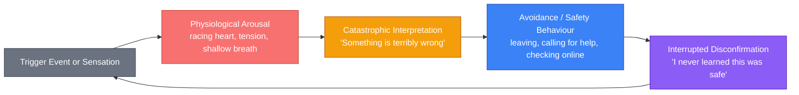

## Introduction

Welcome to BookAtlas. Today: *The Anxiety and Phobia Workbook: Proven Methods to Overcome Worry, Phobias, Panic Attacks, and Obsessions* by Edmund J. Bourne. Sixth edition, 2020. New Harbinger Publications. Approximately 464 pages.

If you've ever woken up in the middle of the night with your heart pounding for no apparent reason — if you've cancelled plans, avoided certain streets, scanned your body for symptoms, or spent hours spiralling into worst-case scenarios — this book was written for you. It is, without qualification, the most widely used self-help CBT workbook for anxiety ever published. Over 1.5 million copies sold. Therapists worldwide assign it as adjunct homework. It has been in continuous print for nearly 35 years.

Edmund J. Bourne is a clinical psychologist who specialised in anxiety disorders for more than three decades. He directed the Anxiety Treatment Center in San Jose and Santa Rosa, California. He compiled everything he learned from decades of clinical practice into this one workbook, designed for the person sitting at their kitchen table who doesn't have a therapist yet, or is waiting for one, or wants to supplement the work they're already doing.

This isn't a philosophy book. It's a manual. And that's its greatest strength — and its most common obstacle.

---

## The Central Proposition

Bourne's thesis is direct: **anxiety is maintained by three interacting systems** — physiology (what your body does), cognition (what you think), and behaviour (what you do). Each system feeds the others in a self-sustaining loop, and you cannot break the loop by addressing only one system. You need all three.

That's the insight that structures the entire workbook. Here it is in plain form:



The loop sustains itself. Your heart races, you think "heart attack," you sit down and call someone, you never learn that your racing heart was a normal adrenaline response that would have resolved in 90 seconds. Next time it happens, you panic harder. That's panic disorder in a diagram.

Bourne's programme attacks all three nodes simultaneously. Let's walk through each.

---

## The Physiological Foundation: Relaxation Training

The first third of the book builds physical skills before touching thinking. This sequencing matters. Bourne knows that if you ask someone to "think positively" during a panic attack, you will not be heard. You need to lower the physiological baseline first.

**Progressive Muscle Relaxation (PMR)** is the cornerstone. Developed by Edmund Jacobson in 1929, the method is simple: tense a muscle group hard for 5–7 seconds, then release and notice the contrast for 20–30 seconds. Bourne walks through all 16 major muscle groups, from the fists to the toes, in a sequence designed for home practice. He then offers a shortened "modified PMR" of just 5–6 groups for daily use after the skill is established.

**Diaphragmatic breathing** is the second pillar — not the "take deep breaths" advice you've heard, but a specific protocol: breathe in for a count of four, hold for one, breathe out for six. The extended exhale activates the parasympathetic nervous system via the vagus nerve. Bourne includes a simple biofeedback exercise: count your breaths per minute. If you're above 12, you're running at sympathetic dominance. The target is **six breaths per minute** — the resonant frequency where heart rate variability peaks and relaxation is maximised.

**Autogenic training** — six phrases of self-suggestion ("My right arm is heavy and warm") developed by German psychiatrist Johannes Schultz in 1932 — rounds out the physiological toolkit. Bourne presents a simplified version that readers can practice twice daily for ten minutes.

The logic of starting here is sound: **if your body interprets every neutral situation as a threat, your mind will follow your body's lead**. Calm the body, and the cognitive corrections become plausible rather than absurd.

---

## The Cognitive Core: Restructuring Distorted Thinking

Once the physiological foundation is in place, Bourne introduces what is the most clinically validated component of the entire workbook: **cognitive restructuring**, derived from Aaron Beck and Albert Ellis.

The framing is unmistakably Beck/Ellis: an **ABC model**.

- **A** — The Activating event: "My boss hasn't replied to my email"
- **B** — The Belief: "She's furious with me; I'm about to be fired"
- **C** — The Consequence: "Panic attack, stomach in knots, can't focus on anything else"

The insight is that C is caused primarily by B, not A. The same event (A) produces no anxiety for someone holding the belief "She's probably in a meeting; I'll follow up tomorrow."

Bourne provides a **7-column thought record worksheet** that is the central practice tool of the book: readers fill in the activating event, their felt emotion and intensity rating, the automatic thought, the cognitive distortion present, a rational counter-response, and the new feeling rating. Doing this once per anxiety episode — and Bourne asks readers to do it in real time — rewires the A→C pathway over weeks of practice.

Twelve cognitive distortions are presented with examples. These are the canonical Beck distortions — catastrophising, mind-reading, fortune-telling, all-or-nothing thinking — but Bourne's examples come from real clinical material, which makes the workbook feel lived rather than theoretical.

The chapter on **core beliefs** goes deeper than automatic thoughts. Bourne teaches a **downward-arrow technique**: if the automatic thought is "I'm going to fail this presentation," you ask "If that's true, what does that mean about me?" → "I'm incompetent" → "If I'm incompetent, what does that mean?" → "I'm not a person who can be relied on." That last layer — the schema, the identity-level belief — is what the thought record alone won't touch. This is the workbook's most sophisticated cognitive exercise, and it carries risk: examining core beliefs without a therapist present can be destabilising. Bourne acknowledges this caveat.

---

## The Behavioral Engine: Exposure and Response Prevention

The metaphor Bourne uses throughout the exposure chapters is the fear thermometer. To break a phobia, you need to spend time in the feared situation at a temperature just uncomfortable enough to register, but not so hot that you flee — and stay there until the thermometer goes down. That habituation is the mechanism. In modern CBT terms, it's **inhibitory learning**: your brain learns that the feared stimulus does not reliably predict harm.

The workbook provides detailed **exposure hierarchy worksheets**: lists of feared situations rated 0–10 on a Subjective Units of Disturbance Scale, from low ("think about a dog for 30 seconds" = 1) to high ("stand next to a large friendly dog" = 9). The reader works up the list one rung at a time, practising until their SUDS rating at that rung drops to 2 or below before advancing.

For **Obsessive-Compulsive Disorder**, the protocol is more demanding: **Exposure and Response Prevention (ERP)**. This means deliberately triggering the obsession — touching a doorknob for a contamination fear — and then *resisting the compulsion* of washing hands. Not washing "a little." Not washing with cold water. Not washing for 10 seconds instead of 20. Complete response prevention for a set period, then gradually extending that period. This is the single most evidence-based anxiety treatment in existence (Foa and colleagues, multiple RCTs), and Bourne presents it with the honesty it deserves: it is uncomfortable, it requires real commitment, and many readers fail at it. He does not sugarcoat this.

```mermaid
flowchart TD
    Start["1. Identify Fear / Obsession"] --> Rate["2. Rate on SUDS Scale 0–10"]
    Rate --> Hierarchy["3. Build Exposure Hierarchy<br/>Lowest → Highest Duck Rating"]
    Hierarchy --> Practice["4. Practice at Each Level Until SUDS ≤ 2"]
    Practice --> Resist{"5. OCD: Resist Compulsion<br/>Non-OCD: Drop Safety Behaviour"}
    Resist -->|Yes| Next["6. Advance to Next Level"]
    Resist -->|No| Repeat["Repeat Current Level<br/>Increase Duration"]
    Repeat --> Practice
    
    style Start fill:#3b82f6,stroke:#1e40af,color:#fff
    style Rate fill:#6366f1,stroke:#3730a3,color:#fff
    style Hierarchy fill:#8b5cf6,stroke:#5b21b6,color:#fff
    style Practice fill:#a78bfa,stroke:#6d28d9,color:#fff
    style Resist fill:#f59e0b,stroke:#b45309,color:#fff
    style Next fill:#22c55e,stroke:#15803d,color:#fff
    style Repeat fill:#f59e0b,stroke:#b45309,color:#fff

    styleDef stroke:#333,stroke-width:1px
```

A separate and important chapter covers **interoceptive exposure** for panic disorder: deliberately inducing feared physical sensations (hyperventilating for 60 seconds, spinning in a chair, holding breath) so that the brain learns these sensations are not harbingers of catastrophe. This is counter-intuitive to many panic sufferers: "You want me to *cause* the feeling I'm most afraid of?" Yes — precisely because the feeling itself is harmless, and the fear of the feeling is what sustains the disorder.

---

## Health Anxiety and the Reassurance Compulsion

One of the most clinically useful chapters in the 6th edition is its treatment of **health anxiety** (Hypochondriasis / Illness Anxiety Disorder). Bourne maps a cycle that is not obvious to sufferers:

Bodily sensation (normal) → misinterpretation as sign of serious illness → vigilance and body scanning ↑ → more sensations detected → internet medical search → temporary relief → doubt returns → repetition.

The **reassurance compulsion** — doctor visits, Googling symptoms, asking friends "Do you think I'm okay?" — functions almost identically to the compulsions in OCD. It provides short-term relief but long-term maintenance of the disorder. The treatment is therefore the same structural approach: systematic exposure to uncertainty without performing the reassurance behaviour.

This review of health anxiety as a *behavioural* rather than content-driven disorder is one of the book's clearest clinical contributions.

---

## PTSD: Memory Integration Through Exposure

The PTSD chapter takes a less-CBT and more-processing-oriented approach than the rest of the book:

**Prolonged Exposure (PE)**: Repeatedly recounting the traumatic memory in detail in a safe context, until the vividness and physiological arousal associated with the memory decreases. The mechanism is habituation combined with context-updating — the traumatic memory fragment is integrated into the broader narrative of one's life with the emotional weight reduced.

Bourne also teaches **grounding techniques** for dissociative episodes — the "5-4-3-2-1" sensory exercise (name five things you see, four you hear, three you can touch, two you smell, one you taste) — and **imaginal rescripting** where the reader mentally revisits the trauma while maintaining a present-day sense of safety: "I am an adult now. I am safe. That moment is over."

Bourne is explicit that severe PTSD should ideally involve a trained therapist. The workbook is positioned as supplemental or stepping-stone. This is a note of professional responsibility that runs through the PTSD and OCD chapters consistently.

---

## Mindfulness, Acceptance, and the New Sixth Edition

The 6th edition's most significant addition is Chapter 18: **Acceptance and Mindfulness-Based Strategies**. This is where Bourne recognises a real limit of CBT alone.

The paradox of control: try not to think of a white bear. You thought of it within seconds. Thought suppression produces a rebound effect — the suppressed thought returns with higher frequency. This is not a personal failure; it is how cognitive architecture works.

**Defusion techniques** replace suppression:
- "I'm having the thought that…" — the prefix creates distance; the thought becomes an event in the mind rather than a command
- Visualising thoughts as cars on a road; you're on the sidewalk — you don't have to get in any of them
- Saying the automatic thought in a silly cartoon voice to reduce its emotional charge

**Urge-surfing**: anxiety impulses are described as waves. They rise, peak at around 90 seconds, and fall. Most people flee the wave. Bourne asks readers to observe it instead, a technique drawn directly from mindfulness-based CBT and Marlatt's work on craving in addiction.

**Values-based committed action**: borrowed from ACT, this asks readers to identify what kind of life they want to live independent of anxiety — and to take action toward those values *while anxious*, not after anxiety goes away. This reframing is profound: anxiety becomes information, not a veto.

---

## Lifestyle as Treatment

What makes Bourne's approach distinctive among CBT-only workbooks is the weight given to lifestyle factors. Chapter 13 is unusually long and evidence-based:

- **Caffeine**: threshold effect at approximately 200 mg/day, above which panic attack frequency increases measurably in clinical samples
- **Exercise**: 30 minutes of moderate aerobic activity 3–5x/week has anxiolytic effects comparable to low-dose benzodiazepines in short-term trials, with superior durability and no tolerance or withdrawal
- **Nutrition**: refined sugar and processed carbohydrates create glycaemic fluctuations that mimic anxiety physiology; B-vitamin and magnesium deficiencies can produce anxiety-identical symptoms
- **Alcohol**: acute anxiolytic but rebound AMPA receptor upregulation in withdrawal produces amplified anxiety 6–12 hours later, often prompting further self-medication
- **Sleep**: sleep deprivation lowers prefrontal cortex regulation of the amygdala, increasing threat sensitivity. Bourne provides a sleep hygiene checklist and directs readers with persistent insomnia to formal CBT-I

---

## Medication and Clinical Referral

Bourne's discussion of medication deserves note because it is unusually balanced in a self-help book. He describes:

| Class | Examples | Use in Anxiety | Notes |
|-------|----------|---------------|-------|
| **SSRIs** | Fluoxetine, sertraline, paroxetine | First-line for GAD, panic, OCD, PTSD | 4–6 weeks to onset; generalised active across disorders |
| **SNRIs** | Venlafaxine, duloxetine | GAD, social anxiety, panic | Similar to SSRIs; useful when SSRIs ineffective |
| **Buspirone** | Buspar | GAD specifically | Non-sedating; slower onset; less withdrawal |
| **Benzodiazepines** | Clonazepam, alprazolam | Acute panic; short-term use | Effective but tolerance and dependence risk; not recommended as monotherapy |
| **Beta-blockers** | Propranolol | Situational anxiety (performance, public speaking) | Treats physical symptoms; does not treat worry |

Bourne's conclusion is consistent across all three medication sections: **CBT plus medication is more effective than either alone for moderate-to-severe anxiety disorders**. Medication lowers the arousal baseline enough for CBT skills to be practiced; CBT provides durable skills that persist after medication is reduced or discontinued. This is the current clinical consensus, and Bourne presents it clearly without editorialising.

---

## The Workbook's Lasting Problem

No piece of criticism is more important than this: **workbook attrition is extremely high**. Multiple studies of self-help CBT have documented that 50–70% of readers complete fewer than 25% of the exercises. The exercises are the mechanism of change. Bourne knows this — every chapter ends with homework, and the structure is explicitly progressive. But the cognitive dissonance for a reader who buys the book expecting insight and finds a manual is real.

This is not a criticism of the book's quality. It's a description of its format's consequence, and it's one Bourne addresses directly in his introduction: the book rewards people who work it as a workbook. People who read it as a book will learn something, but the learning will not translate into reduced anxiety. That distinction between reading and practising is the most important meta-concept in the book, and Bourne says it plainly — more plainly than most of his competitors.

---

## Who This Book is For

| Reader | Assessment |
|--------|------------|
| Someone with mild-to-moderate GAD | Excellent primary resource; complete the programme as written |
| Someone with panic disorder | Excellent; PMR + interoceptive exposure + cognitive restructuring are precisely calibrated for panic |
| Someone with OCD (mild–moderate) | Very good as supplement to ERP with a therapist; adequate as primary only for mild cases |
| Someone with PTSD | Useful as a stepping stone; **seek a trained EMDR or PE therapist for severe PTSD** |
| Someone with social anxiety | Good; the exposure hierarchy and assertiveness training are the most practical parts for this group |
| A therapist looking for homework sheets | Ideal; the pre-designed CBT worksheets reduce administration time |
| Someone simply curious | Will learn a great deal but will get minimal symptom benefit without completing exercises |

<Bibliography client:load entries={['bourne-2020-anxiety-phobia-workbook-part2']} />
