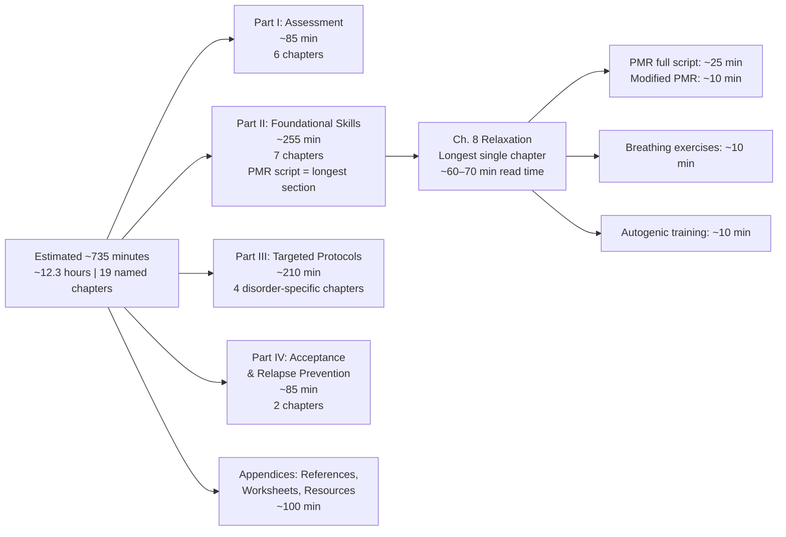

import Callout from '@/components/Callout';

## Part III — Narration Guide

This guide is for audiobook narrators, text-to-speech synthesis engines, and accessibility applications producing an audio version of _The Anxiety and Phobia Workbook_. The book works in two registers simultaneously — as a clinical self-help manual and as an accessible companion for people in distress — and the narration needs to honour both without sounding clinical or unfeeling.

---

## Overall Tone Profile

- **Primary register**: Wry, direct, clinically informed, and slightly conversational. Bourne writes like a seasoned therapist who has watched hundreds of people work through these exercises — he knows where readers get stuck and speaks to that directly.
- **Pace**: Slow and deliberate for exercises and psychoeducation; picking up naturally for APA factoids, research citations, and clinical comparisons. Never rushed.
- **Emotional register**: Warm validation without sentimentality. Bourne normalises anxiety ("All the people I work with in my practice have felt exactly this way") without minimising it. The narration should mirror that: you are witnessing someone's anxiety, not performing therapy on them.
- **Tone when reading exercises**: A step-by-step procedural tone — clear, unhurried, inviting the listener to pause. Pause mid-exercise to give listeners space to actually complete the step before continuing.
- **Technical vocabulary**: Pronounce with care: agoraphobia (ˌag-ə-rə-ˈfō-bē-ə), interoceptive (ˌin-tər-ō-ˈsep-tiv), autogenic (ˌo-də-ˈjē-nik), somatosensory (ˌsō-ˌmä-tō-ˈsen(t)-sə-rē).

---

## Chapter-by-Chapter Narration Notes

### Introduction — The Central Proposition

**Tone**: Reassuring, plain-speaking, direct.

Bourne opens by naming the book's intended reader in the first few pages. You can hear him talking directly to someone who has been suffering. Read this with the warmth of someone opening a door to a person standing in the rain.

> "Living with anxiety, panic disorders, or phobias can make you feel like you aren't in control of your life."

Deliver that with a slight drop in pace — let the listener feel that Bourne has seen this before, knows how overwhelming it can feel, and that the workbook is a realistic plan, not a promise.

The **ABC model** introduction should be read with a slight shift in register — more conceptual, more carefully paced. You're laying the intellectual foundation for everything that follows.

---

### Part I — Agoraphobia and Panic Disorder (Chapter 1)

**Tone**: Clinical but accessible. This is the highest-stakes chapter — the reader may be in active panic disorder — and urgency is appropriate, but not alarmist.

Read the **13 panic symptoms list** slowly, with deliberate spaces between them. A listener in active panic may be using this as a reference during an attack. Do not zip through:

> "Palpitations … sweating … trembling … shortness of breath … choking … chest pain … nausea … dizziness … derealisation or depersonalisation … fear of losing control … fear of dying … paraesthesias … chills or hot flushes."

The section on **fear of the fear itself** — anticipatory anxiety as the real villain — is the chapter's most important passage. Slow down. This is the insight that unblocks the rest of the programme.

---

### Part II — GAD and Worry (Chapter 2)

**Tone**: Analytical, slightly lighter. GAD is a disorder of chronic low-level activation, not acute terror. The narration should feel steady — like someone describing something they understand well and are not alarmed by.

The **worry vs. productive problem-solving** distinction is a genuinely useful cognitive pivot. Read the question "Will this help me solve a problem right now?" with a slight pragmatic emphasis — this is a practical litmus test, not a philosophical one.

---

### Part III — OCD (Chapter 3)

**Tone**: Measured, clear. OCD is a disorder of stuck loops — and the narration should feel steady and unhurried, providing the kind of consistent voice that grounds someone whose internal experience is highly variable.

When describing obsessions and compulsions, use a slight **separate-voice approach**: give obsessions a slightly warmer, descriptive tone, then shift to a more direct, action-oriented tone for compulsions. This mirrors how the chapter separates understanding from intervention.

The **ERP explanation** needs careful pacing:

> "Exposure and Response Prevention: you deliberately encounter the feared situation or thought, while voluntarily resisting the ritual that normally follows."

Do not rush "voluntarily resisting." That word — voluntarily — is the whole therapeutic move.

---

### Part IV — Social Phobia (Chapter 4)

**Tone**: Gentle, perpetuatingly empathetic. Many social anxiety sufferers have been told — incorrectly — to "just be more confident." Bourne's opening treatment of social anxiety as a disorder, not a personality trait, carries relief. Read that section with extra warmth.

The **safety behaviours** section is quietly important. Readers need to feel understood, not criticised — Bourne doesn't say "you're doing it wrong," he says "these behaviours make sense and served a purpose — and now they sustain the problem." Read with that understanding-first register.

---

### Part V — Specific Phobias (Chapter 5)

**Tone**: Encyclopaedic, practical, slightly lighter. Specific phobias are often the most pharmacologically and behaviourally tractable of the anxiety disorders. The narration should feel like someone opening a briefcase of tools.

---

### Part VI — Self-Assessment (Chapter 6)

**Tone**: Clinical, unhurried. This is the assessment section — the reader listens, takes notes or marks the page, and returns for the results section.

When reading instructions for the Fear Questionnaire (FQ), pause meaningfully after each item. This is not a chapter to speed-read; it is a chapter to listen to at a desk with a pen.

---

### Chapter 7 — The MAP Programme

**Tone**: Authoritative but accessible. This is the table of contents for the rest of the book. Read the four phases (psychoeducation → cognitive restructuring → exposure → relapse prevention) with the cadence of someone setting out a map.

---

### Chapter 8 — Relaxation and Breathing Techniques

**Tone**: The most important pacing instruction in the whole book: this chapter *needs* to be used, not just heard.

**PMR script**: Read with 5–7 seconds of silence after "Tense your [muscle group]…" then 20–30 seconds of quiet after "…and release."

> "Now clench your fists as tightly as you can. Hold for five… and release. Let go completely. Notice the warmth and heaviness spreading through your hands."

The silence after "Let go completely" should feel like it has weight — a real invitation to feel the contrast. Most narrators short-change these pauses; in this workbook, the pauses *are* the technique.

**Diaphragmatic breathing exercise**:
Read the breathing-in-halves technique (exhale for twice as long as inhale) with a subtle audible rhythm, so listeners can synchronise. Emphasise the "six breaths per minute" target clearly — give listeners a number they can track.

**Autogenic training**:
Read the six formulas slowly, slightly spaced:

> "My right arm is heavy… warm… calm…"
> "My heartbeat is calm and regular…"
> "My solar plexus [note: brief pronunciation guide "soh-ler PLEK-siss"] is warm…"
> "My forehead is cool…"

Each formula should take approximately 8–10 seconds to deliver, then 20 seconds of silence before the next.

---

### Chapter 9 — Panic Attack Management

**Tone**: Urgent, calm, directive. This section is the book's emergency manual.

The ***in-the-moment protocol*** should be delivered with voice discipline — no dramatic urgency, just steady, low-volume command:

> "Sit down or lean against something. Place one hand on your stomach. Breathe in for a count of four… hold for one… breathe out for a count of six. Expect the symptoms to peak within two to three minutes. They will not harm you. They will subside."

**Interoceptive exposure exercises** (deliberately inducing feared sensations) are designed to be scary when you first read them. Bourne frames this honestly. Read the interoceptive exercise descriptions — hyperventilation in a safe place, chair spinning, breath-holding — with matter-of-fact calm that normalises the discomfort rather than amplifying it.

---

### Chapter 10 — Cognitive Restructuring

**Tone**: Conversation with a thoughtful guide. This is the cognitive heart of the book.

The **7-column thought record** should be set up as a structured exercise. Read the column headers slowly:

> "Column 1: Situation. Column 2: Emotions — and rate the intensity from 0 to 100. Column 3: Automatic thoughts — write exactly what went through your mind. Column 4: Cognitive distortions — name the distortion, if any. Column 5: Rational response — challenge the thought with evidence. Column 6: Outcome emotions — re-rate the intensity from 0 to 100. Column 7: An alternate, more balanced belief."

Each column gets its own emphasis. The **rational response** column should be read with a slight normative encouragement — this is where the change happens.

The list of **12 distortions**, with examples, should be paced deliberately. Each one deserves 8–10 seconds of processing time before moving to the next.

---

### Chapter 11 — Self-Talk and Core Beliefs

**Tone**: More intimate than the cognitive restructuring chapter. You are now asking the listener to look at deeper self-structures.

The **Downward Arrow technique** should be read more slowly than the thought record — this is a process that often brings up material that the listener has been avoiding for years. The pacing should slow down here.

> "Take the thought: 'My partner's silence means I've done something wrong.' Now ask yourself: 'If that were true, what would it mean about me?' … 'If that were true, what would it say about my worth?' … 'If that were true, what would my future hold?'"

Each arrow should land with a slight downward inflection in the voice, as if you're gently descending a staircase.

---

### Chapter 12 — Exposure Therapy and Systematic Desensitisation

**Tone**: Steady, methodical, unhurried. Exposure is a process, not an event.

The **SUDS hierarchy construction** instructions need clarity:

> "Write down your feared situation. Now rate it from 0 to 100 — zero is no anxiety at all, one hundred is the most anxiety you can imagine. Now find something two steps lower on the scale and describe that situation. That is your starting point."

The **imaginal exposure** section — visualising the feared scenario — should be narrated with a slightly guided, dreamlike tone. Back off the clinical register; this is a visualisation exercise.

---

### Chapter 13 — Stress Management, Lifestyle, and Nutrition

**Tone**: Informative, slightly more conversational. This chapter is less CBT and more integrative — consider it a bridge to the later ACT/biohacking chapters.

Exercise prescription: "30 minutes of moderate physical activity, three to five times per week, produces anxiolytic effects comparable to low-dose benzodiazepines" — read this slowly. Many readers will be surprised. Let that fact land.

---

### Part III — Targeted Protocols (Chapters 14–17)

**OCD (Ch. 14)**:
The ERP delay exercise ("set a timer for 30 seconds before washing") should be read with specific urgency. The narrator's job here is to hold the reader's attention while they're being asked to do something very uncomfortable.

**Health Anxiety (Ch. 15)**:
Read the reassurance compulsion explanation with an aha-tone. Many health anxiety readers do not know they are in a reinforcement cycle. The realisation itself is a treatment.

**Social Anxiety (Ch. 16)**:
The assertion training script ("I notice I'd like…") should be read with a practical, rehearsal-quality tone. Read it the way an actor would read a scene for a workshop — speed, clarity, and mild encouragement.

**PTSD (Ch. 17)**:
This chapter requires a significant shift. Place a star in the text at the section beginning so the narrator knows to slow down, drop volume slightly into a holding-space register, and move through the trauma exposure content with genuine care.

---

### Chapter 18 — Acceptance and Mindfulness

**Tone**: A departure from the directive CBT register to something more spacious. The pacing should open up — longer pauses, slower delivery.

The **white bear thought suppression** demonstration should be told almost reverently — it's such a clean demonstration of the mechanism that it works as a teaching scene almost on its own.

> "Try not to think of a white bear."

Pause for two seconds, and then:

> "What came to mind?"

Let the listener have that moment. That moment is the entire ACT chapter's case, in five seconds.

**Thought defusion**: "I'm having the thought that…" — this sentence structure should be read as an experiment, slightly tentative, slightly curious. Not authoritative, because the practice itself is meant to invite curiosity.

**Values clarification**: This is the commitment chapter. Read with quiet conviction. Bourne is asking the reader to live a life bigger than their anxiety. That is genuinely moving. Let the space carry that.

---

### Chapter 19 — Relapse Prevention

**Tone**: Steady, hopeful, forward-looking. A closing chapter. Not an ending — a beginning.

The **coping card** exercise — writing 3–5 strategies on a 3×5 card — should be delivered with a tone of practical empathy. Many readers will have struggled for years. The reading should feel like handing someone a tool they can carry.

---

## Reading Duration and Structure Notes

**Note for automated narration systems**: Chapter 8 is the longest chapter and contains the workbook's longest guided exercises. Any automated TTS should:
1. Preserve pause durations indicated in the source text
2. Offer a chapter-skip (many listeners will already know PMR)
3. Surface the PMR script as a **standalone audio track** — it is the single most-referenced section of the programme

---

## Accessibility Notes for Audio Listeners

- The book says "turn to page X" in many exercise instructions. For audio versions, narrators or publishers should substitute: "refer to the transcript section for the blank worksheet format" or provide a companion PDF.
- Body scan and PMR sections are most effective with eyes closed. Audio players should flag these sections prominently in chapter markers.
- Panic attack management section (Chapter 9) should be easily bookmarked from the front of any audio version.

---

## Mermaid Diagrams — Narration Notes

The following Mermaid diagrams appear in the companion _01-content.mdx_ file. For audio narration, the text content within diagrams should be described verbally rather than narrated verbatim:

**The Anxiety Cycle diagram** (see 01-content.md):
- Read the four components in order: "Anxiety starts with a trigger event or bodily sensation. That activates physiological arousal — racing heart, muscle tension, shallow breath. That arousal is then interpreted through a catastrophic belief: something is wrong, something dangerous is happening. The consequence is avoidant or safety-seeking behaviour, which prevents the brain from learning that the original trigger was not genuinely dangerous. And so the loop generates the next trigger."

**The Four Laws of Behavior Change (ACT integration)**:
- Read the four defusion techniques one at a time with clear separation: "First: prefix your thoughts. 'I am having the thought that…' Second: watch your thoughts pass by. Third: say the thought in a silly voice. Fourth: identify what matters to you and move toward it regardless of how you feel."

**The ERP Flowchart** (see 01-content.md):
- Read step by step, continuing naturally from the clinical narrative rather than reading as a numbered list. Step-by-step pace; longer pause before "resist compulsion" — this is the hardest step for most listeners.

<Bibliography client:load entries={['bourne-2020-anxiety-phobia-workbook-part3']} />
