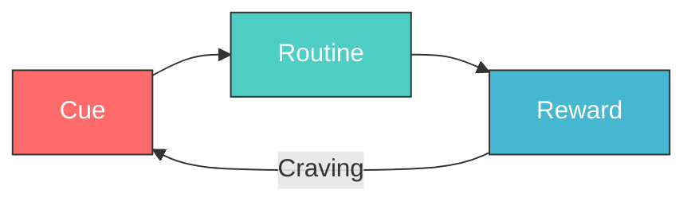
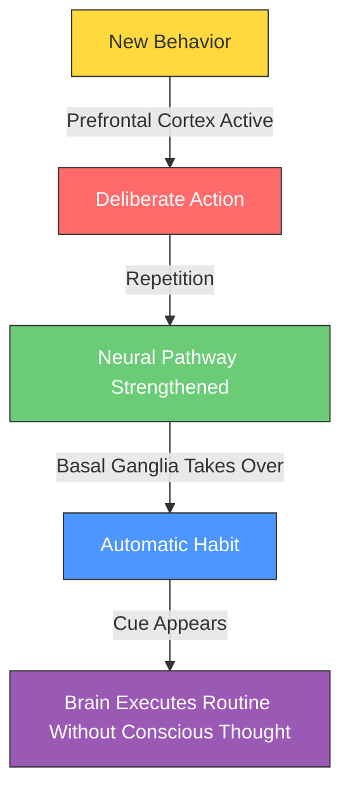

## The Habit Loop: How Habits Work

At the core of Duhigg's argument is a simple neurological pattern he calls the **habit loop**. Every habit—whether biting your nails, exercising, or刷牙—follows the same three-step sequence:

The **cue** is a trigger that tells the brain to enter automatic mode and select which habit to use. The **routine** is the behavior itself—physical, mental, or emotional. The **reward** is the payoff that tells the brain whether this loop is worth remembering for the future.

MIT researcher Ann Graybiel discovered that when a habit is formed, the brain shifts activity from the prefrontal cortex (where deliberate decisions occur) to the basal ganglia (where automatic behaviors are stored). This is why you can drive home on autopilot, barely remembering the trip—the basal ganglia executed the routine while your conscious mind wandered.

The critical insight is that **craving** drives the loop. As the habit becomes entrenched, the brain starts producing dopamine not when the reward arrives, but when the cue appears. This anticipatory craving is what makes habits feel irresistible and why willpower alone is insufficient to break them.

### How the Habit Loop Explains Real Behavior

| Habit | Cue | Routine | Reward |
|-------|-----|---------|--------|
| Afternoon coffee | Feeling groggy at 2pm | Walk to café, order cappuccino | Caffeine boost + social break |
| Stress eating | Anxiety or boredom | Eat snack | Temporary emotional comfort |
| Checking phone | Notification sound or idle moment | Unlock phone, scroll apps | Distraction + social connection |
| Evening wine | Arriving home from work | Pour a glass | Relaxation signal |

## The Golden Rule of Habit Change

Old habits cannot be destroyed—they can only be replaced. Duhigg presents the **Golden Rule of Habit Change** as the central prescription for behavioral transformation:

> **Keep the same cue. Keep the same reward. Insert a new routine.**

This framework was derived from research on addiction recovery. A smoker who smokes after meals (cue: post-meal; reward: oral fixation + relaxation) cannot simply stop. But by replacing the cigarette with nicotine gum or a short walk, the same cue and reward are served by a healthier routine.

The critical addition to this framework is **belief**. Duhigg documents how Alcoholics Anonymous and other recovery programs succeed not just through routine substitution but by fostering genuine belief that change is possible. This belief often comes through community support—group meetings, shared identity, and the witness of others who have changed.

### The Four Steps to Change a Habit

Drawing from Duhigg's framework, the process of habit change follows four stages:

| Step | Action | Purpose |
|------|--------|---------|
| 1. Identify the routine | Map the habit loop—what is the behavior you want to change? | Isolate the routine component |
| 2. Experiment with rewards | Try different rewards to determine which craving drives the loop | Identify the real reward |
| 3. Isolate the cue | Determine what triggers the routine (location, time, emotional state, other people, preceding action) | Find the trigger |
| 4. Have a plan | Write an if-then statement: "When CUE occurs, I will do NEW ROUTINE to get REWARD" | Create the replacement |

## Keystone Habits

Not all habits are equal. Some habits matter more than others because they create **cascading positive changes** across multiple areas of life. Duhigg calls these **keystone habits**.

The most widely cited example is exercise. Research shows that people who begin exercising regularly—even without changing anything else—start eating better, smoking less, being more productive at work, and showing more patience with family members. The exercise habit triggers a chain reaction of related improvements.

### Keystone Habits in Organizations

Paul O'Neill became CEO of Alcoa in 1987 with a surprising priority: worker safety. He announced at his first shareholder meeting that Alcoa would become the safest company in America. Every meeting would begin with safety discussions. Every executive's compensation would be tied to safety metrics.

Wall Street analysts were baffled. But O'Neill understood that worker safety was a keystone habit. To fix safety, Alcoa had to redesign how information flowed through the company—managers had to listen to frontline workers, problems had to be addressed immediately, and accountability had to be real. These changes, driven by the safety imperative, ended up transforming every aspect of Alcoa's operations. Within a year, Alcoa's profits hit a record high. By the time O'Neill retired in 2000, Alcoa's annual net income had increased fivefold.

### Identifying Keystone Habits

| Characteristic | Example |
|----------------|---------|
| Creates small wins that build momentum | Tracking food intake leads to better overall diet |
| Establishes structures where other habits flourish | Regular exercise creates routines around sleep and nutrition |
| Creates cultures where new values become ingrained | Workplace safety at Alcoa transformed organizational culture |

## Organizational Habits

Duhigg argues that organizations are, at their core, collections of habits. Institutional routines—the way meetings are run, how information is shared, what behaviors are rewarded and punished—determine whether companies succeed or fail.

### The Febreze Case Study

Procter & Gamble initially marketed Febreze as an odor eliminator. The product failed. People who lived with unpleasant smells had habituated to them—they couldn't smell the problem, so they never reached for the solution.

The breakthrough came when P&G researchers observed a woman cleaning her house. She sprayed Febreze on her couch, and Duhigg describes the moment: "She closed her eyes, inhaled deeply, and smiled. 'Ah,' she said, 'that smells wonderful.'" The reward wasn't eliminating bad smells—it was the **emotional satisfaction of a freshly cleaned room**. P&G repositioned Febreze as the final step in a cleaning routine, pairing the spray with the existing habit of tidying up. Sales skyrocketed to over $1 billion annually.

### Organizational Routines and Crises

When organizational habits break down, the consequences can be catastrophic. Duhigg examines how the London Underground fire of 1987, which killed 31 people, resulted from institutional habits—specifically, a culture where frontline workers' concerns were routinely ignored by management. The fire spread because of a broken habit of communication: workers had reported fire risks for years, but the organizational routine of dismissing their concerns persisted until disaster struck.

## Social Habits and Movements

The power of habits extends beyond individuals and organizations to shape entire social movements. Duhigg's analysis of the Montgomery Bus Boycott illustrates how social habits—strong ties, weak ties, and peer pressure—drive collective action.

### The Three Social Habits

1. **Strong ties** — Close relationships that motivate action. Rosa Parks's arrest galvanized her close community because they knew and cared about her personally.

2. **Weak ties** — Broader social networks that spread movements. The boycott spread through Montgomery because acquaintances and neighbors reinforced the new social norm.

3. **Peer pressure** — The expectation that others will hold you accountable. Once the boycott gained momentum, participating became a social obligation.

Martin Luther King Jr.'s genius was understanding that social habits could be deliberately activated. He didn't create the civil rights movement from scratch—he recognized that the social habits already existed within Montgomery's Black community and provided the spark that turned habits into a movement.

### Leadership and Social Habits

Leadership, Duhigg argues, is not about charisma or inspiration alone. It is about understanding the existing social habits within a community and providing the direction and hope needed to channel those habits into collective action. King succeeded because he understood the social fabric of his community and spoke to the habits that already bound people together.

## Willpower as a Muscle

One of the book's most influential concepts is the idea that **willpower is a finite, depletable resource**—like a muscle that tires with use. Duhigg draws on research from Walter Mischel's famous marshmallow experiments and subsequent studies showing that people who exercise self-control in one area of their lives often have less willpower available for other tasks.

### Implications for Habit Design

| Strategy | How It Works |
|----------|--------------|
| Reduce temptation | Structure your environment so cues for bad habits are minimized |
| Automate decisions | Turn good behaviors into habits so they require less willpower |
| Build routines | Regular schedules (same time, same place) reduce decision fatigue |
| Use commitment devices | Pre-commit to future behavior (e.g., automatic gym memberships) |

Duhigg argues that the most successful people aren't those with the most willpower—they're those who structure their lives to minimize the need for it. This insight connects directly to the habit loop: by turning beneficial behaviors into automatic routines, you conserve willpower for genuinely novel situations.

## The Neuroscience of Habit Formation

Duhigg explains that habits are stored in the basal ganglia, a structure at the center of the brain. When a behavior becomes habitual, activity in the basal ganglia increases while prefrontal cortex activity decreases. The brain literally stops thinking about what it's doing and lets the habit take over.

This neural architecture evolved because it saves energy. If every action required conscious deliberation, the brain would be overwhelmed. Habits free up cognitive resources for other tasks—but they also make change difficult because the old neural pathways never fully disappear.

### The Role of the Prefrontal Cortex

The prefrontal cortex is responsible for decision-making, planning, and self-control. When habits are first formed, this region is highly active. But as the habit becomes automatic, activity shifts to the basal ganglia. This is why habits feel effortless once established—and why changing them requires deliberate effort to reactivate the prefrontal cortex.

## Key Case Studies at a Glance

| Case Study | Key Concept | Outcome |
|-----------|-------------|---------|
| Lisa Allen (smoker → marathon runner) | Habit loop substitution | Transformed entire life by replacing smoking with running |
| Procter & Gamble / Febreze | Reward redesign | From failed product to $1B annual sales |
| Alcoa / Paul O'Neill | Keystone habit (safety) | Profits increased 5x during tenure |
| Target pregnancy prediction | Data-driven habit analysis | Identified pregnant customers before families knew |
| Michael Phelps | Habitual pre-race routine | 22 Olympic medals through rehearsed automatic behaviors |
| Starbucks / Howard Schultz | Willpower training | "Latte method" for handling difficult customers |
| Martin Luther King Jr. | Social habits | Montgomery Bus Boycott succeeded through community habits |
| London Underground fire (1987) | Organizational habit failure | 31 deaths due to ignored safety warnings |
| Alcoholics Anonymous | Belief + community | Bill Wilson's founding through personal transformation |
| Iraq food vendors | Keystone habit removal | Eliminating food vendors stopped riot patterns |
