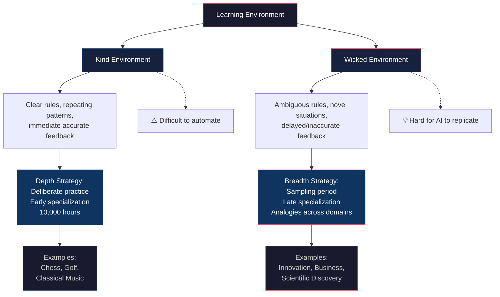

# Core Concepts

## The Tiger vs Federer Paths

Epstein's opening contrast sets up a lifetime-worksheet dichotomy:

| | **Tiger Path** (Early Specialization) | **Federer Path** (Sampling → Specialization) |
|---|---|---|
| Start | Narrow focus from infancy | Broad sampling across domains |
| Practice High | deliberate practice from age 2+ | Light structure, play-oriented |
| Commitment | Fixed early | Flexible; commitment comes after exploration |
| Risk | Cognitive entrenchment, burnout, poor match quality | Delayed payoff, potential for never committing |
| Works best in | Kind environments (predictable, clear feedback) | Wicked environments (complex, ambiguous) |

The key insight: **both paths can produce greatness**, but the Federer path is far more common among elite performers than popular narratives acknowledge. Epstein's research shows that most top performers — across sports, music, science, and business — had a "sampling period" before they specialized.

---

## Kind vs Wicked Learning Environments

This is the book's most important framework, drawn from the work of psychologist Robin Hogarth and extended via Kahneman and Klein's 2009 paper on the conditions for intuitive expertise.

| | **Kind Environment** | **Wicked Environment** |
|---|---|---|
| Rules | Clear, complete, stable | Unclear, incomplete, changing |
| Patterns | Repeat regularly | May not exist; not obvious |
| Feedback | Immediate, accurate, frequent | Delayed, inaccurate, or absent |
| Examples | Chess, golf, classical music, firefighting | Stock market, business strategy, medicine, parenting |
| Expertise develops | Through deliberate practice and experience | Does not reliably correlate with experience |
| Specialization effect | Positive — more experience = better performance | Neutral or negative — narrow experts get entrenched |

The practical implication: **before investing heavily in specialization, ask whether you're in a kind or wicked environment**. If wicked, breadth and analogical thinking matter more than hours of narrow practice.

---

---

## Kind/Wicked Environment Matrix

| Environment Type | Rules | Feedback | Pattern | Best Strategy | Example Domain |
|---|---|---|---|---|---|
| Kind | Clear & stable | Immediate & accurate | Repeats | Deliberate practice | Chess, Golf, Firefighting |
| Kind with noise | Clear but variable | Immediate but noisy | Repeats with variation | Deliberate practice + statistical thinking | Baseball, Weather forecasting |
| Wicked with structure | Unclear but discoverable | Delayed but eventually clear | Hidden patterns | Broad sampling + analogical thinking | Medicine, Engineering |
| Pure wicked | Unclear & shifting | Delayed & inaccurate | May not exist | Diverse teams + outside view | Investing, Politics, Innovation |

---

## Match Quality

The concept economists use to describe how well a career fits a person's abilities and interests. Epstein's crucial contribution: **match quality is not discoverable through introspection alone**. You must *sample* options to learn what fits.

- People who switch careers more early on end up with higher job satisfaction — not because switching is good, but because sampling improves match quality
- Early specialization reduces match quality by locking people in before they have enough information
- The optimal strategy: broad exploration in early adulthood, then increasing specialization as match quality improves

The math: if 20% of careers would be a great fit for you, and each one takes 2 years to properly evaluate, you need ~10 years of exploration to find your match. The Head Start Fallacy ignores this entirely.

---

## Lateral Transfer

The ability to take knowledge or skill from one domain and apply it to a different one. This is the cognitive mechanism that makes generalists effective in wicked environments.

**Key research finding**: "Breadth of training predicts breadth of transfer." The more contexts in which you learn something, the more you build abstract mental models that work across domains.

**Examples of lateral transfer in action**:
- Nobel laureates are 22x more likely to be amateur actors, dancers, or musicians than typical scientists (Root-Bernstein, 2008)
- Gunpei Yokoi (Nintendo) applied "lateral thinking with withered technology" — taking cheap, mature technologies from one domain and creatively applying them to gaming (Game & Watch, Game Boy)
- The invention of the graphical user interface (Doug Engelbart and his lab at SRI) drew from psychology, engineering, and information science

---

## The Head Start Fallacy

The widespread belief that starting early in a field is necessary for elite performance. Epstein shows this is false in two ways:

1. **The sampling period**: Most elite performers sampled multiple activities before specializing. Even in domains where deliberate practice is crucial (music, chess), the most common path is breadth first, depth later.
2. **The 10,000-hour rule is incomplete**: Anders Ericsson's deliberate practice research was about *what* practice produces expertise, not *how much*. Gladwell's popularization oversimplified. Recent replications (Macnamara et al., 2014, 2016) show deliberate practice explains far less variance than originally claimed — 18-26% across domains, leaving ~75% unexplained.

**The real head start**: Having better match quality, not more hours of early practice.

---

## The Grit Paradox

Angela Duckworth's work on grit (passion + perseverance for long-term goals) is valuable but incomplete. Epstein identifies a crucial gap:

- **Grit works in kind environments** where the goal is clear and perseverance pays off
- **In wicked environments**, persistence on the wrong path is disastrous
- The most successful people are *selectively* gritty: they quit bad matches quickly and persist on good ones

**The paradox**: Knowing when to quit requires the same self-knowledge that broad sampling provides. You can't know if you should quit or persist until you've sampled enough alternatives to have a comparison.

Epstein's practical rule: "Before starting, list quitting conditions." Set objective criteria for when to persist versus move on, defined *before* sunk costs cloud your judgment.

---

## The Sampling Period

The phase — typically lasting years — during which future elite performers explore multiple domains before committing to one. Epstein shows this is the norm, not the exception.

| Domain | Sampling Pattern |
|--------|-----------------|
| Sports | Most elite athletes played 3-5 sports before age 15; single-sport early specialization correlates with higher injury rates and shorter careers |
| Music | Top musicians typically studied 2-3 instruments before focusing on one (even in the "early specialization" field of classical violin) |
| Science | Nobel laureates change fields 2-3 times on average during their career; the most impactful scientists are often late bloomers |
| Business | Successful entrepreneurs change careers 3+ times before founding their breakout company |
| Art | Van Gogh tried art dealing, teaching, and theology before painting at age 27 |

---

## Cognitive Flexibility and Entrenchment

**Cognitive entrenchment** (Erik Dane, Rice University): The tendency for experts in a narrow domain to become rigid in their thinking. The more expertise you have in a single area, the harder it is to:
- See alternative approaches
- Recognize when your framework is wrong
- Integrate information from other domains

**Cognitive flexibility**: The ability to shift between different mental frameworks, switch perspectives, and adapt to novel situations. This is the skill that broad experience builds and narrow specialization erodes.

The practical takeaway: periodically stepping outside your domain — even maintaining a serious hobby in an unrelated field — protects against entrenchment and fuels innovation.

---

## Analogies as Tools in Wicked Environments

In kind environments, you can solve problems with domain-specific algorithms. In wicked environments, you need analogies — recognizing structural similarities between superficially different problems.

**The outside view**: When making a prediction or plan, don't rely on your detailed inside knowledge. Instead, find a reference class — a set of analogous situations — and use their base rates. This consistently produces better forecasts than expert intuition.

**Successful problem solvers** (Chi et al., 1981): The key difference between expert and novice problem solvers isn't knowledge — it's that experts first identify the *deep structure* of a problem before selecting a strategy. Novices jump to surface-level categorization and apply the wrong approach.

---

## Key Lessons

1. **Breadth is not the opposite of depth — it's the foundation of it.** The most creative, impactful people don't choose between breadth and depth; they build depth on a foundation of breadth.
2. **The modern world is increasingly wicked.** As the Flynn Effect shows, we've become better at abstract, conceptual thinking — exactly the skill that breadth develops and narrow specialization erodes.
3. **The most important career decision is match quality, not start time.** Early specialization trades match quality for a head start. That trade usually isn't worth it.
4. **Quitting is a skill.** Knowing when to quit — and doing it decisively — is as important as persistence. Quitting is not failure; it's information.
5. **Experts' opinions are less valuable than their facts.** Experts provide data. Their predictions and judgments, however, are often worse than educated amateurs'.
6. **Analogies are the most powerful thinking tool in wicked environments.** The ability to see deep structural similarities across domains is the cognitive superpower of the generalist.

---

## Practical Applications

**For Individuals**: If you're early in your career, optimize for match quality — sample broadly, switch when something doesn't fit, don't worry about the head start. If you're mid-career, maintain range through outside interests, cross-domain reading, and periodic "mini-samplings" of new fields.

**For Parents**: Encourage your children to try multiple activities. Don't push early specialization. The "pully parent" — one who pulls back instead of pushing — is the Federer model. Provide exposure, not pressure.

**For Leaders**: When hiring for wicked-environment roles (most leadership, strategy, and innovation roles), prioritize range over domain expertise. The person who has worked in 3 industries is often more valuable than the one who's spent 15 years in yours.

**For Learners**: Use interleaving (mixing different types of problems), test yourself, and deliberately cultivate "desirable difficulties." If learning feels smooth and comfortable, you're not building range.

**For Organizations**: Create space for generalists. Don't force everyone into narrow job descriptions. Reward cross-functional work, and build diverse teams where range-thinkers complement depth experts.

---

## Examples

**Roger Federer**: Sampled wrestling, swimming, basketball, handball, badminton, table tennis, tennis, and soccer before committing to tennis at 12. His parents actively discouraged early specialization. The result: extraordinary athletic range that made his tennis uniquely creative and adaptable.

**The Nintendo Game Boy**: Gunpei Yokoi's philosophy of "lateral thinking with withered technology" — taking cheap, mature technologies (4-bit processor, monochrome LCD) from other domains and combining them creatively — produced one of the most successful products in history. The technical specialists at Sony and Sega didn't see it coming.

**Vincent van Gogh**: Failed at art dealing, teaching, and theology. Started painting at 27. Produced his masterpieces in the final 3 years of his life. The range of his early failures gave his work an emotional depth and perspective that his formally-trained contemporaries lacked.

**Nobel Laureates**: Scientists who win Nobel Prizes are 22x more likely than typical scientists to be amateur performers (actors, dancers, musicians). They change fields more often. They read outside their discipline. Their "range" is not a distraction — it's an engine.

**The Challenger Disaster**: Epstein argues the disaster was partly a failure of range. Engineers at Morton Thiokol and NASA were so narrowly focused on their specific domains that they missed the systemic picture. The O-ring data was available — specialists didn't connect the dots.

**The Ehrlich-Simon Bet**: Ecologist Paul Ehrlich (specialist) predicted resource scarcity would cause catastrophic price increases in the 1980s. Economist Julian Simon (generalist) bet him they wouldn't. Simon won. His breadth of perspective — using historical base rates and cross-domain analogies — beat Ehrlich's deep but narrow expertise.

**Art Fry (3M Post-it Note)**: A chemist who sang in a church choir. His frustration with bookmarks falling out of his hymnal combined with his knowledge of a "failed" adhesive (discovered by a colleague in another department) to create one of the most successful office products ever. The cross-domain connection was invisible to a specialist.

---

## Action Plan

1. **If you're exploring**: Actively seek variety. Try activities you're not yet good at. Sample careers, hobbies, skills, and domains for 6-24 months each before narrowing. Track what energizes you.

2. **If you're early in specialization**: Maintain at least one significant interest outside your domain. Take a class in an unrelated field. Read books outside your discipline. This protects against cognitive entrenchment and fuels lateral transfer.

3. **If you're hiring**: Evaluate candidates for range. Look for people who've worked in different industries, learned unrelated skills, or pursued significant outside interests. Ask about what they've quit and why.

4. **If you're stuck**: Ask whether you're in a kind or wicked environment. If wicked, stop trying to solve the problem with deeper domain expertise. Look for analogies. Seek the outside view. Find someone from a different field and ask them how they'd approach it.

5. **If you're learning**: Use interleaving — mix different types of problems in each study session. Test yourself frequently. Explain concepts to someone outside your field. Build connections between new ideas and your existing knowledge from other domains.

6. **If you're teaching**: Design curricula that emphasize transfer. Teach concepts in multiple contexts. Resist the urge to make learning feel smooth and easy. Use analogies across domains. Delay specialization.
