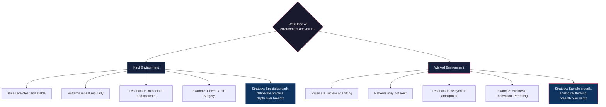

# Narration

*The Case for Generalism*

---

**Host**: Welcome back. Today we're diving into *Range: Why Generalists
Triumph in a Specialized World* by David Epstein. And I have to say —
this book messed me up. In a good way.

**Skeptic**: I've heard about it. Isn't it the one that says the
10,000-hour rule is wrong?

**Host**: That's one piece of it. But it's so much more. It's an
evidence-backed dismantling of the idea that you need to pick one thing
early, grind it out, and never look back. And honestly, as someone who
has read *Peak*, *Grit*, and *Outliers* — I thought I had expertise
figured out. This book made me reconsider everything.

**Skeptic**: OK, I'm intrigued but skeptical on principle. I read
Gladwell's *Outliers* and was convinced that 10,000 hours of
deliberate practice was the path. I read Ericsson's *Peak* and learned
*how* to practice. I read Duckworth's *Grit* and learned to persist.
Where does Range fit in?

**Host**: It's the counterweight. Let me give you the core idea in one
sentence: the type of environment you're in determines whether
specialization or breadth wins.

**Skeptic**: That's too simple. What does "type of environment" mean?

**Host**: Epstein borrows a framework from psychologist Robin Hogarth.
He divides learning environments into two types: kind and wicked.

**Skeptic**: And this is different from Kahneman's System 1 and
System 2?

**Host**: Related but different. Kahneman showed that intuition is
unreliable. Hogarth showed *why* — it depends on whether the
environment gives you accurate feedback. Let me show you what I mean.

**Skeptic**: OK, interesting. So chess is "kind" — clear rules,
immediate feedback, stable patterns. And... business strategy is
"wicked"?

**Host**: Exactly. And here's why this matters. Ericsson's deliberate
practice research — which *Peak* is built on — was conducted almost
entirely in kind environments. Chess, music, sports. Domains where you
can practice a specific thing, get immediate feedback, and improve
measurably.

**Skeptic**: That's a fair point. But aren't there kind elements in
wicked environments too? A business leader needs to understand
accounting — that's pretty stable.

**Host**: Yes, and Epstein acknowledges this. No environment is purely
kind or wicked. But here's the crucial insight: in wicked environments,
*more experience does not reliably produce better performance*. That's
not my opinion — that's Kahneman and Klein's 2009 paper. Medical
doctors making complex diagnoses, stock pickers, political forecasters
— they don't improve with experience alone. Some actually get worse
because they get more confident and less flexible.

**Skeptic**: But what about the 10,000-hour rule? I thought that was
settled. Gladwell made it famous, Ericsson validated it...

**Host**: Here's where Range hit me hardest. Ericsson's original Berlin
violin study found that the best students had accumulated about 10,000
hours of deliberate practice by age twenty. But the *range* — pun
intended — was 7,400 to 14,000 hours. The rule is a marketing slogan,
not a scientific finding.

**Skeptic**: But my copy of *Peak* explicitly says Gladwell
oversimplified...

**Host**: It does. Ericsson himself hates the 10,000-hour rule. So
we're actually agreeing so far. But here's where Range goes further.
Brooke Macnamara and David Hambrick ran a massive meta-analysis —
combining all the available studies — and found that deliberate
practice accounts for only 18 to 26 percent of the variance in
performance across domains.

**Skeptic**: Wait. So 74 to 82 percent is... something else?

**Host**: Something else. Genetics, sure. But also: starting age,
personality, luck, and — crucially — *range*. The breadth of
experience you bring to a domain. Epstein's argument is that the
variance deliberate practice *doesn't* explain is partly explained by
how many different contexts you've learned in.

**Skeptic**: That's a bold claim. What's the evidence?

**Host**: It's not from one study — it's a pattern across domains.
Nobel laureates are 22 times more likely to have artistic or
performance pursuits than typical scientists. The most cited scientific
papers are often by researchers who changed fields. Elite athletes
mostly played multiple sports before age fifteen. It's a convergent
evidence argument, not a single knockout study.

**Skeptic**: Let me push back. Survivorship bias. We see the
generalists who succeeded. We don't see the ones who drifted.

**Host**: That's the strongest criticism of the book, and Epstein
doesn't address it well. But the same criticism applies to the Tiger
Woods narrative. We see the early-specializers who made it, not the
thousands who burned out or peaked at sixteen. The question is not
which side has more survivorship bias — both do. The question is which
path produces better outcomes *on average*, and the data leans toward
sampling.

**Skeptic**: What about Grit? I loved Duckworth's book. The idea that
passion and perseverance matter more than talent...

**Host**: Epstein has a whole chapter on what he calls the "grit
paradox." And it's the most intellectually honest part of the book. He
agrees that grit matters — but argues that grit requires knowing when
to quit.

**Skeptic**: That sounds like a contradiction.

**Host**: Exactly the tension. Duckworth's Grit Scale includes
"consistency of interests" as a component. People who switch careers
or hobbies score lower. But what if switching is *how you find the
right thing to be gritty about*?

**Skeptic**: That's... actually a good point. Duckworth's framework
doesn't tell you how to choose the goal.

**Host**: Right. Epstein introduces the economic concept of "match
quality" — how well a career fits your abilities and interests. You
can't know your match quality without sampling. And sampling requires
quitting. The most successful people are selectively gritty: they quit
bad matches quickly and persist on good ones.

**Skeptic**: But how do you know which is which? That's the hard part.

**Host**: Epstein has a practical rule: before starting something, list
your quitting conditions. Define, in advance, what would make this a
bad match. That way you're not making the decision under the influence
of sunk costs. It's like setting a stop-loss.

**Skeptic**: That's actually useful. I've never heard that before.

**Host**: Let me give you the analogy that made the whole thing click
for me. Think of your career like a hiking route. The specialist says:
pick the tallest mountain, start climbing immediately, don't look back.
The generalist says: spend your first decade exploring the landscape.
Find which mountains exist, which ones suit your abilities, which ones
have trails you enjoy. Then climb. The specialist summits faster. But
the generalist might climb the *right* mountain.

**Skeptic**: And that works in... what, all fields?

**Host**: No. And Epstein is clear about this. If you want to be a
concert pianist, start early and practice deliberately. If you want to
be a competitive chess grandmaster, same. But if you want to start a
company, make a scientific breakthrough, lead an organization, or do
almost anything in a fast-changing field — sample first, specialize
later.

**Skeptic**: So the book's advice is domain-dependent.

**Host**: Yes, but most people don't know which domain they're in.
Epstein tells the story of Frances Hesselbein, who became CEO of the
Girl Scouts of the USA without any nonprofit management experience.
She had range — she'd worked in publishing, retail, and volunteer
organizations. She transformed the organization. How many HR
departments would have rejected her for lacking "relevant experience"?

**Skeptic**: Her story is inspiring, but it's one example. I keep
coming back to: how do I apply this in my own life?

**Host**: Three concrete things. One: if you're early in your career,
optimize for learning, not for the perfect job title. Sample different
roles. Each one teaches you something about what fits. Two: maintain a
serious outside interest. A hobby, a side project, a second domain.
This protects against cognitive entrenchment — and might be the source
of your best ideas. Three: when hiring, look for range. The person who
worked in three industries might be more valuable than the one who
spent fifteen years in yours.

**Skeptic**: The hiring one is hard to sell to most managers.

**Host**: It is. But the data is on your side. McKinsey's own research
on problem-solving found that diverse teams — people with different
backgrounds and cognitive styles — consistently outperformed
homogeneous teams of domain experts. Epstein calls it the "outsider
advantage."

**Skeptic**: Let me test something. I spent my twenties switching
between three different careers. I always felt ashamed of it — like I
wasn't committed. You're telling me that was actually... optimal?

**Host**: If you found a career that fits you well now, yes. Epstein
would say your twenties were a "sampling period" that improved your
match quality. The average person changes careers five to seven times
in their life. The people who do it *early* end up happier than people
who lock in early and try to switch later.

**Skeptic**: That's oddly comforting.

**Host**: That's the emotional core of Range. It validates something
many of us already feel — that our breadth is not a bug, it's a
feature. That the shame of not having "found our passion" yet is
misplaced. That the head start is overrated and match quality is
everything.

**Skeptic**: But here's my lingering doubt: if everyone becomes a
generalist, who does the specialized work that civilization depends on?
We need surgeons who can do the same procedure a thousand times. We
need engineers who know the material science of turbine blades. We need
concert violinists.

**Host**: And Epstein never says we don't. He explicitly says: in kind
environments, specialize. The book's subtitle is "Why Generalists
Triumph *in a Specialized World*" — not "Why Specialists Are
Obsolete." The point is that the world has more wicked environments
than we think, and the education-to-career pipeline is designed as if
everything were kind.

**Skeptic**: OK, final question. If I take one thing from this book,
what should it be?

**Host**: The question to ask yourself is not "am I good enough?" or
"have I practiced enough hours?" but "am I in a kind or wicked
environment?" If you're in a wicked one — and most knowledge workers
are — then the answer is not more deliberate practice. The answer is
more range. Broader inputs, more analogies, more sampling. Don't dig
deeper. Go wider.

**Skeptic**: That's a surprisingly actionable takeaway for a book that
is, fundamentally, a collection of stories.

**Host**: That's what the best pop-science does — it tells you stories
that change how you see the world, and the action follows naturally.
Range changed how I think about my career, my learning, and how I hire.
Whether or not every example holds up under academic scrutiny, the
central insight is durable: breadth is not the enemy of depth. It's the
foundation.

**Skeptic**: Where do I start if I want to build more range?

**Host**: Pick up a book outside your field. Take a class in something
you're bad at. Say yes to the project that scares you because you don't
know how to do it. Join a team with different expertise. Quit something
that isn't working. These small acts of breadth compound into something
valuable: the ability to see connections that specialists miss.

**Skeptic**: I think I'm convinced. Not that specialization is bad —
but that range is more valuable than I gave it credit for.

**Host**: That's exactly the right take. Epstein's closing line says it
all: "We need specialists. But we also need people who can connect
across specialties. And in a world that's becoming more specialized by
the day, the connectors have never been more valuable."

**Skeptic**: Thanks for walking me through this.

**Host**: My pleasure. This has been a BookAtlas narration of *Range*
by David Epstein. Go sample something.
