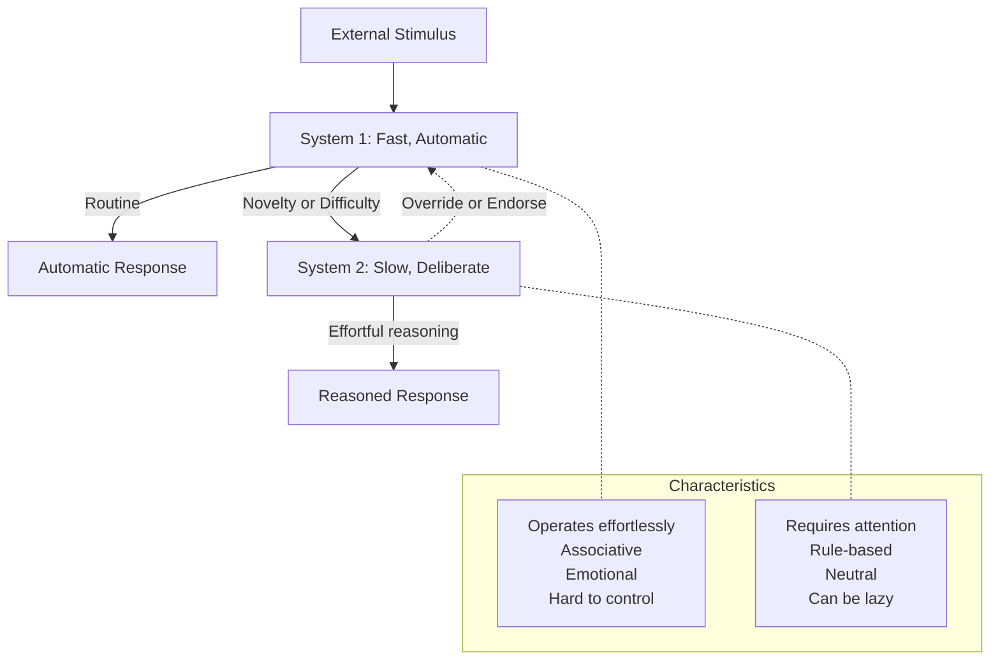
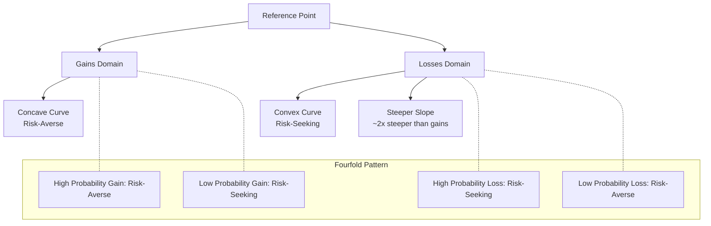
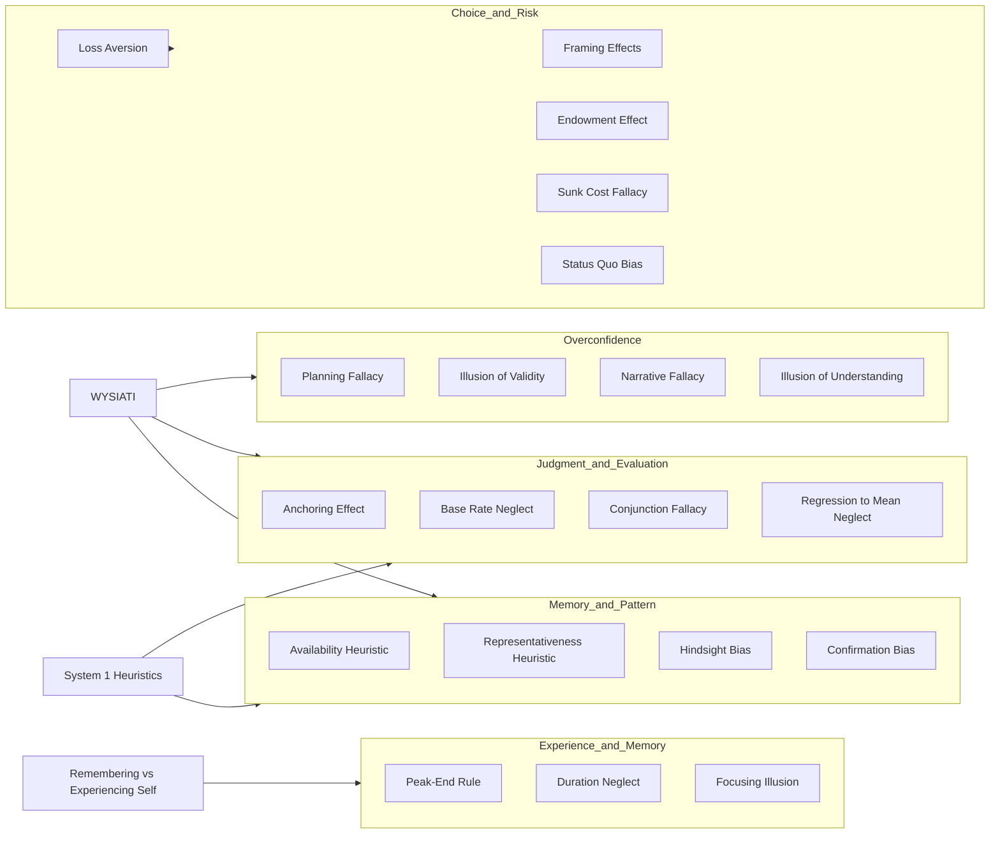
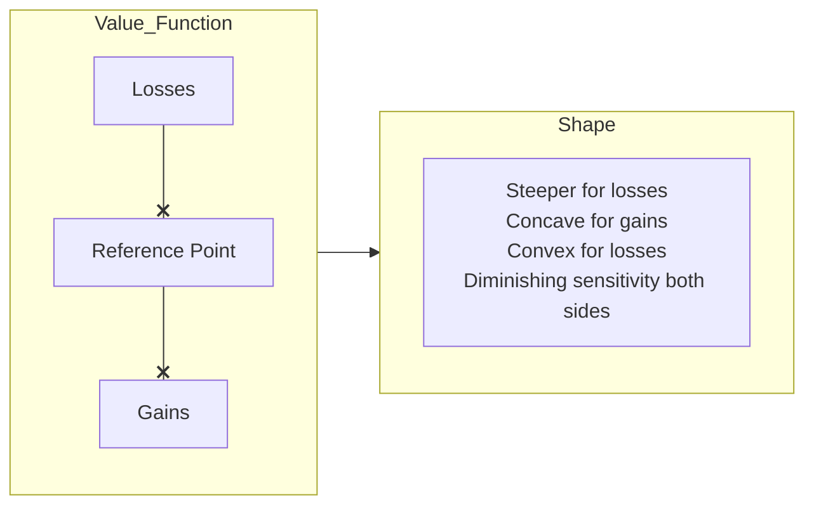

## System 1 and System 2

Kahneman's organizing metaphor divides mental life into two fictional characters.

**System 1** operates automatically and quickly, with little or no effort and no sense of voluntary control. It detects hostility in a voice, reads anger on a face, answers 2+2, completes the phrase "bread and...", drives an empty road, and makes the "wide face" chess move when a master sees the board.

**System 2** allocates attention to effortful mental activities. It computes 17x24, parks in a tight space, fills out a tax form, compares two washing machines for value, and checks the validity of a complex logical argument. System 2 is associated with the subjective experience of agency, choice, and concentration.

The critical insight: System 2 is lazy. It monitors System 1's output but often endorses intuitive answers without deeper checking, especially when cognitive resources are low (tired, hungry, distracted). Most errors traced in the book arise because System 1 generated a flawed intuition and System 2 failed to correct it.

The two systems interact constantly. When you drive, System 1 handles routine operations. When an unexpected pedestrian steps out, System 2 takes over. The conflict between them produces the book's most interesting phenomena.

## Cognitive Ease

When System 1 is operating smoothly, you experience a feeling of cognitive ease. Familiar stimuli, clear font, repeated exposure, and a good mood all generate this feeling. Crucially, cognitive ease is a System 1 signal that System 2 interprets as truth, liking, and confidence.

If a statement is printed in bold blue text and easy to read, you are more likely to believe it than the same statement printed in a small, fuzzy gray font. This is not rational — but it is reliable. Cognitive ease flows from any manipulation that reduces mental strain, and it feeds the illusion of truth.

The mere exposure effect (Zajonc, 1968) is a manifestation: repeated exposure to a stimulus creates liking, even without conscious recognition. The brain mistakes processing fluency for preference.

## Priming

Priming is the mechanism by which an idea activated in one context influences thought and behavior in a subsequent context, often without awareness.

The classic experiment: subjects who unscrambled sentences containing words associated with old age (Florida, forgetful, wrinkle) walked more slowly down the hall than controls (Bargh, Chen & Burrows, 1996). The idea of "old" activated the behavioral schema associated with old age.

Kahneman devotes significant space to priming because it demonstrates how deeply System 1 connects ideas associatively. The concept of **ideomotor priming** — thinking of an action makes its execution more likely — links cognition to behavior at a level beneath conscious control.

**Note on replicability**: The Florida walking study, along with much of social priming research, has failed to replicate in large-scale direct replications. Kahneman himself published an open letter in 2012 expressing doubt about the robustness of priming findings and urging researchers to conduct replication studies. This issue is explored further in the Analysis section.

## Availability Heuristic

You assess the frequency or probability of an event by the ease with which instances come to mind. Salient, vivid, and recent events are more available than mundane ones. This heuristic produces systematic bias.

Examples: People overestimate the frequency of shark attacks (dramatic and memorable) and underestimate deaths from asthma (undramatic and forgettable). Media coverage amplifies this — more coverage = more availability = inflated risk perception.

Tversky and Kahneman (1973) demonstrated this experimentally by asking subjects whether more words in English start with K or have K as the third letter. Most said "start with K" because it is easier to recall words by first letter, but English has roughly twice as many words with K in the third position.

The availability heuristic also explains the **affect heuristic** (Slovic, 2002): emotional reactions guide perceived risk. If we like an activity (nuclear power? no; skiing? yes), we judge its risks as low and benefits as high.

## Representativeness Heuristic

You judge the probability that A belongs to category B by how similar A is to the stereotypical member of B — ignoring base rates and statistical evidence.

The canonical example: Linda is 31, single, outspoken, and majored in philosophy. As a student she was deeply concerned with discrimination and social justice. Which is more probable?
- A: Linda is a bank teller.
- B: Linda is a bank teller and active in the feminist movement.

85% of people choose B, but B is a logical subset of A, so it cannot be more probable. This is the **conjunction fallacy**. System 1 substitutes representativeness (how good a fit is "feminist bank teller" for the description?) for probability (which category is larger?). System 2 endorses the intuitively appealing answer.

**Base rate neglect** follows the same pattern. Presented with a description of a shy, orderly man and told he is drawn from a population of 70 engineers and 30 lawyers, people still rate the chance he's an engineer at 90% — anchoring on representativeness, ignoring the base rate.

## Anchoring

Anchoring occurs when a provided numeric value influences subsequent estimates, even when the anchor is arbitrary or absurd. The mechanism involves both System 1 (automatic suggestion effect) and System 2 (insufficient adjustment away from the anchor).

The classic demonstration: subjects spin a rigged wheel that lands on 65 or 10, then are asked whether the percentage of African nations in the UN is more or less than that number, and then to estimate the actual percentage. The 65 group estimated ~45%; the 10 group estimated ~25%. The irrelevant anchor pulled estimates in its direction.

Kahneman identifies two mechanisms:
1. **Selective accessibility** (System 1): The anchor activates compatible information in associative memory, biasing the evidence base for the judgment.
2. **Insufficient adjustment** (System 2): People start at the anchor and move away, but stop too early because moving requires effort.

Anchoring is remarkably robust. It works with clearly random anchors, with implausible anchors (is the Mississippi River longer or shorter than 100,000 miles?), and even when subjects are explicitly warned that the anchor is meaningless.

## WYSIATI — What You See Is All There Is

This is perhaps the most fundamental concept in the book — the master key that unlocks many biases. System 1 constructs the best possible story based only on the information currently available and has no mechanism for registering what it does not know.

WYSIATI explains:
- **Overconfidence**: You construct a coherent story from fragmentary evidence and mistake coherence for truth.
- **Framing effects**: Your response depends on which aspects of a situation are made salient.
- **Confirmation bias**: You seek and weight evidence consistent with your existing story.
- **Hindsight bias**: After learning the outcome, you seamlessly integrate it into your story and cannot reconstruct your prior ignorance.
- **Cause-seeking**: System 1 detects causal patterns even in random noise.

WYSIATI is not a bug — it is a feature of an associative machine that must operate quickly and efficiently. But in a world where missing information is often the most important information, it is a dangerous feature.

## Loss Aversion and Prospect Theory

Prospect Theory (Kahneman & Tversky, 1979) is the centerpiece of the book and Kahneman's Nobel-winning contribution. It describes how people actually evaluate risky choices, in contrast to the rational Expected Utility Theory.

Three core properties distinguish Prospect Theory:

1. **Reference dependence**: Utility is attached to gains and losses relative to a reference point, not to absolute states. Winning $100 feels good; losing $100 feels bad. But winning $100 when you expected $200 feels like a loss.

2. **Loss aversion**: Losses loom larger than gains. The ratio is approximately 2:1 — the pain of losing $100 is roughly twice the pleasure of winning $100. This explains the endowment effect, status quo bias, and reluctance to accept symmetric bets.

3. **Diminishing sensitivity**: The marginal impact of both gains and losses diminishes with magnitude. The difference between $0 and $100 feels larger than the difference between $1100 and $1200.

The famous Asian Disease Problem demonstrates framing: "600 people are infected. Program A saves 200 people. Program B has a 1/3 chance of saving 600 and 2/3 chance of saving none." Most choose A (risk-averse for gains). Reframe: "Program A: 400 people die. Program B: 1/3 chance nobody dies, 2/3 chance 600 die." Most choose B (risk-seeking for losses). Same options, different frames.

## Framing Effects

The way a choice is presented — the frame — determines which aspects of the decision are salient. Since System 1 responds to salience and reference points, different frames produce different preferences even when the objective outcomes are identical.

Beyond the Asian Disease Problem, framing effects appear everywhere:
- **Narrow framing**: People evaluate each gamble in isolation rather than aggregating over many decisions, which encourages excessive risk aversion.
- **Mental accounting**: People segregate money into mental accounts (grocery budget, entertainment budget) and treat losses within each account differently than they would treat the same total loss across accounts.
- **Sunk cost**: Money already spent creates a mental account that "must be closed" profitably, driving irrational persistence.

Kahneman argues that reframing is effortful (System 2 work) and that we default to whatever frame our environment supplies.

## Endowment Effect

People demand much more to give up something they own than they would pay to acquire it. The gap between willingness-to-accept and willingness-to-pay is a direct consequence of loss aversion: giving up an object is coded as a loss; acquiring it is coded as a gain. Losses hurt more than gains gratify.

Thaler's classic experiment: subjects given a coffee mug demanded a median of $5.25 to sell it; subjects not given a mug were willing to pay only $2.25 to buy one. The mere act of ownership shifted the reference point.

The endowment effect is strongest for goods held for personal use and weaker for goods held for exchange. It explains why real estate sellers often overprice their homes and why "free trials" convert so effectively — once you own the product, losing it hurts.

## Peak-End Rule and Duration Neglect

The remembering self does not store a moment-by-moment record of experience. Instead, it judges past episodes by two data points: the most intense moment (peak) and the ending. Duration is largely ignored.

In a colonoscopy study (Redelmeier & Kahneman, 1996), patients reported less pain for a longer procedure that had a less painful ending than for a shorter procedure with a more painful ending. The patients whose actual experience was worse (more cumulative pain) gave better retrospective ratings — and were more willing to return.

This creates a fundamental tension: the experiencing self suffers longer but the remembering self feels better. Kahneman asks: which self matters? If you trust the remembering self, you would recommend the longer, easier-ended procedure. If you trust the experiencing self, you would not.

## Planning Fallacy

The planning fallacy is the systematic tendency to underestimate costs, completion times, and risks of planned actions — even when past projects of the same type have consistently run over.

Kahneman offers a clean prescription: **reference-class forecasting**. Instead of constructing a story from the inside (the unique features of this project), step outside and ask: How long did similar projects actually take? The inside view is WYSIATI in action; the outside view incorporates base rates.

The Edinburgh Parliament building was budgeted at £40 million and cost £400 million. The Sydney Opera House was budgeted at $7 million and cost $102 million. Every major infrastructure project shows the same pattern. Kahneman notes that optimism may be the engine of capitalism (without it, no one would undertake ambitious projects), but it also reliably produces overruns.

## Hindsight Bias

After learning an outcome, people systematically exaggerate how well they could have predicted it in advance. "I knew it all along" is a feeling that directly undermines learning from experience.

The mechanism: the outcome becomes seamlessly integrated into your existing story. Since WYSIATI means you cannot remember which evidence was and was not available before the outcome, your updated story feels like the story you always had.

The hindsight bias is particularly damaging in organizational learning. Post-mortems and reviews are contaminated by it: the team that made a reasonable decision based on available information is judged harshly because the outcome is now known. Kahneman argues that the only defense is disciplined decision journals — recording predictions before outcomes are known, then reviewing them coldly afterward.

## Cognitive Biases Taxonomy

## Prospect Theory Value Function

The value function is S-shaped and asymmetrical. It passes through the reference point (where gains and losses are defined relative to, not absolute). It is concave for gains (risk-averse: sure $500 beats a 50% chance of $1000) and convex for losses (risk-seeking: a 50% chance to lose $1000 beats a sure loss of $500). And it is notably steeper for losses than for gains — the hallmark of loss aversion.

## Key Lessons

- **Recognize cognitive ease as a warning**: If a decision feels effortless and intuitive, pause. The ease may signal familiarity rather than correctness.
- **Ask "what is the base rate?"**: Before making any probabilistic judgment, ask what the typical outcome is for similar cases.
- **Reset your anchor**: Before negotiating or estimating, deliberately consider an opposite anchor. If selling, think of low prices first.
- **Broad-frame your decisions**: Avoid narrow framing. Aggregate many small gambles rather than evaluating each in isolation.
- **Check your reference point**: Ask whether your perception of gain or loss is determined by an arbitrary reference point rather than by absolute outcomes.
- **Use the outside view**: For any plan or prediction, first ask how similar projects actually performed.

## Practical Applications

| Domain | Application |
|---|---|
| Investing | Recognize that loss aversion causes selling winners too early and holding losers too long. Set mechanical rules. |
| Negotiation | Anchor first and anchor aggressively. The first number pulls the entire negotiation. |
| Product design | Use loss framing ("don't miss out") rather than gain framing for conversion. Free trials exploit endowment. |
| Medical decision-making | Test both survival and mortality frames on patients. The choice changes. |
| Risk management | Use reference-class forecasting for project timelines. Inside-view optimism is the norm. |
| Performance reviews | Keep a decision journal. Hindsight bias guarantees you will judge past decisions unfairly. |
| Public policy | Design defaults that work with System 1. Organ donation opt-out vs opt-in changes rates from ~40% to ~90%. |

## Action Plan

1. **Install friction for important decisions**: When the stakes are high, force System 2 engagement. Write down the pros and cons. Ask someone else to play devil's advocate.
2. **Build a personal bias checklist**: Before major financial commitments, run through: Am I anchored? Am I loss-averse? Am I overconfident? Am I ignoring base rates?
3. **Practice reference-class forecasting**: For any major project, collect data on similar projects first. Use their outcomes, not your story, as your prediction.
4. **Adopt broad framing**: Refuse to evaluate any decision in isolation. Ask: if I made 100 decisions like this, what would my aggregate outcome be?
5. **Keep a prediction journal**: Record your forecasts with confidence levels. Review them quarterly. Calibrate your judgment against reality.
6. **Redesign your environment**: Make desired behaviors easy (System 1 friendly) and undesired behaviors hard. Environment design beats willpower.
7. **Trust algorithms over intuition in the right domains**: Where statistical prediction is known to outperform experts (clinical diagnosis, hiring, parole decisions), use the algorithm even when it feels wrong.
