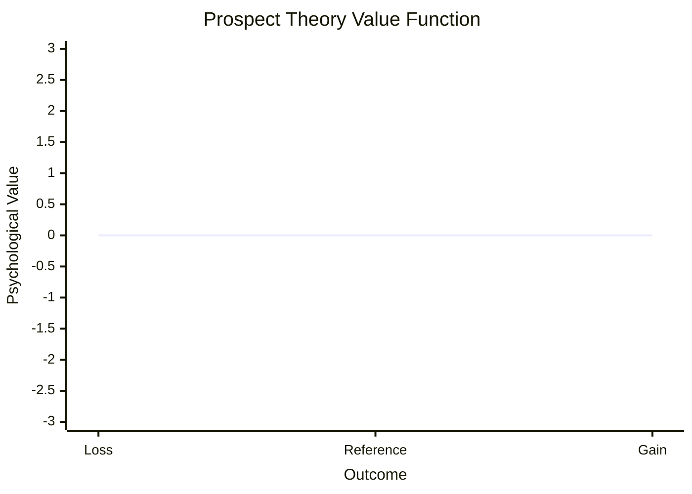

**[Host]**: Welcome back to BookLab. I'm your host. Today we're taking on a book that's been called "the most important work of popular psychology ever written" — Daniel Kahneman's *Thinking, Fast and Slow*. To help me unpack it, I have Dr. Elena Vasquez, a behavioral economist who worked in Thaler's lab at Chicago and now advises governments on choice architecture. Elena, welcome.

**[Guest]**: Thanks for having me. I want to say upfront — this book is complicated for me, emotionally and professionally. It's the reason I went into behavioral economics. I read it as an undergrad and it felt like someone handed me the user manual for my own brain. But I've also spent the last decade watching parts of it crumble under replication pressure. So I have complicated feelings.

**[Host]**: That's exactly why I wanted you here. Let's start with the big idea that everyone knows even if they haven't read the book: System 1 and System 2.

**[Guest]**: Right. So Kahneman says there are two systems. System 1 is the automatic pilot — it's what you're using right now to understand my voice, to recognize that I'm a person, to know your coffee cup is on the table. All of that happens without effort. System 2 is the deliberate, analytical mode — it's what you'd use to multiply 37 by 54 or to decide whether a logical argument is valid.

**[Host]**: And the key insight is not that these systems exist — everyone knows they daydream and concentrate at different times — it's something about how they interact.

**[Guest]**: Exactly. The critical insight is that System 2 is lazy. It's the lazy controller. It monitors what System 1 is doing, but it doesn't jump in to correct every mistake. It trusts System 1 by default. So most of the time, the answer System 1 generates — the fast, intuitive answer — is the one we go with, even when it's wrong.

**[Host]**: Give me a concrete example from real life.

**[Guest]**: Okay. Think about hiring. You interview someone. They're confident, well-spoken, they remind you of yourself ten years ago. System 1 says: good hire. System 2 could kick in and say: wait, confidence isn't competence. Let me check their actual track record. Let me look at structured interview scores. But System 2 is lazy. It's tired from a long day. So you hire the confident person and they turn out to be terrible. The book is basically a catalogue of all the times System 1 leads us astray and System 2 doesn't bother to correct it.

**[Host]**: And that catalogue includes things like anchoring, availability, representativeness...

**[Guest]**: Right. And these aren't abstract. Let me give you a real anchoring story. I worked with a nonprofit that was negotiating a building lease. The landlord threw out a number — way too high, obviously absurd. But every subsequent negotiation was anchored to that number. The nonprofit ended up paying more than they should have because nobody at the table could ignore the first number they heard. That's anchoring in the wild.

**[Host]**: And the book also covers something called Prospect Theory, which is Kahneman's Nobel-winning work.

**[Guest]**: Prospect Theory is the most important thing in the book that nobody talks about at dinner parties. Everyone talks about System 1/System 2. But Prospect Theory is the rigorous formal model that actually won the Nobel prize.

**[Host]**: Explain it to me like I'm a smart but busy person.

**[Guest]**: Here's the core idea. Before Kahneman and Tversky, economists believed that people evaluate options based on final outcomes. You have $100, you feel good. You have $0, you feel bad. Simple. Kahneman showed that's wrong. People evaluate things based on *changes from a reference point*.

**[Host]**: Changes relative to what?

**[Guest]**: Whatever you consider your current situation to be. Say you expect a $1000 bonus. You get $800. The rational model says: you're $800 richer, you should be happy. But Prospect Theory says: you're $200 below your reference point. You feel like you *lost* $200. And here's the killer — losses hurt roughly twice as much as equivalent gains feel good. They call it loss aversion. Losing $200 hurts about as much as gaining $400 feels good.

Let me show you the math that changes everything:

The curve is much steeper on the left (losing side) than on the right (gaining side). That's the whole thing in one picture.

**[Host]**: And this explains a lot of real-world behavior?

**[Guest]**: It explains almost everything that puzzled economists. Why do people refuse to sell stocks at a loss — they want to avoid realizing the loss, so they hold and hope. That's the disposition effect. Why do people buy extended warranties on $50 electronics? The product is a gain; the warranty protects against making it a loss. Why does the status quo have such a gravitational pull? Because changing is coded as a loss of whatever you currently have. Loss aversion is everywhere once you learn to see it.

**[Host]**: But there's been a lot of controversy about whether these findings hold up.

**[Guest]**: You're talking about the replication crisis. And yes. This is the part where I have complicated feelings.

**[Host]**: Walk me through it.

**[Guest]**: There are two separate conversations that need to stay separate. First, Kahneman's own work with Tversky — the heuristics, Prospect Theory, framing effects. That work has replicated well. It's been tested across cultures, across methods, across decades. Loss aversion is real. Anchoring is real. Framing effects are real. The Linda problem replicates. The Asian disease problem replicates. All of that is solid.

**[Host]**: So what doesn't replicate?

**[Guest]**: Social priming. The famous study where people who unscrambled sentences about old age walked more slowly down the hall — that doesn't replicate. Ego depletion — the idea that self-control is a finite resource that runs out like a muscle — that's on shaky ground. Some of the cognitive ease and fluency effects have been harder to reproduce than the original studies suggested.

**[Host]**: So how damaging is this to the book?

**[Guest]**: Here's the nuanced take. The book is built like a layer cake. Bottom layer: Kahneman's own Nobel-winning work. That layer has aged beautifully. Middle layer: well-established findings from cognitive and social psychology. Mixed — some solid, some wobbly. Top layer: the flashy, surprising studies that make the book a page-turner. Those are the least reliable. So a reader in 2026 should trust the framework but be skeptical of the individual studies. It's not that the book is wrong — it's that some of the examples it uses to illustrate its points don't hold up.

**[Host]**: And what about the philosophical debate with Gigerenzer?

**[Guest]**: Oh, that's fascinating. Gerd Gigerenzer has spent his career arguing that heuristics aren't "biases" at all — they're smart shortcuts that work well in the environments we evolved in. He says Kahneman judges the mind against the wrong standard. Kahneman uses probability theory as the gold standard. Gigerenzer says the real standard is survival and reproduction, not mathematical coherence.

**[Host]**: Who's right?

**[Guest]**: Both, honestly. Gigerenzer is right that our heuristics are adaptive in many environments. But Kahneman is right that we now live in a world of complex statistics, insurance products, retirement planning, and medical risk calculations — environments our brains were not designed for. In those environments, heuristics produce systematic errors. The question is not "are heuristics good or bad?" but "in which environments do they succeed and fail?"

**[Host]**: Let me ask you the big question. If someone asks you "should I read this book?" — what do you say?

**[Guest]**: Yes. Absolutely yes. But read it with a critical eye. Read it for the framework — the System 1/System 2 distinction, Prospect Theory, the difference between the experiencing self and remembering self. Those ideas are genuinely transformative. But don't treat every study as gospel. Some of them are intellectual history by now, not settled science.

**[Host]**: And what about the criticism that the book tells you what's wrong with your thinking but doesn't tell you how to fix it?

**[Guest]**: That's fair. Kahneman is pessimistic about debiasing. He says you can't eliminate your biases just by knowing about them. The best you can do is install friction — make yourself slow down in situations where bias is likely. Hire using structured interviews. Use checklists in medicine. Use prediction markets instead of executive intuition. The fix is environmental, not personal.

**[Host]**: Give me your three most actionable takeaways for our listeners.

**[Guest]**: One: For any important prediction or estimate, use the outside view. Don't ask "what makes this project special" — ask "how did similar projects perform?" Two: Before making a decision, ask "what would I decide if the frame were reversed?" If you're choosing between two medical treatments presented in survival rates, ask what you'd choose if they were presented in mortality rates. Three: Keep a decision journal. Write down your predictions and your confidence before you know the outcome. Review them later. It's the only way to calibrate your judgment against reality.

**[Host]**: Elena, one last question. This book came out in 2011. It's been fifteen years. If Kahneman were writing it today, what would be different?

**[Guest]**: He's actually said this in interviews. He would be much more cautious about priming. He would probably remove the ego depletion chapter entirely. He would include more material on noise — the unwanted variability in judgment that he wrote about in his 2021 book *Noise*. And he would be more explicit about which findings are his own well-replicated work and which are interesting but tentative findings from other labs. The core of the book — the two systems, Prospect Theory, loss aversion, framing — that would all stay. The scaffolding would just be more honest about its wobbly bits.

**[Host]**: Elena Vasquez, thank you. That was illuminating.

**[Guest]**: Thank you. This book changed my life. I'm glad we could give it the honest treatment it deserves.

**[Host]**: And to our listeners — if you've read *Thinking, Fast and Slow*, go back and re-read Part IV on Prospect Theory. That's where the Nobel lives. If you haven't read it, pick it up. But pick up a pen too. You're going to want to argue with it. That's the whole point.

*This podcast script is based on* Thinking, Fast and Slow *by Daniel Kahneman (2011). The Host and Guest are fictional representations for educational purposes.*
