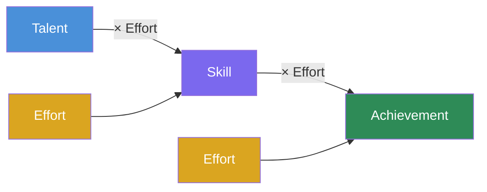
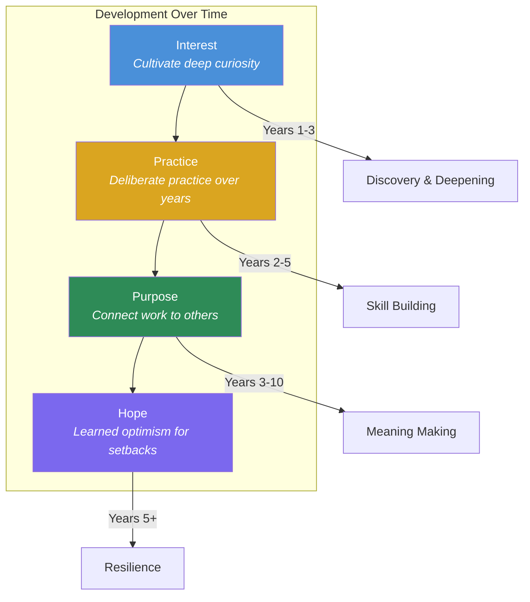

## The Grit Scale

Duckworth's first major contribution was a measurement tool. The 12-item
Grit Scale (later shortened to the 8-item Grit-S) asks respondents to
rate themselves on two dimensions:

- **Consistency of Interest** — "I often set a goal but later choose to
  pursue a different one." (reverse-scored)
- **Perseverance of Effort** — "I finish whatever I begin."

These two factors — passion and perseverance — together define grit.
Notably, the two factors are only moderately correlated with each other,
meaning that sustaining passion over years is a distinct challenge from
working hard consistently. You can work hard on something you don't
deeply care about, but that isn't grit.

---

## Grit: Passion + Perseverance

Duckworth defines grit as:

> Passion and perseverance for especially long-term and meaningful goals.
> It is having stamina. Grit is sticking with your future, day in, day
> out — not just for the week, not just for the month, but for years —
> and working really hard to make that future a reality. Grit is living
> life like it's a marathon, not a sprint.

The passion component is often misunderstood. Duckworth does not mean
intense emotion; she means *consistency of commitment* over years. Gritty
people have a "hierarchy of goals" — a top-level life goal that organizes
all subordinate goals. When a lower-level goal fails, they adapt and find
a new path toward the same ultimate objective.

---

## The Effort Counts Twice Model

This is the mathematical heart of the book:

The implications are profound and counterintuitive:

- **Talent without effort is wasted potential** — raw ability that never
  gets developed into skill.
- **Effort compounds** — it works twice, at both stages of the production
  function. This means that a less talented person who works harder can
  surpass a more talented person who coasts.
- **The talent myth distorts incentives** — when we reward "natural"
  talent, we discourage the very effort that creates achievement.
- **Achievement is a multiplicative function** — zero effort produces
  zero achievement, regardless of talent.

Duckworth is not anti-talent. She acknowledges that talent exists and
matters. Her argument is that effort deserves far more weight than our
culture gives it.

---

## The Talent Myth

Our culture worships natural talent. Duckworth traces this to:

- The "natural" label we apply to children ("he's a natural athlete")
- Media narratives of overnight success that erase years of hidden work
- The fixed mindset (Dweck) that frames ability as static
- The fundamental attribution error — we attribute others' success to
  stable traits rather than effort

The consequence is damaging: people who are told they're "naturals" fear
challenges that might expose their limits, and people who aren't labeled
talented may conclude they lack what it takes.

---

## Key Studies

### West Point (Beast Barracks)

Duckworth's landmark study: entering West Point cadets face the grueling
seven-week Beast Barracks. The academy's Whole Candidate Score (which
includes SAT, class rank, physical fitness, and leadership) predicts
success poorly. Grit scores, however, reliably predict which cadets
survive Beast Barracks.

### National Spelling Bee

Finalists at the Scripps National Spelling Bee took the Grit Scale and
were asked how many hours they studied. Grittier spellers practiced more,
and practice hours predicted performance better than IQ.

### Chicago Public Schools

Grit predicted which students would graduate from Chicago's notoriously
tough high schools — better than any other measure available.

### Sales Representatives

In corporate sales, grittier reps stayed in their jobs longer and earned
more commissions than less gritty peers with similar talent.

---

## Deliberate Practice

Drawing heavily on Anders Ericsson's research, Duckworth distinguishes
between ordinary practice and deliberate practice:

| Ordinary Practice | Deliberate Practice |
|---|---|
| Doing something you already know | Stretching beyond your current ability |
| No specific goal for improvement | Clearly defined stretch goal |
| No immediate feedback | Immediate feedback on performance |
| Focused on enjoyment | Focused on improvement |

The deliberate practice cycle:

1. Set a specific stretch goal
2. Concentrate fully with full effort
3. Seek immediate feedback (from a coach, a mirror, a recording)
4. Refine technique based on feedback

Duckworth adds a nuance: deliberate practice is not intrinsically
enjoyable. It is hard, effortful, and uncomfortable. Gritty people
persist through this discomfort because they see it as the path to
mastery.

---

## The 4 Psychological Assets of Grit

### 1. Interest

Passion is discovered and cultivated, not stumbled upon fully formed.
Duckworth describes a process:

- **Triggering** — An initial spark of curiosity (often in childhood or
  adolescence)
- **Deepening** — Sustained engagement over years that reveals nuance
  and complexity
- **Integration** — The interest becomes central to identity

Key: interests must be *intrinsic*. External rewards (grades, money,
praise) can crowd out intrinsic motivation. Gritty people are driven by
what genuinely fascinates them, not by what looks good.

### 2. Practice

Deliberate practice every day. Not when you feel like it. Not when you're
motivated. As a discipline. Duckworth calls it "the daily discipline of
doing things better than you did yesterday."

She distinguishes between the experience of flow (enjoyable immersion)
and deliberate practice (effortful improvement). Gritty people experience
more flow than others — paradoxically, because they embrace the
discomfort of deliberate practice that enables flow.

### 3. Purpose

Purpose is the conviction that your work matters. Duckworth identifies
two types:

- **Self-oriented** — "My work is important to me" (interest)
- **Other-oriented** — "My work is important to others" (purpose)

Gritty people have both, but the other-oriented component provides the
stamina for the long haul. Purpose transforms "I love what I do" into
"What I do makes a difference."

The book draws on research showing that purpose:
- Increases motivation and persistence
- Buffers against burnout
- Increases life satisfaction
- Improves performance

### 4. Hope

Hope in Duckworth's framework is *learned optimism* — the belief that
one's own efforts can improve the future. This builds on Martin
Seligman's work:

- **Pessimistic explanatory style**: "This failure is permanent, pervasive,
  and my fault. I'll never be good at this."
- **Optimistic explanatory style**: "This failure is temporary, specific,
  and I can change my approach. With more effort, I'll improve."

Duckworth argues that hope is the grittiest asset of all because it
determines whether you get back up after falling down. Without hope,
interest fades, practice stops, and purpose fades.

---

## Parenting for Grit: The Hard Thing Rule

Duckworth's most famous practical recommendation is the Hard Thing Rule,
used in her own family:

1. **Everyone must do one hard thing** — an activity that requires
   deliberate, daily practice (music, sport, art, etc.)

2. **You cannot quit mid-season or mid-term** — you must finish what
   you started. But you *can* quit at a natural stopping point.

3- **You choose your own hard thing** — because grit requires intrinsic
   passion, the child must pick what they commit to.

The rule is designed to teach three lessons simultaneously:
- Commitment (you can't quit on a bad day)
- Self-determination (you choose what matters to you)
- Persistence (mastery takes years)

Duckworth also discusses research on supportive parenting styles, noting
that the combination of high expectations and high warmth (authoritative
parenting) is most associated with grit in children.

---

## Key Lessons

### 1. Replace talent praise with effort praise
When you praise children for being "smart," you encourage a fixed
mindset. Praise the effort, the strategy, the persistence — and you
encourage a growth mindset that feeds grit.

### 2. Embrace the "hard things" in your own life
You cannot teach grit you don't have. Parents, teachers, and leaders
model grit by taking on their own difficult challenges.

### 3. Stack your passions
Grit doesn't mean having one interest forever. It means having a
hierarchical goal system where lower goals serve a higher purpose.
Changing *how* you pursue the goal is not quitting — it's adaptation.

### 4. Deliberate practice is not fun — do it anyway
The discomfort of deliberate practice is a signal that you're
stretching, not a sign you should stop.

### 5. Connect your daily work to a larger purpose
When motivation flags, ask: who benefits from this work? The answer
provides stamina.

### 6. Cultivate hope by reframing setbacks
Every failure is data. What can you learn? What will you do
differently? The story you tell yourself about failure determines
whether you persist.

---

## Action Plan

1. **Take the Grit Scale** — Measure your current grit to establish a
   baseline. Look at both subscales: consistency of interest and
   perseverance of effort.

2. **Identify your top-level goal** — What is the single long-term
   goal that organizes your life? Write it down. Review whether your
   daily activities serve it.

3. **Adopt a Hard Thing Rule** — Pick one activity that requires daily
   deliberate practice. Commit to it for at least one year.

4. **Reframe your explanatory style** — When you fail, write down your
   explanation. Is it permanent, pervasive, personal? Reframe it as
   temporary, specific, and changeable.

5. **Connect to purpose** — List three ways your work helps others.
   Post it where you'll see it during difficult moments.

6. **Practice deliberately** — For your chosen hard thing, set a
   specific stretch goal, find a feedback mechanism, and track your
   improvement daily.

7. **Build grit in others** — If you're a parent, teacher, or manager,
   implement effort-focused praise. Model taking on hard things.

8. **Find grittier peers** — Grit is contagious. Surround yourself
   with people who persist through difficulty.

9. **Re-evaluate goals annually** — Grit is not blind persistence.
   Each year, check: does your top-level goal still matter? If not,
   the gritty thing may be to change course.

10. **Study gritty role models** — Read biographies of people who
    persisted through failure (Lincoln, Curie, Darwin, Jobs). Learn
    their specific strategies for maintaining hope.
