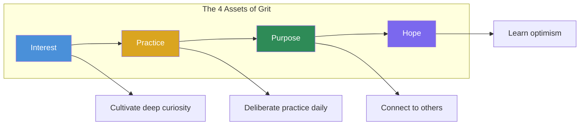

## Introduction

Welcome to BookAtlas. Today: *Grit: The Power of Passion and
Perseverance* by Angela Duckworth. Published 2016, Simon & Schuster.
352 pages. Penn psychologist, MacArthur Fellow.

This one is personal. I'm reading it as a parent, and I want to talk
about something the book raises but doesn't fully settle: should I
teach my child to be gritty? And if so — how?

Let's walk through the argument, the evidence, and the hard questions.

---

## The Central Argument

Duckworth's thesis is simple: talent is overrated. What really matters
is a combination of passion and long-term perseverance that she calls
grit. She studied West Point cadets, National Spelling Bee finalists,
Chicago teachers — and in every case, grit predicted success better
than IQ, talent, or physical fitness.

The core model is elegant:

> Talent × Effort = Skill
> Skill × Effort = Achievement

Effort counts twice. That's the math. It means that someone with modest
talent who works incredibly hard can outperform a "natural" who coasts.
And it means talent without effort produces nothing.

This idea is liberating. It says: you are not limited by your starting
point. Your effort compounds.

---

## The 12-Question Test

Duckworth developed the Grit Scale — 12 questions that measure two
things: consistency of interest ("I often set a goal but later choose
to pursue a different one") and perseverance of effort ("I finish
whatever I begin").

Here's something interesting: these two dimensions barely correlate
with each other. You can be incredibly hard-working at something you
don't deeply care about. That's not grit — that's just work. Grit
requires *both*: the sustained passion *and* the sustained effort.

The Grit Scale is useful because it reveals something about yourself.
Where are you on consistency of interest? Where on perseverance? The
answer tells you where to grow.

---

## The 4 Psychological Assets

Duckworth says grit develops through four stages, in sequence:

First, interest. You cannot be gritty about something you don't care
about. Passion starts with intrinsic curiosity. You discover it by
exploring, then deepen it by engaging over years.

Second, practice — not just any practice, but *deliberate* practice.
The kind Anders Ericsson studied: stretch goals, full concentration,
immediate feedback, refinement. It's not fun. Gritty people do it anyway.

Third, purpose. The conviction that your work matters to someone else.
Purpose transforms "I love this" into "this matters." It's what keeps
you going when love alone isn't enough.

Fourth, hope. Learned optimism. The belief that setbacks are temporary
and changeable, not permanent and personal. Without hope, the first
three collapse.

---

## The Hard Thing Rule: A Parent's Dilemma

Here's where it gets personal for me. Duckworth's family rule:

1. Everyone does one hard thing — daily deliberate practice
2. You can't quit mid-season
3. You choose your own hard thing

I love this in theory. But here's what keeps me up at night: what if
my child's "hard thing" isn't making them gritty — it's making them
miserable? What if they're learning to persist at something they hate,
and the lesson they internalize is "I'm bad at this and also I can't
quit"?

Duckworth's answer: you can quit at natural stopping points. The rule
teaches commitment, not blind persistence. But the line between
"building character" and "causing harm" feels awfully thin sometimes.

And this is the deeper question: how do we teach kids to persevere
without teaching them to ignore valid signals that they should change
course?

---

## The Grit Paradox

David Epstein's *Range* made the counterargument powerfully: knowing
when to quit is a superpower. The most successful people in complex
fields are often "samplers" — they try many things before narrowing
their focus. Early specialization can be a trap.

Duckworth acknowledges this tension. In later interviews she says the
question isn't "should I quit?" but "does quitting this goal serve my
higher-level purpose?" If you quit a bad job to pursue a better one,
that's not grit failure — that's strategic persistence toward a bigger
goal.

But the book's emotional weight is all on the side of persistence.
The stories are about people who never quit. The subtitle is literally
"passion and perseverance." The message a reader absorbs is: don't
give up. And sometimes, giving up is exactly the right call.

---

## The Credé Problem

In 2017, Marcus Credé published a meta-analysis that landed like a
bomb. His finding: grit correlates with conscientiousness at around
0.80 to 0.98. Once you control for conscientiousness, grit adds almost
nothing to predicting success.

In other words: grit might just be a rebranding of an already well-
understood personality trait. The *jangle fallacy* — giving a new name
to an old thing.

Duckworth's counter: conscientiousness is broad; grit is precise. Grit
specifically captures long-term passionate persistence toward a single
goal, which matters in contexts where general conscientiousness doesn't
predict.

It's a fair point, but the data is what it is. The academic consensus
has shifted: grit is real, it matters, but it's not the revolutionary
new construct it was initially presented as.

---

## Cultural Blind Spots

There's another critique that bothers me more. Grit is deeply
American and individualist. It assumes you have the freedom to choose
your path, that effort will be rewarded, that persistence is universally
adaptive.

What about the single mother working two jobs? Is she characterized as
"not gritty enough" if she doesn't pursue a passion project? What about
the student in an underfunded school who *does* work incredibly hard
but still fails because the system is broken? Does grit become another
way to blame the disadvantaged?

Duckworth is aware of this. Her response is that grit and opportunity
are both necessary. She's advocated for character education alongside
structural reform. But the book itself doesn't spend much time on
this tension, and it's a significant gap.

---

## What I'm Taking Away

So. Should I teach my child grit? Yes — but carefully.

Here's what I'm taking from this book:

1. **Praise effort, not talent.** This is the simplest and most
   evidence-backed change a parent can make. "You worked so hard on
   that" instead of "you're so smart."

2. **Model grit yourself.** I can't tell my child to be gritty if I
   quit everything hard in my own life. They learn from watching.

3. **Let them choose.** The Hard Thing Rule's third component is the
   most important: they pick. Grit requires intrinsic drive.

4. **Teach reframing.** When they fail, help them tell a better story
   about it. "What did you learn? What will you do differently?"

5. **The quitting question.** I need to teach them *when* to quit too.
   The question: is this setback a signal to try harder, or a signal
   to change direction? The answer depends on their top-level goal.
   If the goal matters, persist. If the goal is wrong, pivot.

---

## Final Thoughts

*Grit* is an imperfect book about an important truth. The core insight
— that sustained passion and effort matter enormously — is both true
and liberating. The practical advice, especially the Hard Thing Rule
and effort praise, is genuinely useful.

But the book oversells its claims. Grit is probably not a standalone
new construct. The research is more correlational than causal. The
cultural context matters more than the book acknowledges. And the
"grit paradox" — knowing when to quit — deserves more than a chapter.

Read it for the inspiration. Read *Range* and *Peak* for the balance.
And if you're a parent: trust your instincts. Grit is a tool, not a
virtue. Use it wisely.

This has been a BookAtlas narration of *Grit: The Power of Passion and
Perseverance* by Angela Duckworth. Thanks for listening.
