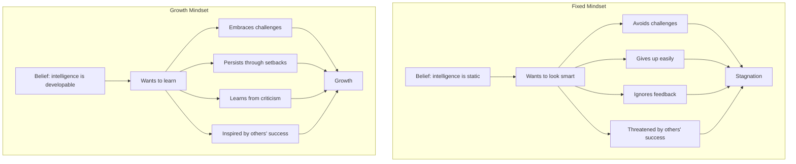
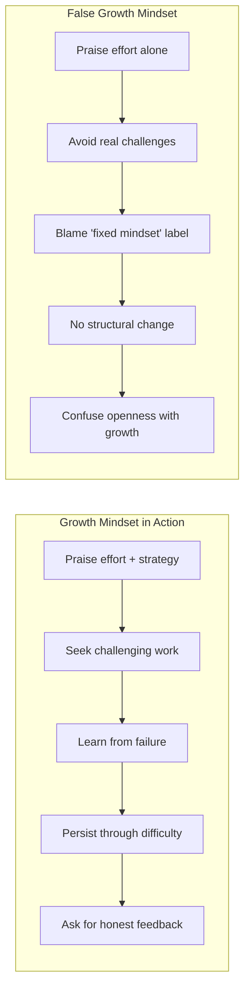
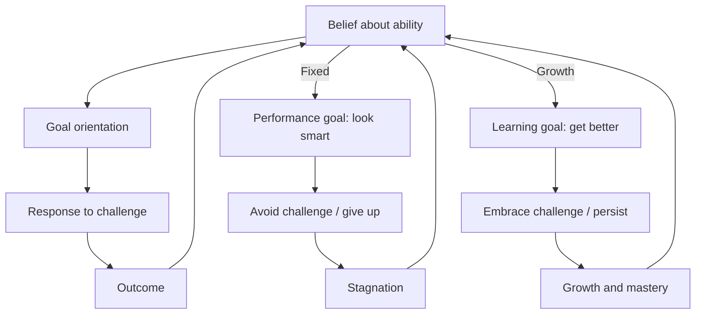

# Core Concepts

## The Two Mindsets

The foundational idea of the book is that people hold one of two implicit theories about human ability. A **fixed mindset** is the belief that intelligence, talent, and character are static traits — you have a certain amount and that is that. A **growth mindset** is the belief that these qualities can be developed through effort, learning, and persistence.

Dweck is careful to argue that this is not a personality type but a belief system — and beliefs can be changed. The same person can hold a fixed mindset in one domain (e.g., mathematical ability) and a growth mindset in another (e.g., athletic skill). The mindset is activated by situations involving challenge, effort, setback, or evaluation.

| Dimension | Fixed Mindset | Growth Mindset |
|---|---|---|
| Core belief | Abilities are fixed at birth | Abilities develop through effort |
| Goal | Look smart at all costs | Learn and improve |
| Challenge | Avoid — risk of exposure | Embrace — chance to grow |
| Obstacle | Give up quickly | Persist and try new strategies |
| Effort | Fruitless if you lack talent; only needed by the untalented | The path to mastery |
| Criticism | Ignore or reject defensive | Learn from feedback |
| Others' success | Threatening | Inspiring and instructive |
| Result | Plateau early, underachieve | Continuously improve, achieve more |

## The Brain as a Muscle

Dweck devotes significant attention to neuroplasticity — the brain's ability to form new connections and strengthen existing ones through experience. She cites research showing that when people learn new things, their neurons form new connections; when they practise, these connections strengthen. The implication is direct: the growth mindset is neurologically grounded. Students who are taught about neuroplasticity — that the brain grows like a muscle when challenged — adopt more growth-oriented attitudes and improve their academic performance.

Blackwell, Trzesniewski, and Dweck (2007) demonstrated this in a landmark study. They followed students through the challenging transition to seventh grade. Half received an intervention teaching study skills and the growth mindset (including brain-plasticity lessons). The other half received only study skills. The mindset group reversed a declining grade trajectory — their math grades improved while the control group continued to decline. The study was one of the first to show that a brief, scalable intervention could produce measurable academic gains.

## The Praise Trap

The most cited research in the book is the series of five experiments by Mueller and Dweck (1998) on the effects of praise. Children were given a puzzle task and then praised in one of two ways: "You must be smart at this" (person praise) or "You must have worked hard" (process praise). The results were striking and have been widely replicated.

Children praised for intelligence subsequently chose easier problems (to protect their "smart" label), lost confidence after harder problems, lied about their scores, and showed less enjoyment. Children praised for effort chose harder problems, maintained confidence through difficulty, persisted longer, and told the truth about poor performance. The mechanism: intelligence praise ties self-worth to performance, creating fragility; effort praise ties self-worth to engagement, creating resilience.

Dweck emphasises that the praise trap is pervasive precisely because it is well-intentioned. Praising children's intelligence feels natural and affirming. The book's practical guidance: praise the process — the effort, strategy, focus, persistence, and improvement — not the person.

## Challenge-Seeking vs Challenge-Avoiding

One of Dweck's earliest experiments shaped her career. She gave 10-year-olds a series of increasingly difficult puzzles. Some children welcomed the harder puzzles: "I love a challenge!" Others were distressed: "I'm not good at this." The first group saw difficulty as interesting; the second saw it as threatening.

This divergence defines the two mindsets in action. Growth-mindset individuals seek challenges because they understand that growth happens at the edge of competence. Fixed-mindset individuals avoid challenges because failure would mean they are not talented after all. Challenge-seeking becomes a self-reinforcing cycle: you take on hard things → you grow → you take on harder things. Challenge-avoiding also self-reinforces: you avoid hard things → you stay the same → you fall behind → hard things get even harder.

The book shows this pattern across domains. In education, fixed-mindset students take easy courses and coast; growth-mindset students take demanding courses and learn more. In sports, fixed-mindset athletes stick to what they are good at; growth-mindset athletes work on their weaknesses.

## Effort as Strategy

The fixed mindset views effort as a signal of inadequacy: if you are talented, things should come easily. Needing to try hard means you lack natural ability. This belief leads to the "effort paradox": the fixed-mindset person avoids effort to protect their identity as talented, which prevents development, which confirms the belief that they "just do not have it."

The growth mindset reframes effort as the engine of accomplishment. Even the most gifted — Mozart, Darwin, Michelangelo — worked relentlessly. Dweck cites Anders Ericsson's research on deliberate practice (later popularised in *Peak*) to show that effortful, focused practice is what produces expertise, not innate talent. In the growth mindset, effort is not a consolation prize for the untalented; it is what everyone who achieves anything does.

This reframing has practical consequences. Fixed-mindset students stop trying when work gets hard — they assume they have hit their natural ceiling. Growth-mindset students increase their effort and change their strategies. The difference is not ability; it is beliefs about what effort means.

## Learning Goals vs Performance Goals

Dweck distinguishes between two types of goals. **Performance goals** aim to validate ability — to look smart, to avoid looking dumb, to outperform others. **Learning goals** aim to increase competence — to master new skills, to understand deeply, to improve over time.

Performance goals are not inherently bad. They can motivate in the short term. But when challenges arise, performance goals create fragility. If the goal is to look smart and you fail, the meaning is devastating: "I am not smart." Learning goals absorb failure differently: "I did not master this yet."

The research shows that students who adopt learning goals seek more challenging tasks, use deeper learning strategies, persist longer through difficulty, and achieve higher outcomes over time — even on objective performance measures. The practical takeaway: ask "what will I learn?" rather than "will I look good?"

## Mindsets in Sports

Dweck devotes a chapter to sports, arguing that the growth mindset explains why some athletes transcend their "natural talent" limits while others with enormous potential plateau. Michael Jordan exemplifies the growth mindset — he was cut from his high school team and used it as fuel to work harder. He treated every loss as a lesson and every weakness as something to improve.

The fixed mindset in sports shows up as the "natural" athlete who stops improving once they hit competition that requires work. Dweck contrasts "talent-first" athletes (John McEnroe, who blamed losses on external factors) with "growth-first" athletes (Michael Jordan, Pete Sampras, Tiger Woods before his fall). The fixed mindset creates an ego that is fragile and excuse-prone; the growth mindset creates resilience and a relentless improvement drive.

Coaches with fixed mindsets believe some players "have it" and others do not, reducing development opportunities. Growth-mindset coaches believe every player can improve, creating a culture of development.

## Mindsets in Business

The business chapter examines how mindsets shape leadership and corporate culture. Fixed-mindset leaders (Dweck uses Lee Iacocca as the primary case) surround themselves with yes-men, take credit for success, blame others for failure, and prioritise personal glory over company health. Growth-mindset leaders (Jack Welch at GE, Lou Gerstner at IBM) build organisations where employees are developed, honest feedback is encouraged, and learning is valued over ego.

Groupthink is presented as a fixed-mindset phenomenon — when a leader cannot admit weakness, the team stops pointing out problems. The book argues that Enron was a fixed-mindset culture: it hired "the smartest guys in the room" and fired anyone who fell behind, creating an environment of performance pressure rather than genuine development.

Dweck also discusses negotiation, arguing that growth-mindset negotiators see each deal as a learning opportunity and are more willing to walk away from bad terms because their identity is not tied to winning.

## Mindsets in Relationships

The relationship chapter extends the framework to romantic relationships, friendships, and social dynamics. The fixed mindset in relationships says: either you are compatible or you are not; either your partner can read your mind or they are not the one; either things are perfect or the relationship is failing. This creates an "effortless perfection" standard that no real relationship can meet.

The growth mindset in relationships says: relationships require work, communication, and conflict resolution. Problems are not signs of incompatibility — they are opportunities to understand each other better. Partners grow together by tackling challenges rather than judging each other for having them.

Dweck also covers shyness and bullying. Fixed-mindset shyness leads people to avoid social situations because they believe social skill is innate and unchangeable. Growth-mindset shyness sees social skill as learnable and approaches social challenges as practice. Bullies, Dweck argues, are often fixed-mindset individuals who need to dominate to feel worthy; interventions that teach growth mindset can reduce bullying.

## Mindsets in Education

The education domain is where mindset research has had the most impact. Dweck shows how fixed-mindset teachers label students early ("gifted" vs "struggling") and create self-fulfilling prophecies. Growth-mindset teachers see every student as capable of improvement and adapt their teaching strategies accordingly.

The book covers the work of Jaime Escalante (the calculus teacher portrayed in *Stand and Deliver*), who refused to believe that any student could not learn advanced math. Escalante's growth mindset and high expectations produced extraordinary results with underprivileged students. Dweck also discusses the "math myth" — the belief that some people are math people and others are not — as a particularly destructive fixed-mindset belief in education.

## False Growth Mindset

In the 2016 updated edition, Dweck added a chapter addressing **false growth mindset** — the misapplication of her concept. She identifies several forms:

- **Praising effort alone**, regardless of outcome or strategy. True growth mindset praises effort that worked or that led to learning, not empty effort.
- **Claiming a growth mindset while acting fixed.** Many people say they believe in growth but still avoid challenges, hide mistakes, or feel threatened by others.
- **Using growth mindset as a stick.** Telling students "you just need a growth mindset" without providing support, resources, or effective strategies blames them for their struggles.
- **Confusing growth mindset with being open-minded or flexible.** The growth mindset is specifically about the belief that abilities can be developed, not a general personality trait.

Dweck's honesty about false growth mindset is one of the book's strengths. She acknowledges that the concept has been oversimplified and misused, and she provides guidance for genuine implementation.

---

# Frameworks

## Dweck's Mindset-Action Cycle

---

# Mental Models

1. **The Two Beliefs.** Implicit theories of intelligence are self-fulfilling prophecies. What you believe about ability determines what you attempt, how hard you try, and how you interpret setbacks.

2. **The Effort Paradox.** The fixed mindset treats effort as evidence of inadequacy, which prevents effort, which prevents growth. The growth mindset treats effort as the path to mastery, which enables effort, which produces growth.

3. **The Praise Trap.** Praise intended to boost confidence often undermines it. Praising traits makes children fragile; praising process makes them resilient. The mechanism is attribution: "I am smart" → "I must avoid failure" vs "I worked hard" → "I can work harder."

4. **The Learning Loop.** Growth mindset drives challenge-seeking; challenge drives effort and strategy; feedback drives adjustment; improvement reinforces the growth mindset. The loop compounds over time.

5. **False Growth Mindset.** The most sophisticated application of mindset theory is recognising when you are not actually applying it. Awareness of the gap between belief and behaviour is the starting point for genuine change.

---

# Key Lessons

1. When you praise a child, praise the process (effort, strategy, focus, improvement), not the person (intelligence, talent, ability).

2. When you face difficulty, ask "what can I learn from this?" rather than "what does this say about me?"

3. When you see someone succeed, ask "what can I learn from them?" rather than "why am I not that good?"

4. When you fail, own it, analyse it, and adjust your strategy. Fixed-mindset response: "I am not good at this." Growth-mindset response: "I have not mastered this yet."

5. When you feel like giving up, recognise the fixed-mindset voice and choose the growth response. The fixed mindset never fully disappears — it gets quieter with practice.

6. When you teach, communicate that the brain grows with challenge. Students who understand neuroplasticity adopt more resilient attitudes.

7. When you manage, create a culture where mistakes are learning opportunities, not reputation threats. The best teams surface problems early.

---

# Practical Applications

**For Parents**: Replace "you are so smart" with "you worked so hard" or "that strategy worked well." When your child struggles, ask "what can you try differently?" Model growth mindset by talking about your own challenges and learning.

**For Teachers**: Teach students about neuroplasticity in the first week. Use process praise in feedback. Frame tests as learning tools, not evaluations of worth. Avoid ability-grouping that creates fixed-mindset labels.

**For Managers**: Hire for growth potential, not polished credentials. Give honest, developmental feedback. Encourage risk-taking that leads to learning, even when it fails. Ask "what did we learn?" after projects, not "who is to blame?"

**For Athletes**: Identify the weakest aspect of your game and make it your primary practice focus. Treat losses as data. Study opponents not to compare but to learn specific strategies.

**For Individuals**: Notice when the fixed-mindset voice shows up — "I am not a math person," "I am just not good at this kind of thing." Name it. Then choose the growth response: "I am not good at this yet. What is a strategy I can try?"

---

# Examples

**The Puzzle Experiment (Dweck, early career).** Dweck gave 10-year-olds increasingly difficult puzzles. Some children asked for more: "I love a challenge!" Others panicked: "I am not smart enough." This single experiment launched her decades-long research programme.

**Mueller & Dweck (1998).** Five experiments showing that praise for intelligence leads children to choose easier tasks, lose confidence after failure, lie about performance, and enjoy the task less. Praise for effort produced the opposite pattern.

**Blackwell, Trzesniewski & Dweck (2007).** A growth-mindset intervention with seventh graders reversed a downward grade trajectory. Students taught about neuroplasticity improved their math grades while the control group declined. The effect was largest among students at risk of dropping out.

**Michael Jordan.** Cut from his high school varsity team, Jordan used the setback as motivation. He arrived early, stayed late, and treated every weakness as something to improve. His mindset — not just his talent — made him the greatest.

**Lee Iacocca vs Lou Gerstner.** Iacocca saved Chrysler but then refused to listen, surrounded himself with sycophants, and took credit for everything good while blaming others for everything bad. Gerstner transformed IBM by building a leadership team that valued learning over ego and honest feedback over flattery.

**The Wrong-Way Drug.** Dweck describes a pharmaceutical CEO who rejected a promising drug because it did not fit his strategy, then watched a competitor launch it. Fixed-mindset leaders reject information that challenges their plans; growth-mindset leaders adapt.
