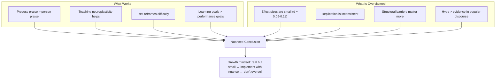

<PodcastTranscript>

🎙️ **Host:** Welcome to BookAtlas. Today we are tackling one of the most influential psychology books of the past two decades — *Mindset: The New Psychology of Success* by Carol Dweck. I am joined by two guests: Sarah, a middle school teacher who has spent years trying to apply growth mindset in her classroom, and Dr. James, a researcher who has studied the mindset literature closely and has some critical perspectives. Sarah, James — thank you for being here.

🎙️ **Sarah:** Thanks for having me. This book was genuinely transformative for me as a teacher.

🎙️ **James:** Glad to be here. I want to be clear upfront: I think the core idea is valuable. But I also think the hype has significantly outpaced the evidence, and that has consequences.

🎙️ **Host:** Let us start with the basics. Carol Dweck is a Stanford psychologist, and her central claim is that people hold one of two beliefs about ability. Sarah, how do you describe the two mindsets to your students?

🎙️ **Sarah:** I put it as simply as I can. A fixed mindset means you believe your intelligence is a fixed number — you have what you have, and that is that. A growth mindset means you believe your brain is like a muscle — it gets stronger when you work it. I have a poster in my classroom that says "I cannot do this... yet." That single word — yet — captures the entire framework.

🎙️ **James:** And that is the part I think is genuinely useful. The "power of yet" is a meaningful reframe. It changes how a student experiences difficulty. The problem is that the story gets much more complicated when you look at the actual data.

🎙️ **Host:** James, what is wrong with the data?

🎙️ **James:** Several things. First, the famous school intervention — Blackwell, Trzesniewski, and Dweck in 2007 — showed that teaching growth mindset improved math grades. That study has been cited thousands of times. But in recent large-scale replication efforts, the effect is much smaller than people think. The *Nature* consortium study with 65 schools found effects of about d = 0.05. That is tiny. The meta-analysis by Sisk et al. in 2018 found the same — small overall effects, with the strongest effects only in specific subgroups.

🎙️ **Sarah:** I hear that, and I want to push back. I have seen this work in my classroom. I have students who came in believing they were "bad at math" and left believing they could improve. That is not a statistical artifact — that is a real change in how a child sees themselves.

🎙️ **James:** I am not saying the effect is zero. I am saying the effect is small, and the book presents it as large. Dweck's writing implies that mindset is the primary driver of success. Michael Jordan had a growth mindset — but so did thousands of basketball players who never made the NBA. Mindset alone is not enough. You also need talent, opportunity, coaching, resources, and luck.

🎙️ **Host:** Sarah, does that resonate with you?

🎙️ **Sarah:** Partially. The book is definitely over-optimistic — Dweck's examples make it sound like mindset explains everything. But I think the book's practical value survives that critique. The praise research, for example, is genuinely robust. I have changed how I talk to my students because of Mueller and Dweck 1998. I do not say "you are so smart" anymore. I say "you worked really hard on that" or "I like the strategy you used." That specific change is well-supported and it works.

🎙️ **James:** The praise research is indeed the strongest part of the programme. It has replicated well. But even there, the book oversimplifies. The effect depends on how you praise effort — empty effort praise ("you tried so hard!") can backfire if the student did not actually succeed. The book addresses this in the updated edition with the "false growth mindset" chapter, but the popular understanding still tends toward "praise effort, period."

🎙️ **Host:** Let us talk about the false growth mindset concept. Dweck added it in the 2016 edition. What is it?

🎙️ **Sarah:** It is basically Dweck saying: look, the world has taken my idea and run with it in ways I did not intend. People claim a growth mindset while still behaving in fixed-mindset ways. They praise effort even when the effort was misdirected. They use "growth mindset" as a way to blame students — "you just need to try harder." It is an important corrective.

🎙️ **James:** It is also somewhat self-serving. Dweck gets to have it both ways: the growth mindset is powerful when it works, and when it does not work, people are doing it wrong. That is hard to falsify. A theory that can always explain away failures is a theory that never has to face real scrutiny.

🎙️ **Host:** That is a fair critique. But let me push back on your behalf, James — is it not also true that any real psychological intervention can be implemented poorly? If I teach retrieval practice badly, that does not mean retrieval practice does not work.

🎙️ **James:** That is fair. Implementation fidelity matters. But the false-growth-mindset concept creates an infinite regress. If I do a study and find no effect, Dweck can say "you did not implement it correctly." At what point do we accept that the effect might just be small?

🎙️ **Sarah:** I think that diagram captures it well. It is real, but it is not magic. I have seen enough in my classroom to know the concept has power. But I also know that a growth mindset will not fix poverty, or systemic racism, or underfunded schools. It is one tool.

🎙️ **James:** And I would add: it is a tool that can be weaponised. I have seen schools where administrators tell teachers "you just need a growth mindset" rather than giving them smaller class sizes or better resources. I have seen parents tell struggling children "you are not trying hard enough" while ignoring genuine learning disabilities. The growth mindset becomes a way to blame people for systemic failures.

🎙️ **Sarah:** That is a real danger. But I think the alternative — not teaching the concept at all — is worse. I would rather teach it carefully, with all the nuance, than let children grow up believing they cannot change.

🎙️ **James:** That is where we agree. Let me be clear about what I think is solid. The core theoretical claim — that beliefs about ability influence motivation and behaviour — is well-supported. The praise research is robust. The general framework helps people recognise patterns in themselves. What I object to is the hype cycle that turned a modest psychological insight into a billion-dollar education industry.

🎙️ **Host:** So practically, how should people apply this book?

🎙️ **Sarah:** Start with the praise change. That is the highest-leverage, most evidence-backed application. When you praise a child — or an adult, honestly — praise the specific process, not the person. Say "that strategy you used was effective" instead of "you are so talented."

🎙️ **James:** I agree. Second, teach neuroplasticity. When students understand that the brain grows new connections when they struggle, they are more likely to persist. That is a consistent finding. Third, be honest about the limitations. A growth mindset will not make you Einstein. It will help you become a slightly better version of yourself, on average.

🎙️ **Host:** What about cultivating a growth mindset in yourself as an adult?

🎙️ **Sarah:** The book has a very practical framework. First, notice your fixed-mindset voice. It says things like "I am not a math person" or "I am just not good at this." Second, recognise that you have a choice. You can respond with a growth-mindset voice: "I am not good at this yet. What strategies can I try?" Third, act on the growth voice. Take the harder path. And fourth, keep practising — the fixed mindset never fully disappears, but it gets quieter.

🎙️ **James:** I would add one thing. Be suspicious of overly simple narratives about success. The growth mindset is appealing because it says "you can improve" — and that is often true. But it is also a story that flatters the successful. If you succeeded, you had the right mindset. If you failed, you did not try hard enough. This maps neatly onto American individualism and it is not always true.

🎙️ **Sarah:** That is a fair warning. I would say: use the growth mindset as a tool for self-reflection, not as a judgment of others. Ask yourself "what beliefs are holding me back?" rather than asking "why is that person not just believing harder?"

🎙️ **Host:** Let me ask you both directly. Is the growth mindset real?

🎙️ **James:** Yes. But it is not as big or as certain as the book makes it seem. It is a real psychological phenomenon with small effects. The praise research is solid. The intervention research is mixed. The hype is disproportionate. My grade: B-.

🎙️ **Sarah:** Yes, it is real. And I think the book, for all its flaws, has done enormous good. It has changed how millions of parents talk to their children, how teachers give feedback, how coaches coach. The effects may be small at the statistical level, but across an entire population, small effects add up. My grade: A-.

🎙️ **Host:** So the honest answer is: it works, it matters, do not oversell it, do not weaponise it, and start with how you praise people.

🎙️ **Sarah:** Exactly. Read the book. Take the core insight. Leave the hype behind.

🎙️ **James:** I can get behind that. The growth mindset is worth knowing about — just worth knowing about critically.

🎙️ **Host:** Thank you both. That was a genuinely productive disagreement. For our listeners — read *Mindset* for the core idea, read the critical literature for the nuance, and apply the concept with humility. That is the genuinely growth-minded approach.

</PodcastTranscript>
