## The Intellectual Architecture

Greene spent 18 years on this book. The result is a structure that
feels like a cathedral — 18 laws, each a vaulted chamber, connected by
recurring motifs. Understanding the architecture before entering the
individual laws is essential.

```mermaid
flowchart TD
  A["The Laws of Human Nature"] --> B[Laws 1-4<br/>Self and Inner World]
  A --> C[Laws 5-8<br/>Social and Group Dynamics]
  A --> D[Laws 9-12<br/>Negative Emotions]
  A --> E[Laws 13-16<br/>Coping and Transcendence]
  A --> F[Laws 17-18<br/>Mastery and Wisdom]
  B --> B1["1: Irrationality"]
  B --> B2["2: Narcissistic Spectrum"]
  B --> B3["3: Role-Playing"]
  B --> B4["4: Compulsion / Destiny"]
  C --> C1["5: The Crowd / Conformity"]
  C --> C2["6: Aggression"]
  C --> C3["7: Gender Fluidity"]
  C --> C4["8: Shortsightedness"]
  D --> D1["9: Defensiveness"]
  D --> D2["10: Self-Sabotage / Envy"]
  D --> D3["11: Grandiosity"]
  D --> D4["12: Fickleness"]
  E --> E1["13: Envy (Transmuted)"]
  E --> E2["14: Gender (Expanded)"]
  E --> E3["15: Conformity (Expanded)"]
  E --> E4["16: Fatalism / Serpent's Wisdom"]
  F --> F1["17: Self-Awareness"]
  F --> F2["18: Final Perspective"]
  style A fill:#2c3e50,color:#fff
  style F1 fill:#e74c3c,color:#fff
  style F2 fill:#2ecc71,color:#fff
```

---

## Law 1: The Law of Irrationality

The foundational law. Everything else rests on it.

Greene argues that rationality is not the absence of emotion. It is the
ability to understand the emotional forces operating within you and
choose which governs which decision. The Stoics called this
*synkatathesis* — assent to impressions. Modern psychology calls it
cognitive defusion.

The mechanism of irrationality:

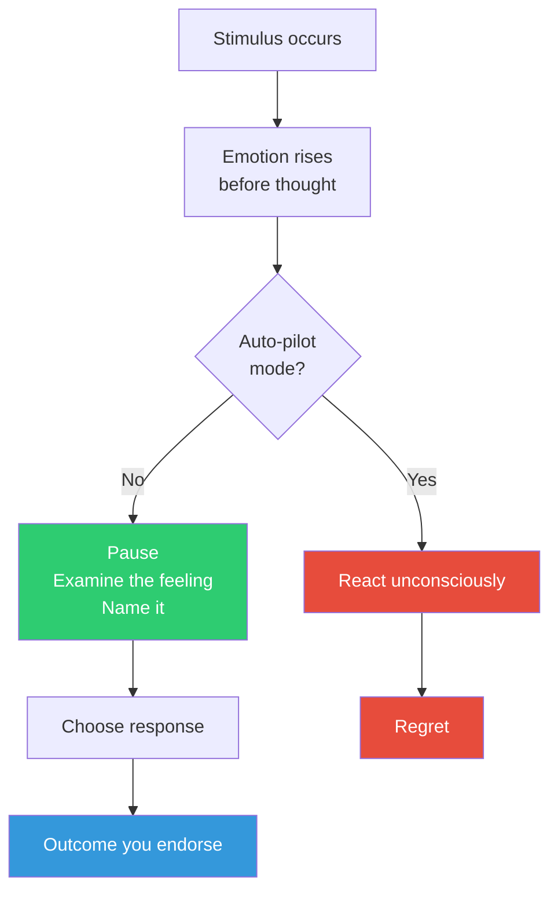

Key technique: the *name it to tame it* approach. When you can name an
emotion precisely, the amygdala — the brain's alarm system — begins to
de-escalate. This is not new age thinking. It is neuroscience aligned
with Stoic practice.

---

## Law 2: The Law of the Narcissistic Spectrum

Greene treats narcissism as a spectrum, not a binary. Everyone has some
narcissistic needs. Healthy narcissism allows self-regard and
boundaries. Pathological narcissism — what Greene calls "deep
narcissism" — is the inability to step outside the need for admiration
even momentarily.

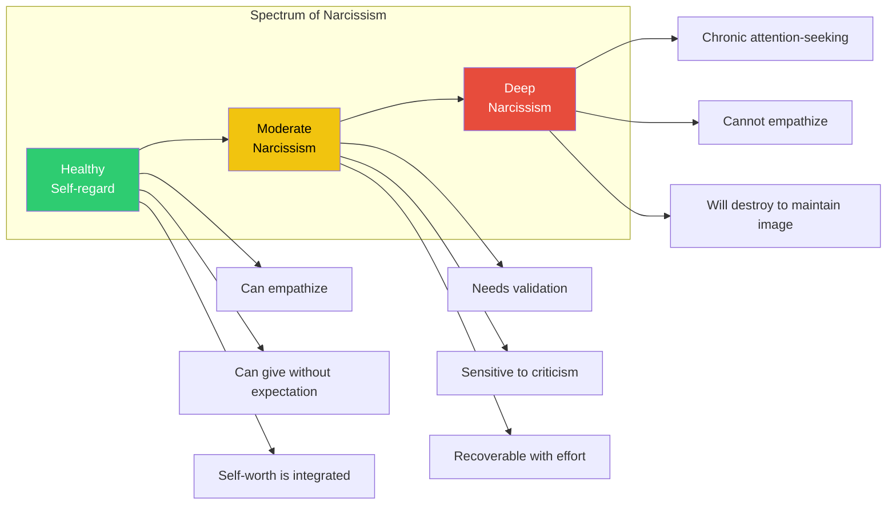

The practical skill: recognizing narcissistic patterns without labeling
every difficult person a narcissist. Greene warns against the temptation
to fight a deep narcissist on their terms — they are masters of
attention warfare. The strategy is to deliver minimal "narcissistic
supply" (praise when appropriate, indifference otherwise) while
protecting your own emotional boundaries.

---

## Law 3: The Law of Role-Playing

Humans are theatrical animals. Every person you meet is playing a role —
most of the time without conscious awareness. The executive plays
"decisive leader." The subordinate plays "loyal team member." The victim
plays "helpless." The rebel plays "free thinker."

The role someone is playing reveals their insecurities and aspirations:

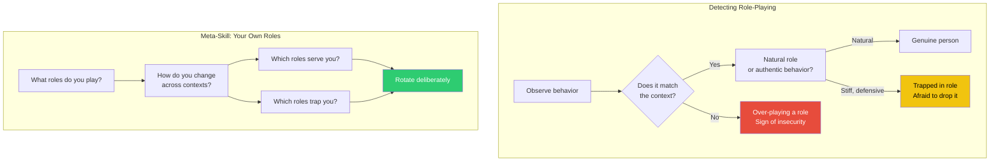

The meta-skill is noticing your own roles. Greene is explicit: the
person who plays "always confident" or "always agreeable" is not free
— they are performing under an internal contract they never agreed to.

---

## Law 4: The Law of Compulsion (Destiny)

Every human being carries an innate calling — a set of inclinations,
curiosities, and capacities present from childhood that point toward a
specific kind of work or life. Greene draws on Jung's concept of
*individation* — the process of becoming the individual you were meant to
be — and Nietzsche's *amor fati*: the love of your own specific fate.

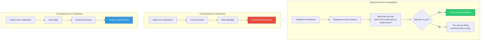

The compulsion is not a career choice. It is a gravitational pull. You
can ignore it, but you cannot eliminate it. It will re-express itself
through illness, depression, relationship failure, or quiet desperation.

---

## Law 5: The Law of the Crowd (Conformity)

Humans evolved as group animals. Conformity is not a weakness — it is
a survival mechanism. But the modern crowd operates at scale, through
media and social networks, and it can steer an entire culture toward
catastrophe with remarkable speed.

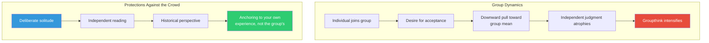

The antidote is not anti-social withdrawal. It is the deliberate
practice of thinking alone — reading complex texts, writing your own
ideas, resisting the comfort of agreement.

---

## Law 6: The Law of Aggression

Aggression is energy. It is neither inherently good nor inherently
bad — it is a force that can be directed in any direction. Repressed
aggression becomes depression, anxiety, or chronic physical tension.
Expressed destructively it becomes cruelty. Channeled outward as
ambition, it becomes creation.

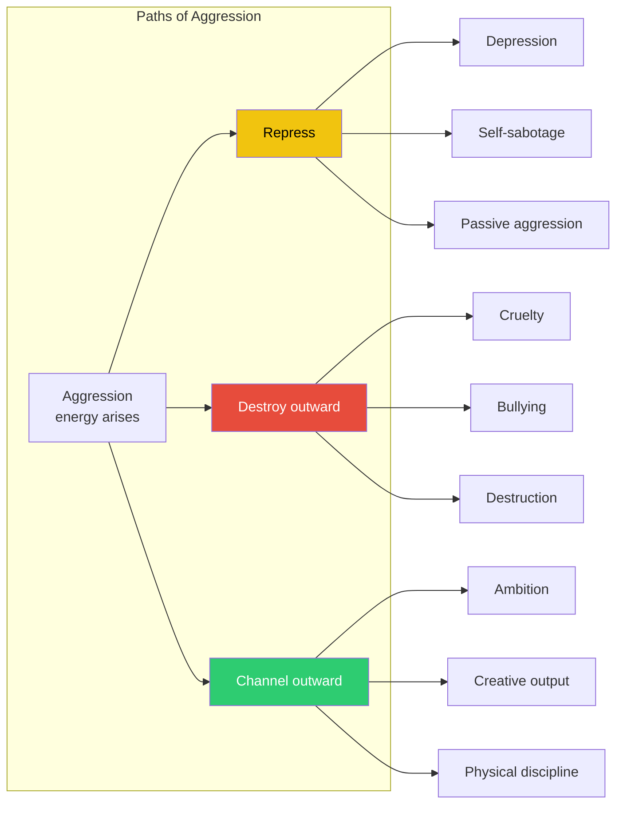

---

## Law 7: The Law of Gender Fluidity

Adapting Jung's anima/animus: every person contains both masculine
(assertive, directed, penetrating) and feminine (receptive, empathetic,
nurturing) energies. Psychological dysfunction — for Greene — is almost
always a function of imbalance.

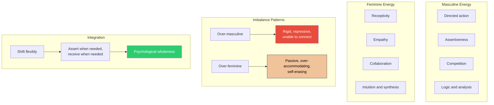

The gender fluidity law is not primarily a political statement. It is a
psychological one: power requires access to both modes, and the person
who can shift between them depending on context has a major strategic
advantage.

---

## Law 8: The Law of Shortsightedness

The human brain evolved to discount the future dramatically. In an
environment of immediate physical threats, this was adaptive. In a
world of compound interest, career trajectories, and long-term
relationships, it is catastrophic.

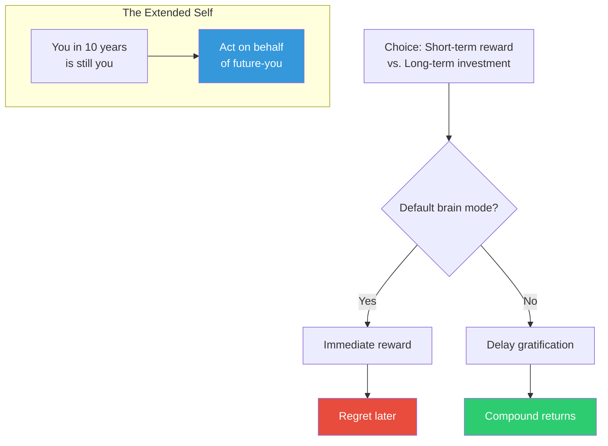

Greene's technique for countering shortsightedness: make the future
self vividly real. Write a letter from your future self. Visualize the
long-term consequence of today's choice in sensory detail. The brain
treats vivid futures as more immediate.

---

## Law 9: The Law of Defensiveness

When the ego perceives a threat — criticism, disagreement, exposure —
it activates a defensive triad: denial, counter-attack, and
rationalization. These responses are predictable. They are also almost
always counterproductive.

```mermaid
flowchart TD
  A[Threat to ego<br/>perceived] --> B{Defensive triad}
  B --> C[Denial:<br/>"It isn't true"]
  B --> D[Counter-attack:<br/>"You are worse"]
  B --> E[Rationalization:<br/>"It was justified"]
  C --> F[Relationship damaged]
  D --> F
  E --> F
  subgraph "Strategic Humility"
    G[Pause before responding] --> H[Ask: What is true<br/>in this criticism?]
    H --> I[Accept the grain of truth]
    I --> J[Ego becomes ally,<br/>not tyrant]
  end
  style J fill:#2ecc71,color:#fff
  style F fill:#e74c3c,color:#fff
```

Strategic humility does not mean self-abasement. It means protecting
your capacity to learn — which is destroyed by the need to always be
right.

---

## Law 10: The Law of Self-Sabotage (Envy)

Envy is the most forbidden emotion in human culture. This is precisely
why it is the most powerful. When you cannot acknowledge envy — or
when you act on it unconsciously — it covertly undermines your goals,
relationships, and creative energy.

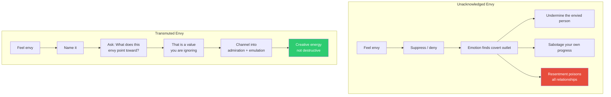

Schopenhauer's warning: envy is universal. Nietzsche's prescription:
the noble soul does not experience envy — or if it does, it transforms
it immediately into impulse toward self-improvement.

---

## Law 11: The Law of Grandiosity

Grandiosity — the sense that you are special, chosen, destined — is
the engine of both extraordinary achievement and catastrophic failure.
The law is not about suppressing ambition. It is about calibrating
self-assessment with enough realism to avoid the fall.

```mermaid
flowchart TD
  subgraph "The Grandiosity Cycle"
    A[Ambition + early success] --> B[Belief: I am exceptional]
    B --> C[Ignore warning signals]
    C --> D[Overreach]
    D --> E[Catastrophic failure]
    E --> F[Despair OR<br/>corrected perspective]
  end
  subgraph "Healthy Calibration"
    G[Ambition + early success] --> H[Gratitude for luck]
    H --> I[Continued learning]
    I --> J[Realistic self-assessment]
    J --> K[Steady, sustainable achievement]
  end
  style K fill:#2ecc71,color:#fff
  style E fill:#e74c3c,color:#fff
  style G fill:#3498db,color:#fff
```

The skill is to hold grand visions without believing they make you
invulnerable. Greene writes: the greatest leaders are those who can
think big while examining their own flaws honestly.

---

## Law 12: The Law of Fickleness (Sociability)

People are more fickle than they appear.opinions, loyalties, alliances,
and affections shift in response to changing circumstances, moods, and
self-interests. Taking people's current stance as permanent is a recipe
for disappointment.

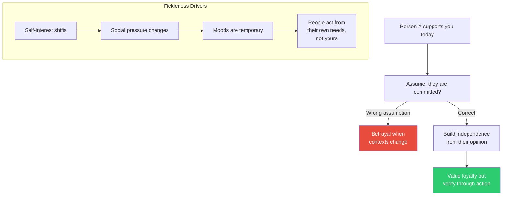

---

## Law 13: The Law of Envy (Transmuted)

Building on Law 10, Greene deepens the treatment here. Envy is not
only personal — it is social and structural. When envy is shared across
a group, it becomes resentment, which becomes ideology, which becomes
political violence.

The personal antidote remains what it was: transmutation into
admiration. The social antidote: create systems where people can rise
rather than tearing down those who have.

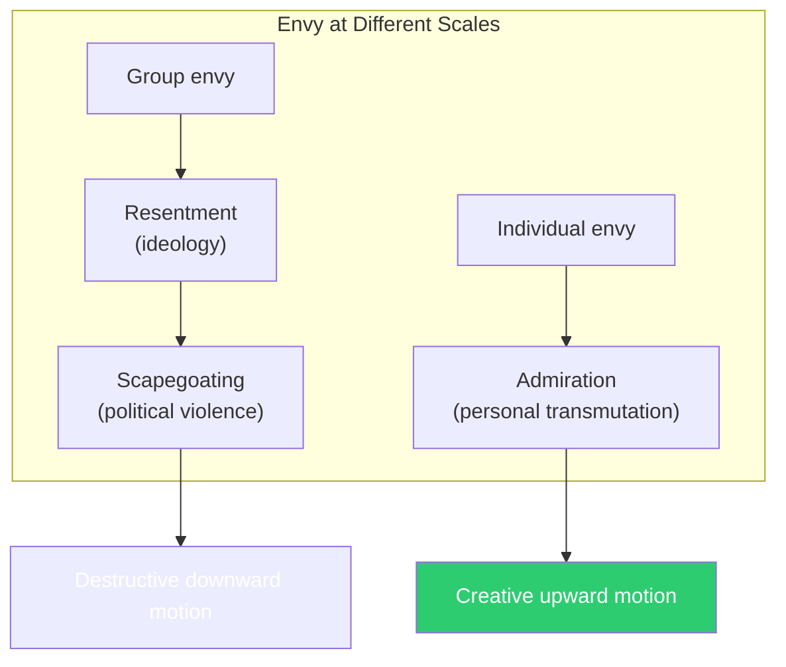

---

## Law 14: The Law of Gender

Building on Law 7, Greene expands from individual psychology to
cultural analysis. Rigid gender roles — the over-masculine culture of
repression, the over-feminine culture of passive accommodation — are
sources of widespread psychological suffering.

```mermaid
flowchart TD
  subgraph "Over-Masculine Culture"
    A1[Repression of emotion] --> A2[Empathy seen as weakness]
    A2 --> A3[Hyper-competition]
    A3 --> A4[Relational poverty]
  end
  subgraph "Over-Feminine Culture"
    B1[Excessive passivity] --> B2[Conflict avoidance at all cost]
    B2 --> B3[Self-erasure in relationships]
    B3 --> B4[Resentment explosion]
  end
  subgraph "Integration"
    C[Neither extreme] --> D[Assertive empathy]
    D --> E[Strength AND warmth]
    E --> F[Individual and collective<br/>psychological health]
  end
  style F fill:#2ecc71,color:#fff
  style A4 fill:#e74c3c,color:#fff
  style B4 fill:#f1c40f,color:#000
```

---

## Law 15: The Law of Conformity (Expanded)

Greene returns to the crowd theme with greater depth. Conformity is not
inherently bad — it is the substrate of culture, law, and civilization.
Blind conformity is the problem.

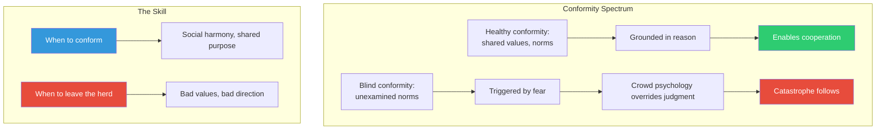

---

## Law 16: The Law of Fatalism / The Serpent's Wisdom

This law is Greene's call to embrace uncertainty and find opportunity
in what others fear. The serpent — across mythologies — is the creature
that sheds its skin. That is the central image: transformation requires
surrender of the old form.

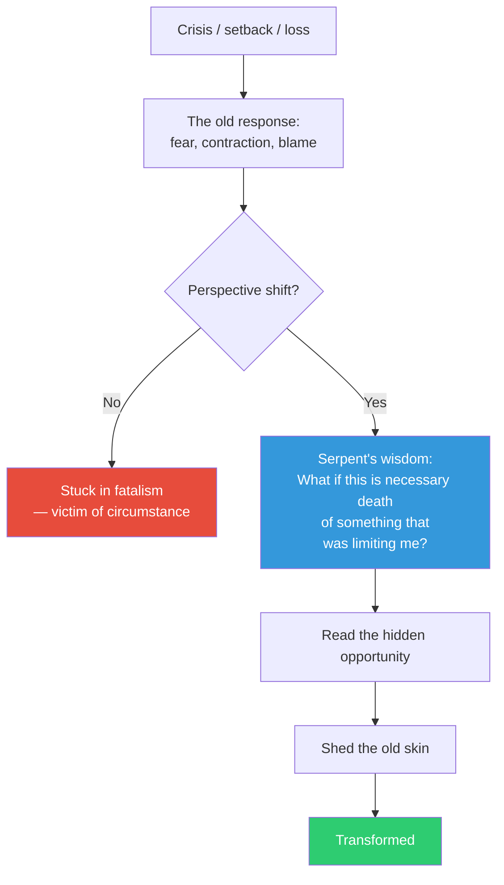

---

## Law 17: The Law of Self-Awareness (Empathy as a Skill)

Greene's most practical chapter. Empathy is not sympathy. It is not
compassion. It is the deliberate, learnable capacity to enter another
person's reality accurately enough to predict their behavior.

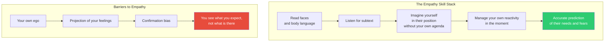

Techniques Greene recommends: reading fiction to practice perspective
taking, studying faces in photographs (without looking away — discomfort
means you are noticing something real), and the *reverse role play*:
before meeting someone, imagine their day, their fears, their desires,
until you can predict what they will say before they say it.

---

## Law 18: The Law of the Final Perspective

The culmination. Not the end of learning — the beginning of wisdom.
Greene draws on the Stoic *view from above*, the Buddhist recognition
of impermanence, and Nietzsche's demand for self-overcoming.

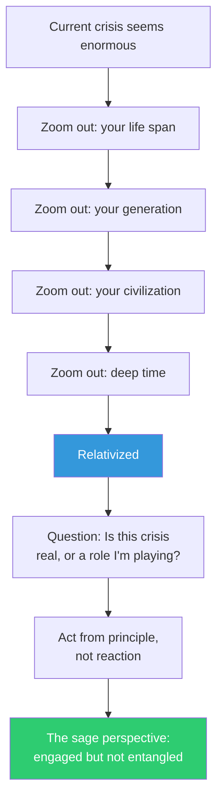

This is not detachment from life. It is the highest form of engagement
— action taken from a vantage point so high that pettiness, ego, and
short-term emotion cannot reach it.

---

## The 18 Laws at a Glance

```mermaid
flowchart TD
  A[18 Laws of Human Nature] --> L1[1: Irrationality]
  A --> L2[2: Narcissistic Spectrum]
  A --> L3[3: Role-Playing]
  A --> L4[4: Compulsion / Destiny]
  A --> L5[5: Conformity / Crowd]
  A --> L6[6: Aggression]
  A --> L7[7: Gender Fluidity]
  A --> L8[8: Shortsightedness]
  A --> L9[9: Defensiveness]
  A --> L10[10: Self-Sabotage / Envy]
  A --> L11[11: Grandiosity]
  A --> L12[12: Fickleness]
  A --> L13[13: Envy Transmuted]
  A --> L14[14: Gender Expanded]
  A --> L15[15: Conformity Expanded]
  A --> L16[16: Fatalism / Serpent]
  A --> L17[17: Self-Awareness / Empathy]
  A --> L18[18: Final Perspective]
  L1 --> L1a[Master yourself first]
  L2 --> L2a[Recognize depth in yourself<br/>and others]
  L3 --> L3a[See through the performance]
  L4 --> L4a[Follow your inner signal]
  L5 --> L5a[Think independently<br/>of the herd]
  L6 --> L6a[Channel energy outward]
  L7 --> L7a[Integrate masculine<br/>and feminine]
  L8 --> L8a[Delay gratification]
  L9 --> L9a[Strategic humility]
  L10 --> L10a[Transmute envy<br/>into emulation]
  L11 --> L11a[Calibrate ambition<br/>with realism]
  L12 --> L12a[Expect fickleness<br/>in all people]
  L13 --> L13a[Envy is a compass,<br/>not a poison]
  L14 --> L14a[Flexibility is power]
  L15 --> L15a[Conform to values,<br/>not to the crowd]
  L16 --> L16a[Find opportunity<br/>in destruction]
  L17 --> L17a[Build empathy<br/>as a practical skill]
  L18 --> L18a[Raise your perspective<br/>to wisdom]
```
