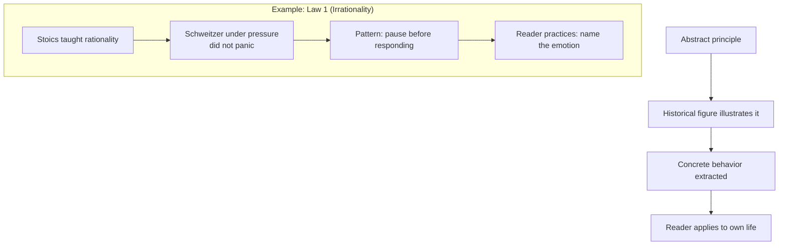
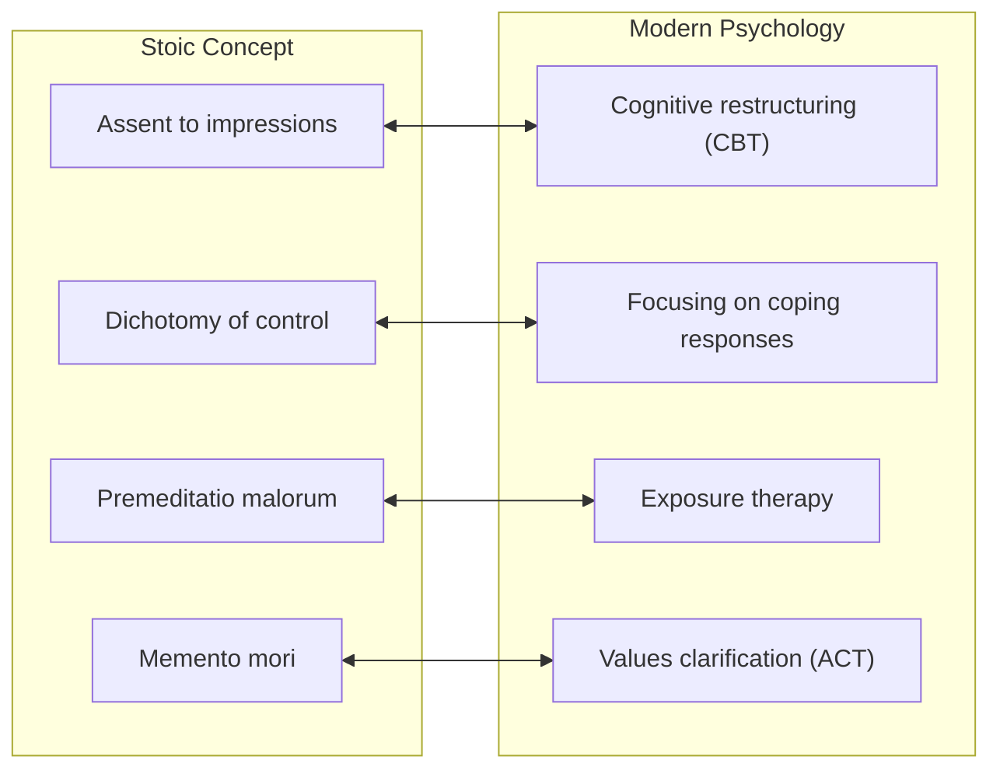

## Critical Evaluation

*The Laws of Human Nature* arrived at a cultural moment starved for
depth and immediately became a bestseller. But popular success does not
equate to philosophical rigor. This analysis examines the book's genuine
strengths, its real weaknesses, and where readers should apply their own
critical judgment.

---

## Strengths

### Unprecedented Synthesis at Popular Scale

The book's greatest achievement is structural: Greene has assembled a
coherent psychological system from sources that rarely appear in the same
library — Stoic ethics, Jungian psychology, behavioral economics,
evolutionary biology, and biographical history. He is not the first to
attempt this synthesis, but he is the first to attempt it at 624 pages
aimed at a general audience.

The synthesis works because Greene filters every source through a single
question: what pattern does this explain? The result is less a
scholarly work and more an operating manual — which is exactly what he
intended.

### Radical Practicality

Unlike most psychology books, which describe phenomena, and most
philosophy books, which argue for positions, *Laws of Human Nature*
prescribes specific behaviors. For each law, Greene provides:

- A diagnostic tool (how to recognize the pattern in yourself and others)
- A concrete exercise or practice
- A historical case study illustrating the pattern in action

This makes the book unusually actionable. Reading it without a journal
is almost a waste of time — Greene is explicit that the learning happens
in the writing, the reflection, and the deliberate practice.

### Honest Treatment of the Dark Side

Greene does not flinch from human capacity for darkness. His treatment of
envy, aggression, narcissism, and self-sabotage is unusually direct
for a popular book. The fear of envy — the social prohibition against
acknowledging it — is precisely what makes it powerful. Greene's
willingness to name it, normalize it, and provide strategies for
managing it is a genuine contribution.

### Historical Case Studies as Psychological Evidence

Greene uses biography and history the way a psychologist uses case
studies. The pattern is consistent: find a historical figure who
embodied or failed to embody a specific law, extract the behavior, and
generalize from it. The method is not scientific — it is rhetorical and
literary — but it is effective at making abstract principles vivid.

### The Shadow Work Practicality

Jung's concept of the shadow — the collection of impulses, fears, and
desires we have disowned — has been popularized but rarely operationalized
in accessible form. Greene's shadow law is the most practical treatment
available in a popular book. He provides concrete exercises: writing
down your ugliest thoughts without censorship, analyzing your dreams for
recurring symbols, noting who you envy and why.

---

## Weaknesses

### Loose Attribution and Selective Scholarship

Greene's approach to sources is opportunistic. He draws from Nietzsche,
Jung, Schopenhauer, the Stoics, Kahneman, and evolutionary psychology
without always indicating which tradition a particular idea belongs to.
The result is a seamless narrative that gives the impression of a unified
tradition when none exists.

| Issue | Example |
|-------|---------|
| Conflating Stoicism and CBT | Stoics developed *assent to impressions* — a philosophical practice. CBT developed cognitive restructuring — a clinical technique. Greene treats them as equivalent |
| Jung without Jung | Greene uses shadow, anima/animus, individuation, and synchronicity without addressing Jung's controversial methodology or the criticisms of his system |
| Nietzsche without Nietzsche | The will to power is not primarily about ambition — it is about the fundamental striving of all life. Greene simplifies it to individual achievement |

Readers who want the source material should consult the originals. Greene
is a gateway, not a destination.

### Structural Padding

At 624 pages, the book could be 300 pages shorter without losing
meaningful content. The law structure imposes an artificial order on
topics that naturally overlap, and several chapters repeat material that
was better presented earlier. Greene's prose, which is often elegant,
becomes repetitive when stretched to book length across 18 chapters.

### The "Gender Fluidity" Law

Greene's Law 7 — the Jungian anima/animus adapted as "gender fluidity" —
is the most philosophically problematic chapter. It treats deeply
cultural and political questions (gender identity, gender roles, the
social construction of masculinity and femininity) as if they were
primarily psychological energies. This is not merely a simplification —
it is a category error that flattens real human complexity into
archetype.

The expanded treatment in Law 14 is more responsive to modern concerns,
but the underlying framework remains Jungian essentialism dressed in
contemporary language.

### The Grand Finale Law

Law 18 — the Final Perspective or Sage/Master — is the weakest chapter.
After 17 carefully argued laws, Greene ends with a vague exhortation to
"raise your perspective so high that everyday conflicts become
insignificant." This is true but unhelpful. The Stoics spent decades
developing practical exercises for perspective-taking; Greene condenses
them into a chapter that reads more like a conclusion than a law.

### Therapy Without Therapist

Greene is explicit that *Laws of Human Nature* is not therapy. But the
book's practical exercises — shadow work, journaling, envy transmutation —
are therapy techniques that, without professional guidance, can be
misapplied. The reader who uses shadow work to obsess over their dark
thoughts without the containment of a therapist is not performing the
practice Greene intends.

---

## Criticism

### Is Greene Amoral?

This is the most common criticism. *48 Laws of Power* was explicitly
amoral — it described power dynamics without passing judgment. *Laws* is
different: Greene is clearly advocating for self-awareness, empathy, and
transcendence as genuine goods. But the source material he draws from —
Schopenhauer's pessimism, Nietzsche's will to power, Machiavellian
statecraft — carries its own moral weight that Greene does not fully
address.

The fairer criticism: Greene's framework lacks a robust account of how
to handle conflicts between laws. If Law 6 says channel your aggression
outward as ambition and Law 17 says cultivate empathy, what happens when
ambition requires stepping on others? Greene trusts the reader to figure
that out, but the question deserves more than a paragraph.

### Is the 18-Law Structure Arbitrary?

Yes, to some degree. The laws are discrete in presentation but
continuous in practice. You cannot genuinely master Law 1
(Irrationality) without engaging with Law 17 (Empathy), because
emotional self-awareness and other-awareness are two faces of the same
competence. The law structure is a pedagogical device, not a
metaphysical claim.

---

## Alternative Books

| Book | How It Differs |
|------|---------------|
| **Meditations** (Marcus Aurelius) | The Stoic source material. Marcus wrote for himself. Greene writes for you. Read both — Marcus is harder but more internally consistent |
| **Man and His Symbols** (Carl Jung) | Explains the Jungian framework Greene treats as raw material. Essential if you want the theoretical foundation Greene skips |
| **Predictably Irrational** (Dan Ariely) | Behavioral science version of Law 1. Cleaner methodology, less ambitious synthesis, more empirically grounded |
| **Emotional Intelligence** (Daniel Goleman) | The most accessible empirical treatment of empathy as skill (Law 17). Directly applicable to leadership |
| **The Righteous Mind** (Jonathan Haidt) | Moral psychology that supports Greene's claims about crowd dynamics (Law 5) with empirical research |
| **The Denial of Death** (Ernest Becker) | Deeper theoretical treatment of the anxiety that underlies narcissism, aggression, and grandiosity (Laws 2, 6, 11) |
| **Influence** (Robert Cialdini) | Tactical complement to Greene's diagnostic approach — how to apply psychological awareness in real interactions |
| **The Art of Seduction** (Robert Greene) | Greene's exploration of charm and manipulation. Shows the darker side of the role-playing law |

---

## Scientific Evidence

### Stoicism and Cognitive Behavioral Therapy

The connection is not metaphorical — it is historical. Aaron Beck, the
founder of CBT, credited Epictetus as a direct influence. Albert Ellis's
Rational Emotive Behavior Therapy (REBT) is built explicitly on Stoic
principles.

Multiple meta-analyses confirm CBT-based interventions as effective for
anxiety, depression, and PTSD. The core mechanism — that changing
thoughts changes feelings — is the same mechanism Greene describes in
Law 1.

### Social Psychology and Group Conformity

Law 5 draws heavily (without naming) on Asch's conformity experiments,
Zimbardo's Stanford Prison Experiment, and Milgram's obedience studies.
The scientific consensus is robust: group norms exert powerful pressure
on individual judgment, and awareness of this pressure does not
eliminate it. Deliberate dissent — the Stoic practice of solitude and
independent study — is the most reliable antidote.

### Narcissism Research

Law 2 is supported by decades of personality psychology. Narcissism
measures reliably predict attention-seeking behavior, empathic deficit,
and vulnerability to narcissistic injury. The spectrum model Greene uses
reflects the current clinical consensus: narcissistic traits exist
on a continuum, and clinical narcissism (NPD) is one extreme.

### Aggression and Catharsis

Law 6 challenges the "catharsis hypothesis" — the idea that expressing
aggression reduces it. Research consistently shows that venting aggression
can actually *increase* it. Greene's preferred model — channeling into
ambition — aligns better with the catharsis critique.

---

## Long-Term Relevance

The book's relevance will likely deepen rather than fade. Several
structural trends support this:

1. **Attention economics has intensified** since 2018. Greene's warning
   about shortsightedness (Law 8) is more urgent in an era of TikTok
   and algorithmic content feeds.

2. **Political polarization** has increased. Laws 5 (conformity) and 12
   (fickleness) are more visible in public life than when Greene wrote.

3. **Mental health awareness** has grown. Laws 1, 9, and 10 address
   emotional patterns that Anxious Generation trends and therapy culture
   are making newly visible.

4. **AI and automation** will make uniquely human capacities — empathy,
   self-awareness, perspective-taking — more valuable economically. Law 17
   may become the most strategically important chapter for the next
   generation of workers.

Greene's synthesis has flaws, but the questions it asks — how do I
understand myself? how do I understand others? how do I act well under
pressure? — are permanent human questions. *Laws* offers one of the
most comprehensive popular answers available right now.
