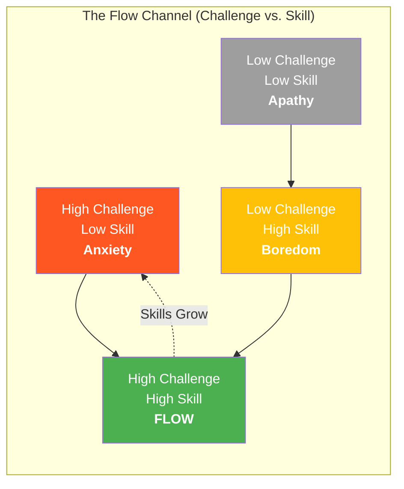
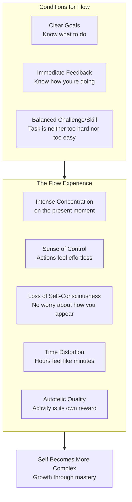

## The Flow Experience — An Overview

Csikszentmihalyi's research began with a simple question: when do people
feel most happy and engaged? He and his team interviewed thousands of
people — surgeons, rock climbers, chess players, dancers, factory workers,
elderly Korean women, teenagers in Chicago, farmers in the Alps — across
cultures and economic circumstances. The answer was consistent across all
groups: the best moments occur when a person's body or mind is stretched to
its limits in a voluntary effort to accomplish something difficult and
worthwhile.

He named this state **flow**, after the metaphor his respondents
spontaneously used: "It was like floating," "the current carried me."

---

## The Flow Channel

Flow lives in the narrow channel where challenge and skill are balanced.
When challenges outstrip skills, we feel anxious. When skills outstrip
challenges, we feel bored. Flow pushes us toward growth: as skills improve,
we must seek greater challenges to stay in the channel. This creates a
dialectic that drives the complexity of the self.

---

## Conditions for Flow

---

## The Eight Components of Enjoyment

Csikszentmihalyi identified eight phenomenological components that people
report when describing flow experiences. Not all are necessary, but most
are present.

| # | Component | Description |
|---|---|---|
| 1 | **Complete Task** | The activity is something we have a realistic chance of finishing |
| 2 | **Concentration** | Deep focus on a limited field of attention |
| 3 | **Clear Goals** | We know what needs to be done at each moment |
| 4 | **Immediate Feedback** | Actions have clear, instant consequences |
| 5 | **Effortless Involvement** | Deep but effortless engagement — no distractions |
| 6 | **Sense of Control** | No fear of losing control; we feel capable |
| 7 | **Loss of Self-Consciousness** | Worry about self disappears; we become one with the activity |
| 8 | **Altered Time** | Time passes differently — faster or slower |

These components form a subjective phenomenology that is remarkably
consistent across activities. A surgeon, a rock climber, a pianist, and a
factory worker all describe the same architecture of optimal experience.

---

## Flow in Different Domains

### Flow in Physical Activity

Sports, martial arts, dance, and yoga are designed flow activities. They
provide clear goals (score a point, land a move), immediate feedback (did
the ball go in?), balanced challenges (play someone at your level), and
concentrated attention (one mistake can lose the game). The body's
capabilities — vision, movement, proprioception — offer a rich set of skills
to match against physical challenges. Even yoga and martial arts transform
the body's limits into a source of ordered, enjoyable experience.

### Flow in Work

Csikszentmihalyi's research found that people report flow more frequently
at work than in leisure. Work provides structure: clear goals, feedback
(salary, deadlines, performance reviews), and built-in challenges. The
paradox: people prefer leisure, but feel more engaged, creative, and
satisfied at work. The solution is not to avoid work but to reframe it —
to find the flow conditions in your job, or to develop an autotelic
personality that can transform any task into a flow opportunity.

### Flow in Relationships

Other people are among the most complex and rewarding sources of flow.
Social interaction requires constant attention, clear goals (express a
thought, understand another person), immediate feedback (facial
expressions, tone of voice), and a delicate balance of challenge and skill.
Flow with others occurs in conversation, shared activities, sexual intimacy,
and family life. The autotelic family provides what Csikszentmihalyi calls
the "five characteristics": clarity, centering, choice, commitment, and
challenge.

### Flow in Thinking

The mind itself can produce flow through symbolic systems: language,
mathematics, logic, philosophy, science. Wordplay, poetry, puzzles, coding,
and theoretical reflection are all flow activities of the mind. The key is
that mental activities need the same structure as physical ones: goals,
feedback, and concentration. Reading is passive; writing, calculating,
arguing, or composing is active flow.

### Flow in Solitude

One of the most challenging places to find flow is alone with an empty
schedule. Csikszentmihalyi notes that people who cannot tolerate solitude
are at risk for disordered consciousness — the mind drifts into psychic
entropy (anxiety, worry, boredom). Learning to enjoy solitary activities —
writing, gardening, crafting, coding, thinking — is essential for a high
quality of life.

---

## The Autotelic Personality

The Greek roots: *auto* (self) + *telos* (goal). An autotelic activity is
done for its own sake. An autotelic person is one who generally does things
for their own sake rather than to achieve external rewards.

### Traits of Autotelic Personalities

- **Curiosity** — interest in the world for its own sake
- **Persistence** — ability to stay engaged even when challenges are hard
- **Low self-centeredness** — less worry about how others perceive them
- **Intrinsic motivation** — find reward in the activity itself
- **Goal-setting** — able to set clear, meaningful goals independently
- **Attention control** — can direct focus without external structure
- **Openness to novelty** — seek new experiences and challenges

### How Autotelic People Differ

Csikszentmihalyi studied teenagers and found that those with autotelic
personalities spent more time in flow, reported higher self-esteem, and
pursued more challenging goals. They came from families that provided
clarity, centering, choice, commitment, and challenge. These traits can
be cultivated — the autotelic personality is not fixed at birth.

---

## Enjoyment vs. Pleasure

A critical distinction that runs through the entire book:

| Pleasure | Enjoyment |
|---|---|
| Passive satisfaction of needs | Active engagement and effort |
| Homeostatic — returns to baseline | Expands and grows the self |
| Requires no psychic energy | Requires focused attention |
| Fleeting | Produces lasting growth |
| Can be addictive | Leads to greater complexity |
| Example: eating when hungry | Example: cooking a complex meal |
| Example: watching TV | Example: playing a musical instrument |

Pleasure is easy and passive. Enjoyment requires investment of attention
and effort, but produces the growth that makes life worth living.

---

## The Complexity of Consciousness

Csikszentmihalyi's model of consciousness draws on information theory.
**Psychic entropy** is disorder in consciousness — information that
conflicts with existing goals and disrupts attention. Worry, anxiety,
boredom, and distraction are forms of psychic entropy. **Flow is the
opposite:** ordered consciousness where all attention is invested in
a coherent set of goals.

The self grows through a dialectical process:

1. **Differentiation** — developing unique skills and traits
2. **Integration** — connecting those skills into a coherent whole

Flow pushes both: you become more unique (differentiation) as you master
challenges, and more connected (integration) as the activity becomes part
of your identity. A complex self is one that has both — unique enough to
be interesting, integrated enough to be stable.

---

## Key Lessons

### 1. Happiness is not a target — it's a byproduct
Direct pursuit of happiness is self-defeating. Happiness emerges from total
engagement in meaningful challenges. Set goals, invest attention, and
enjoyment follows.

### 2. Control your attention
Attention is the most fundamental psychic resource. How you spend it =
the quality of your life. Learn to focus it deliberately rather than
letting external stimuli grab it.

### 3. Structure your environment for flow
Make goals clear, get feedback, adjust challenge levels. This works for
work, relationships, and leisure. Don't wait for flow — design for it.

### 4. Transform work into flow
Even repetitive jobs can produce flow when you approach them with an
autotelic mindset: set personal challenges, develop skills, find goals
within the activity.

### 5. Learn to enjoy solitude
The ability to be alone without anxiety is a sign of ordered
consciousness. Develop activities that engage you when no one else is
around.

---

## Practical Applications

### Daily Flow Audit

At the end of each day, ask: When was I most engaged? When was I most
checked out? Follow the data — schedule more of the activities that
produced flow.

### Challenge Scaling

For any activity you find boring: raise the challenge. Play the song
faster, do the job better, add a constraint that forces creativity. For
activities that cause anxiety: break them down, build skills, find a
mentor.

### Goal Clarity Practice

Before starting any significant activity, spend 30 seconds defining:
- What am I trying to accomplish?
- How will I know if I'm succeeding?
- What counts as a win?

### Feedback Design

Create or seek immediate feedback loops. Use a timer, a coach, a score,
a checklist. The faster the feedback, the easier flow becomes.

### Attention Training

Practice concentrating on a single task for increasingly longer periods.
Remove distractions. Use environmental cues to signal "flow time."
