## Introduction

**Narrator:** Welcome to BookAtlas. Today: *Flow: The Psychology of
Optimal Experience* by Mihaly Csikszentmihalyi. Published 1990. Harper &
Row. 304 pages. This is the book that gave us the concept of "flow" — the
feeling of being in the zone.

To dig into it, I'm joined by Dr. Elena Vasquez, a positive psychology
researcher who has spent 15 years studying flow states, and Marcus Webb,
a skeptic who thinks flow is just a fancy name for "getting really
into your work."

Let's see where they agree, where they clash, and what any of us can
actually use.

---

## What Is Flow, Really?

**Narrator:** Elena, let's start with the basics. What is flow?

**Elena:** The simplest definition is the one Csikszentmihalyi himself used:
flow is the state of complete absorption in an activity where nothing else
seems to matter. It's when challenge precisely matches skill. The surgeon
in the OR, the climber on the wall, the programmer deep in code — they're
all describing the same psychological state. Eight components: clear goals,
immediate feedback, intense concentration, a sense of control, loss of
self-consciousness, distorted time, the activity feels effortless, and it's
done for its own sake.

**Marcus:** Okay, but isn't that just "being really focused"? I've been
"in the zone" playing video games. It doesn't feel like it needs a whole
book and 30 years of research.

**Elena:** That's exactly the point, Marcus — it seems obvious once you
experience it, but nobody before Csikszentmihalyi had systematically
studied *when* and *why* it happens. He interviewed thousands of people
across dozens of cultures. A surgeon in Chicago and a farmer in the Italian
Alps described the same phenomenon. The universality is the discovery.

**Marcus:** Thousands of interviews? So this is all self-report? People
saying "I was really engaged"? How do you know they weren't just having a
good day?

**Elena:** That's a fair critique, and it's the central weakness. The
Experience Sampling Method — paging people at random times and having them
log their state — is the best tool we have, but it's still subjective. We
don't have a blood test for flow. But the patterns in the data are
remarkably consistent across activities and cultures. The same structure of
experience keeps appearing.

---

## The Flow Channel

```mermaid
graph TD
    Anxiety["Anxiety<br/>(High Challenge, Low Skill)"]
    Flow["FLOW<br/>(High Challenge, High Skill)"]
    Boredom["Boredom<br/>(Low Challenge, High Skill)"]
    Apathy["Apathy<br/>(Low Challenge, Low Skill)"]

    Anxiety -->|Build Skills| Flow
    Boredom -->|Increase Challenge| Flow
    Apathy -->|Find a Challenge| Flow
    Flow -->|"Skills Grow &#8594; Need More Challenge"| Boredom
    Flow -->|"Seek Harder Challenges"| Anxiety

    style Flow fill:#2E7D32,color:#fff
    style Anxiety fill:#C62828,color:#fff
    style Boredom fill:#F9A825,color:#fff
    style Apathy fill:#757575,color:#fff
```

**Marcus:** I've seen this diagram everywhere. It's elegant but is it true?
If I'm anxious, I just need more skill. If I'm bored, I need more
challenge. That feels oversimplified.

**Elena:** It is simplified — it's a model, not a law. But the core
insight holds up: flow is a narrow channel that requires active management.
I've tested this in my lab. We put people in tasks where we control
challenge and skill levels. When they're mismatched, people report
anxiety or boredom. When they match, flow emerges. The effect is real and
reproducible.

**Marcus:** But "managing the channel" assumes I can control my
circumstances. What if my job is repetitive assembly line work? What if I'm
a single parent with two jobs? Telling me "adjust the challenge level" is
a luxury.

**Elena:** This is the book's biggest blind spot, and critics have rightly
called it out. Csikszentmihalyi acknowledges material conditions but
dismisses them too quickly — he says "health, money, and other advantages
may or may not improve life; unless you learn to control psychic energy,
they are useless." That's true as far as it goes, but it's easier to
control your attention when you're not worried about eviction.

**Marcus:** So you're admitting the book has a privilege problem?

**Elena:** I'm saying the advice is *conditional*. If you have basic
stability, the flow framework is transformative. If you don't, the
framework is still useful but much harder to apply. The science is sound;
the accessibility of the solution varies.

---

## Autotelic Personality — Born or Made?

**Marcus:** Csikszentmihalyi talks about the "autotelic personality" —
people who naturally do things for their own sake. Is this something you're
born with, or can you develop it?

**Elena:** Both. There's a genetic component — some people are naturally
more curious, more persistent, less self-conscious. But the book presents
strong evidence that autotelic traits are cultivated through family
environment. Csikszentmihalyi studied teenagers and found that families
with five characteristics — clarity, centering, choice, commitment,
challenge — produce kids who experience more flow.

**Marcus:** So good parenting creates flow kids. That's not exactly
actionable for a 35-year-old who wasn't raised that way.

**Elena:** It's more actionable than you think. Habits reshape personality
over time. Practice setting clear goals. Practice paying attention to
feedback. Practice doing things for the challenge, not the reward. These
are skills. The autotelic personality is not a fixed identity — it's a
practice.

---

## Flow at Work

**Marcus:** Here's what I found genuinely surprising: Csikszentmihalyi's
data shows people report more flow at work than in leisure. That seems
backwards.

**Elena:** It's one of the most counterintuitive findings in the book.
Work provides structure — goals, feedback, appropriate challenges. Leisure
is often passive — watching TV, scrolling social media. We *think* we'd be
happier on vacation, but the data says we're more engaged, more creative,
more satisfied when we're working. The key is finding or creating flow
conditions in your work.

**Marcus:** So the advice isn't "quit your job and pursue your passion."
It's "make your current job more flow-inducing."

**Elena:** Exactly. Set personal challenge goals within your role. Find
ways to get faster feedback. Structure your day for deep engagement. The
autotelic approach transforms work from something you endure to something
you engage in.

---

## Enjoyment vs. Pleasure

**Marcus:** Another distinction I want to push on — enjoyment vs. pleasure.
Csikszentmihalyi says pleasure is passive and enjoyment is active, and
enjoyment is what matters. But isn't there value in pure pleasure? In
relaxation?

**Elena:** Absolutely. He's not saying pleasure is bad. He's saying
pleasure alone doesn't produce growth. Enjoyment — flow — pushes the self
to become more complex. You need both. A life of only flow would be
exhausting. A life of only pleasure would be empty. The art is knowing
when to engage and when to rest.

**Marcus:** That's actually reasonable. I was worried this was going to be
a "you must optimize every moment" book.

**Elena:** It's not. Csikszentmihalyi is very clear: flow is not always
good. It can be addictive. Gambling, extreme sports, obsession with a
single activity — flow can become a trap. The book is a theory of
happiness, not a prescription for constant intensity.

---

## Practical Tips for Finding Flow

**Narrator:** Let's end with something practical. If our listener wants to
experience more flow starting tomorrow, what should they do?

**Elena:** Three things. First, do a flow audit for one week. Every few
hours, note your engagement level on a 1-10 scale. At the end of the week,
look for patterns. What activities produce the highest engagement? Do more
of those.

Second, practice challenge scaling. Whatever you're doing — work, hobby,
exercise — ask yourself: is this too easy (boredom) or too hard (anxiety)?
Adjust accordingly. If it's boring, add a constraint. If it's stressful,
break it down or build the skill.

Third, design your environment for clear goals and immediate feedback.
Before any significant activity, spend 30 seconds defining: what am I
trying to do, and how will I know if it's working? That simple mental
shift creates the conditions for flow.

**Marcus:** And my practical tip: don't overthink it. Flow is a natural
state that your brain already knows how to enter. The science is useful
for understanding *why* it works, but you don't need to diagram your life
into flow channels. Find activities you lose yourself in. Do more of those.
That's the book in one sentence.

**Elena:** I actually agree with Marcus. The book's job is to show you
what's happening, not to micromanage how you get there.

---

## Closing

**Narrator:** *Flow: The Psychology of Optimal Experience* is a
foundational text — flawed, meandering, occasionally tone-deaf about
privilege, but genuinely profound. It reframes happiness from something
that happens to you to something you participate in. Flow is not the
answer to every problem, but it is a powerful lens for understanding what
makes life engaging, meaningful, and worth living.

The science has evolved since 1990. We now have fMRI studies, EEG
correlates, and refined measurement tools. But Csikszentmihalyi's core
insight — that the quality of our lives is determined by the quality of
our attention — has only become more urgent in our age of distraction.

This has been a BookAtlas narration of *Flow: The Psychology of Optimal
Experience* by Mihaly Csikszentmihalyi. Thanks for listening.
