```mermaid
flowchart TB
    P["Seven Principles of Influence"]
    
    P --> R[Reciprocity<br>We feel obliged to repay]
    P --> S[Scarcity<br>Limited = Valuable]
    P --> A[Authority<br>We defer to experts]
    P --> C[Consistency<br>We align with past commitments]
    P --> L[Liking<br>We say yes to people we like]
    P --> SP[Social Proof<br>We follow the crowd]
    P --> U[Unity<br>We trust our own tribe]
    
    R --> DITF[Door-in-the-Face<br>Reject large ask → accept smaller]
    R --> TNA[That's-Not-All<br>Sweetened deal before response]
    R --> FS[Free Samples<br>Gift creates obligation]
    
    S --> LN[Limited Numbers<br>Only X available]
    S --> DL[Deadlines<br>Offer expires soon]
    S --> PR[Psychological Reactance<br>Forbidden = Desirable]
    
    A --> TIT[Titles<br>Dr., Prof., Expert labels]
    A --> CL[Clothing<br>Uniforms, suits, badges]
    A --> TR[Trappings<br>Status symbols, cars, offices]
    
    C --> FITD[Foot-in-the-Door<br>Small yes → larger yes]
    C --> PUB[Public Commitment<br>Written, announced pledges]
    C --> LAB[Labeling<br>Assign trait → person enacts it]
    
    L --> SIM[Similarity<br>We like people like us]
    L --> COMP[Compliments<br>Praise increases liking]
    L --> FAM[Familiarity<br>Mere exposure effect]
    L --> ASS[Association<br>Linked to positive things]
    
    SP --> UNC[Uncertainty<br>Looking to others when unsure]
    SP --> SML[Similar Others<br>Strongest proof from peers]
    SP --> PI[Pluralistic Ignorance<br>Everyone looks, no one acts]
    
    U --> KIN[Kinship<br>Family, ethnicity, nation]
    U --> COH[Co-creation<br>Shared making = shared identity]
    U --> IDE[Idea Fusion<br>Ideology as identity]
```

## Reciprocity

The rule of reciprocity is simple: we should try to repay what another person has provided us. This rule is universal across human cultures — every society teaches it. Its power lies in the sense of obligation it creates, even when the initial gift was uninvited or unwanted.

### Research Foundations

Cialdini's classic 1975 experiment demonstrated the **door-in-the-face** technique. Researchers posing as the "County Youth Counseling Program" asked college students to volunteer two hours per week for two years — an extreme request. 100% refused. When the researchers then asked for a one-day chaperone trip to the zoo, 50% agreed. In the control group (asked only for the zoo trip), only 17% agreed. The apparent concession from the extreme ask triggered the reciprocity rule: students felt obligated to reciprocate the researchers' "compromise."

The **that's-not-all** technique derives from the same principle. A seller makes an initial offer, then before the customer responds, sweetens the deal with a bonus or discount. The "concession" triggers reciprocal compliance. Field experiments in a retail setting found that adding a bonus before the customer decided ("this set of cupcakes is $3 — and we'll throw in two free cookies") increased sales by 30% compared to offering the same deal upfront.

**Free samples** are the most visible application. The Hare Krishna Society in the 1970s famously used this — they would hand a flower to a passerby in an airport. Once accepted, the obligation to reciprocate made donations far more likely. The tactic was so effective it became their primary fundraising method.

### Real-World Application

Charitable organizations exploit reciprocity by sending free address labels or small gifts with donation requests. The American Disabled Veterans association reported that a simple mailing with personalized address labels produced an 18% donation rate versus 5% without. The labels triggered the reciprocity rule even though the recipient never asked for them.

In negotiations, making an extreme initial demand and then retreating to your actual target (the "rejection-then-retreat" strategy) produces not only compliance but also greater satisfaction on both sides — the counterpart feels they extracted a concession.

### Defense

If someone offers you a gift or favor you did not ask for, recognize it may be a compliance tactic. Accept the gift on its own terms — but if you later feel pressured to reciprocate beyond what is appropriate, mentally reframe the gift as a sales tactic. Ask: "Would I feel differently about this person if I had never received this free gift?"

## Scarcity

Opportunities seem more valuable when their availability is limited. The scarcity principle operates on the human tendency to judge quality by availability — what is hard to get is typically better. The deeper mechanism, however, is **psychological reactance**: when our freedom to have something is threatened or restricted, we want it more intensely.

### Research Foundations

Cialdini and colleagues ran a field experiment where consumers were told about a sales price for a brand of beef. Some were told the beef was normally available; others were told it was in short supply due to demand. Those in the scarcity condition purchased significantly more — and rated the beef as higher quality in blind taste tests even though the product was identical.

The classic "cookie experiment" by Worchel, Lee, and Adewole (1975) showed participants a jar of cookies. When there were ten cookies, participants rated them moderately. When only two cookies remained, the same cookies were rated significantly more desirable. When the scarcity was *created* by high demand (the jar was depleted by popular demand), desirability ratings rose highest of all.

**Limited-number** tactics ("only 3 left in stock") and **time-limit** tactics ("sale ends midnight") are the most common commercial applications. Amazon's "Only X left in stock" and Booking.com's "Last room available" notifications are direct descendants of this research.

**Censorship** reliably backfires — when information is restricted, people want it more. Cialdini cites the finding that college students rated a book more favorably after being told they could not read it.

### Real-World Application

The "deadline close" is a staple of sales training: "This offer is available until Friday." The tactic exploits the combination of scarcity and psychological reactance. The most effective version adds a *reason* for the scarcity, making it more legitimate: "We're offering this discount to our first 100 customers because we're launching a new product line and need the inventory space."

### Defense

The key question: are you drawn to something because it is truly better for your needs, or because it feels like it is slipping away? Separate the value of the thing from the feeling of scarcity. Recognize that scarcity itself does not increase quality — it only increases desire.

## Authority

Deep-seated deference to authority figures is wired into human social structure. From childhood, we are taught that authority figures (parents, teachers, police, doctors) know what they are talking about. This generalized respect transfers to symbols of authority — titles, clothing, and trappings — even when the "authority" has no relevant expertise.

### Research Foundations

**Milgram's obedience experiments** (1963-1974) are the most dramatic demonstration. Subjects were instructed by a scientist in a lab coat to administer increasingly powerful electric shocks to a "learner" (an actor). 65% of subjects continued to the maximum voltage (450 volts) — labeled "Danger: Severe Shock" — despite hearing screams, pleas, and eventually silence. Neutral observers predicted only 1% would go all the way. The authority of the experimenter overrode the subject's moral compass.

Cialdini notes that the Milgram results are not a relic — replications as recent as 2009 (Burger) found compliance rates only modestly lower, at 70%.

**Titles** trigger automatic deference. Cialdini cites a study where an actor introduced as "Dr." was rated by subjects as taller and more authoritative than the same person introduced as "Mr." Another study showed that patients with "Dr." on their hotel reservation received more favorable treatment from staff.

**Clothing** matters: a study where a confederate dressed as a security guard instructed pedestrians to pick up litter or comply with other requests found compliance rates of 92% versus 42% when the same person wore casual clothes. Uniforms signal authority even when there is no institutional basis for it.

**Trappings** — expensive cars, corner offices, professional credentials on the wall — trigger the same automatic deference. Car salesmen exploit this by wearing expensive suits and displaying industry awards.

### Real-World Application

Medical authority is one of the strongest influence levers. Patients comply with prescriptions at higher rates when the physician prominently displays diplomas and certificates. Television commercials for toothpaste and pain relievers have used actors in white coats for decades because the authority cue works even when the viewer knows it is an actor.

In digital contexts, authority cues include verified badges, credentials in author bios, and "as seen in" media logos. The "expert" label on Amazon reviews (verified purchase + high volume of helpful votes) combines authority and social proof.

### Defense

Before complying with an authority figure, ask: "Is this person truly an expert in the relevant domain?" A Nobel laureate in physics has no special authority on nutrition. Also ask: "How honest would this authority be likely to be?" A salesperson who happens to have a PhD has a conflict of interest.

## Consistency

Once we make a choice or take a stand, we encounter personal and interpersonal pressure to behave consistently with that commitment. The drive for consistency is a powerful motivator — inconsistency is associated with mental weakness, instability, and untrustworthiness.

### Research Foundations

**Foot-in-the-door**: Freedman and Fraser (1966) demonstrated that homeowners who agreed to place a small "Drive Safely" sign in their window were 400% more likely to later agree to place a large, ugly "Drive Safely" sign on their lawn compared to homeowners approached directly with the large sign. The initial small commitment reshaped the homeowners' self-image as "someone who supports safe driving," making the larger request consistent with that identity.

**Labeling**: Once someone is labeled with a trait ("you're so generous"), they tend to behave consistently with that label. Cialdini cites a study where children who were told they "seem to be the kind of person who would help" were significantly more likely to donate candy than children who were simply asked to donate.

**The Chinese Prisoner of War brainwashing program** during the Korean War used consistency-based techniques. Instead of harsh interrogation, captors extracted small written commitments that were gradually escalated: signing a statement like "There is no perfect society on earth" led to "The US is not perfect" which led to "Communism is worth trying." Each step was consistent with the previous one.

**Public commitment** is stronger than private commitment. A study of horse race bettors found they were significantly more confident in their pick immediately after placing the bet than before — even though no new information had been received. The act of committing changed their beliefs about their own choice.

### Real-World Application

A classic sales tactic: the "lowball" technique. A car dealership offers an incredible price. The customer commits — invests time, imagines owning the car, tells friends. Then the dealer "discovers" a mistake and raises the price. Many customers still buy because the commitment process has already begun. Consistency pressure overrides the price increase.

Online: free trials that require a credit card are foot-in-the-door. The signup is easy; canceling requires effort. Each month the service charges, the user's behavior reinforces the identity of "someone who uses this service."

### Defense

Ask yourself: "Knowing what I know now, if I could go back in time, would I make the same commitment?" If not, recognize that consistency is pressuring you to stay with a bad decision — the most courageous act is to change your mind.

## Social Proof

We determine what is correct by finding out what other people think is correct. The principle of social proof is most influential under two conditions: uncertainty (when we do not know what to do) and similarity (when we observe people like ourselves).

### Research Foundations

**The bystander effect** is social proof operating in crisis. In the infamous 1964 murder of Kitty Genovese, 38 witnesses watched from their apartments as she was repeatedly stabbed — yet no one called the police. Cialdini explains this through **pluralistic ignorance**: each witness saw others not reacting and concluded the situation was not an emergency. Darley and Latané's experiments confirmed that a single person in a room alone is far more likely to help than a person in a room with passive others.

**Laugh tracks** on television are a direct application. The canned laughter triggers social proof: if others are laughing, this must be funny. Despite being widely disliked, laugh tracks measurably increase audience ratings of comedic material.

**Similarity amplifies social proof**: a study at Columbia University found that students were far more likely to volunteer for a psychology experiment when the experimenter wore clothes like theirs. Sales training has long taught: "Mirror the customer's body language, speech patterns, and dress."

Cialdini's own field study: pitchmen in a restaurant gave the same pitch to two groups. One group was shown a list of people who had already donated (all with similar names to the target). Donations increased by 400% compared to the control list.

### Real-World Application

Amazon's "Customers who bought this also bought" and "Bestseller" badges are social proof. Yelp and TripAdvisor reviews determine consumer choices not just through information but through social proof: if thousands of people like this restaurant, it must be good.

The "Bartender's Trick": a bartender salts the tip jar with a few bills before the shift starts, signaling that others tip. The cue works on automatic pilot.

Social proof drives Facebook/Instagram engagement — seeing friends like a post increases the likelihood of liking it. The platform's algorithms amplify this by showing posts with more engagement higher.

### Defense

Beware of manufactured or manipulated social proof. Are the testimonials real? Are the reviews authentic? Are the "people like you" actually like you? The best defense is to separate the evidence of what others do from the question of what you truly want or need.

## Liking

People prefer to say yes to people they like. This seems obvious, but the scale of the effect is often underestimated, and the factors that create liking are more subtle than most people realize.

### Research Foundations

**Physical attractiveness** triggers a halo effect: attractive people are automatically judged as more intelligent, honest, and persuasive. Cialdini cites a study finding that attractive defendants receive significantly lighter sentences than unattractive ones. In elections, physically attractive candidates receive 2-3x more votes than unattractive ones with identical platforms.

**Similarity**: we like people who are like us — in opinions, personality, background, or lifestyle style. A compliance study found that people were significantly more likely to agree to a survey request from someone with a similar-sounding name or similar interests.

**Compliments**: praise, even when obviously flattering and inaccurate, increases liking. A study showed that people who received a compliment about their taste in art rated the complimenter more favorably even when they knew the praise was manipulative.

**Contact and familiarity**: the mere exposure effect (Zajonc, 1968) shows that repeated exposure to a stimulus increases liking. This is why advertising works — and why salespeople are trained to build rapport before making the pitch.

**Association**: the principle of association links the persuader with positive things. Sports fans wear team colors and feel personal victory when their team wins — the "basking in reflected glory" effect (BIRGing). Car salesmen stand next to the car in ads, and companies pay millions for celebrity endorsements to transfer likability.

The **Tupperware party** is the classic application: a host (who is a friend of the guests) sells Tupperware to her social circle. The purchase is a favor to a friend. Cialdini's analysis showed that the social relationship between host and guest was the primary driver of sales — not the product quality.

### Real-World Application

Network marketing (Mary Kay, Avon, Amway) is built entirely on liking. Distributors sell to friends and family first. The model works because the liking principle is stronger than any advertising campaign.

Online influencer marketing is the digital Tupperware party. Followers feel a parasocial relationship with the influencer — similarity, familiarity, and liking combine to generate purchase intent that rivals (or exceeds) traditional advertising effectiveness.

### Defense

Separate your feelings about the person from the merits of the offer. Ask: "Would I want the product or service if it were offered by a stranger I didn't particularly like?" If the answer is no, your liking for the salesperson is driving the decision.

## Unity (Seventh Principle, Added 2021)

The Unity principle holds that people are more influenced by those they perceive as sharing a category with them — being "us" rather than "them." Cialdini added this principle to the 2021 expanded edition based on research showing that shared identity creates a deeper, more automatic influence pathway than mere liking.

### Research Foundation

The principle goes beyond liking. We can like someone who is different from us; unity involves a shared identity. This is rooted in evolutionary psychology: kin selection means we are wired to trust, help, and be influenced by those who share our genes — and by extension, those who share our tribe, nation, ethnicity, religion, or even alma mater.

**Co-creation** is a key element: people who create something together develop a shared identity that increases mutual influence. The IKEA effect — valuing furniture you built yourself more — extends to ideas, products, and relationships created jointly.

**Family and kinship**: studies show people are more persuadable by family members than by close friends. The "family first" norm is cross-cultural.

**We vs they language**: political and marketing messages that use "we" and "us" language activate the unity principle. A study found that consumers were significantly more likely to donate to a cause when the appeal used "we" language versus "they" language, controlling for all other factors.

### Real-World Application

Brand communities (Harley-Davidson, Apple, Nike) build identity fusion. Customers don't just like the products — they see themselves as part of a tribe. Harley-Davidson owners don't just buy motorcycles; they identify as "HOG members." This identity fusion generates loyalty that price competition cannot challenge.

Political campaigns use unity when they talk about "our values" and "our country." The most effective appeals invoke shared geographic, religious, or cultural identity.

Online: Facebook Groups, Discord servers, and Substack communities that create "insider" status activate unity. The stronger the shared identity, the higher the engagement and the lower the member churn.

### Defense

Notice when someone uses "we" language to create a false sense of shared identity with you. Are you actually part of the same tribe — or is the persuader manufacturing a sense of unity to borrow your trust? Ask: "If I didn't share this identity with this person, would this request still make sense?"
