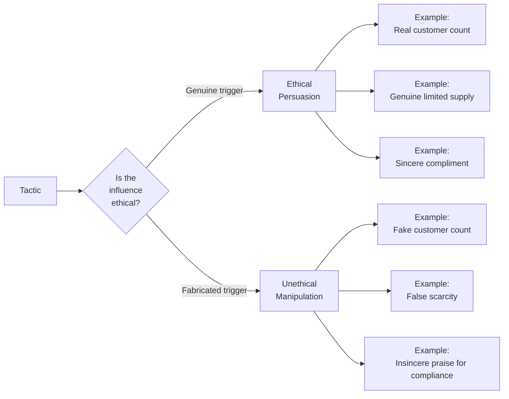

**[Host]**: Welcome to BookLab. I'm your host. Today's book is Robert Cialdini's *Influence: The Psychology of Persuasion* — the best-selling, most-cited book ever written about why people say yes. To debate it, I have two guests who could not approach this book more differently. Sarah Chen is a VP of Marketing at a major e-commerce company. She has used Cialdini's principles to drive millions in revenue. Welcome, Sarah.

**[Sarah]**: Thanks. I'll be honest — this book is my professional Bible. I have a worn-out copy on my desk and a digital copy on my phone. Every campaign I've ever run that worked well had Cialdini fingerprints all over it.

**[Host]**: And Dr. Marcus Webb is a professor of applied ethics who has written about the ethics of persuasive technology. Marcus, welcome.

**[Marcus]**: Thanks for having me. I have complicated feelings about this book. It's brilliant — genuinely brilliant — but it also functions, in the wrong hands, as a manipulation handbook. And I have seen those wrong hands up close.

**[Host]**: Let's start where the book starts: the idea that human beings operate on automatic pilot much more than we realize. Sarah, is that your experience?

**[Sarah]**: Absolutely. Let me give you a concrete example. We tested two versions of a landing page. Version A said: "Join 50,000 customers who trust us." Version B said: "Join 50,000 customers." No other difference. Version A converted 34% better. That's social proof in action. Our customers didn't evaluate our product feature by feature — they used the shortcut: "If 50,000 people chose this, it must be good."

**[Marcus]**: And the ethical question Sarah is not asking: were those 50,000 customers real? Were they actual users, or was it a number the company manufactured? Cialdini's framework is agnostic about truth. The principle works whether the social proof is genuine or fabricated. That's the problem.

**[Sarah]**: That's a fair point, but I would push back. The smartest companies I know use the principles with real data. We don't fabricate numbers. The 50,000 figure was genuine. And here's the thing Cialdini emphasizes that people miss: the principles work *best* when they are true. False social proof gets caught. Empty authority claims get exposed. Discovered manipulation destroys trust permanently.

**[Marcus]**: In theory. In practice, the timeline of discovery is often long enough that the manipulator has already profited. And the damage — the erosion of trust in entire systems — is borne by everyone, not just the cheater.

**[Host]**: Let's walk through each principle and debate it. Start with reciprocity. Sarah, how do you use it?

**[Sarah]**: The most effective thing we do is give value before asking for anything. We publish free guides, run free webinars, offer free tools. When people get genuine value, they feel a subtle obligation to reciprocate — often by subscribing, purchasing, or referring others. The key word is "genuine" — it has to be real value, not a loss leader dressed as generosity.

**[Marcus]**: And this sounds wonderful until you realize that the same principle powers the "free sample" of a harmful product, the "free consultation" that turns into a high-pressure sales pitch, and the "gift" of address labels from a charity that spends more on fundraising than on its cause. Reciprocity works regardless of the quality of what is given.

**[Host]**: Scarcity. "Only 2 left." Sarah, do you use time pressure?

**[Sarah]**: We use it transparently. When a promotion actually has a deadline, we display it. When inventory is actually low, we show it. The ethical version is: provide real scarcity information to help customers make informed decisions. The unethical version is: manufacture false scarcity to create artificial urgency. We do the first.

**[Marcus]**: But here's the thing — even real scarcity can be manipulated. A company can intentionally understock a popular item to create scarcity. The inventory is real, but the scarcity is a strategic choice. This is the "limited edition" strategy that has driven consumer goods for decades. The information asymmetry means the consumer never knows if the scarcity is structural or manufactured.

**[Host]**: Authority. How does this show up?

**[Sarah]**: We feature real experts. If a doctor recommends our product, we quote the doctor. If we win an industry award, we display it. I see authority as a credibility signal — it helps customers trust decisions faster.

**[Marcus]**: And the dark side is obvious: fake doctors in white coats, paid celebrity endorsements presented as unbiased opinions, astroturfing. Cialdini himself showed that titles alone trigger deference — you don't need the expertise, just the symbol. That is not helping consumers. That is exploiting their cognitive architecture.

**[Host]**: Consistency and commitment — this one feels especially loaded.

**[Sarah]**: We use it in our onboarding. We ask users to set a small goal first — "What do you want to achieve?" — and then we guide them toward that goal. The initial commitment increases the likelihood they'll stay engaged. It feels less like manipulation and more like partnership.

**[Marcus]**: The Chinese POW brainwashing example in Cialdini's own book should give everyone pause. The same mechanism — small commitments escalating to larger ones — was used to make prisoners sign statements against their own country. Consistency is such a deep human drive that it can override values, self-interest, and even survival instinct. Using it in marketing at scale means you are deploying a force powerful enough to override someone's voluntary judgment.

**[Sarah]**: That's an extreme analogy. A B2B SaaS onboarding flow is not a POW camp.

**[Marcus]**: Of course not. But the same psychological mechanism is engaged. And the question is: at what point does a small commitment technique become coercive? Where is the line? Cialdini gives you the tools, but he doesn't give you a clear ethical framework for drawing that line.

**[Host]**: Liking. This must be the most natural principle.

**[Sarah]**: It is. Influencer marketing, referral programs, community building — all rely on liking. And they work because the relationships are real. When a customer refers a friend, that's genuine liking driving the behavior.

**[Marcus]**: And when an influencer takes money to recommend a product without disclosing it, liking is the mechanism that makes the deception work. The FTC disclosure rules exist precisely because liking is so powerful that consumers will trust an influencer they've never met over the product's actual specifications.

**[Host]**: Social proof. Sarah, your earlier example.

**[Sarah]**: The 50,000 customer example. Also testimonials, case studies, user reviews — all social proof. The more specific and authentic, the better.

**[Marcus]**: And fake reviews are a multi-billion dollar industry because social proof is so effective. Yelp, Amazon, Google — every platform fights fake reviews. The principle is so powerful that an entire shadow industry exists to fabricate the proof that triggers it.

**[Host]**: Unity — the seventh principle added in 2021. Sarah, does this change how you think?

**[Sarah]**: It changed everything. We started building communities, not just customer bases. Our most successful initiative was a user group where customers help each other. The shared identity — "we're all users of this product" — drives engagement far beyond what traditional loyalty programs achieve. Unity is about making customers feel they belong.

**[Marcus]**: And Cialdini himself was asked in interviews: is Unity really a new principle, or is it just an extension of Liking? His answer — that unity is about shared identity, not just affection — is intellectually interesting but practically blurry. And I worry about the applications: political tribalism, in-group bias, nationalism. When a politician says "our country" to sell a policy, that is Unity. And it is one of the most dangerous forces in human history. Adding it to a persuasion toolkit without addressing its risks feels incomplete.

**[Host]**: So, Marcus — what is the best defense against manipulation?

**[Marcus]**: Cialdini's own defense advice is deceptively simple: recognize when you feel a disproportionate urge to comply, and ask yourself why. But the deeper defense is structural, not individual. We need:

1. **Regulation** — rules against fake scarcity, fake social proof, undisclosed paid endorsements.
2. **Transparency requirements** — mandatory disclosure of when influence tactics are in play.
3. **Digital literacy education** — teach people how the principles work, starting in schools.
4. **Design ethics** — build systems that make the ethical choice the easy choice for practitioners.

**[Sarah]**: And I would add: **authenticity as competitive advantage**. The companies that use the principles genuinely will outperform those that fabricate. Customers are getting smarter. The backlash against manipulation is real. The market rewards trust.

**[Marcus]**: That is an optimistic theory. I hope you are right.

**[Host]**: Final question: should people read this book?

**[Sarah]**: Absolutely. It will make you a better marketer, a better seller, and a better communicator. And if nothing else, you will never walk into a car dealership the same way again.

**[Marcus]**: Read it. But read it with your critical faculties fully engaged. Treat it as a user manual for your own brain — learn how the automatic features work so you can spot when someone is trying to hack them. The book is a weapon. Whether you use it to manipulate or to defend is entirely up to you.

**[Host]**: That's a powerful note to end on. The book is *Influence: The Psychology of Persuasion* by Robert Cialdini. Sarah Chen, Dr. Marcus Webb — thank you both for a genuinely illuminating conversation.

**[Sarah]**: Thank you.

**[Marcus]**: Thanks for having me.

### Practical Defenses Against Manipulation

| Principle | Red Flag | Defense Question |
|---|---|---|
| Reciprocity | Unsolicited gift or favor | "Was this given freely, or is it creating an obligation I didn't ask for?" |
| Scarcity | "Limited time only" / "Only X left" | "Is this genuinely scarce, or is the scarcity manufactured?" |
| Authority | Credentials displayed prominently | "Is this person a genuine expert in this specific domain?" |
| Consistency | Starting with a small request | "Would I agree to this if I hadn't already committed to the smaller thing?" |
| Liking | Compliments or similarity signaled | "Am I being influenced by who this person is, or by what they are offering?" |
| Social Proof | "Everyone is doing it" | "Are these people actually like me, and is their behavior relevant to my decision?" |
| Unity | "We" language from a stranger | "Are we actually part of the same group, or is this a sales pitch dressed as belonging?" |
