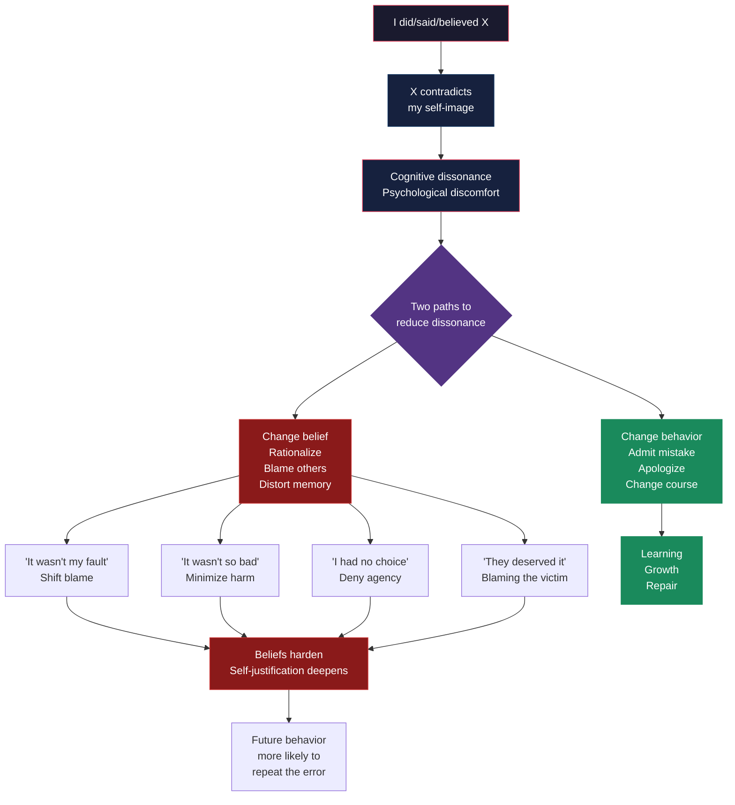

# Core Concepts

## Cognitive Dissonance: The Engine of Self-Justification

The book is built on Leon Festinger's theory of cognitive dissonance — the single most influential theory in social psychology. Dissonance is the mental discomfort that arises when a person holds two contradictory cognitions, especially when one of them is "I am a good, smart, competent person" and the other is "I just did something stupid, cruel, or irrational." People are driven to reduce this discomfort, and the easiest path is usually to change their beliefs to fit their behavior rather than the reverse.

Festinger discovered the phenomenon by infiltrating a doomsday cult whose leader predicted a flood that would destroy the world on December 21, 1954. When the prophecy failed, the believers did not admit error — they became more fervent, convinced that their faith had saved the world. The dissonance between "I believed a false prophecy" and "I am a rational person" was so painful that they invented a new belief: God had spared the planet because of their devotion.

The authors trace this mechanism through dozens of case studies. The $1/$20 experiment is the classic: participants who performed a boring task were paid either $1 or $20 to tell the next participant it was fun. Those paid $20 had sufficient external justification (the money) and experienced little dissonance. Those paid $1 had insufficient external justification — so they changed their internal belief, convincing themselves the task was actually enjoyable. The brain resolves the inconsistency by rewriting its own attitudes.

---

## The Self-Justification Cycle

Self-justification is not a single act but a cycle that deepens over time. Each rationalization commits us more strongly to the position we are defending, which makes future error admissions more costly, which requires further rationalization.

The cycle follows a predictable pattern:

1. **Mistake** — You do something that conflicts with your values.
2. **Dissonance** — You feel the discomfort of inconsistency.
3. **Justification** — You construct a reason that preserves your self-image ("I had no choice," "It wasn't really wrong," "They started it").
4. **Commitment** — The justification commits you to a narrative. Having publicly or privately defended your action, you now have a stake in that narrative being true.
5. **Escalation** — The next time a similar situation arises, you are more likely to repeat the behavior, because the first justification laid the groundwork.
6. **Entrenchment** — Over time, the self-justification becomes automatic and unconscious. You no longer see the behavior as a mistake at all.

The cycle explains why small ethical compromises escalate into major violations, why bad relationships get worse, and why institutions that cannot admit error become increasingly dysfunctional.

---

## The Pyramid of Choice

One of the book's most memorable metaphors: the Pyramid of Choice illustrates how small initial decisions, each easily justified, lead to outcomes that no one would have chosen at the outset.

At the wide base of the pyramid, many options are available. Each decision narrows the range of future choices. By the time you reach the narrow top, the path seems inevitable — the only option consistent with all the choices that came before.

**Marriage example**: A couple has a minor disagreement. One partner makes a sarcastic remark. The remark goes unmentioned. The next disagreement includes more sarcasm. Soon, the default mode of communication is contempt. Neither partner consciously chose to build a contemptuous relationship; each sarcastic remark was justified in the moment ("They deserved it," "I was just joking"). But the cumulative effect is devastating.

**Legal example**: A detective is convinced of a suspect's guilt. He interprets the suspect's nervousness as evidence of deception. He asks leading questions. He ignores evidence that points to a different perpetrator. He becomes invested in the confession. By the time the case goes to trial, tunnel vision has replaced objective investigation. The detective doesn't see himself as biased — he sees himself as having solved the case.

**The key insight**: At the top of the pyramid, people genuinely believe they had no alternative. But the constraints they feel are largely self-created by choices they made — and justified — along the way.

---

## Confirmation Bias

Confirmation bias — the tendency to seek, interpret, and remember information that confirms what we already believe — is dissonance theory's handmaiden. Once we have taken a position, we selectively attend to evidence that supports it and dismiss evidence that challenges it.

The book offers a striking demonstration: in one study, people who favored or opposed the death penalty were shown two studies — one supporting the deterrence effect and one refuting it. Both sides found the study that supported their view to be more methodologically sound and the opposing study to be flawed. Each side rated *identical* methodological details differently depending on whose conclusion they favored.

Confirmation bias is especially dangerous because it does not feel like bias. From the inside, it feels like careful evaluation. We are not aware that we are applying different standards to evidence we like versus evidence we don't.

---

## Blind Spot Bias

The blind spot bias is the inability to recognize our own cognitive biases while easily spotting them in others. It is perhaps the most important bias of all, because it prevents us from correcting our other biases.

Research cited in the book: when people are asked to rate their own objectivity compared to others, a large majority rate themselves as more objective than the average person — which is statistically impossible. When presented with evidence that they are biased, they acknowledge the bias could exist in principle but insist it did not affect them in *this particular case*.

The blind spot is not modesty or dishonesty. It is a structural feature of cognition: our biases operate below awareness, so we cannot introspectively detect them. We can only infer them from patterns we do not want to see.

---

## Memory Distortion

Chapter 3 is a tour de force on the reconstructive nature of memory. The authors argue that memory is not a recording device but a self-justifying historian, constantly rewriting the past to make it consistent with our present self-image.

Key research:
- **The misinformation effect** (Elizabeth Loftus): After witnessing an event, people who are exposed to misleading information will incorporate it into their memory. The suggestion that a car "smashed into" another produces higher speed estimates and more memories of broken glass than the word "hit."
- **False memories**: In controlled studies, researchers have implanted entirely false memories — of getting lost in a shopping mall, of meeting Bugs Bunny at Disneyland (impossible because Bugs is a Warner Bros. character) — in a significant minority of participants.
- **Autobiographical distortion**: People remember their past attitudes as more consistent with their current attitudes than they actually were. Smokers who quit remember being more opposed to smoking than they were; voters who supported a losing candidate remember having doubts they never had.

The implication is unsettling: we cannot trust our own memories about events that threaten our self-image. The more painful the memory, the more likely we are to have revised it.

---

## Commitment and Consistency Traps

Drawing on Cialdini's research and the broader dissonance literature, the book shows how commitment — once made — creates pressure for consistency. Public commitments are the most powerful: having announced a position, we feel compelled to act in accordance with it, even when evidence suggests we should change course.

The trap is that consistency is socially valued. We praise people who "stick to their principles" and criticize those who "flip-flop." This creates a powerful incentive to maintain a position beyond the point where it is justified by evidence.

**Practical example**: In police interrogations, suspects who initially proclaim their innocence but then provide a false confession face a special kind of torture: the interrogator uses their initial denial as evidence of deception ("If you were really innocent, you wouldn't have changed your story"), creating a double bind. Either the suspect is guilty (the confession is true) or they are a liar (the initial denial was false). The interrogator's commitment to the guilty narrative makes it impossible for them to see the confession as coerced.

---

## Applications by Domain

### Marriage
Self-justification is love's assassin. Partners who cannot admit fault transform every disagreement into a contest of who is right. The blame escalates, each partner's narrative of the relationship diverges, and what began as a minor conflict becomes an unbridgeable chasm. The antidote: genuine apology — not "I'm sorry you feel that way" but "I was wrong and here is what I will do differently."

### Law
The criminal justice system is a factory for self-justification. Prosecutors who convict innocent people, police who secure false confessions, forensic analysts who overstate their certainty — all are trapped in the same dissonance-driven cycle. The very structure of the adversarial system, which rewards winning over truth-seeking, amplifies the problem. The book documents dozens of exoneration cases (long before the Innocence Project made them widely known).

### Medicine
Doctors who misdiagnose patients face a choice: admit the error and learn from it, or rationalize. The rationalization path is disturbingly common: the patient was noncompliant, the symptoms were atypical, the test results were ambiguous. The culture of medicine, with its emphasis on confidence and authority, makes error admission especially difficult. The chapter draws on the work of Kathryn Schulz (Being Wrong) and Atul Gawande to show how some medical institutions have created error-reporting systems that bypass the self-justification impulse.

### Politics
Dissonance theory predicts that leaders who initiate disastrous policies will escalate their commitment rather than admit failure. The Bay of Pigs invasion, the Vietnam War, the Iraq War — each was sustained by leaders who could not bear the psychological cost of admitting they had made a terrible mistake. The 2020 edition extends this analysis to the Trump era, examining how cognitive dissonance turned political opponents into enemies.

### Science
Scientists are supposed to be objective seekers of truth, but they are human. The book shows how researchers become committed to their theories and resistant to disconfirming evidence. The replication crisis in psychology is, in part, a crisis of self-justification: laboratories that cannot reproduce findings may resist the implication that their original results were flawed.

---

## Key Lessons

1. **Self-justification is not the same as lying.** Liars know they are lying. Self-justifiers genuinely believe their rationalizations. That is what makes them so difficult to dislodge.

2. **The inability to admit error is the enemy of learning.** You cannot learn from a mistake you will not admit you made. The organizations, relationships, and individuals that tolerate the discomfort of being wrong are the ones that improve.

3. **Small justifications enable large errors.** The Pyramid of Choice shows that major ethical violations rarely begin as major. They begin as small compromises that are easy to justify. By the time the actor reaches the top, they have lost the perspective to see the bottom.

4. **Blind spot bias makes correction self-defeating.** You cannot introspect your way out of bias because the bias prevents you from seeing it. You need external feedback systems: trusted critics, institutional checks, pre-mortems.

5. **Genuine apology is the opposite of self-justification.** It requires acknowledging responsibility without excuses, understanding the harm from the other's perspective, and committing to change. Most apologies are actually self-justifications in disguise.

6. **Cognitive dissonance is not inherently bad.** It is the alarm system that signals inconsistency. The problem is not the alarm but our habitual response: silencing it with rationalization rather than addressing the underlying inconsistency through change.

---

## Practical Applications

**For Individuals**: When you feel defensive, pause. Ask yourself: "Am I defending a position or seeking the truth?" The fact that you can ask the question is the first step toward answering it honestly.

**For Couples**: The authors recommend a simple protocol during conflict: before you can state your own position, you must restate your partner's position to their satisfaction. This forces you to understand before you justify.

**For Organizations**: Create systems that make it safe to admit error. Pre-mortems (imagine the project has failed; what went wrong?) bypass the self-justification cycle because the failure is hypothetical. Post-mortems should focus on systemic causes, not individual blame.

**For the Legal System**: Blind lineup procedures, sequential rather than simultaneous witness identification, and mandatory disclosure of exculpatory evidence are structural fixes that reduce the opportunity for tunnel vision.

**For Anyone in a Disagreement**: Before arguing, ask: "What evidence would change my mind?" If the answer is "nothing," you are not engaged in reasoning — you are engaged in self-justification.
