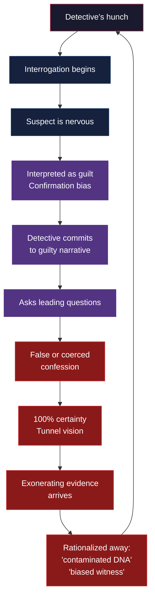
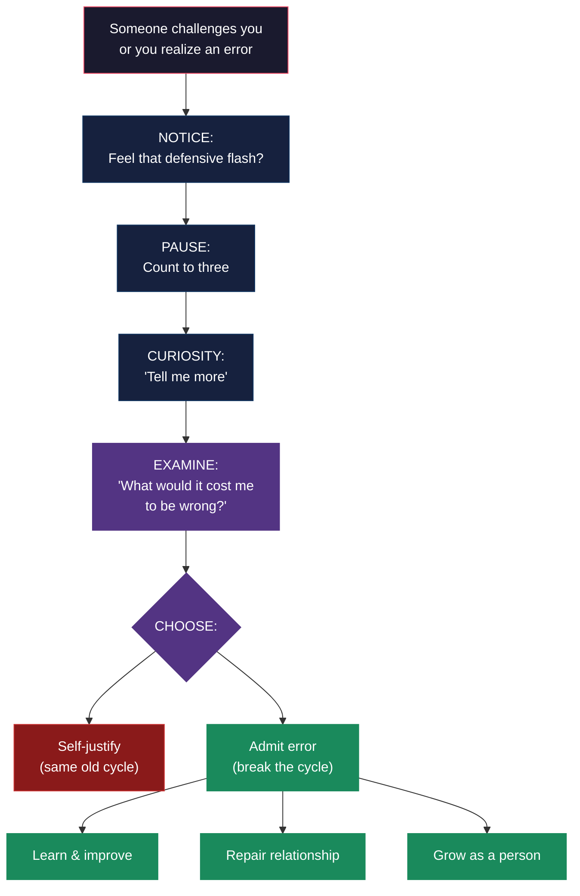

## 🎙️ Introduction

**Host**: Welcome to *Cognitive Blindspots*. I'm your host, and today I'm joined by Dr. Sarah Chen, a clinical psychologist who specializes in couples therapy and conflict resolution, and Marcus Webb, an investigative journalist who has covered wrongful convictions for a decade. We're talking about *Mistakes Were Made (But Not by Me)* by Carol Tavris and Elliot Aronson — a book that argues our inability to admit error is not a character flaw but a feature of how the brain works. Sarah, Marcus, welcome.

**Sarah**: Thanks for having me.

**Marcus**: Happy to be here.

**Host**: Let me start with a provocative claim from the book. The authors say: "Self-justification is not the same as lying. Liars know they are lying. Self-justifiers genuinely believe their rationalizations." Marcus, you've spent years investigating prosecutors who put innocent people behind bars. Do you see this in your work?

**Marcus**: Every single case. I've sat across from prosecutors who convicted someone who was later exonerated by DNA evidence — and they *still* believe the person was guilty. They have a narrative: the DNA was contaminated, the witness was coached, the defense attorney was better than the prosecution. They'll find any explanation except "I made a mistake." And they're not lying. They genuinely believe it.

**Sarah**: And that's the dissonance mechanism in action. To admit "I convicted an innocent person" would mean "I am a prosecutor who destroyed someone's life" — and that conflicts with "I am a good person who serves justice." The brain cannot hold both, so it revises one of them. It's almost never the self-concept.

**Host**: That sounds like something extreme — reserved for people in high-stakes jobs. But the book argues it's universal.

**Sarah**: It's universal. I see it in couples therapy every day. A couple comes in, and they've been fighting for years. Each partner has a detailed narrative of the relationship — and the narratives don't match. And each partner is *certain* their version is correct. They're not lying. They've genuinely reconstructed their history to make themselves the injured party and their partner the aggressor.

**Marcus**: Same pattern in journalism. I've been in newsrooms where editors committed to a story angle and then twisted every subsequent fact to fit it. They don't see it as twisting — they see it as "adding context."

---

## 🧠 Recognizing Self-Justification in Ourselves vs Others

**Host**: The book has this devastating finding: the blind spot bias. We can see self-justification in everyone except ourselves. How do you actually catch yourself doing it?

**Sarah**: The first sign is emotional, not cognitive. You feel *defensive*. That tightening in your chest when someone suggests you might be wrong. If you feel the urge to explain, justify, or minimize before you've even fully heard the criticism, that's dissonance. The key is to notice that feeling and name it: "I'm in justification mode right now."

**Marcus**: For me, it's the question the authors recommend: "What evidence would change my mind?" If the answer is nothing — if there is literally no evidence that could convince me I'm wrong — then I'm not reasoning. I'm justifying. That's a hard question to ask yourself honestly.

**Host**: Sarah, you use this in couples therapy. How do you get partners to see their own self-justification without triggering more defensiveness?

**Sarah**: I don't point it out directly. That backfires — they just feel attacked and justify harder. Instead, I use a technique from the book: I ask each partner to restate the other's position before stating their own. To restate it accurately enough that the other person says "yes, that's what I mean." The act of restating forces you to temporarily step outside your own narrative. It doesn't always work, but when it does, it's powerful.

**Marcus**: We do something similar in interviews. Before I challenge a source's account, I summarize their account back to them and ask: "Did I get that right?" It disarms them, and it forces me to actually understand their perspective before I critique it.

---

## 🔄 The Self-Justification Cycle in Real Life

**Host**: Let's talk about the cycle. The book describes self-justification as a loop: mistake, dissonance, justification, commitment, escalation. Marcus, walk me through this in a criminal investigation.

**Marcus**: It starts small. A detective gets a hunch about a suspect. He brings the suspect in for questioning. The suspect is nervous — which proves nothing, but the detective interprets it as guilt. He asks leading questions. The suspect gives inconsistent answers — as anyone would under pressure. The detective takes that as confirmation. By the time the real evidence comes in — alibi witnesses, DNA — the detective has already committed to the narrative. He can't back down because backing down means admitting that he interrogated, arrested, and charged an innocent person.

**Sarah**: The same cycle happens in relationships. A wife makes a sarcastic comment. She justifies it in the moment: "He was being insensitive." The next time, she's more likely to be sarcastic because the first comment normalized it. He retaliates. She justifies harder. Six years later, they're in my office and neither can remember who started it — because both have reconstructed a history where they are the victim.

**Host**: And neither sees their own role in the escalation?

**Sarah**: Exactly. The Pyramid of Choice. Each step was small and justified. But the cumulative effect is a relationship neither of them would have chosen at the beginning.

---

## 💪 Practical Tools

**Host**: The book is great at diagnosis, thinner on prescription. What practical tools do you actually use?

**Sarah**: The pre-mortem. Before making a significant decision, imagine it has failed catastrophically. Now explain why. This technique bypasses self-justification because the failure hasn't happened yet — there's nothing to defend. It surfaces assumptions and blind spots that post-mortems never catch because by then, everyone is busy defending their choices.

**Marcus**: I do a version of this with sources. Before publishing a story, I ask: "If I'm wrong about this, what would the evidence against my conclusion look like?" Then I try to find that evidence. If I can't find it, or if I find it and it changes the story, I've done my job.

**Host**: Sarah, what about in couples therapy specifically?

**Sarah**: I teach partners a three-step apology protocol, adapted from the book's discussion. Step one: "I was wrong" — no qualifiers, no "but." Step two: "Here is what I did that was harmful" — specific, not generic. Step three: "Here is what I will do differently." Most apologies are actually self-justifications disguised as apologies. "I'm sorry you feel that way" is not an apology — it's blame. "I'm sorry I said that; it was hurtful and I will not say it again" is an apology.

**Host**: Marcus, how do you apply this in your own reporting?

**Marcus**: I keep what I call a "wrong list." Every story I publish, I write down one thing I might have gotten wrong — an assumption I made, a source I trusted too much, an angle I pursued too aggressively. When the story runs, I check back. The list trains you to notice the gap between your certainty and your accuracy. It's humiliating at first — you see how often you were overconfident — but it's the only way to get better.

---

## 🌍 Systemic vs Individual Self-Justification

**Host**: The book focuses on individual psychology. But aren't whole systems designed to protect actors from admitting error?

**Marcus**: Absolutely. The adversarial legal system is a self-justification machine. Prosecutors are evaluated on conviction rates. Judges are evaluated on whether they are overturned. Police are evaluated on arrests. Every incentive points toward defending your initial judgment, not revisiting it. The Innocence Project has exonerated hundreds of people, and in almost every case, the original prosecutors and detectives resisted the re-investigation. Not because they are bad people — because the system rewarded them for being certain and punishes them for admitting doubt.

**Sarah**: Same in medicine. Doctors who make diagnostic errors face malpractice suits, board reviews, and reputational damage. The rational response — from a purely self-protective standpoint — is to blame the patient, the disease, or the system. Some hospitals have created "disclosure and apology" programs that protect doctors who admit error from litigation, and the results are striking: patients are less likely to sue when doctors are honest, and doctors are less likely to repeat mistakes.

**Host**: So the solution is structural, not just individual?

**Sarah**: Both. The individual skills matter — noticing defensiveness, practicing apology, seeking disconfirming evidence. But without structures that make error admission safe, those skills are fighting against the current. The book is at its best when it shows how the same psychological mechanism plays out across different systems. The weakness is that it leaves readers knowing they need to change but not always knowing how.

---

## 🚀 Breaking the Cycle

**Host**: If a listener wants to start catching their own self-justification tomorrow, what's the single most important thing?

**Sarah**: The next time someone tells you that you made a mistake, pause before responding. Count to three. Don't explain. Don't justify. Just say: "Tell me more." That three-second pause breaks the automatic defense cycle. The rest follows.

**Marcus**: For me, it's the question: "What would it cost me to be wrong about this?" Not in terms of money — in terms of identity. What would it mean about who I am? If the answer is "it would mean I'm not as smart/good/perceptive as I think," then I know I'm in high-risk territory for self-justification.

**Sarah**: And if you want to do the hardest thing: apologize — really apologize — to someone you've wronged. The book is right that genuine apology is the opposite of self-justification. It feels terrible. It also changes everything.

**Host**: Sarah, Marcus, thank you. The book is *Mistakes Were Made (But Not by Me)* by Carol Tavris and Elliot Aronson. Three takeaways: notice your defensiveness, pre-mortem your decisions, and learn to apologize without the "but."

