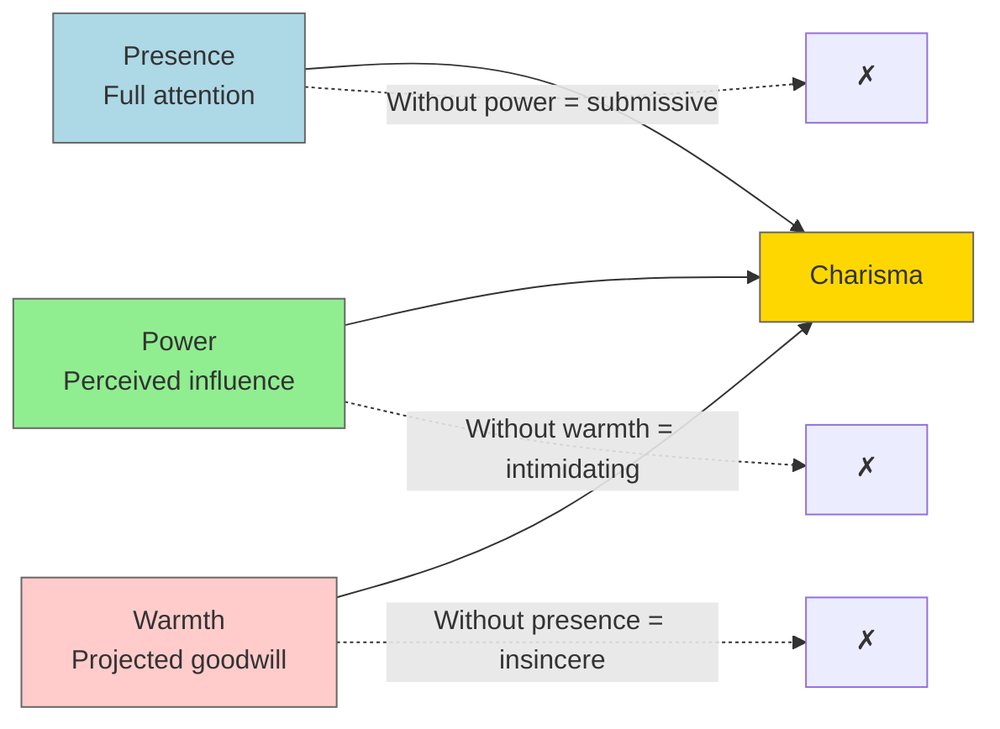
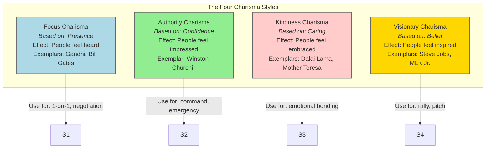
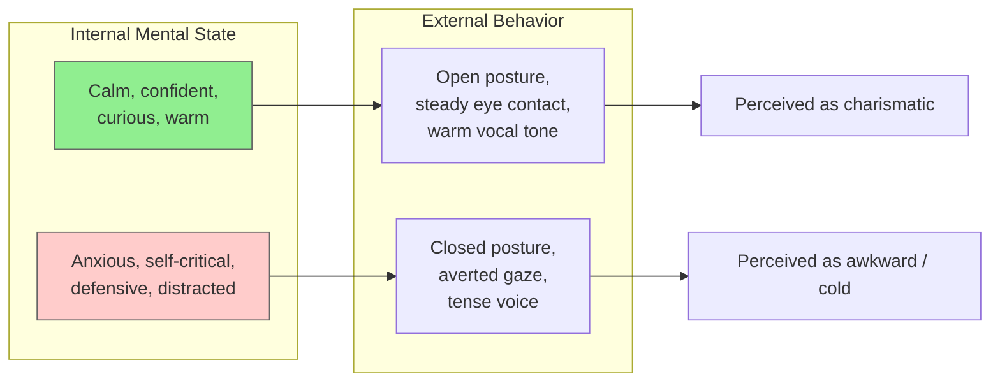
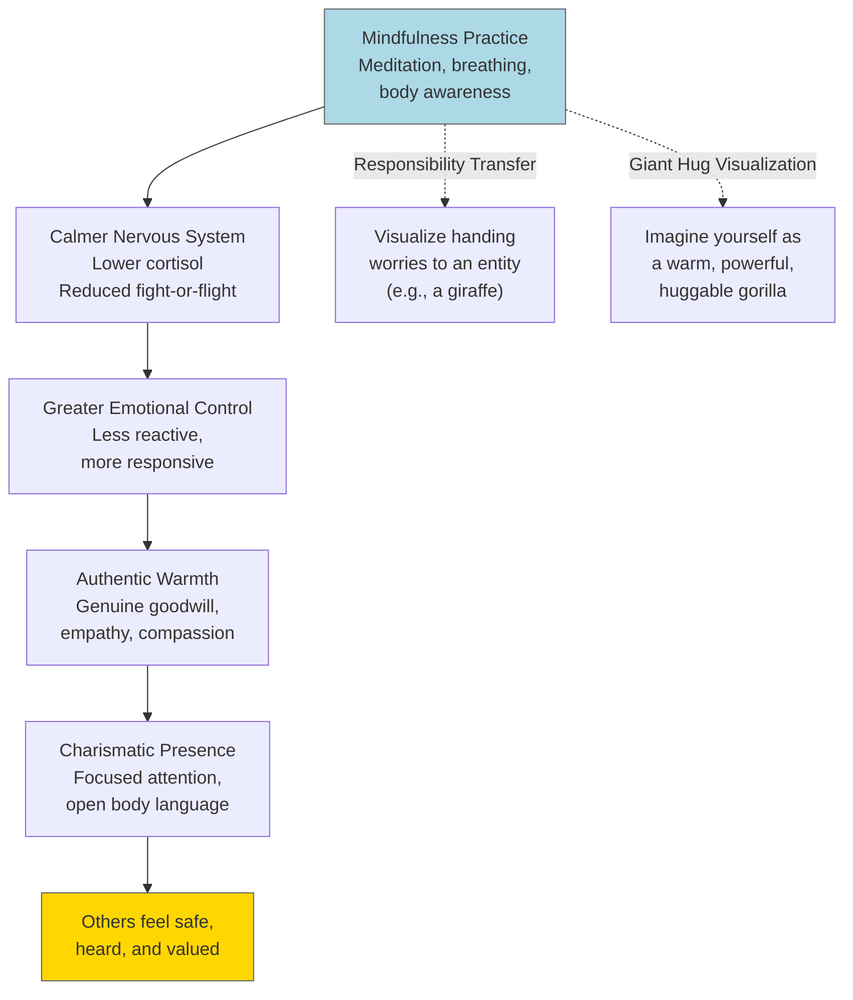
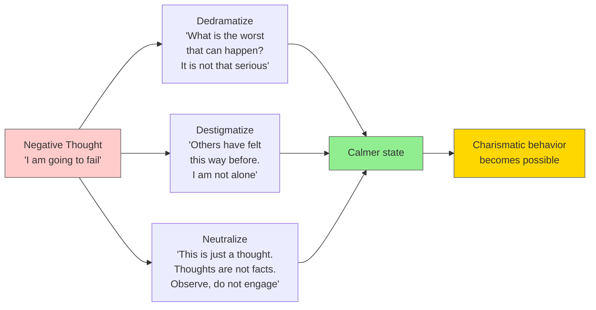
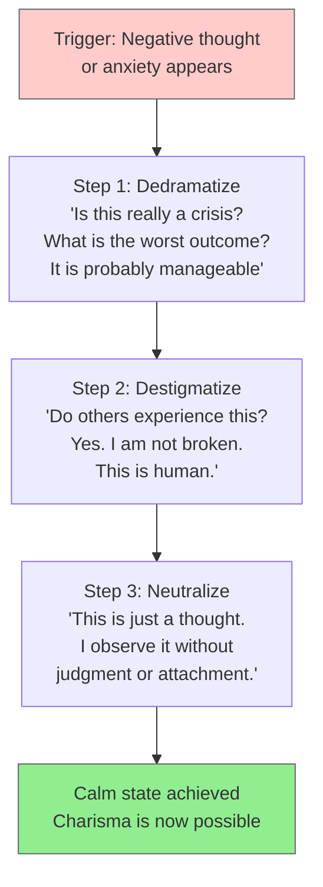
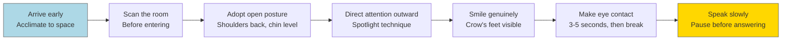

## Diagrams

### The Charisma Formula

### The Four Charisma Styles

### Internal State → External Behavior

### Mindfulness → Charisma Pathway

### The Three Mental Techniques for Negative Thoughts

---

## Chapter Breakdown

Part I — The Charisma Myth (Chapters 1–4)

**Chapter 1: The Charisma Myth**

Cabane introduces the central thesis: charisma is not an innate, mystical
gift. It is a set of learnable behaviors that anyone can practice. She
recounts how Marilyn Monroe could turn her charisma on and off at will —
proving that charisma is a switch, not a fixed trait. Steve Jobs is held up
as the archetypal example: awkward and clumsy in early Apple appearances,
mesmerizingly charismatic by the iPhone era. The chapter previews the three
components — presence, power, warmth — and the four charisma styles.

**Chapter 2: The Behaviors of Charisma**

Deep dive into the three components. Presence means being completely in the
moment — your attention never wanders. Power is the perception that you can
affect the world (through status, competence, wealth, or strength). Warmth
is the projection of goodwill — the sense that you have others' best
interests at heart. Cabane explains that humans evolved to scan for these
three cues because they signaled whether someone could help or harm us.
When someone projects all three, our brains instinctively grant them
influence.

**Chapter 3: The Obstacles to Charisma**

The biggest obstacle to charisma is internal: the brain's stress response.
Self-criticism, social anxiety, imposter syndrome, and rumination trigger
fight-or-flight, which tenses the body and narrows attention. In this state,
charismatic behavior is impossible. Cabane introduces her three-part system
for neutralizing negative thoughts: dedramatize (lower the stakes),
destigmatize (normalize the experience), and neutralize (observe without
attachment). Physical discomfort also blocks charisma — hunger, fatigue,
and pain should be addressed before any high-stakes interaction.

**Chapter 4: The Internal State**

The key insight: you cannot fake charisma. Your internal state leaks through
micro-expressions, tone of voice, and body language. Humans are remarkably
accurate at detecting incongruence. The solution is not to pretend, but to
genuinely shift your internal state. Visualization is the primary tool.
Cabane introduces the Responsibility Transfer (imagine handing your worries
to an entity) and the Giant Hug visualization (imagine yourself as a large,
warm, powerful gorilla). These techniques prime the brain to produce calm
confidence, which the body then mirrors.

Part II — The Charisma Tools (Chapters 5–9)

**Chapter 5: Overcoming Discomfort**

Physical and mental discomfort directly impair charisma. Cabane provides
specific techniques: power breathing (slow, deep exhalations to calm the
nervous system), power posing (adopting expansive posture to raise
testosterone and lower cortisol), and the Rewind Technique (mentally replay
awkward interactions with positive outcomes). She emphasizes that preparation
includes managing your physical state — eat well, sleep well, and arrive
early to acclimate to the environment.

**Chapter 6: The Charisma Mindset**

Three key mindsets for charisma: gratitude, goodwill, and compassion.
Gratitude softens body language and lowers heart rate. Goodwill — genuinely
wishing others well — creates the micro-expressions of warmth. Compassion
(empathy plus goodwill) is the deepest source of charismatic connection.
Cabane introduces a compassion meditation exercise: visualize someone you
care about, extend warm feelings to them, then gradually extend those same
feelings to neutral people and even difficult people.

**Chapter 7: Developing Presence**

Presence is the most critical component and the hardest to fake. Cabane
offers mindfulness exercises: focusing on ambient sounds, then on the
breath, then on physical sensations (like the toes). The goal is to train
the attention to return to the present moment when it wanders. In
conversations, presence means resisting the urge to plan what to say next.
It means letting silence exist. Cabane suggests a daily practice: spend
two minutes fully present with one person, giving them your complete,
uninterrupted attention.

**Chapter 8: Projecting Power and Warmth**

Power and warmth must be balanced. Cabane breaks down the nonverbal signals
for each:

Power signals: Tall posture, slow movements, controlled gestures, steady eye
contact (but not staring), relaxed shoulders, chin parallel to the ground,
vocal variety with downward inflection.

Warmth signals: Genuine smile (reaches the eyes — crow's feet), open palms,
head tilt (exposes neck, signals trust), nodding, leaning in, softening
the voice.

The most powerful combination: high power + high warmth. This signals "I
can help you and I want to." Cabane recommends practicing in front of a
mirror or recording yourself on video.

**Chapter 9: Vocal Charisma**

The voice is a primary instrument of charisma. Cabane covers: speaking
slowly (pauses project confidence), lower pitch (deeper voices are perceived
as more authoritative), varied pace and volume (monotone kills charisma),
and the power of silence. She introduces "charismatic listening": never
interrupt, pause two seconds before responding, let your face show you have
absorbed what was said.

Part III — The Charismatic Life (Chapters 10–13)

**Chapter 10: Charismatic First Impressions**

First impressions happen in seconds. People judge warmth and power
instantly. Cabane advises: always arrive early to acclimate, scan the room
before entering, adopt open body language before the interaction begins,
and use the "spotlight technique" — direct your attention outward toward
others rather than inward toward your own anxiety. First impressions are not
about impressing; they are about making others feel comfortable.

**Chapter 11: Speaking and Listening with Charisma**

Practical communication techniques. Speak in pictures and metaphors — the
brain processes imagery more deeply than abstraction. Make stories dramatic
and concise. When presenting, you are in the entertainment business. For
listening: let others talk as much as possible (the more they talk, the
more they like you), ask open-ended questions, and show genuine curiosity.
Cabane quotes Dale Carnegie: "You can make more friends in two months by
becoming truly interested in other people than you can in two years by
trying to get other people interested in you."

**Chapter 12: Handling Difficult People**

Different charisma styles for different difficult situations. Divide and
conquer: address individual resisters one-on-one rather than in a group.
Use kindness charisma to defuse hostility — warm body language paired with
firm boundaries. Use focus charisma to extract the real objection. Use
authority charisma when you need compliance. Cabane warns against
responding to attacks with counter-attacks; instead, validate the emotion,
then redirect.

**Chapter 13: The Charismatic Life**

The closing chapter addresses the risks and responsibilities of charisma.
Increased magnetism attracts attention — not all of it welcome. People may
project qualities onto you that you do not possess. You may face jealousy or
unwanted admiration. Cabane advises maintaining boundaries, staying grounded
through mindfulness practice, and using charisma ethically. She quotes
Marshall Goldsmith: charisma is an asset like intelligence — if you are
going in the right direction, you will get there faster. In the wrong
direction, charisma will also help you get there faster. It is not an
insurance policy against poor judgment.

---

## Frameworks

### The Three-Step Anti-Negativity Protocol

### The Charisma Styles Decision Matrix

| Situation | Recommended Style | Key Goal |
|---|---|---|
| One-on-one conversation | Focus | Make them feel heard |
| Negotiation | Focus + Authority | Gather intel, project strength |
| Team meeting | Visionary | Inspire alignment |
| Difficult feedback session | Kindness | Preserve relationship |
| Emergency / crisis | Authority | Get immediate compliance |
| Public keynote | Visionary + Warmth | Inspire + connect |
| Networking event | Focus + Kindness | Build rapport quickly |
| Mediating conflict | Kindness + Focus | Validate both sides |

### The First Impression Checklist

---

## Principles

1. **Charisma is behavioral, not biological.** Anyone can learn it with
   practice.

2. **Presence is primary.** Without it, power reads as cold and warmth reads
   as fake.

3. **Internal state determines external output.** Change the mind, and the
   body follows.

4. **Power and warmth must be balanced.** One without the other is
   ineffective.

5. **Your brain cannot distinguish imagination from reality.** Use
   visualization to program charismatic states.

6. **Discomfort kills charisma.** Address physical and mental discomfort
   before any important interaction.

7. **Negative thoughts are not facts.** Observe them, neutralize them, and
   return to presence.

8. **Match your charisma style to the situation.** One style does not fit
   all contexts.

9. **Listening is more charismatic than speaking.** The more you let others
   talk, the more magnetic you become.

10. **Charisma amplifies direction.** It is a tool — its ethical value
    depends on how it is used.

11. **Body language outweighs words.** Nonverbal signals are processed
    before language and carry more weight.

12. **Self-compassion is the foundation of warmth.** You cannot project
    genuine warmth to others if you are harsh with yourself.
