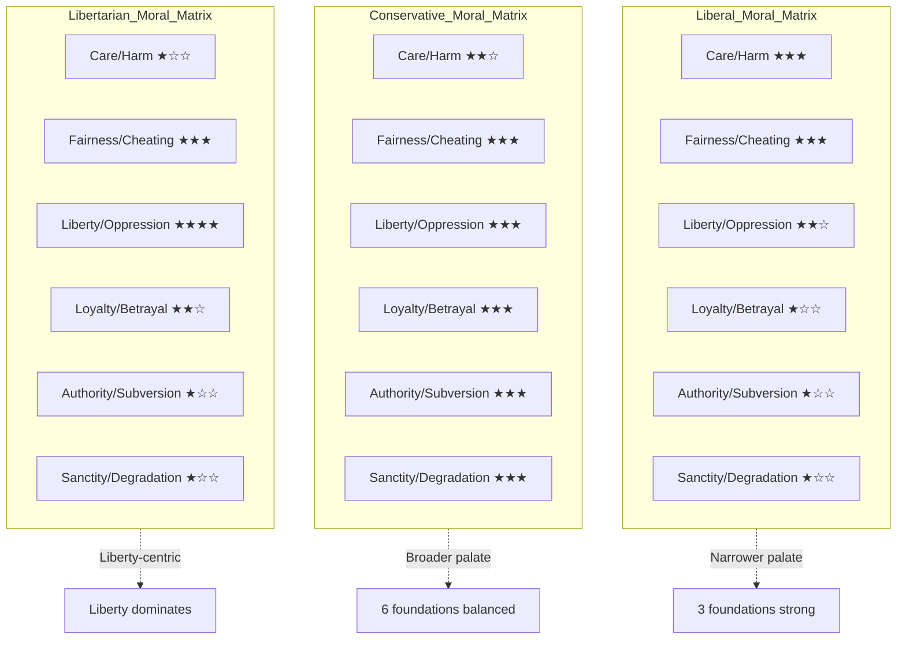

## The Three Principles

Haidt organizes the book around three principles:

**Principle 1: Intuitions come first, strategic reasoning second.**
**Principle 2: There's more to morality than harm and fairness.**
**Principle 3: Morality binds and blinds.**

Each principle anchors one part of the book and builds on the one before.

## Part 1: The Rider and the Elephant

### The Social Intuitionist Model

Haidt's Social Intuitionist Model (SIM) rejects the rationalist tradition — stretching from Plato through Kant to Lawrence Kohlberg — that moral judgment is produced by conscious reasoning. Instead, SIM proposes a six-pathway model where moral judgment is driven by fast, automatic intuitions:

1. **The intuitive judgment pathway**: A situation triggers an affective flash — disgust, anger, awe, compassion — which directly produces a moral judgment. Reasoning happens afterward, if at all.
2. **The post-hoc reasoning pathway**: The rider (conscious reasoning) generates justifications for the intuitive judgment. These are often confabulated and bear little relation to the actual causes of the judgment.
3. **The reasoned persuasion pathway**: One person's reasoning can trigger new intuitions in another person — but only in social contexts. Private reasoning rarely overrides one's own intuitions.
4. **The social persuasion pathway**: Friends and allies influence moral judgments by shaping which intuitions get triggered in the first place.
5. **The reasoned judgment pathway**: In rare cases, slow reasoning can override an initial intuition — usually when the intuition is weak and the reasoning is compelling and socially supported.
6. **The meta-cognition pathway**: People can reflect on their own judgment processes, but this is the rarest and least influential pathway.

The critical point: pathways 1 and 2 (intuition + rationalization) handle the vast majority of real-world moral judgments.

### Moral Dumbfounding

In Haidt's signature experiment, subjects hear a story about a brother and sister — Julie and Mark — who decide to have sex once, using two forms of birth control. It is consensual, no one is harmed, and they feel closer afterward. By every utilitarian metric, this is a victimless act.

Subjects almost unanimously call it wrong — but cannot say why. When pressed, they invent reasons (it might hurt their parents, inbreeding risks), but each reason is demolished by the story's design. Eventually they fall back on "I just know it's wrong." This is **moral dumbfounding**: a strong moral conviction combined with an inability to produce supporting reasons.

For Haidt, this is the cleanest evidence that moral judgment precedes — and often bypasses — reasoning entirely.

```mermaid
flowchart TD
    Trigger[Situation or Event] --> Intuition[Intuitive Flash<br>Emotion/Disgust/Awe]
    Intuition --> Judgment[Moral Judgment<br>"This is wrong/right"]
    Judgment --> Reasoning[Post-hoc Reasoning<br>The Rider explains]
    Reasoning --> Social[Social Persuasion<br>Convincing others]
    
    Trigger -.-> Reflection[Rare: Conscious Reflection]
    Reflection -.-> Override[Overrides Intuition<br>Only when intuition is weak]
    
    subgraph Rider
        Reasoning
        Reflection
    end
    
    subgraph Elephant
        Intuition
        Judgment
    end
    
    Social -.-> OthersIntuition[Triggers intuition in listeners]
    OthersIntuition -.-> Social
    
    Style Elephant fill:#e1d5e7,stroke:#8b5a9b
    Style Rider fill:#d5e8d4,stroke:#5a9b5a
    Style Trigger fill:#ffe6cc,stroke:#d79b5a
```

### The Rider and the Elephant

Haidt's master metaphor: the mind is divided between a rider (conscious reasoning) and an elephant (automatic intuition). The elephant is far larger and more powerful. The rider can guide the elephant, but only when the elephant does not want something else.

The rider evolved to serve the elephant, not to command it. It functions as a press secretary: after the elephant makes a decision, the rider constructs a plausible explanation. It also functions as a lawyer: when disagreements arise in groups, the rider argues for the elephant's position, attempting to persuade other riders — which in turn triggers intuitions in their elephants.

The rider can influence the elephant over the long term through training and habit-formation — like training a real elephant — but direct commands ("decide rationally") rarely work. You cannot override disgust by reasoning; you can only expose yourself gradually to the object of disgust until your intuitive response changes.

## Part 2: Moral Foundations Theory

### The Six Moral Taste Buds

Haidt proposes that the human mind comes pre-equipped with at least six modular moral intuitions — "taste buds of the righteous mind." Each foundation evolved to solve a specific adaptive challenge in human evolutionary history.

| Foundation | Adaptive Challenge | Original Trigger | Modern Triggers | Liberal | Conservative |
|---|---|---|---|---|---|
| **Care/Harm** | Protecting vulnerable offspring | Suffering, distress of kin | Baby seals, victims of oppression, animal cruelty | Strong | Moderate |
| **Fairness/Cheating** | Reaping benefits of cooperation without being exploited | Cheating, cooperation, deception | Proportionality vs. equality debates, free-riding | Strong (equality) | Strong (proportionality) |
| **Loyalty/Betrayal** | Forming and maintaining coalitions | Threat or challenge to the group | Flag, national pride, team sports, whistleblowing | Weak | Strong |
| **Authority/Subversion** | Forging beneficial relationships within hierarchies | Signs of rank and status | Leadership, tradition, respect for elders, law enforcement | Weak | Strong |
| **Sanctity/Degradation** | Avoiding pathogens and parasites | Waste products, spoiled food, disease signals | Religious rituals, purity ideals, disgust at certain acts | Weak | Strong |
| **Liberty/Oppression** | Resisting domination by alpha individuals | Signs of attempted domination | Anti-government sentiment, workers' rights, anti-colonialism | Strong (victim groups) | Strong (personal/ingroup) |

The key pattern: liberals in WEIRD (Western, Educated, Industrialized, Rich, Democratic) societies rely primarily on Care and Fairness (plus Liberty). Conservatives engage all six foundations more evenly. This is not a claim that one side is morally better — it is a descriptive claim about the different moral ecologies in which the two sides operate.

### The Liberty Foundation

The sixth foundation — Liberty/Oppression — was added in response to a puzzle: libertarians and economic conservatives felt their moral concerns were not captured by the original five. They care deeply about fairness, but in a different sense than liberals. For them, fairness means proportionality (you get what you earn, nobody gets a free ride) and, more fundamentally, the right to be free from coercion.

Haidt notes that Liberty may be a foundation with a unique trigger: reactance — the innate response to being physically or psychologically confined. This explains the emotional force of "Don't Tread on Me" for conservatives and of anti-corporate, anti-authoritarian protest for the left.

### The Moral Matrices

Different political cultures are like different cuisines: they use the same basic taste receptors but combine and emphasize them differently. A "moral matrix" is the full set of values, practices, norms, and institutions built on a particular configuration of the foundations.

Haidt identifies three major US moral matrices:

- **Liberal matrix**: Prioritizes Care and Fairness (with Liberty applied to oppressed groups). Suspicious of Loyalty, Authority, and Sanctity — these foundations are associated with oppression, hierarchy, and superstition.
- **Conservative matrix**: Engages all six foundations, with particular strength in Loyalty (patriotism, group cohesion), Authority (respect for tradition, law, and hierarchy), and Sanctity (religious values, purity concerns, the sacredness of the nation).
- **Libertarian matrix**: Centered on Liberty as the highest value. Fairness (as proportionality) is secondary. Skeptical of Authority, especially government. Less engaged with Care and Sanctity.



### The Conservative Advantage

In Chapter 8, Haidt makes his most provocative argument: because conservatives appeal to all six moral foundations, they hold an electoral advantage in complex, diverse societies. A political party that only speaks to Care and Fairness will struggle to connect with voters who also care about loyalty, authority, sanctity, and liberty.

This argument has been heavily criticized as normatively loaded (is "broader" really "better"?) and as potentially entrenching stereotypes. Haidt insists it is a descriptive observation: "the righteous mind was designed to be a multi-foundational instrument, and any political party that narrows its moral range will be at a disadvantage."

## Part 3: Morality Binds and Blinds

### We Are 90% Chimp, 10% Bee

The final part makes the case for multilevel selection in human evolution. Haidt argues that while individual selection produced selfishness (the "chimp" — 90% of our nature), group selection produced genuine groupishness (the "bee" — 10%). This is not altruism in the strict sense (self-sacrifice for strangers), but **parochial altruism** — willingness to cooperate with and sacrifice for ingroup members while competing with outgroups.

The critical evolutionary step was **shared intentionality** (Tomasello, 2009): the ability to share goals, attention, and intentions in a way that no other primate can. Two chimpanzees cannot carry a log together. Two humans can, and then can plan to do it again tomorrow, and then can build a ritual around it, and then can build a temple, a city, a civilization.

### The Hive Switch

Under certain conditions, humans enter a "hive state" — a mode of consciousness where self-interest dissolves and group identity dominates. Haidt identifies three reliable triggers:

1. **Awe in nature**: Vast, beautiful landscapes trigger feelings of smallness and connection. Subjects in awe of towering eucalyptus trees reported feeling less self-important and more part of something larger.
2. **Collective rituals**: Marching, dancing, singing together — especially synchronously — triggers endorphin release and social bonding. Military training, religious worship, and sports events all exploit this.
3. **Psychedelic drugs**: Psilocybin, LSD, and MDMA can produce profound experiences of ego dissolution and unity with others — experiences that often lead to lasting increases in openness and well-being.

Religions, Haidt argues, are cultural adaptations that master the hive switch. They combine awe-inspiring architecture, synchrony (chanting, kneeling, singing), sacred texts, and supernatural surveillance to create moral communities that can bind thousands of strangers into cooperative wholes.

### Political Tribalism

The binding mechanism explains why political disagreements are so venomous. When a moral matrix successfully binds a group, it simultaneously blinds its members:

- **Confirmation bias**: Within the matrix, evidence against the group's sacred values is filtered out.
- **Naive realism**: Each side believes it sees reality clearly and that the other side is biased or irrational.
- **Moral outrage**: Perceived violations of the group's sacred values trigger righteous anger, which reinforces ingroup bonds.
- **Narrative self-justification**: Each side constructs a heroic story of its own motives and a villainous story of the other side.

Haidt argues that the only defense against blinding is diversity — especially political diversity — in the institutions where knowledge is produced and disseminated. A university with only liberal professors will systematically miss questions and evidence that a conservative perspective would surface. The Heterodox Academy movement (which Haidt co-founded) advocates for viewpoint diversity in higher education on exactly these grounds.

### The Curse and Miracle of Cooperation

The paradox at the heart of the book: the same psychological machinery that enables the miracle of human cooperation — building cities, creating laws, developing vaccines, writing symphonies — also produces the curse of eternal division. We are designed for groupish righteousness. We cannot have one without the other.

## Key Lessons

- **Moral judgments are not conclusions; they are perceptions** — You do not reason your way to a moral position any more than you reason your way to liking chocolate. You feel it, and then you explain it. Understanding this is the first step toward moral humility.
- **To change minds, talk to the elephant, not the rider** — Data and logic rarely persuade. Stories, emotional appeals, trusted messengers, and social belonging do. If you want someone to change their moral position, change their social context first.
- **The moral foundations explain the appeal of both left and right** — Liberals are not confused; they are responding to genuine Care and Fairness intuitions. Conservatives are not bigoted; they are responding to genuine Loyalty, Authority, and Sanctity intuitions. Neither side is simply wrong.
- **Disgust is a moral emotion, not just a food emotion** — Disgust is central to the Sanctity foundation. When people express disgust at an act (homosexuality, flag-burning, eating meat), they are making a moral claim that should not be dismissed as mere irrationality.
- **Vitriol is a sign of moral binding, not evil** — When someone attacks you on political or religious grounds, they are enacting a deep evolutionary program: protecting their moral team. Understanding this does not require agreement, but it allows de-escalation.

## Practical Applications

| Domain | Application |
|---|---|
| Political communication | Frame arguments to engage multiple foundations, not just Care and Fairness. To persuade conservatives on climate, use Sanctity ("protecting God's creation") and Loyalty ("patriotic duty to preserve the country"). |
| Cross-partisan dialogue | Begin by acknowledging the moral intuitions of the other side. "I understand you value loyalty and authority. Let me show you how my position also upholds those values." |
| Education | Teach Moral Foundations Theory as a tool for understanding political disagreements. Encourage students to map the moral matrices of arguments they encounter. |
| Media literacy | Recognize that outrage is a business model. News outlets select stories that trigger Care (victims) and Sanctity (violations of the sacred) because those foundations drive engagement. |
| Activism | Avoid blaming and shaming the other side — this triggers their Loyalty foundation and hardens opposition. Instead, reframe your cause in terms their foundations recognize. |
| Product and platform design | Design social media algorithms to downrank content that triggers moral outrage. Consider alternative engagement metrics based on understanding rather than reaction. |
| Organizational leadership | Build teams with political diversity. A leadership team representing one moral matrix will make systematically wrong decisions about stakeholders who live in other matrices. |
| Personal relationships | When political disagreements threaten relationships, identify which foundation is being triggered. "You care about Loyalty, I care about Care — we're both moral, we're just emphasizing different taste buds." |
| Self-reflection | Examine your own moral matrix. Which foundations do you default to? Which do you dismiss? The dismissiveness is the blindness that Haidt warns about. Cultivate curiosity about the foundations you do not share. |

## Action Plan

1. **Map your moral matrix** — Take the Moral Foundations Questionnaire (yourmorals.org). See which foundations you weight most and least. Use this as a starting point for understanding your own political intuitions.
2. **Practice moral humility** — Before dismissing a position you disagree with, ask: "Which foundation might make this position seem right to a reasonable person?" Even if you still disagree, the act of imagining changes the tone.
3. **Seek out cross-matrix conversations** — Read opinion pieces from the other side seriously. Find a friend or colleague from a different moral matrix and discuss a contentious issue with the goal of understanding, not winning.
4. **Reframe, don't shame** — When advocating for a position, translate it into the moral language of your audience. Climate action as "protecting the purity of our air and water" (Sanctity) reaches voters that "saving the planet" (Care) misses.
5. **Beware of sacred values** — Identify your own sacred values (positions that are non-negotiable, beyond compromise). Notice when you feel moral outrage — it is a sign that a sacred value has been touched. That outrage is not a signal to attack; it is a signal to understand what matters most to you.
6. **Build diverse teams** — In any organization where decisions affect people with diverse moral matrices (which is every organization), ensure ideological diversity in decision-making roles. Homogeneous groups suffer from blinding — they cannot see what they are missing.
