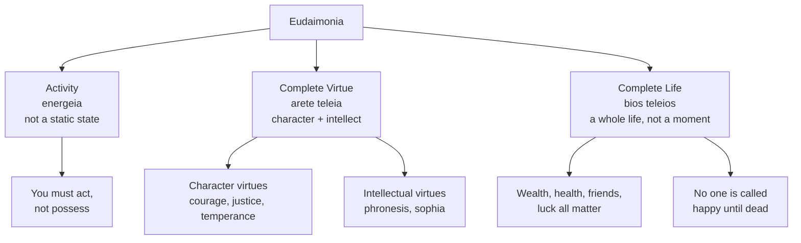
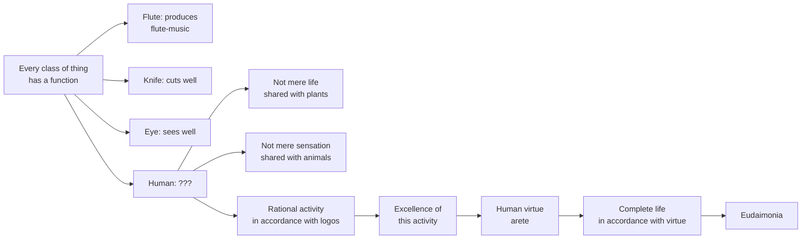
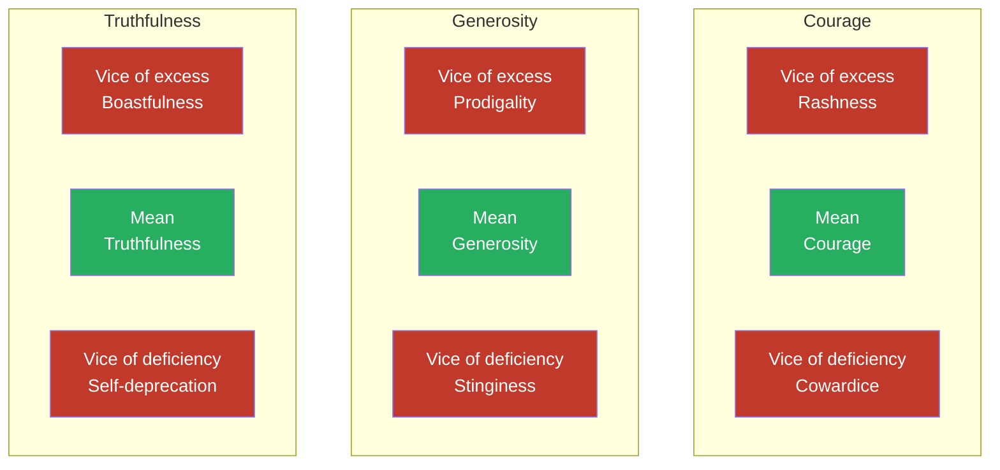
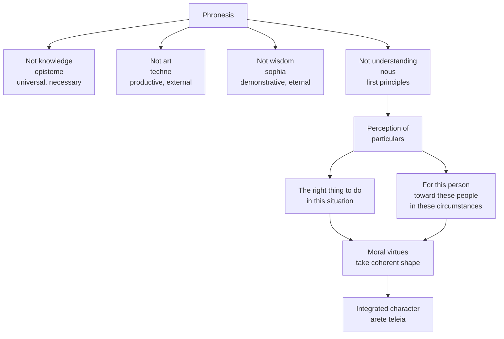
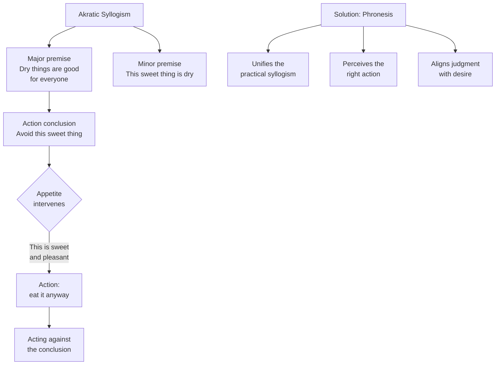
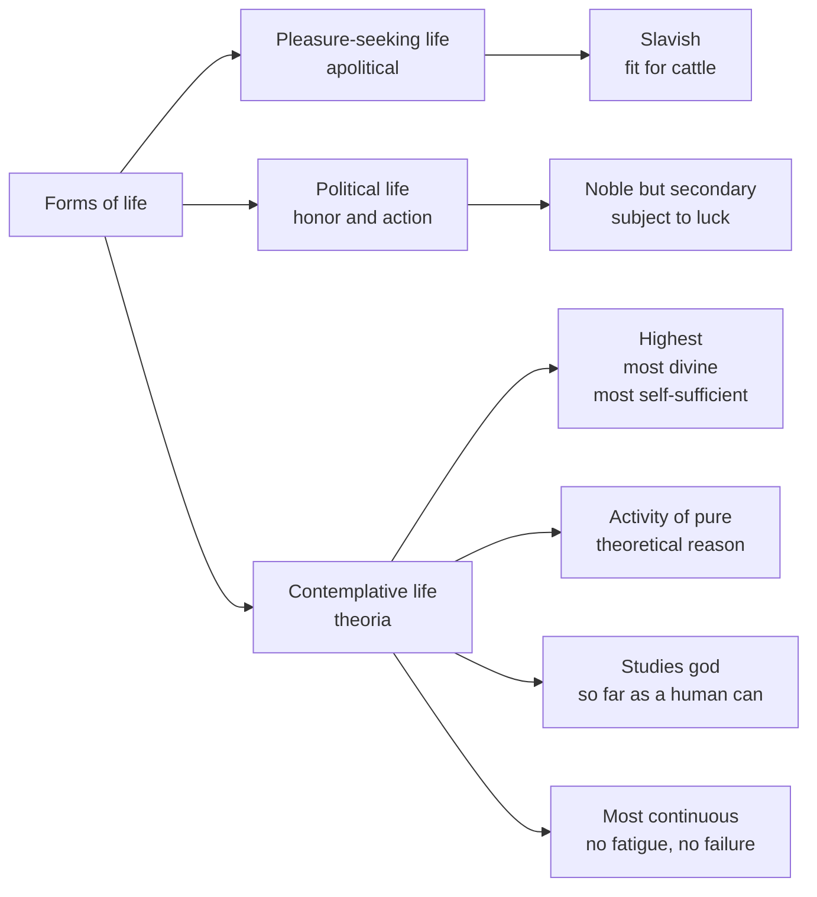

## The Highest Good: Eudaimonia

Aristotle opens the *Nicomachean Ethics* with a methodological
claim: every art, every inquiry, every action aims at some good.
The ends are nested — bridle-making serves horsemanship,
horsemanship serves strategy, strategy serves the *polis*. The
chain must terminate, or else human action is unintelligible. The
final end, pursued for its own sake, is the **highest good**.

He names it: *eudaimonia* — often translated "happiness," but the
word literally means "good spirit" or "flourishing." Aristotle
immediately says that it is *not* a feeling, not a mood, not a
pleasure. It is the activity of the soul in accordance with
complete virtue over a complete life. Three things in that
formula matter:

The famous last clause is not a morbid joke. It is part of the
analysis. Eudaimonia is a *life-form*; it cannot be assessed in
a moment. Solon had already said no living person is happy; the
claim is that good fortune and misfortune can still overtake
even the most virtuous. Hence the requirement of completeness.

---

## The Function Argument (Ergon)

How do we identify what is distinctively human? Aristotle's
move: every class of thing has a *function* (ergon), and the
*good* of that thing is to perform the function well. A good
flute is one that performs the function of a flute. What is the
function of a human being?

The argument is the engine of the book. Two points to grasp:

- **The function is not arbitrary.** It is what makes a thing
  *the kind of thing it is*. Cutting is what makes a knife a
  knife; rational activity is what makes a human a human. The
  good life is the life that performs this function *well*
- **The function is not independent of psychology.** The
  rational activity of a human is *characteristic activity
  expressed in character*. A knife can be good by design; a
  human becomes good by training the soul

The argument has been challenged for centuries. Kant thought
it rested on a category mistake. Modern biologists reject
teleology. But the *practical* form of the argument — that
human flourishing has a shape, that shape is excellence of
characteristic activity, and that excellence is built through
habit — survives every critique.

---

## The Doctrine of the Mean (Book II)

Aristotle's most famous and most misunderstood doctrine.
*Virtue is a mean between two vices — one of excess, one of
deficiency.* Courage is the mean between rashness and cowardice.
Generosity is the mean between prodigality and stinginess.
Truthfulness is the mean between boastfulness and
self-deprecation.

### What the Mean Is Not

- **It is not arithmetic.** The mean is *relative to us* —
  the right amount for *this* person, in *this* situation,
  given *this* degree of training. A fit person eats more
  than an unfit person; a brave soldier feels fear
  differently than a child
- **It is not a formula.** The mean is perceived in
  particulars. There is no rule that tells you whether this
  particular act of frankness is boastful, self-deprecating,
  or truthful
- **It is not a compromise.** The mean is not a half-truth
  between two opinions. It is a *peak* on a single
  dimension of character

### What the Mean Is

The mean describes the *state* of the virtuous person. He
neither feels the wrong things too much nor too little. He
acts at the right time, in the right way, toward the right
people, for the right reason. This is what the practically
wise person *perceives* — and what the un-virtuous person
does not.

### The Limit: Some Acts Are Always Wrong

Aristotle is explicit: there are *no* virtuous means of
committing adultery, theft, or murder. For these, the only
"mean" is the deficient one (never doing them) and the excess
(doing them). The doctrine applies to *character* — to the
dispositions from which we act — not to acts the law already
forbids.

---

## How Virtue Is Acquired: Habituation

The moral virtues are not innate. They are not taught like
mathematics. They are *acquired by repeated practice from
childhood*. We become just by doing just acts, temperate by
doing temperate acts, brave by doing brave acts.

> "It makes no small difference to be habituated this way or
> that way from early on. It makes a very great difference,
> or rather all the difference."

The mechanism is *analogy* with craft skills. To become a
builder, build. To become a flute-player, play. To become
brave, act bravely. The first acts are difficult; the acts
themselves *produce* the character that makes later acts
easy. The end is internal: a settled disposition (hexis) to
feel, choose, and act rightly.

This is one of Aristotle's most powerful and most
counter-modern ideas. It contradicts the Kantian fantasy of
the moral agent choosing virtue from nothing, the
nativist fantasy of virtue as inborn temperament, and the
behaviorist fantasy of virtue as external compliance. The
Aristotelian view is that virtue is *built into the
psyche* through a long apprenticeship of right action under
the right models.

---

## Phronesis: Practical Wisdom (Book VI)

If the moral virtues are states of character, what tells
the virtuous person where the mean lies? Aristotle's
answer: *phronēsis* — practical wisdom, the
intellectual virtue of *perception of the particular*.

Phronēsis is the eye of the soul. Without it, the moral
virtues become *isolated excellences* — a person can be
"courageous" in one act, foolhardy in the next, and
self-destructive in ten others. Phronēsis is what makes
the virtues *parts of a single life*.

Phronēsis is acquired by *experience*. A young person can
know what courage *is* — they can recite the definition
— but they cannot reliably *be* courageous in action.
This is why Aristotle famously says that young people
should not study ethics: they have not yet lived enough
to grasp its subject matter.

---

## Justice as Complete Virtue (Book V)

Aristotle gives the longest treatment to *justice*,
treating it as a kind of summary of all virtue directed
toward the other. The just person is the person who does
not just exercise his own virtues toward himself, but
exercises them *toward others* — who takes his share of
goods and burdens, who keeps his promises, who renders
to each what is due.

| Sense | Object | Distribution Rule |
|---|---|---|
| **Universal justice** | The whole of virtue toward others | Acts as a complete virtuous person would in dealings with others |
| **Particular justice — distributive** | Distribution of goods, honors, burdens | *Geometric* proportion: to each according to merit |
| **Particular justice — commutative** | Exchanges, transactions, contracts | *Arithmetic* proportion: equal treatment of equal parties |
| **Corrective justice** | Voluntary and involuntary transactions | Restores a balance disturbed by unjust gain or loss |
| **Reciprocal justice** | The economic engine of the *polis* | Money is the *measure* that allows exchange of unequal goods |
| **Political justice** | Justice *within* a just *polis* | Holds only among citizens of a true *politeia* |

Justice is the political virtue. It is what makes the
*polis* — the community in which humans can flourish —
possible. A community of unjust people is not a *polis*
in the full sense; it is a collection of mutually
predatory units.

---

## Voluntary Action and Responsibility (Book III)

Before analyzing virtue, Aristotle must determine when
praise and blame apply. He distinguishes:

| Category | Condition | Example |
|---|---|---|
| **Voluntary** | Done knowingly, not under compulsion | A brave soldier choosing to stand |
| **Involuntary** | Done in ignorance of what one is doing, or under genuine compulsion | Striking a friend thinking him an enemy |
| **Nonvoluntary** | Done in ignorance but with some responsibility | Acting in drunkenness or rage |

The analysis is dense and has been worked over for
centuries. The crucial point: Aristotle rejects the
Socratic claim that all error is involuntary. People
*do* know what they are doing and choose the bad
nonetheless. They are not excused by appetite or
ignorance; they have trained themselves to be the kind
of person who does such things.

The implications are radical. A person raised in
cowardice from youth, who has performed cowardly acts
all his life, is responsible for that cowardice —
because each act, at the time, was voluntary. Habit is
not an excuse. Habit is destiny — and you built it.

---

## Akrasia: Weakness of Will (Book VII)

Socrates had argued that no one errs knowingly. Aristotle
disagrees: we *observe* people acting against their own
better judgment, and we must account for the phenomenon.
He calls it *akrasia* (incontinence, weakness of will).

The akratic is not a *bad* person. He is a person whose
*practical syllogism* has been disrupted. Appetite overrides
the conclusion before action issues. Aristotle distinguishes
several forms (impulsiveness, weakness proper), and a small
class of people (the *intemperate*) who are so corrupted
that they reason from bad premises entirely. Akrasia is
curable; intemperance is not easily so. Phronēsis is the
remedy — the perception that aligns judgment with desire
in a single integrated response.

---

## The Three Types of Friendship (Books VIII–IX)

Aristotle's most extensive treatment of *philia* covers
far more than the English word "friendship." Philia is
*reciprocal goodwill between people who recognize each
other as goods for one another* — a structural feature of
the good life.

| Type | Basis | Longevity | Mutual Recognition |
|---|---|---|---|
| **Utility** | Each finds the other useful | As long as the use lasts | Low — friends of use, not of each other |
| **Pleasure** | Each finds the other pleasant | As long as the pleasure lasts | Low — friends of pleasure, not of each other |
| **Character** | Each loves the other for their virtuous character | Lifelong, ideally | High — each loves the other as the person they are |

Only the third is true friendship. Utility and pleasure
friends are friends of the *use* or *pleasure* they
provide. They can be replaced when the use ends. Character
friends cannot. The lover and the beloved, the parent and
the adult child, the lifelong companion — these are
*philia* in the strict sense.

Aristotle's famous definition: "the friend is another
self" (*allos autos*). Friendship is necessary for the
good life; the prosperous man who has no friends has not
*exercised* his capacity for recognition of good. It is
impossible, Aristotle says, to love without being loved
in return — except in political contexts where one might
be a benefactor of the whole *polis*.

---

## Contemplation: Theōria (Book X)

The book ends with a thesis that looks like a reversal.
After nine books placing the good life in virtuous
*political* activity, Aristotle declares that the highest
activity is **theōria** — contemplation, the activity of
pure theoretical reason.

> "Such a life would be best for a human being — for it is
> the life of the human being in so far as he is a human
> being — but also the happiest. Theōria is the activity of
> the intellect that grasps the highest things, and it is
> the most continuous, the most self-sufficient, the most
> pleasant of activities, and therefore the best."

Three readings of Book X have been proposed:

1. **Strong reading**: contemplation is *strictly higher*
   than political life; the philosopher's life is *the*
   best
2. **Inclusive reading**: theōria is the *highest part* of
   a life that remains political; the philosopher is also
   a citizen
3. **Two-tier reading**: Aristotle is offering an
   *ideal* (contemplation) without prescribing that
   humans can fully achieve it; the practical life is
   what most humans *should* aim at

The debate remains open. What is clear is that Aristotle
places a *divine* activity at the peak of human life —
and this placement has shaped every subsequent Western
account of the relation between wisdom and action.

---

## The Teleological Frame

The book rests on a *teleology* — the doctrine that
natural things have ends built into their nature. A human
has a *function* (rational activity); a good human
performs the function well. Modern biology has rejected
teleology. The argument, for modern readers, must be
re-interpreted: not that nature *intends* a function for
us, but that a life with a *shape* — structured by
characteristic activity, formed by habit, organized by
practical wisdom — has qualities that a life without one
lacks. The empirical observation survives; the
metaphysical scaffolding does not.
