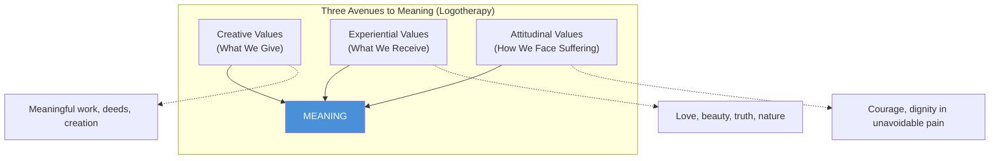
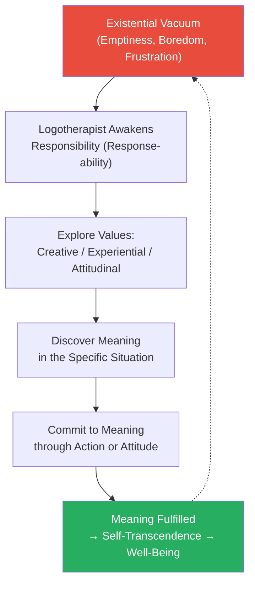

## The Meaning Triad

## Logotherapy Process

---

## Part 1 — Experiences in a Concentration Camp

### The Three Psychological Phases

Frankl divides the camp experience into three distinct stages, each with
its own psychological signature.

**Phase 1: Admission — Shock**

The train arrives at Auschwitz. Families separate. A single SS officer
points left (death, gas chamber) or right (slave labor). Frankl estimates
90% of each transport was sent to the gas chambers immediately. For those
selected, the first phase is pure shock: the stripping of clothes,
shaving of heads, showering, issuing of rags. Everything is designed to
strip identity. Inmates thought of suicide as a near-universal reaction.

Frankl smuggled a manuscript of his first book into the camp, hoping to
reconstruct it. That manuscript — the single thread connecting him to a
future — was taken and destroyed. The loss triggered a reckoning: without
a future task, would he survive?

**Phase 2: Apathy — Emotional Death**

The dominant psychological state of the long-term prisoner. Apathy is a
protective mechanism: the prisoner simply cannot afford to react
emotionally to every beating, every death, every cruelty. The prisoner
retreats into a purely inner life. Frankl describes watching a fellow
prisoner collapse and die mid-step, and the others simply stepping over
the body. This is not moral failure but survival.

In this phase, inmates live in "the camp's rigid timetable":
- 4:00 AM: wake, roll call in freezing darkness
- Thin soup substitute
- Labor: digging, hauling, laying rail ties
- Evening: thin bread ration, watery soup
- Bed: tightly packed on wooden slats, lice, dysentery

Frankl notes two key coping mechanisms. First: **humor**. Prisoners
would invent stories about their futures — "perhaps at a future dinner
party I will tell my guests about all this" — to create emotional
distance. Second: **beauty**. Frankl describes a moment when prisoners,
on a work detail, paused to watch a sunset over the Bavarian mountains
and one inmate said, "How beautiful the world could be."

The inner life intensifies. Men who had never prayed began praying.
Frankl conducted a silent "psychohygiene" — reminding himself that the
camp was a "living laboratory" for his theories.

**Phase 3: Release — Disillusionment**

Liberation arrives. The guard abandons the camp. Prisoners are free. And
the psychological reaction is not ecstasy but numbness. Frankl describes
the difficulty of believing the nightmare is over. When the reality sinks
in, bitterness and resentment surface. Many survivors felt rage at the
neighbors who pretended not to know. Many learned their entire families
were dead. Frankl's father died of pneumonia at Theresienstadt, his
mother and brother perished at Auschwitz, his pregnant wife Tilly died
at Bergen-Belsen.

The released prisoner must unlearn the camp's cruelty and re-enter a
world that cannot understand.

---

### Finding Meaning in Suffering

Frankl's most radical claim occupies the core of Part One: **meaning can
be found even in the worst suffering**. He distinguishes between
unnecessary suffering (which should be changed or escaped) and
unavoidable suffering (which can be a source of meaning through attitude).

He cites Nietzsche: "He who has a *why* to live can bear almost any
*how*." The prisoners who survived longest were not the physically
strongest but those with a sense of future purpose. Frankl observed that
the death rate spiked in the week between Christmas and New Year's 1944
— because prisoners had hoped to be home by Christmas. When the hope
collapsed, so did their will to live.

---

### The Last Inner Freedom

The book's most famous passage:

> "Everything can be taken from a man but one thing: the last of the
> human freedoms — to choose one's attitude in any given set of
> circumstances, to choose one's own way."

This is not cheerfulness. Frankl is not saying "look on the bright
side." He is describing a radical existential stance: that between any
stimulus and our response lies a space, and in that space is our freedom
and our power. Even the SS could not take this space.

---

### Tragic Optimism

Added in the 1984 postscript, the concept of **tragic optimism** is the
ability to remain optimistic in the face of the **tragic triad**: pain,
guilt, and death. Each, Frankl argues, can be turned into an opportunity:
- Pain → achievement through bearing it with dignity
- Guilt → opportunity to change a past wrong into a better future
- Death → the very transience of life gives it meaning; we are
  responsible for what we "deposit" in the past

---

## Part 2 — Logotherapy in a Nutshell

### Will to Meaning vs Will to Pleasure / Will to Power

Frankl positions logotherapy as the **Third Viennese School of
Psychotherapy**, after Freud's psychoanalysis (will to pleasure) and
Adler's individual psychology (will to power). Frankl argues that
meaning, not pleasure or power, is the deepest human drive. When the
will to meaning is frustrated, the result is the **existential vacuum**
— a pervasive sense of emptiness, boredom, and lack of purpose.

The existential vacuum manifests as the **mass neurotic triad**:
depression, addiction, and aggression. People try to fill the void with
materialism, hedonism, or busyness, but these are substitutes that do
not satisfy. Frankl saw the tremendous success of his own book as
evidence that millions were searching for meaning.

### The Meaning Triad

Frankl proposes three ways to discover meaning:

1. **Creative Values** — doing a deed, creating a work, contributing to
   a cause. Work can be a source of meaning not just for its output but
   for the personal commitment it embodies.

2. **Experiential Values** — encountering someone (love) or something
   (beauty, truth, nature). Frankl gives special emphasis to love as
   "the ultimate and highest goal to which man can aspire." In love, one
   person sees and enables another's potential.

3. **Attitudinal Values** — the stance we take toward unavoidable
   suffering. This is Frankl's most original contribution. Even when a
   person is stripped of all creative and experiential opportunities,
   they can still choose how to face their fate.

### Paradoxical Intention

A logotherapeutic technique for anxiety and phobias: the patient is
instructed to *intend* the very thing they fear. An insomniac tries to
stay awake as long as possible — and falls asleep. A person with public
speaking anxiety tries to tremble as much as possible — and finds the
trembling subsides. The mechanism: anticipatory anxiety creates a
feedback loop (fear of fear). Paradoxical intention breaks the loop by
introducing humor and detachment.

### Dereflection

For problems rooted in hyper-reflection (obsessive attention to bodily
functions, sexual performance, etc.), dereflection redirects attention
away from oneself and toward meaningful engagement with the world. The
patient is guided to forget themselves in service of something larger.
Happiness and pleasure are not pursued directly but *result* from
self-transcendence.

### The Noetic Dimension

Logotherapy rests on a tri-dimensional view of the human person:
- **Soma** (body) — biological
- **Psyche** (mind) — psychological
- **Noos** (spirit) — the uniquely human dimension of meaning, freedom,
  and responsibility

Frankl insists the noetic dimension is not reducible to the somatic or
psychic. Psychotherapy that ignores the spiritual dimension misses the
essence of the patient. This is not religious in a sectarian sense —
Frankl uses "spirit" to mean the human capacity for meaning, conscience,
and self-transcendence.

---

## Key Lessons

- Suffering is not necessary for meaning, but when it is unavoidable,
  the attitude toward it is a source of meaning
- Meaning is unique to each person and each moment — there is no
  universal meaning, only the right meaning *for this person now*
- We should not ask what life means but recognize life is asking *us*
  for an answer; we are responsible
- The existential vacuum is the疾病 of modern civilization — the mass
  media, consumer culture, and loss of tradition have left people
  feeling empty
- Logotherapy is not a prescription — it helps patients find *their*
  meaning, not the therapist's
- Human beings are ultimately self-determining: "man does not simply
  exist but always decides what his existence will be"
