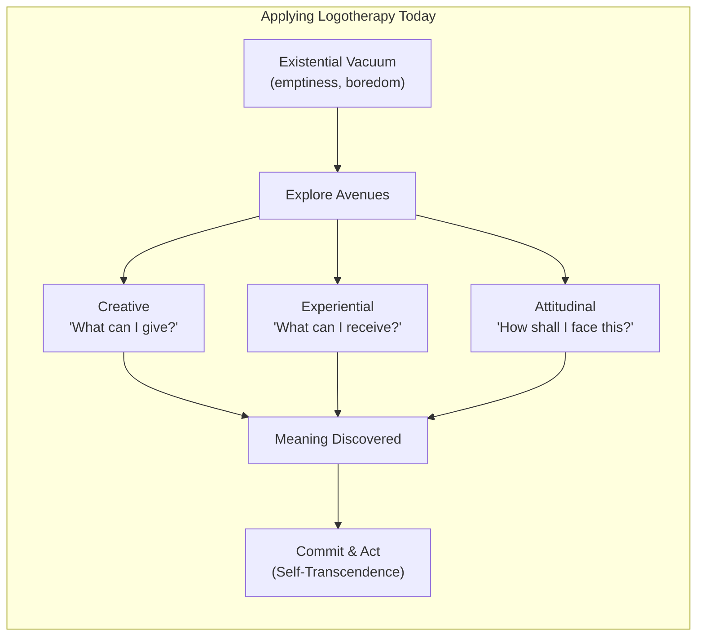

## Introduction

**Narrator:** Welcome to BookAtlas. Today: *Man's Search for Meaning*,
by Viktor Frankl. Published 1946. Beacon Press. 184 pages. Part Holocaust
memoir, part psychotherapy manifesto — and one of the most influential
books of the 20th century.

To break it apart, we have two guests. Dr. Sarah Chen is a practicing
therapist who uses logotherapy with her patients. Professor David
Ortiz is a historian of the Holocaust who studies survivor testimony.
They bring very different lenses to the same book.

---

## The Book in One Sentence

**Narrator:** Sarah, you go first. What's the core of this book?

**Sarah:** One sentence: *Life has meaning under all circumstances, even
the most miserable, and it is our responsibility to find it.* Frankl
watched prisoners in Auschwitz give up and die, and watched others
survive because they held onto something — a person, a task, a faith.
He concluded the difference wasn't physical strength. It was meaning.

**David:** And I'd add: that's a powerful statement, but it's also a
constructed narrative. Frankl was writing as a psychiatrist, not a
historian. The camps were not laboratories, and the prisoners were not
subjects. The book reads camp experience through the lens of a theory he
already believed in.

---

## Did Frankl's Framework Hold Up?

**Narrator:** David, you study Holocaust testimony. How does Frankl's
account compare to other survivors?

**David:** It's unusually clean. Most survivor memoirs are chaotic —
memory gaps, overwhelming emotion, moral ambiguity. Frankl's is tidy.
The camp has three phases. The prisoners have clear psychological
responses. The message is uplifting. That's not how most survivors
describe it. Primo Levi writes about the "gray zone" where moral
categories collapse. Elie Wiesel describes a loss of faith that never
came back. Frankl describes faith finding new forms.

**Sarah:** But that's his point — he's not denying the chaos. He's
saying that even in chaos, the capacity for choice and meaning exists.
His account may be tidier than some, but the observation it's built on
is real. I see it with my patients. Two people face the same diagnosis,
the same loss. One is crushed. The other finds new purpose. The
difference is meaning-making.

**David:** But can we separate the observation from the circumstances?
Auschwitz wasn't cancer. The SS didn't care if you made meaning. You
could do everything right — keep your spirits up, maintain your will to
live — and be selected for the gas chamber anyway. Frankl survived
partly because he was useful as a doctor, and partly by sheer luck.
His framework risks suggesting that those who died simply failed to find
meaning.

**Sarah:** That's the most common critique, and Frankl would reject it.
He explicitly says meaning isn't about survival — it's about how you
live your last moments. He says "any existence, however restricted, still
has meaning." Even the prisoner walking into the gas chamber, he says,
can choose an attitude of dignity. He calls that the attitudinal value.

**David:** And that's where I think the framework breaks down. Lawrence
Langer called these "empty heroics." Is it meaningful to tell a person
being marched to their death that they still have the freedom to choose
their attitude? That feels less like therapy and more like
philosophical imposition.

---

## Applying Logotherapy Today

**Narrator:** Sarah, how does this actually work in a clinical setting?

**Sarah:** I don't bring up Auschwitz with my patients. That would be
grotesque and irrelevant. But the structure is useful. When someone
comes in feeling empty, directionless — what Frankl called the
existential vacuum — I help them explore the three avenues.

*Creative values:* what do you want to contribute? Not in a grand sense,
but today. A patient recovering from burnout found meaning in baking
bread for her neighbors. It sounds small, but it was a creative act
directed outward — self-transcendence.

*Experiential values:* what can you receive? Another patient, going
through a divorce, started volunteering at an animal shelter. She
experienced love and connection — not romantic, but real.

*Attitudinal values:* how do you face what you can't change? A terminal
cancer patient I worked with said the diagnosis forced her to become the
person she always wanted to be. She stopped pretending, stopped
placating, started telling the truth. That's attitudinal meaning.

**David:** That sounds genuinely helpful. But does it need Frankl's
philosophical apparatus? Yalom does similar work without claiming
meaning is objectively available in all circumstances.

**Sarah:** Yalom is more cautious. Frankl is more audacious. And I think
that audacity is part of the therapy. When you tell a patient "life
never stops having meaning," you give them permission to look where they
hadn't looked. If you say "meaning may or may not be there," it's a
weaker intervention. Frankl's radical claim *works* — not because it's
provably true, but because it directs attention toward possibility.

---

## The Practical Toolkit

---

## Criticisms: The Elephant in the Room

**Narrator:** David, what's the strongest argument against Frankl?

**David:** That he misrepresents the Holocaust to sell a philosophy.
He was at Auschwitz for three days. The book implies much longer. He
never mentions that the camps existed primarily to murder Jews — he
universalizes the victim. He omits the Muselmann entirely. He made
controversial professional choices before the war that he later buried.
None of this makes the book valueless, but it should make us read it
with critical eyes.

**Sarah:** I agree with some of that. The universalization is
problematic. The self-promotion is real. But here's the thing — I don't
recommend the book as Holocaust history. I recommend it as a
philosophical stance backed by lived experience. That experience was
real even if the telling is selective. Frankl lost everyone. He had
every reason to become a nihilist. Instead, he chose "yes to life in
spite of everything." That choice, imperfectly documented as it may be,
is itself the evidence.

**David:** I still find it hard. Can we really call it "choice" when the
alternative was despair and death? That's like saying someone chose not
to be crushed by a building.

**Sarah:** I think we can. Not as blame — if someone couldn't find
meaning in the camps, that's not their fault. But as an observation:
that some people *did* find meaning, and it helped them. The possibility
exists. That's all Frankl needed to prove.

---

## So, Does It Hold Up?

**Narrator:** Final verdict. Sarah?

**Sarah:** Yes, it holds up. Not as a complete psychology — Frankl never
claimed it was. But as a corrective to the meaninglessness of modern
life, it's more relevant than ever. People are drowning in affluence and
emptiness. The will to meaning is a genuine human need. The book gives
language to a hunger people can't name.

**David:** With reservations. The core insight — that meaning matters,
that we can choose how to face suffering — is valid. But the book
itself needs to be read critically, not as gospel. Frankl was a flawed
messenger with an important message. That tension shouldn't be smoothed
over.

**Sarah:** I'll take that. Are we in agreement?

**David:** Close enough. The book has helped too many people to dismiss
it. But the critics have too many valid points to accept it uncritically.

**Narrator:** *Man's Search for Meaning* — a flawed masterpiece that
asks the hardest question: given that life includes suffering, how do
we live? Seventy-five years later, we're still trying to answer.

---

## Recommended Next Reads

- **When Breath Becomes Air** (Paul Kalanithi) — Frankl's ideas in
  practice, facing mortality with honesty and purpose
- **The Denial of Death** (Ernest Becker) — A darker complement; what
  happens when the will to meaning meets the terror of death
- **Man's Search for Ultimate Meaning** (Viktor Frankl) — The later,
  more metaphysical development of logotherapy
- **The Happiness Hypothesis** (Jonathan Haidt) — Modern positive
  psychology's engagement with ancient wisdom, including Frankl
