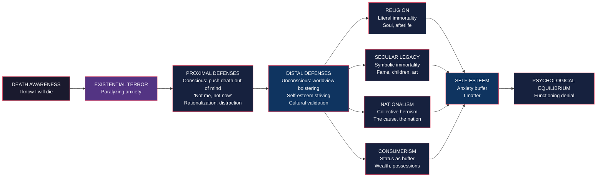

# 🎙️ The Denial of Death — Podcast Episode

**Host**: Welcome back to BookAtlas. Today we are tackling a book that won the Pulitzer Prize, inspired one of the most researched theories in social psychology, and might just change how you see everything — from why you work so hard, to why you fall in love, to why people kill each other over politics. It is *The Denial of Death* by Ernest Becker.

**Guest**: I have been waiting to talk about this book. It is one of those rare works — you read it, and you cannot go back to the way you thought before. It is like putting on glasses for the first time.

**Host**: Let us start with the core claim. What is Becker actually saying?

---

## 🎙️ The Core Thesis

**Guest**: Becker's thesis is brutally simple. Humans are the only animals who know we are going to die. That knowledge is so terrifying that we have built entire civilizations to avoid facing it. Culture, religion, politics, career ambition, romantic love — they are all, at bottom, elaborate defense mechanisms against the terror of annihilation.

**Host**: That sounds extreme. Everything is about death?

**Guest**: That is the natural reaction. But Becker is careful. He is not saying you consciously think about death every time you check your email. He is saying death anxiety is the background radiation of human experience. It is always there, below consciousness, shaping your behavior in ways you do not recognize.

**Host**: How does that work psychologically?

**Guest**: Becker starts with a duality. Humans live in two worlds. We have a physical body — an animal body that eats, gets sick, and will die. And we have a symbolic self — the part that creates meaning, imagines the future, and conceives of eternity. The problem is these two selves are in constant conflict. The symbolic self wants to live forever. The physical self is a decaying organism. The gap between them is unbearable.

**Host**: So what do we do about it?

**Guest**: We build what Becker calls "immortality projects." These are cultural belief systems that let us feel our lives matter beyond our biological span. Religion is the classic example — you die, but your soul lives on. But the same mechanism applies to secular pursuits. Building a business, writing a book, raising children, being remembered — all are forms of symbolic immortality. You create something that will outlast your body.

---

## 🎙️ The Structure of Denial

**Host**: This diagram helps. So there are levels of defense?

**Guest**: Exactly. TMT researchers — the psychologists who turned Becker's ideas into a scientific theory — distinguish between proximal and distal defenses. Proximal defenses happen when death is in conscious awareness. You think "I am going to die" and you immediately push it away. "Not me, not now." You distract yourself. You make rationalizations.

**Host**: And distal defenses?

**Guest**: Those happen below awareness. When death thoughts are primed but not conscious — say, you walked past a cemetery earlier and it registered subliminally — your brain activates deeper defenses. You cling more strongly to your worldview. You defend your group. You seek self-esteem. You become more nationalistic, more religious, more attached to your political identity.

**Host**: And that has been experimentally demonstrated?

**Guest**: Hundreds of times. The classic paradigm: you have one group write about their own death, and a control group write about dental pain. Then you measure their attitudes toward someone who praises their country versus someone who criticizes it. The mortality salience group shows dramatically more ingroup favoritism and outgroup hostility. The effect is robust across cultures, ages, and political orientations.

---

## 🎙️ The Hero System

**Host**: Let us talk about Becker's concept of heroism.

**Guest**: For Becker, heroism is not optional. It is a biological need. Every human needs to feel they are a valuable contributor to a meaningful universe. That feeling — call it self-esteem, call it significance — is what protects us from death terror.

**Host**: And culture provides the means to achieve it.

**Guest**: Right. Every culture has a "hero system" — a set of standards for what counts as valuable. The warrior who dies for his tribe. The entrepreneur who builds a fortune. The saint who serves the poor. The artist who creates something beautiful. Different systems, same function: to let the individual feel heroic, to feel their life matters.

**Host**: What happens when you cannot be a hero in your culture's system?

**Guest**: That is where Becker's analysis of mental illness comes in. Neurosis is the inability to fully believe in the hero system. You see through it. You recognize it is a fiction. But without it, you face the raw terror of death. So you are stuck — too aware to believe, too afraid to not believe.

**Host**: And depression?

**Guest**: Depression is what happens when your immortality project fails. You stop feeling heroic. Your self-esteem collapses. The buffer against death anxiety disappears. You are exposed to the raw reality: you are going to die, and nothing you do matters. Depression is, in a terrible way, the most honest response to the human condition.

**Host**: That is dark.

**Guest**: It is. But Becker's point is not to depress you. It is to show you that this is the universal human predicament. We are all in the same boat. Everyone you see — the CEO, the politician, the celebrity, the person who cut you off in traffic — is managing the same terror. The recognition can be liberating.

---

## 🎙️ Romantic Love and the Fetishization of the Other

**Host**: Becker has a chapter on romantic love that I found both beautiful and disturbing.

**Guest**: He argues that romantic love is a modern immortality project. In traditional societies, religion provided the primary container for death anxiety. You did not need your partner to be your everything. But in secular modernity, we have placed an enormous burden on romantic relationships. Your partner is supposed to be your soulmate, your best friend, your sexual fulfillment, your source of meaning, your redemption.

**Host**: And Becker says this is death denial.

**Guest**: Yes. The beloved is elevated to godlike status because they carry the weight of your existential terror. You merge with them and, through that merger, transcend the boundaries of the self. This is why breakups can feel like an existential crisis — not just sadness, but a collapse of meaning. The immortality project has failed.

**Host**: What is the alternative? Just accept that love is a defense mechanism?

**Guest**: Not exactly. Becker is not dismissing love. He is saying we should understand it fully. When we see that our desperate need for love is partly a need to manage death terror, we can approach relationships with more honesty and less desperation. The goal is not to stop needing love. It is to understand *why* we need it so much.

---

## 🎙️ Living with Awareness

**Host**: This is the practical question. If Becker is right — if most of what we do is a form of death denial — what is the alternative? Should we just face death directly all the time?

**Guest**: No, and Becker does not recommend that. Total honesty about death would be paralyzing. We need some level of denial to function. The question is what kind of denial, and how conscious we are about it.

**Host**: So what does a healthy relationship with death look like?

**Guest**: Becker suggests — and this is subtle — that the healthiest response is what he calls "creative transference." You invest your death anxiety in a project that genuinely transcends the self. A scientific discovery. A work of art. A just cause. A spiritual practice. The key is that the project is *real* — it connects you to something beyond your ego rather than just inflating your ego.

**Host**: So it is not about eliminating the immortality project. It is about choosing a better one.

**Guest**: Exactly. The most dangerous immortality projects are the ones that demand the destruction of other people's projects — nationalism that requires enemies, religion that damns unbelievers, political ideologies that justify violence. The less dangerous ones are those that allow for pluralism, that do not require you to annihilate competing worldviews.

---

## 🎙️ The Empirical Legacy

**Host**: I want to talk about the scientific validation. Becker's book was written in 1973, but TMT research has been running for almost 40 years.

**Guest**: It is remarkable. Three social psychologists — Jeff Greenberg, Sheldon Solomon, and Tom Pyszczynski — read Becker in graduate school and decided to test his ideas experimentally. They developed the mortality salience paradigm: ask people to write about their own death, then measure the effects on their attitudes and behavior.

**Host**: What have they found?

**Guest**: That Becker was essentially right. Reminding people of death:
- Increases their patriotism and nationalism
- Makes them more punitive toward moral transgressors
- Strengthens their religious beliefs
- Increases their preference for charismatic leaders
- Makes them more generous toward ingroup members and hostile toward outgroups
- Increases their desire for children (biological immortality)
- Makes them more materialistic

And crucially, these effects happen even when death thoughts are subliminal — below conscious awareness.

**Host**: That is concerning. It suggests that subtle death reminders in the news, in movies, in conversation are constantly shaping our political and social attitudes.

**Guest**: Precisely. During COVID, TMT became hugely relevant. The constant death reminders were driving polarization, blame, and worldview defense. Understanding this dynamic helps us recognize when our reactions are about death rather than about the issue at hand.

---

## 🎙️ Practical Takeaways

**Host**: If our listeners take one thing from this episode, what should it be?

**Guest**: Three things. First: recognize that a lot of what you feel strongly about — your politics, your career ambition, your relationship intensity — is shaped by a fear you do not consciously feel. That recognition alone can give you some distance.

**Host**: Second?

**Guest**: Be aware of how death reminders affect your judgment. When you feel yourself becoming more rigid, more defensive, more hostile toward people who disagree — ask yourself: has something reminded me of mortality recently? The news, an illness, a funeral, even a cemetery you passed? That awareness can help you pause before acting on worldview defense.

**Host**: Third?

**Guest**: Choose your immortality projects wisely. The most destructive human behavior comes from immortality projects that demand the annihilation of competing ones. The most constructive comes from projects that create meaning without requiring enemies. If your sense of significance depends on someone else being wrong, your project is dangerous — not just to others, but to you.

**Host**: Because if they are wrong and you defeat them, you still have to face death?

**Guest**: Exactly. The enemy is a distraction from the real problem: the terror inside yourself.

---

## 🎙️ Final Thoughts

**Host**: What is the most important thing Becker taught you?

**Guest**: That we are all in the same predicament. The billionaire and the beggar, the saint and the sinner, the scientist and the mystic — we are all managing the same terror. The forms differ, but the underlying need is universal. That recognition, if we let it, can make us more compassionate and less cruel.

**Host**: That is the paradox of the book. It is deeply unsettling — it pulls back the curtain on all our illusions. But the result can be more freedom, not less. If we understand why we do what we do, we have a chance of doing it differently.

**Guest**: Becker died at 49, two months before winning the Pulitzer. He knew he was dying while writing the final chapters. There is a poignancy to that. He was not theorizing from a safe distance. He was writing about his own death denial while staring at his own death.

**Host**: That gives the book an authenticity that is hard to find.

**Guest**: Yes. Becker admits he has no perfect solution. He does not promise a way out. He just promises a clearer view of what we are up against. And for many readers, that clarity is the closest thing to liberation they will find.

---

**Outro**: *The Denial of Death* by Ernest Becker is available from Free Press. If this episode shifted something in how you see the world, share it with someone who needs to hear it. We will be back next week with another book that might change how you think.
