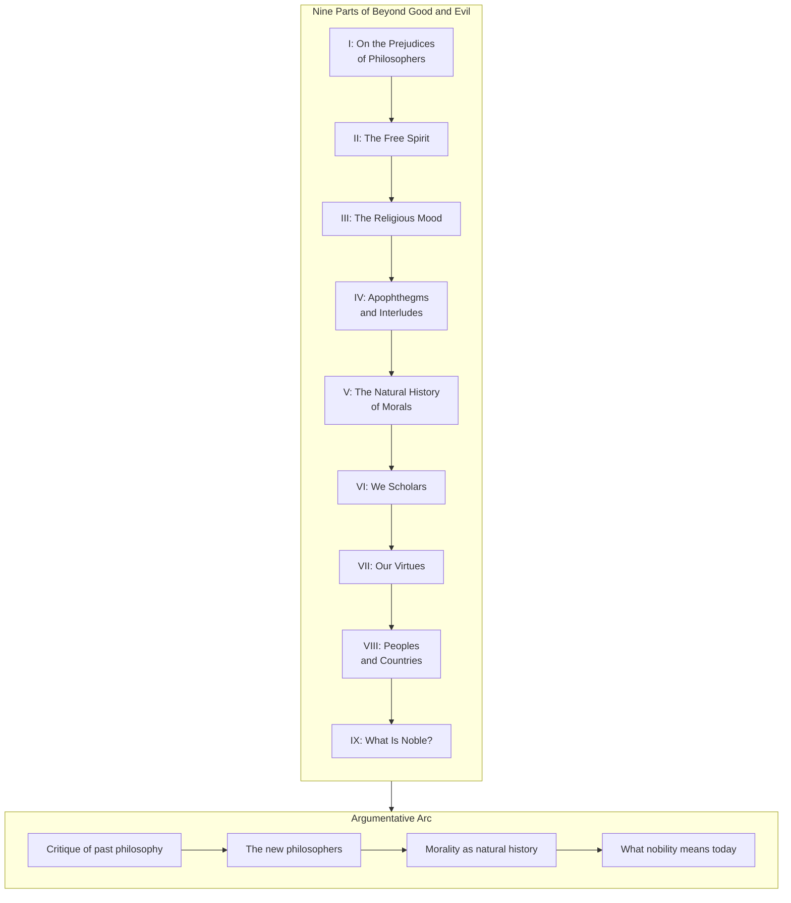

## The Structure of the Work

*Beyond Good and Evil* is organized into a preface, nine numbered
parts, and an epode (aftersong) titled "From High Mountains." The
296 sections vary in length from single sentences to several pages.
The nine parts form a logical progression:

The arc moves from **destruction** (Parts I-III: tearing down
dogmatic philosophy, religion, and moral prejudice) through
**interlude** (Part IV: 125 aphorisms that sharpen the reader's
sensibility) to **construction** (Parts V-IX: a new natural history
of morals, a new image of the scholar, and finally the
philosopher-legislator who creates values).

---

## Part I: On the Prejudices of Philosophers

This is the most famous and influential section of the book.
Nietzsche accuses the entire Western philosophical tradition of
a fundamental dishonesty: philosophers claim to seek objective
truth, but their systems are really elaborate rationalizations
of their moral prejudices.

### The Will to Truth as a Problem

Nietzsche opens with a provocative question: "Suppose truth is a
woman — what then?" The implication: philosophers have approached
truth with clumsy, dogmatic certainty, unable to seduce or be
seduced. They have never doubted the *value* of truth itself.

> The falseness of a judgment is for us not necessarily an
> objection to it. The question is to what extent it is
> life-promoting, life-preserving, species-preserving, perhaps
> even species-cultivating.

### Every Philosophy Is an Unconscious Memoir

Section 6 contains one of Nietzsche's most devastating claims:

> Every great philosophy has been the personal confession of
> its author and a kind of involuntary and unconscious memoir.

The moral (or immoral) intentions of the philosopher constitute
the real germ from which the entire plant of his philosophy grows.
Logic, metaphysics, epistemology — these are not neutral inquiries.
They are elaborate masks for what the philosopher *wants* to affirm
about life.

### Critique of Specific Philosophers

Nietzsche does not spare individuals:

| Philosopher | Critique |
|-------------|----------|
| **Descartes** | The *cogito* presupposes an "I," an activity called "thinking," and knowledge of what thinking is — all unexamined assumptions |
| **Spinoza** | Hides personal timidity behind the geometric method; his drive for self-preservation contradicts his rejection of teleology |
| **Kant** | The "great Chinaman of Königsberg"; synthetic a priori judgments are explained by an imaginary "faculty" — like Molière's doctor who explains opium's sleepiness by a "sleepy faculty" |
| **Schopenhauer** | Mistaken that the nature of the will is self-evident; the will is a complex instrument of command and obedience |
| **Stoics** | Your "living according to nature" is a lie — you want to impose your own morality on nature, which is profligate and indifferent |

### The Will to Power as Alternative

In §13, Nietzsche rejects the Darwinian and Spinozist notion that
self-preservation is the fundamental drive. "Physiologists should
think before putting down the instinct of self-preservation as the
cardinal instinct of an organic being. A living thing seeks above
all to *discharge* its strength — life itself is *will to power*."

---

## Part II: The Free Spirit

The "free spirit" is Nietzsche's transitional figure — the
philosopher who has liberated himself from moral prejudice but has
not yet become the full legislator of new values.

### Characteristics of Free Spirits

They are "investigators to the point of cruelty, with rash fingers
for the ungraspable, with teeth and stomach for the most
indigestible" (§44). They experiment with themselves, risk
themselves, and refuse the comforts of certainty. They are not
"free thinkers" in the Enlightenment sense — mere liberators from
superstition — but something more radical: liberators *from* the
will to truth itself.

### The Grand Deception

Nietzsche explores the psychology of the will to knowledge.
Consciousness, he argues, is a surface phenomenon — the real work
of thinking happens beneath awareness. What we call "self-
consciousness" is largely a misinterpretation of our own drives.
The free spirit knows this and turns suspicion into a virtue.

### On the Prejudice of Cause and Effect

In §§ 19-21, Nietzsche offers one of his most radical
epistemological arguments. "There is no 'spirit,' no reason, no
thinking, no consciousness, no soul, no will, no truth: all are
fictions that have become useless." The cause-effect relation is
something *we* fabricate, not something we discover in the world.

---

## Part III: The Religious Mood

Nietzsche analyzes religion as a psychological phenomenon. His
target is not belief in God per se, but the *type of human being*
that Christianity produces.

### Cruelty and the Religious Life

Religion has always been connected to "three dangerous dietary
prescriptions: solitude, fasting, and sexual abstinence" (§47).
These are techniques for inducing the "religious mood" — a state
of heightened sensitivity and susceptibility.

Nietzsche traces a "ladder of cruelty" in religious sacrifice:
first animals, then one's own instincts, and finally God himself
(the death of God is the ultimate self-sacrifice of Christianity).

### Christianity as Slave Morality

> Christianity — the most fatal kind of self-presumption ever —
> has beaten everything joyful, assertive, and autocratic out of
> man and turned him into a "sublime abortion" (§62).

The New Testament is compared unfavorably to the Old Testament,
which Nietzsche admires for its "magnificent" expressions of
strength. The New Testament is a "sort of rococo of taste" —
sweet, sentimental, and essentially dishonorable.

### Europe's Talent for Religion

Northern Europeans have much less talent for religion than
southerners. Protestantism is a "half-measure" compared to
Catholicism's sophisticated apparatus of grace, confession, and
hierarchy. German religiosity is particularly clumsy.

---

## Part IV: Apophthegms and Interludes

This section contains 125 brief aphorisms, many only a single
sentence. They cover women and men, music, art, love, power,
and human nature. Some of the most famous:

- §146: "He who fights with monsters should be careful lest he
  thereby become a monster. And if you gaze long into an abyss,
  the abyss also gazes into you."
- §153: "What is done out of love always takes place beyond good
  and evil."
- §188: "Morality is the herd-instinct in the individual."

The aphorisms about women (§§ 84, 85, 86, 114, 115, 127, 131, 139,
144, 145, 147, 148) are among the book's most controversial passages,
presenting women as fundamentally mysterious and resistant to the
masculine drive for depth and truth.

---

## Part V: The Natural History of Morals

Nietzsche prefigures his *Genealogy of Morality* by arguing that
moralities must be *compared*, not judged from within one moral
framework. He calls for a "typology of morals" (§186).

### Herd Morality

"In Europe today, morality is herd-animal morality" (§202). The
distinctive feature of modern morality is its claim to *universality*
— the assumption that what is good for one is good for all. This,
Nietzsche argues, is a prejudice of the weak, who cannot tolerate
difference and exception.

### The Order of Rank

Morality must bow before "order of rank" (§221). Different types
of human beings require different moralities. A morality for
everyone is a morality for no one — it flattens the highest
creatures while pretending to elevate the lowest.

---

## Part VI: We Scholars

Nietzsche distinguishes sharply between the "philosophical laborer"
(the scholar, the scientist) and the genuine philosopher. Scholars
are valuable — they are objective, disciplined, and rigorous — but
they cannot be confused with philosophers.

### The Philosopher as Commander

> The genuine philosopher lives unphilosophically and
> unwise... He risks himself constantly, he plays the
> wicked game.

The philosopher does not discover truth. He *creates* values.
He is a "commander and law-giver" (§211). The scholar serves;
the philosopher rules.

---

## Part VII: Our Virtues

Nietzsche examines modern virtues — modesty, pity, sympathy,
public-spiritedness — and finds each a disguised form of the will
to power. The most "moral" person is often the most subtly
domineering.

### On Women (§§ 232-239)

The most controversial section of the book. Nietzsche's views on
women are reactionary even for the 19th century: "Woman wants to
become independent — and she begins to enlighten men about 'woman
as such' — that is one of the worst developments of the general
uglification of Europe." These passages have rightly drawn
extensive feminist critique.

---

## Part VIII: Peoples and Countries

Nietzsche offers a characterology of European nations. He praises
France as "the seat of Europe's most spiritual and refined culture
and the leading school of taste" (§254). The English are "no
philosophical race" — Bacon, Hobbes, Locke, and Hume represent a
"debasement of the concept 'philosopher'" (§252). Germans have a
"dangerous" and "mysterious" soul.

He praises the Jews as "the strongest, toughest, and purest race
now living in Europe" and condemns German antisemitism as
small-minded (§251).

A prophetic statement closes this section: "The time for petty
politics is past: the very next century will bring the struggle
for mastery over the whole earth" (§208).

---

## Part IX: What Is Noble?

The culminating section. Nietzsche asks what constitutes genuine
nobility in a democratic, egalitarian age.

### The Pathos of Distance

Nobility is rooted in the "pathos of distance" (§257) — the
awareness of an unbridgeable gap between higher and lower types.
Every high culture begins with this pathos. Nobility is not
inherited title or wealth; it is the *sense* of being a higher
type, and the *responsibility* that comes with it.

### The Noble Soul

The noble person:
- Honors himself as powerful
- Is benevolent, not from pity, but from an overflow of power
- Keeps his word because it is *his* word
- Is truthful with himself but not naive about others
- Does not need to be loved (though he may be)
- Creates values and measures himself against himself

The epode, "From High Mountains," a poem to friendship, closes the
work in an unexpectedly tender key — suggesting that even the
philosopher-legislator, the loneliest of humans, craves the
recognition of an equal.

---

## Key Lessons

- **Philosophy is autobiographical.** Every system of thought is
  the confession of its author's drives and prejudices. Read
  philosophers as you would read novels — for character, not
  truth.
- **Life is will to power.** All organic life — indeed all
  existence — is the drive to discharge strength, overcome
  resistance, and grow. Morality is one arena of this struggle.
- **There are no moral facts.** Moralities are interpretations
  that serve the interests of their creators. The question is not
  "is this moral?" but "whose will to power does this morality
  serve?"
- **The philosopher creates values.** The task of the highest
  human beings is not to discover pre-existing truths but to
  create new values, new tables of what is good.
- **Equality is leveling-down.** The modern passion for equality
  is disguised ressentiment against the exceptional. A healthy
  culture requires hierarchy, distance, and the cultivation of
  higher types.
- **Self-overcoming is the highest good.** The goal of life is not
  happiness, security, or comfort, but *growth* — the continual
  overcoming of what one currently is.

---

## Practical Applications

### For Reading Philosophy
- Ask not "is this argument sound?" but "what kind of person
  would need to believe this?" Nietzsche's hermeneutic of
  suspicion is a powerful critical tool
- Read against the grain — look for the emotional commitments
  hiding behind logical arguments

### For Thinking About Morality
- When someone tells you something is "just wrong," ask: who
  benefits from this judgment? What does this moral conviction
  *do* for the person who holds it?
- Distinguish between your inherited morality and a morality you
  have chosen. Nietzsche challenges you to take responsibility
  for your values

### For Creating
- Nietzsche's model of the artist-philosopher is one who creates
  values, not products. Ask yourself: what new way of evaluating
  the world am I bringing into existence?
- The pathos of distance: excellence requires the courage to be
  different, to stand apart, to measure yourself by your own
  standard

### For Self-Examination
- Apply Nietzsche's question to your own beliefs: "What if this
  conviction were false? Would I still want to hold it?"
- Practice perspectivism: try to see your most cherished opinion
  from the standpoint of someone who despises it
- The abyss: be careful in what you criticize — you may become it

---

## Action Plan

1. **Read Part I twice.** It is the most concentrated and
   important section. Read it once for argument, once for
   rhetorical strategy.

2. **Map the moral prejudices of a philosopher you admire.**
   Take Plato, Kant, or any philosopher you respect. Try to
   identify the unexamined moral commitments that drive their
   system.

3. **Practice perspectivism for one week.** For every opinion you
   hold strongly, articulate the best version of the opposing
   view. Not to convert, but to see.

4. **Identify your own herd prejudices.** What do you believe
   because everyone around you believes it? Nietzsche is most
   useful as a mirror for unexamined conformity.

5. **Write a personal "beyond good and evil."** Identify one
   area of your life where inherited moral categories prevent
   you from thinking clearly. Try to develop a value judgment
   that is genuinely your own.

6. **Read the sections on women (§§ 232-239).** Wrestle with
   them. Nietzsche is wrong here in important ways, but
   understanding *why* he is wrong sharpens your own thinking
   about gender, equality, and power.

7. **Compare *Beyond Good and Evil* with the *Genealogy.** *
   The two books were written a year apart and cover much of
   the same ground. Notice how the argument changes form.
