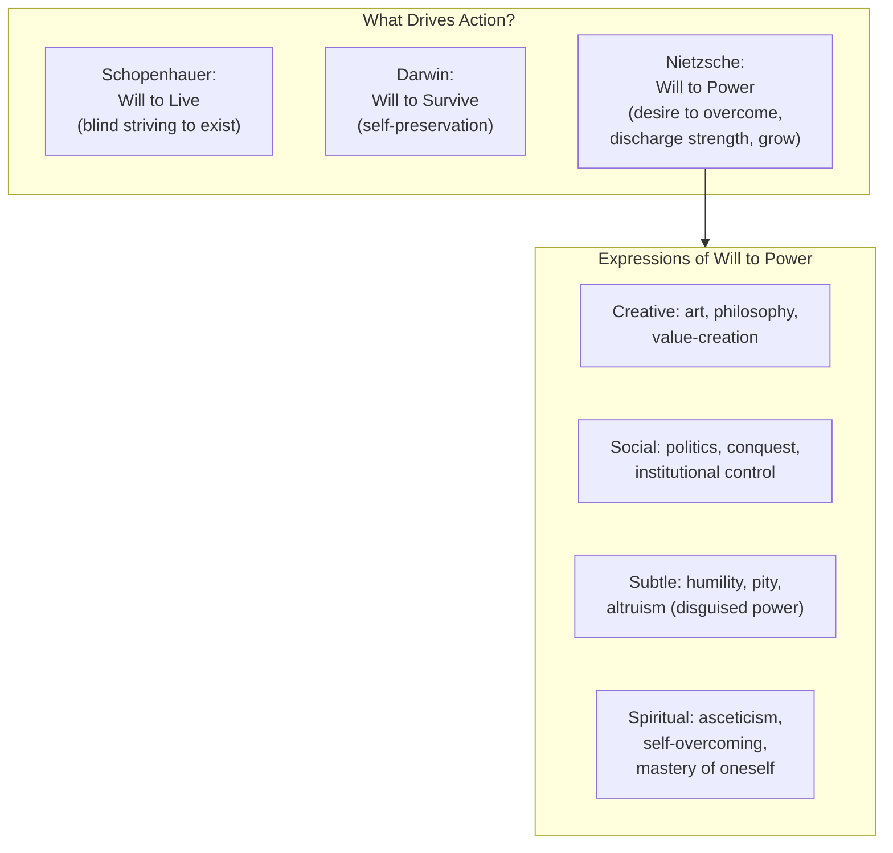
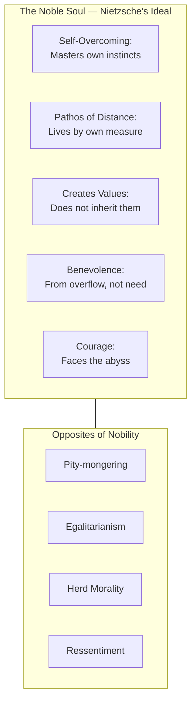

## Introduction

Welcome to BookAtlas. Today: *Beyond Good and Evil: Prelude to a
Philosophy of the Future* by Friedrich Nietzsche. Published 1886,
C. G. Naumann, Leipzig. 296 aphoristic sections. Originally in
German. Translated into every major language. One of the most
influential — and most controversial — philosophical works ever
written.

This conversation takes the form of a debate between two readers.
One is a Continental philosopher who has spent twenty years with
Nietzsche. The other is an analytic philosopher who thinks
Nietzsche is more poet than thinker, more provocateur than
philosopher.

Let's begin.

---

## The Setup: What Is Beyond Good and Evil?

The title is the thesis. Nietzsche wants to move past the binary
thinking that has governed Western morality for two thousand years:
good versus evil. Not to abolish moral judgment, but to show that
the categories themselves are products of history, psychology, and
power — not revelations of cosmic truth.

**Continental:** This is the book where Nietzsche puts his cards
on the table. *Thus Spoke Zarathustra* is poetry, prophecy, myth.
*Beyond Good and Evil* is argument — compressed, provocative,
often devastating argument. It's the closest he ever came to a
systematic work.

**Analytic:** It's not systematic at all. It's a collection of
assertions. He doesn't argue; he announces. The will to power is
introduced as if it were self-evident. He never defines it, never
defends it, never considers objections. If a student turned this
in as a dissertation, I'd fail them.

**Continental:** That's a category error. Nietzsche isn't writing
a dissertation. He's writing a *provocation* — a bomb thrown into
the room of academic philosophy. The aphoristic form is deliberate.
It forces you to stop, think, resist. It's harder to write an
aphorism that rewires your brain than a paragraph that fills in a
footnote.

---

## Part I: The Prejudices of Philosophers

This is the heart of the book. Nietzsche accuses every philosopher
from Plato to Kant of a fundamental dishonesty: they claim to seek
truth, but they are really rationalizing their own moral prejudices.

> Every great philosophy has been the personal confession of its
> author and a kind of involuntary and unconscious memoir.

**Continental:** This single sentence changes how you read
philosophy. After Nietzsche, you can't read Kant the same way.
You start asking: what kind of person wrote this? What did they
need to believe? Philosophy becomes a branch of psychology — or
more accurately, a branch of character analysis.

**Analytic:** That's exactly what's wrong with it. Nietzsche
replaces argument with ad hominem on a grand scale. Instead of
engaging with Kant's arguments, he reduces them to Kant's
personality. It's the genetic fallacy elevated to a philosophical
method. And it's self-undermining: if every philosophy is an
unconscious memoir, then *Beyond Good and Evil* is just the
memoir of a sick, lonely invalid with a grudge against Christianity.

**Continental:** Nietzsche anticipates that objection. He says
the honest philosopher admits what he is doing. That's the
difference: Kant pretends to be discovering universal truth.
Nietzsche says "this is *my* truth — now wrestle with it." The
reflexivity is a feature, not a bug.

---

## The Will to Power: Fundamental Drive or Empty Concept?

Nietzsche's central metaphysical claim: "Life itself is will to
power." A living thing seeks above all to discharge its strength,
to overcome resistance, to grow. Self-preservation is secondary.

**Analytic:** This is the weakest part of the book. Will to power
is either tautological or false. If every action expresses will to
power — including self-sacrifice, humility, and asceticism — then
what would count as a *counterexample*? Nothing. It's an unfalsif-
iable claim, which means it tells us nothing. It's a metaphysical
story, not a theory.

**Continental:** You're applying a criterion Nietzsche rejects.
He's not offering a scientific hypothesis. He's offering an
*interpretation* — and he argues that it's a better interpretation
than the alternatives. Darwin's self-preservation can't explain
why organisms take risks. Schopenhauer's pessimism can't explain
creation. Will to power explains more: why the strong dominate,
why the weak develop slave morality, why artists create, why
ascetics mortify themselves. It unifies the phenomena.

**Analytic:** It unifies them by making everything mean the same
thing. That's not explanation; it's leveling. If will to power
explains everything, it explains nothing.

---

## Master Morality vs. Slave Morality

Perhaps Nietzsche's most famous — and most influential — conceptual
distinction:

| Aspect | Master Morality | Slave Morality |
|--------|----------------|----------------|
| Origin | The noble, the powerful, the self-affirming | The weak, the oppressed, the resentful |
| Good = | Noble, strong, truthful-with-self | Humble, pitying, peaceful, equal |
| Bad = | Base, weak, contemptible | Proud, powerful, self-interested |
| Psychology | Spontaneous overflow of strength | Ressentiment: repressed hatred turned into moral judgment |
| Religion | Pagan self-glorification | Christian guilt and humility |

**Continental:** This is Nietzsche's most original contribution to
moral philosophy. He's not just saying there are two moral systems.
He's showing that *which* morality you hold depends on your
position in a social hierarchy. The slave's morality is not a
discovery of eternal truth — it's a weapon. "Blessed are the meek"
means "I am weak and I want to punish the strong for being strong."

**Analytic:** It's a brilliant typology, but it's also a gross
oversimplification. Most people's moral psychology is a mess —
not a pure master or slave type. And Nietzsche's own morality
is clearly a form of master morality that he's advocating, which
means he's not "beyond good and evil" at all. He's just picking a
different side.

**Continental:** He never claimed to be neutral. The point is that
the *claim* to neutrality is what he's attacking. Master morality
is honest about being partial. The universalism of slave morality
is the deception.

---

## The Critique of Religion

Nietzsche's analysis of Christianity is psychological rather than
theological. He does not argue that God does not exist; he asks
what kind of person needs to believe in God, and what this belief
does to them.

**Continental:** The passages on religion are some of his best.
He traces the "ladder of cruelty" in religious sacrifice: first
animals, then one's own instincts, then God himself. Christianity
is the religion that sacrifices God to save man — and then
collapses into nihilism when the sacrifice is complete.

**Analytic:** Again, this is poetry, not argument. Nietzsche has
no theory of truth or meaning. He tells a story about the death of
God as if it were a historical event. It's a rhetorical performance
— powerful, but not philosophy in any rigorous sense.

---

## What Is Noble? The Final Question

The book ends with Nietzsche's most affirmative question: what
does nobility mean in a democratic, egalitarian age?

**Continental:** The answer is beautiful and terrifying. Nobility
is not birth or title. It is the *pathos of distance* — the lived
awareness that you are a higher type, not through arrogance but
through self-overcoming. The noble person measures themselves
against themselves. They do not need the approval of the herd.

**Analytic:** And this is where Nietzsche becomes politically
dangerous. The "order of rank," the contempt for equality, the
celebration of hardness — these ideas were directly appropriated
by fascist thinkers. Nietzsche cannot be held responsible for
every misreading, but he wrote in a way that invited misreading.
The language is incendiary by design.

**Continental:** The misinterpretation is real, but the text is
more subtle than the reputation. The book ends with a *poem* to
friendship. The noble person, for Nietzsche, is not a brute. He
is someone who has mastered himself — who can afford to be gentle
because his strength is secure.

---

## The Verdict: Should You Read This Book?

**Continental:** Absolutely. But not as a set of doctrines to
believe. Read it as a *workout* for your mind. Nietzsche will
make you uncomfortable. He will make you question things you
didn't know you believed. That discomfort is the value. Even
where he's wrong — especially where he's wrong — he forces you
to think harder.

**Analytic:** Read it if you want to understand where half of
20th-century philosophy came from. But read it critically. Read
secondary sources alongside it. And don't mistake rhetoric for
argument. Nietzsche is a genius of style and psychological
penetration, but he is not a reliable guide to truth. The
questions he asks are profound. The answers he gives are
often irresponsible.

**Continental:** That's exactly the tension that makes the book
great. Nietzsche forces you to choose: do you want truth, or do
you want comfort? He doesn't offer you both. And that challenge
itself — that refusal to reassure — is what makes *Beyond Good and
Evil* a book that still matters, 140 years after it was written.

---

## Final Thoughts

*Beyond Good and Evil* is not a book you finish. It is a book you
return to — at different ages, in different moods, from different
positions in life. It reads differently at twenty than at forty.
What seemed like arrogant posturing at first reading becomes
hard-won wisdom at the second. What seemed like wisdom becomes
something more complicated.

The title promises a destination: a place beyond good and evil.
But the book does not take you there. It shows you why you cannot
stay where you are. The journey itself is the point.

This has been a BookAtlas narration of *Beyond Good and Evil* by
Friedrich Nietzsche. Thanks for listening.
