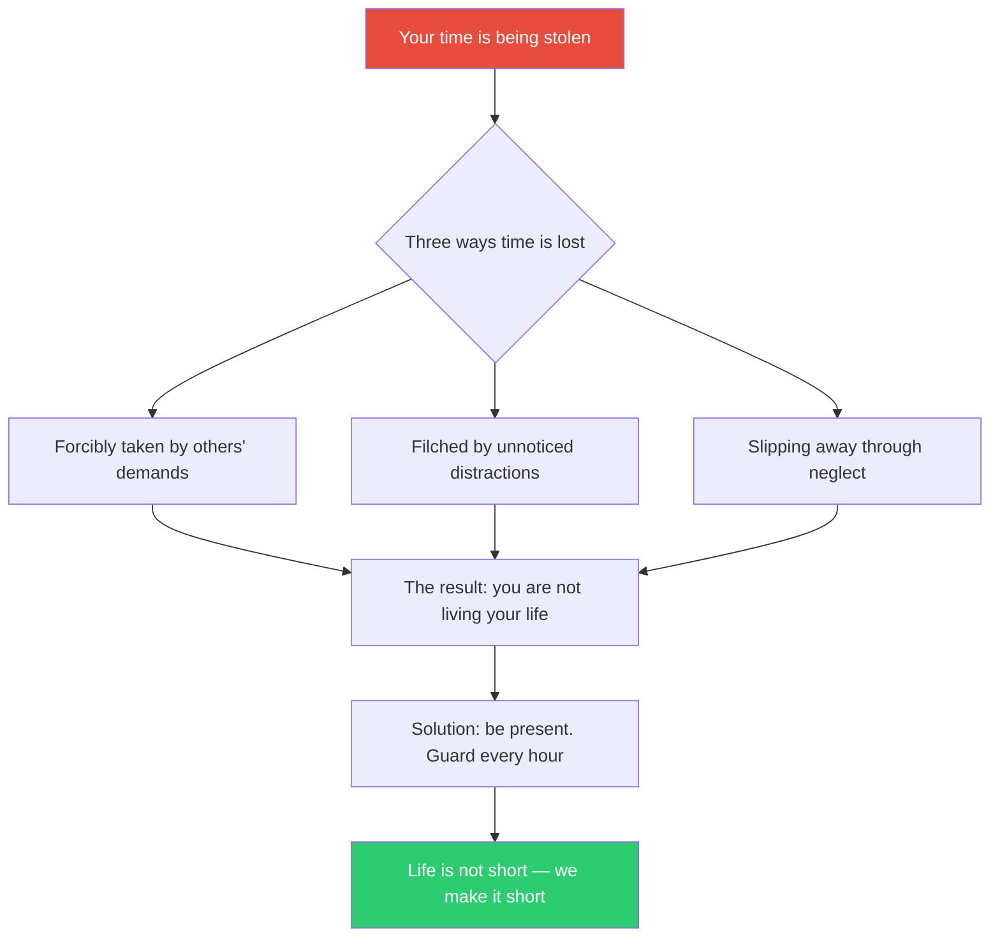
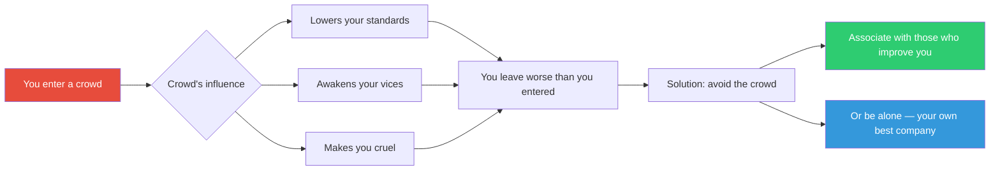
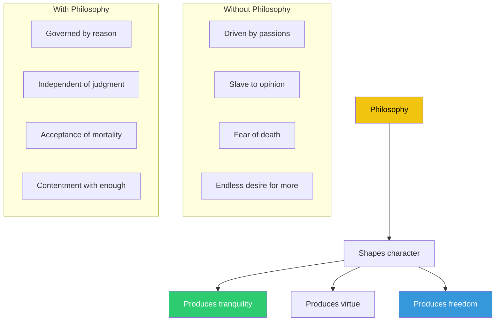
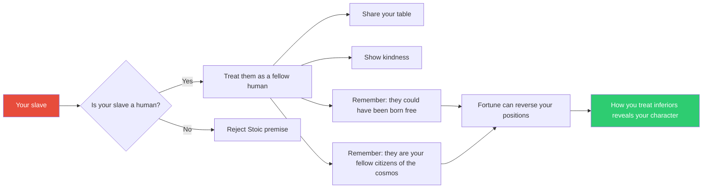
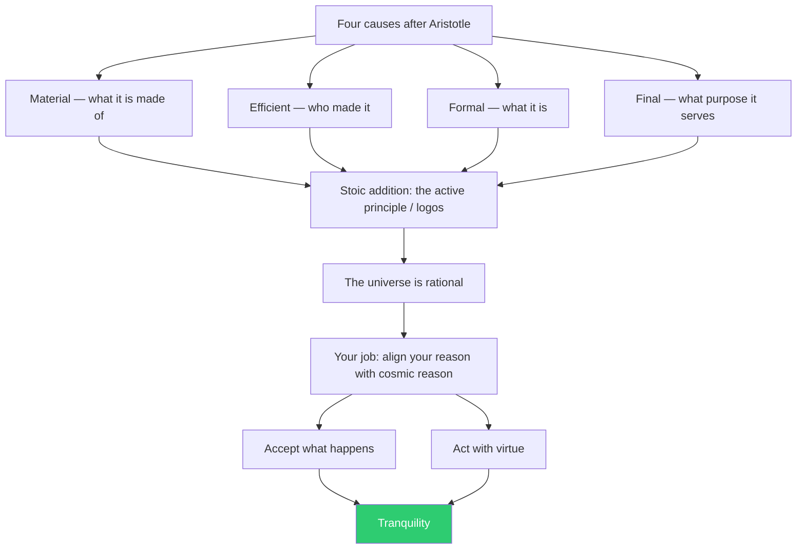
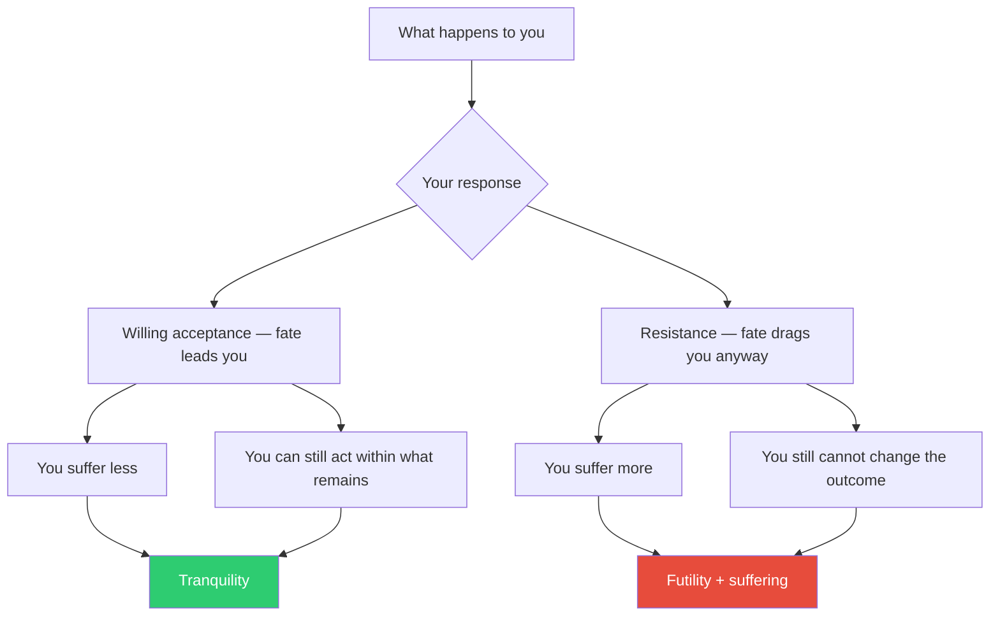

## Letter 1: On Saving Time

Seneca opens with a punch: "Vindica te tibi" — reclaim yourself for
yourself. Time is the only resource that, once spent, cannot be
recovered. People guard their money obsessively but let their hours
drain away without a thought.

The philosophical move: Seneca collapses "saving time" into "saving
yourself." To waste time is to waste your life, because your life
*is* time. The letter ends with a maxim from Epicurus (a pattern
Seneca follows in early letters): "It is not that we have a short
time to live, but that we waste a lot of it."

---

## Letter 7: On Crowds and the Gladiatorial Arena

Seneca reports a visit to the midday games — the slaughter of
unarmed prisoners by armed fighters. His horror is palpable. He
leaves more cruel, less human than he entered. The crowd infects
you with its vices.

This letter contains the first extant moral objection to gladiatorial
combat from a pre-Christian writer. Seneca is not objecting to the
death itself — he is objecting to the moral corruption it produces in
the spectators. The crowd's bloodlust makes you complicit in something
that damages your own soul.

---

## Letter 16: On Philosophy, the Guide of Life

Philosophy is not a subject. It is a craft — the craft of living
well. Seneca argues that just as you need a doctor for the body, you
need philosophy for the soul. Without it, you drift.

The key insight: philosophy is not about abstract knowledge. It is
about *formation* — shaping who you are at the level of character.
If your study of philosophy does not make you kinder, calmer, braver,
or wiser, you are doing it wrong.

---

## Letter 47: On Slaves and Masters

One of the most remarkable letters in the collection. Seneca argues
that slaves are human beings — "born of the same stock" as their
masters — and should be treated with dignity and kindness.

Seneca's argument is grounded in Stoic cosmopolitanism. All humans
share the same rational nature; social status is an accident of
fortune. The master who treats his slaves cruelly is damaging his
own character more than theirs. The letter is radical for its time
— and remains a powerful challenge to anyone in a position of power
over others.

---

## Letter 65: On the First Cause

The most philosophically technical letter in the Campbell selection.
Seneca discusses Aristotelian and Platonic theories of causation,
then argues that Stoic physics ultimately leads to the same ethical
conclusion: accept the universe as it is.

Seneca's point: the deep physics of causation ultimately returns to
how you should live. If the universe is rational (providence), align
with it. If it is random (atoms), create order within your own mind.
Either way, the ethical demand is the same.

---

## Letter 83: On Drunkenness

A classic example of Seneca's method: a concrete observation — a
discussion of whether the wise man gets drunk — expands into an
examination of self-control, habit, and the nature of virtue.

Seneca's position is characteristically practical: nobody deliberately
sets out to become a drunkard, but each drink is a choice that
accumulates. The same logic applies to any vice: you do not fall into
it at once; you walk into it step by step.

---

## Letter 88: On Liberal and Vocational Studies

Seneca attacks the educational establishment of his day. Studying
literature, music, geometry, or astronomy — the "liberal arts" — is
not the same as studying how to live. These subjects are means, not
ends. They prepare the mind for philosophy but are not philosophy
themselves.

The message is bracing: you can be a master of trivia and a fool in
life. Education without ethical formation is just ornamentation.
Seneca would have little patience for modern credential inflation.

---

## Letter 107: On Obedience to the Universal Will

The most famous single line in Seneca: "Ducunt volentem fata, nolentem
trahunt" — Fate leads the willing, drags the unwilling. The letter
is Seneca's most sustained treatment of the Stoic doctrine of
acceptance.

The doctrine is not fatalism: within the scope of what you can
control — your judgments, choices, and actions — you remain free.
But resisting the inevitable is like fighting the current of a river.
You will lose, and exhaust yourself in the process.

---

## Letter 16: On Brawn and Brains (Letter 15 in some editions)

Seneca contrasts physical training with mental cultivation. A strong
body is not useless, but developing it at the expense of the mind is
a tragedy. The pursuit of wisdom is the only exercise that never loses
its value.

---

## The Epistolary Arc: Lucilius's Progress

Seneca's letters follow a deliberate pedagogical arc. Tracking
Lucilius's development reveals the structure of Seneca's teaching:

| Stage | Letters | What Happens |
|---|---|---|
| Beginner | 1–10 | Basic maxims; quotes from Epicurus; focus on time, crowds, friendship |
| Intermediate | 11–33 | Deeper themes (death, virtue, fear); Seneca stops offering maxims and demands independent judgment (Letter 33) |
| Advanced | 34–65 | Technical philosophy (causation, the good, the sage); Lucilius asks harder questions |
| Mastery | 66–124 | Lucilius is philosophically mature; Seneca shifts to advanced topics and reflection on the philosophical life |

The turning point is Letter 33, where Seneca refuses to continue
providing pithy maxims. Lucilius must now think for himself — and
so must the reader. This is the pedagogical masterstroke: the letters
teach Stoicism not just by stating its principles but by modeling
the process of philosophical maturation.

---

## Core Concepts Glossary

**Vindica te tibi** — "Reclaim yourself for yourself." The opening
injunction of Letter 1. To have ownership of your own time and
attention is the foundation of the philosophical life.

**Indifferents** — Things that are neither good nor evil in themselves.
Wealth, health, reputation, poverty, disease, obscurity — all are
indifferents. Some are "preferred" (wealth over poverty), but none
affect whether you live well. Only virtue is good; only vice is evil.

**Premeditatio Malorum** — The premeditation of evils. Visualizing
potential misfortunes in advance so that they never arrive as a shock.
"What is quite unlooked for is more crushing in its weight," Seneca
writes. The practice is not pessimism — it is psychological
preparedness.

**Memento Mori** — Remember you will die. Not as a threat, but as a
clarifying tool. "Let us prepare our minds as if we had come to the
very end of life. Let us postpone nothing. Let us balance life's
accounts every day."

**The Sage** — The idealized perfectly wise person. No one has fully
achieved this state (Seneca calls it "rarer than the phoenix"). But
the sage serves as a regulative ideal — a target to aim at even if
never quite reached.

**Cosmopolitanism** — The Stoic doctrine that every rational being is
a citizen of the universe (cosmos), not of any particular city. Local
loyalties are real but secondary. The wise person treats all humans as
fellow citizens.

**Fate and Providence** — The Stoic view that the universe is governed
by a rational principle (logos, providence). Events unfold according
to a causal chain. Freedom consists not in escaping this chain but in
willing what nature already intends.

**Ducunt volentem fata, nolentem trahunt** — "Fate leads the willing,
drag the unwilling." The most famous line in the letters. The choice
is not whether fate will happen, but whether you run ahead of it or
are dragged behind.

**Amicitia** — Friendship in the Stoic sense. Not utility-based or
pleasure-based relationships, but a partnership in virtue between two
people committed to each other's moral improvement.

**Otium** — Retirement or leisure, but in Seneca's sense: the
withdrawal from public life necessary for philosophical reflection.
Seneca defends otium as a positive good, not just an absence of work.
