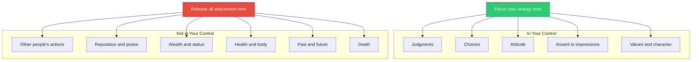
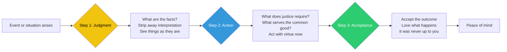
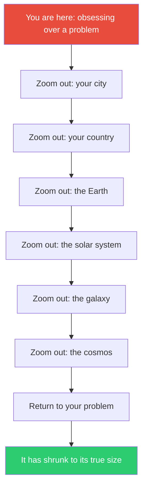
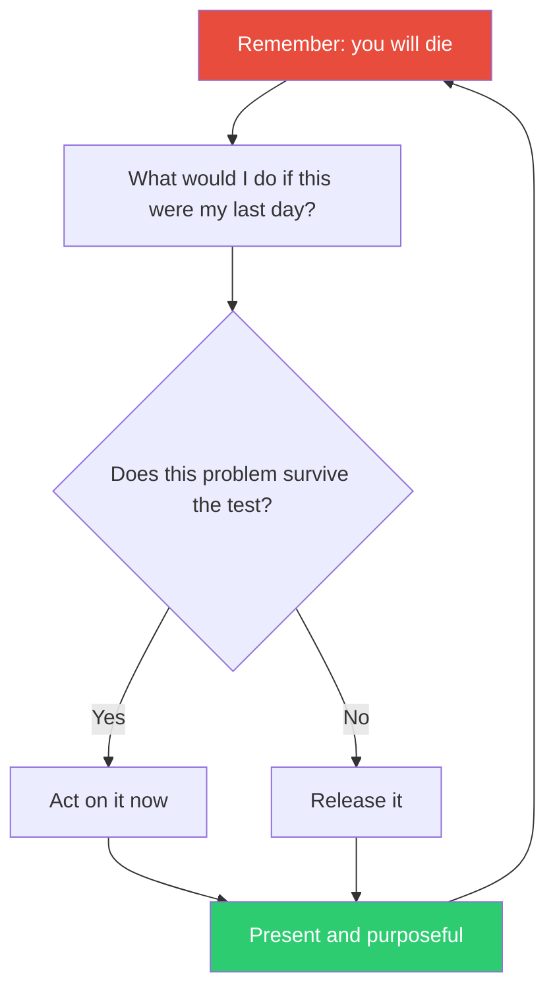
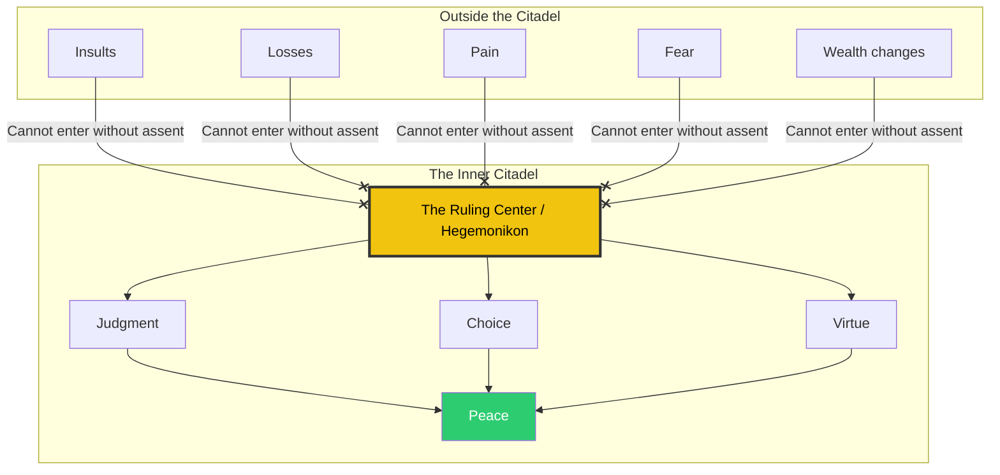
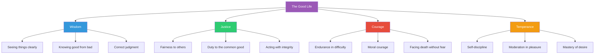

## The Dichotomy of Control

The bedrock of Stoic ethics, inherited from Epictetus and reinforced
by Marcus in every book. Some things are up to us; most are not. The
mistake that causes almost all human suffering is treating things
outside our control as if they were within it.

Marcus's version: "You have power over your mind — not outside events.
Realize this, and you will find strength." The principle is not passive
resignation. It is radical redirection of effort. Every ounce of energy
spent worrying about what you cannot control is stolen from what you
can.

---

## The Stoic Decision Framework

For every decision, Marcus proposes a three-step mental procedure:
objective judgment, unselfish action, willing acceptance of outcomes.
This is the practical engine of the entire philosophy.

Marcus's concise version (Meditations 9.6): "Objective judgment, now,
at this very moment. Unselfish action, now, at this very moment.
Willing acceptance — now, at this very moment — of all external events.
That's all you need."

---

## The View From Above

One of Marcus's signature spiritual exercises. When overwhelmed by a
problem, zoom out — to the scale of the city, the empire, the Earth,
the cosmos. Watch your concern shrink to its proper size.

Marcus writes: "You have the power to strip away many superfluous
troubles located wholly in your judgment, and to possess a large room
for yourself embracing in thought the whole cosmos, to consider
everlasting time, to think of the rapid change in the parts of each
thing."

The View from Above is not nihilism. It is precision targeting: it
identifies the problems that are actually important (virtue, justice,
character) and dissolves the ones that are not (status, grudges,
trivial anxieties).

---

## Memento Mori

Contemplation of death is perhaps Marcus's most frequently used tool.
He returns to it in every book. The purpose is not to depress — it is
to clarify. If you could die today, what would change?

"You could leave life right now. Let that determine what you do and say
and think." The logic: if death is always possible, then postponing
virtue is absurd. The present moment is not practice for life. It *is*
life.

---

## The Inner Citadel

The mind as an impregnable fortress. No external event can harm it
without your consent. People can insult you, the empire can crumble,
you can lose everything — but your ruling center remains free.

"External things are not the problem. It is your judgment of them. And
you can erase that judgment at any time." The citadel metaphor is not
about isolation — it is about sovereignty. You are the ruler of your
inner world. Nothing can depose you but yourself.

---

## The Four Cardinal Virtues

Stoic ethics organizes all good character around four master virtues.
Marcus does not treat these as abstract categories — they are the
operating system for every decision.

Marcus's most famous formulation (from Plato via Stoic tradition):
"Justice is the source of all the other virtues, for without it,
courage becomes brutality, wisdom becomes cunning, and temperance
becomes repression."

---

## Book-by-Book Themes

### Book 1: Debts and Lessons

A catalogue of gratitude. Marcus thanks his grandfather, his mother, his
adoptive father Antoninus Pius, his teachers Rusticus and Apollonius,
and the gods. Each entry names a specific virtue he learned from that
person: not to be angry, to endure hardship cheerfully, to judge before
speaking, to value reason above everything.

This is the most personal book. It reveals what Marcus valued before he
began to argue with himself: gentleness, patience, freedom from
passion, the ability to listen, and the refusal to be impressed by
wealth or status.

### Book 2: Waking to the Day

The famous morning practice. "At the start of the day tell yourself: I
shall meet people who are officious, ungrateful, abusive, treacherous,
malicious, and selfish." The purpose is not cynicism but preparation —
the Stoic premeditation of adversity (praemeditatio malorum). By
expecting the worst, you are never surprised by it and can respond with
virtue rather than shock.

The book also introduces the cosmic perspective: life is brief, change
is constant, and only philosophy can keep your ruling center steady.

### Book 3: Tools at Hand

Marcus compares philosophy to a doctor's instruments — they must be
ready when needed. The core exercise: analyze every event into its
component parts. Strip away the narrative and see what is actually
there. "A thing is what it is, nothing else."

He emphasizes the importance of acting with "reservation" — doing your
best while accepting that outcomes are not up to you. This is the
origin of the modern Stoic "inner goal vs. outer goal" distinction.

### Book 4: The Inner Fortress

The most quoted book. "Choose not to be harmed — and you won't feel
harmed. Don't feel harmed — and you haven't been." This is the inner
citadel in its strongest form.

Marcus also introduces the recurring image of constant change: "Like a
river, all things are flowing. Cause and action are in continual flux."
Nothing is permanent, so attachment to anything is irrational. The
tranquil person is the one who flows with reality rather than
resisting it.

### Book 5: The Work of Being Human

Your job is not to be a perfect philosopher — it is to be human. And
being human means encountering obstacles, adapting to them, and
turning them into opportunities for virtue.

"A directing mind accustomed to understanding the nature of each
individual thing and to penetrating the whole structure of things will
find it quite easy to adapt to what happens." The obstacle becomes the
way.

### Book 6: Harmony with Nature

The entire universe is governed by a rational principle — the logos.
Living well means aligning your personal reason with this universal
reason. "Everything harmonizes with me which is harmonious with you,
O universe."

Marcus also tackles fame: posthumous reputation is meaningless because
the future will forget you just as the present already does. The only
audience that matters is your own conscience.

### Book 7: The Whole and the Parts

We are all parts of a single body — humanity. To harm another person is
to harm yourself, because you are cutting against the organic unity of
rational beings.

Marcus introduces the "reserve clause" — the practice of acting while
silently adding "fate permitting." This is not hedging. It is
acknowledging reality: you control the attempt, not the outcome.

### Book 8: Stay at the Task

Stop talking about what the good person is like. Be one. Marcus
returns repeatedly to the danger of philosophical posturing — using
Stoic principles to impress others rather than to live better.

He also emphasizes action in the present. Not next year, not when
conditions improve. "Do what nature requires now. Start where you are.
Use what you have."

### Book 9: Justice Is Piety

To act unjustly is to be impious — it violates the rational structure
of the universe. Marcus makes no separation between ethics and
religion. Living virtuously *is* reverencing the gods.

The book also addresses the "providence or atoms" question: whether the
universe is governed by divine reason or random chance. Marcus's
answer: it does not matter. Either way, your job is the same — to live
virtuously in the present moment.

### Book 10: Simplify

The most practical book. Marcus urges: cut desire, cut worry, cut
complexity. The soul's job is simple: act justly, accept what happens,
and be satisfied with what you have.

He also offers psychological exercises: ask yourself "What is my ruling
center doing with itself right now?" and "What is this person's ruling
center doing?" This practice of seeing the inner state of yourself and
others is the core of Stoic mindfulness.

### Book 11: The Soul's True Powers

The soul can always choose its response. No one can prevent you from
being just, patient, courageous, or kind. The only person who can harm
your character is you.

Marcus includes a famous taxonomy of the "ten commandments of Stoic
practice" — a list of reminders about dealing with difficult people,
including: they act from ignorance; you and they are kin; no one can
harm you without your consent; anger is not useful.

### Book 12: The Final Reflections

The closing book reads as a summary — Marcus distilling everything into
its essence. "A human being's true happiness consists in doing what is
proper to human nature, which is to act with kindness toward others and
to despise the movements of the senses."

His final meditation on death: "You have lived as a citizen of the
great city. It does not matter whether for five years or fifty. What
the law of the city ordains is equally fair for every citizen. So what
is there to fear?"

---

## Core Concepts Glossary

**Hegemonikon** — The ruling center or directing mind. The part of you
that chooses, judges, and assents. It is the seat of moral agency and
remains free regardless of external circumstances.

**Phantasiai** — Impressions or representations. The raw data of
experience — what appears to the mind before judgment. You cannot stop
impressions from arriving, but you control whether you assent to them.

**Synkatathesis** — Assent. The act of agreeing or disagreeing with an
impression. This is where freedom lives: between the impression and
your response.

**Horme** — Impulse or action tendency. What you are moved to do.
Stoic training involves disciplining impulse so that it aligns with
reason and virtue.

**Logos** — The rational principle that orders the universe. Both the
cosmic logos (the nature of reality) and the human logos (our capacity
for reason) are manifestations of the same thing. Living well means
bringing your logos into harmony with the cosmic logos.

**Prohairesis** — Moral character or will. The faculty of choice that
makes you who you are. Epictetus's term, absorbed by Marcus.

**Ta eis heauton** — The original Greek title: "To Himself." The work
was never meant for public consumption.

**Amor Fati** — Love of fate. Not just accepting what happens but
actively wanting it because it is what reality delivered.

**Memento Mori** — Remember you will die. Not as a threat but as a
clarifying tool for prioritization.

**Premeditatio Malorum** — The premeditation of evils. Visualizing
potential setbacks in advance so they do not catch you off guard.
