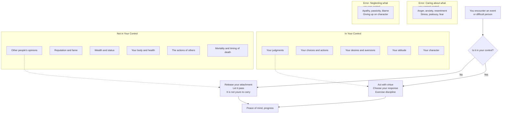
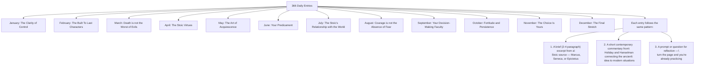

## The Three Pillars

The Daily Stoic organizes its 366 entries around overlapping themes, but three concepts receive the most weight. Understanding them deeply is what separates a casual reader from a practitioner.

---

## 1. The Dichotomy of Control

This is the Stoic first principle and the bedrock of all Stoic practice. Epictetus's Enchiridion opens with it: "Some things are in our control and others not." Holiday and Hanselman return to it throughout the year, using it as the lens through which all other Stoic ideas are interpreted.



The practical test: when you feel a negative emotion, immediately ask — is this about something I control, or something I don't? If it's not yours to control, you are choosing to suffer. Exposure to this question dozens of times a day gradually reconditions your response to every situation.

Daily Stoic entry theme: January (The Clarity of Control), May (The Art of Acquiescence), September (Your Decision-Making Faculty), November (The Choice Is Yours)

---

## 2. Amor Fati — Love Your Fate

Amor Fati is not passive acceptance. It is active, enthusiastic embrace of everything that happens — including obstacles, pain, loss, and surprise. Nietzsche later made this famous; Marcus lived it. Holiday frames it as the difference between "dealing with" something and wanting nothing else:

```mermaid
flowchart LR
  A[An obstacle appears<br/>challenge, setback, pain] --> B{How do you respond?}

  B --> C[Avoid / resist / resent<br/>"This shouldn't happen to me"]
  C --> C1[Energy wasted in resistance<br/>Identity weakened<br/>Problem persists]

  B --> D[Accept / embrace / fuel<br/>"I'm glad this happened"]
  D --> D1[This becomes my material<br/>This is the training<br/>This is the path]

  A --> D

  D --> E[Amor Fati in Practice]
  E --> E1[Getting fired?<br/>Fuel for your next chapter]
  E --> E2[Criticism?<br/>Data on how to serve better]
  E --> E3[Rejection?<br/>Redirection toward the right door]
  E --> E4[Physical limitation?<br/>Focus on what you still control]

  style C1 fill:#e74c3c,color:#fff
  style E1 fill:#2ecc71,color:#fff
  style E2 fill:#2ecc71,color:#fff
  style E3 fill:#2ecc71,color:#fff
  style E4 fill:#2ecc71,color:#fff
```

Marcus's formulation (*Meditations* 4.43): "A blazing fire makes flame and brightness out of everything that is thrown into it." Amor Fati is that fire. Every event — loss, insult, delay, injury — is fuel. The Stoic does not hope for easy conditions. The Stoic becomes the kind of person for whom conditions do not matter.

Daily Stoic entry theme: February (The Built To Last Characters), June (Your Predicament), October (Fortitude and persistence)

---

## 3. Memento Mori — Remember Death

Death is the most universal human experience and the most avoided topic. The Stoics believed that if you truly absorbed the reality of your own mortality, you would change almost everything about how you spend your days. Memento Mori is not a meditation designed to make you sad — it is a tool that makes you deliberate.

```mermaid
flowchart TD
  A[Memento Mori<br/>You will die. Sooner than you think.] --> B{What changes<br/>if I act as if<br/>today matters most?}
  B --> C[Stop delaying what matters]
  B --> D[Stop fearing what doesn't]
  B --> E[Stop taking people for granted]

  C --> F[Practice today,
  not tomorrow]
  D --> G[The obstacle is
  the way — face it]
  E --> H[Love
  more openly]

  A --> I[Seneca: "Let us
  prepare our minds
  as if we'd come to
  the very end of life."]
  I --> J[Seneca: "You are
  not so business that
  you must neglect
  your own soul."]

  A --> K["Marcus: 'You
  could leave life
  right now.
  Let that determine
  what you do and say
  and think.'"]

  style A fill:#e74c3c,color:#fff
  style F fill:#2ecc71,color:#fff
  style G fill:#3498db,color:#fff
  style H fill:#f39c12,color:#000
```

The Stoic practice is not a one-time crisis reflection. It is a daily drill: you wake up, you remember you could die today, and you ask whether what you're about to do is worth doing if this is the last version of yourself. Most people have not thought seriously about their death in years. The Stoics contemplate it daily.

Daily Stoic entry theme: March (Death is not the worst of evils), August (Courage is not the absence of fear), December (The Final Stretch)

---

## Summary: The Daily Stoic Structure

The book is organized as 366 themed entries, covering:



The three Stoic authors — and what each contributes to the book:

| Author | Role | Why They Appear |
|---|---|---|
| Marcus Aurelius | Emperor philosopher; wrote a journal for himself | Teaches inner fortitude, decision-making, accepting difficulty |
| Seneca | Statesman, playwright, advisor to Nero; wrote letters | Teaches practical ethics, mortality, the examined life |
| Epictetus | Former slave, teacher in Athens; recorded by Arrian | Teaches the dichotomy of control with crystalline precision |

---

## The Daily Practice
The book's purpose is to replace received habits with designed habits. The Stoic day:

**Morning (before work begins):** 2–3 minutes. Read that day's entry. Write one sentence on how you will apply it. This is not journaling in the expressive sense — it is pre-commitment, written in advance of the day's challenges.

**During the day:** When you encounter difficulty, recall the day's theme. Is this something you control? What does it mean to love this? What would this look like if it were easy? One-page Stoicism is useless as abstract knowledge. It only works if it surfaces when you need it.

**Evening (before sleep):** Review your actions. What went well? Where did you slip? Which emotion did you not regulate well? Did you maintain the dichotomy of control? The evening review was Seneca's daily exercise; Marcus reviewed his actions before bed; Epictetus asked his students to mentally replay their day at night.
