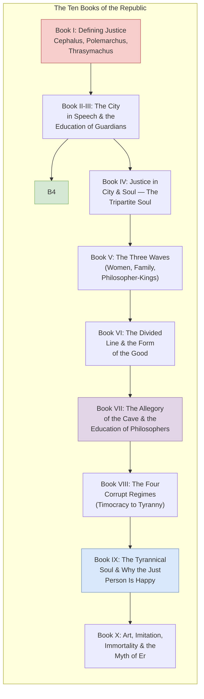
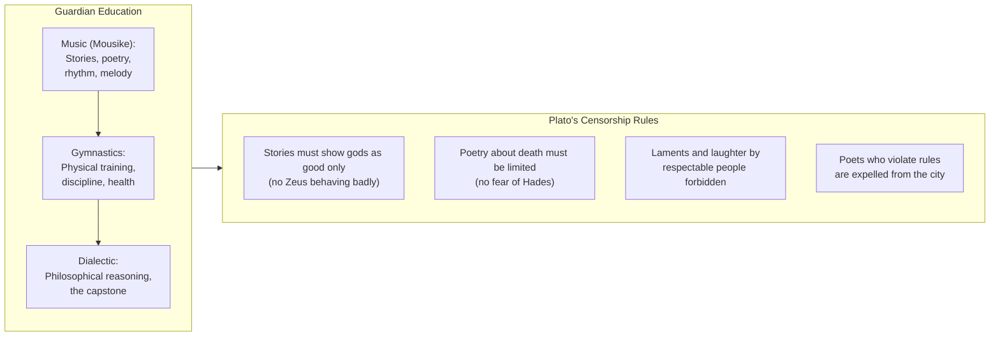
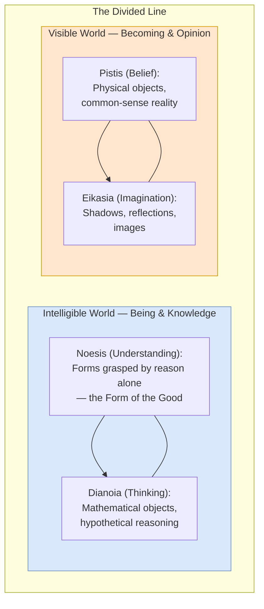
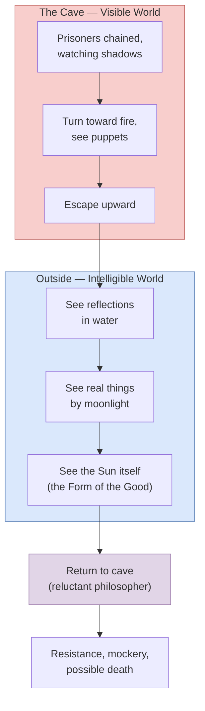
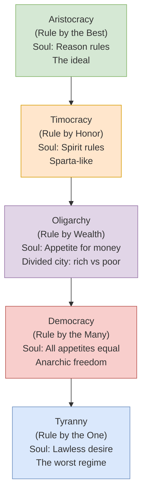

## The Structure of the Work

*The Republic* is divided into ten books. The dialogue form allows
Plato to develop arguments through refutation and counterexample.
The overall arc moves from the question "what is justice?" through
the construction of an ideal city, the education of its guardians,
and the nature of the soul, to a final myth about the afterlife.

---

## Book I: What Is Justice?

Socrates encounters Cephalus, Polemarchus, and Thrasymachus. Three
definitions of justice are proposed and refuted:

| Interlocutor | Definition | Socrates' Refutation |
|---|---|---|
| **Cephalus** | Justice = telling the truth and paying debts | Returning a weapon to a madman is truthful but harmful |
| **Polemarchus** | Justice = giving each what is owed; benefiting friends, harming enemies | We cannot reliably tell friends from enemies; harming anyone makes them worse (more unjust) |
| **Thrasymachus** | Justice = the advantage of the stronger (might makes right) | Rulers can err; every art seeks the advantage of its subject, not the practitioner |

The refutation of Thrasymachus is the dialogue's first major
set-piece. Thrasymachus argues that justice is whatever the ruling
power decrees in its own interest. Socrates counters that (1)
rulers sometimes err, so obeying them does not always serve their
interest, and (2) every genuine art (medicine, navigation, ruling)
aims at the good of its subject, not the practitioner.

---

## Book II-III: The City in Speech

Glaucon and Adeimantus challenge Socrates: show that justice is
good for its own sake, not just for its rewards. Glaucon tells
the story of the **Ring of Gyges** — a shepherd who finds a ring
of invisibility and uses it to commit crimes with impunity. If
justice is only chosen for its consequences, the perfectly unjust
man who appears just would be happier than the truly just man who
appears unjust.

Socrates responds by building a city in speech — first a "healthy"
city of basic needs (the "city of pigs"), then a "luxurious" city
that requires war, hence guardians.

### The Education of the Guardians

The guardians require a rigorous education:

Plato's censorship of poetry is among the most controversial ideas
in *The Republic*. Poets are "makers of images" who corrupt the
young by depicting gods as immoral and heroes as cowardly. Only
hymns to the gods and praises of good men are permitted.

### The Noble Lie

To bind the city, Socrates introduces a "Phoenician" myth: all
citizens are born from the earth and have gold, silver, or bronze
mixed into their souls. Rulers have gold, auxiliaries silver,
farmers and craftsmen bronze. Children may be moved up or down
based on their nature. The lie is "noble" because it serves social
unity — though critics have called it the prototype of totalitarian
propaganda.

---

## Book IV: Justice Defined

Having constructed the ideal city, Socrates locates the four
cardinal virtues:

| Virtue | Location in City | Location in Soul |
|--------|------------------|------------------|
| **Wisdom** | Rulers (guardians) | Reason |
| **Courage** | Auxiliaries (soldiers) | Spirit |
| **Temperance** | All classes (agreement on who rules) | Harmony of all parts |
| **Justice** | Each part doing its own work | Reason rules, spirit supports, appetite obeys |

### The Tripartite Soul

Socrates argues that the soul has three parts, discovered through
psychological conflict:

- **Reason** (*logistikon*): loves truth, calculates, ought to rule
- **Spirit** (*thymos*): loves honor, anger, and recognition; the
  natural ally of reason
- **Appetite** (*epithymia*): loves food, drink, sex, and money;
  the many-headed beast that must be controlled

Justice in the soul = each part doing its proper work, with reason
ruling and the other parts not rebelling. Injustice = civil war in
the soul.

---

## Book V: Three Waves

Book V addresses three "waves" of paradox that threaten to swamp
the argument:

1. **Women as guardians.** Women and men have the same nature for
   guardianship. Women are weaker but not different in kind. Female
   guardians receive the same education and share the same duties.
   (This was radical for 4th-century Athens.)

2. **Community of wives and children.** Guardians live communally —
   no private families, no private property. Children are raised
   collectively so no guardian knows which child is theirs. This
   eliminates faction and ensures unity.

3. **Philosophers must rule.** The third and largest wave: unless
   either philosophers become kings or kings become philosophers,
   there will be no rest from evil for cities.

---

## Book VI: The Philosopher and the Good

Socrates defends the philosopher against the charge of uselessness.
True philosophers are those who love the sight of truth, who
grasp the Forms rather than mere particulars. They have a
philosophical nature: truthfulness, high-mindedness, justice,
gentleness, and quickness to learn.

### The Divided Line

Socrates distinguishes four levels of cognition, arranged in
proportion:

### The Form of the Good

The Good is "beyond being" — it is the source of reality,
truth, and knowledge, yet is not identical with any of them.
The sun analogy: as the sun illuminates visible things and makes
them grow, so the Good illuminates intelligible things (the Forms)
and makes them knowable.

---

## Book VII: The Allegory of the Cave

The most famous passage in Western philosophy. Prisoners are
chained in a cave their whole lives, facing a wall. Behind them,
a fire casts shadows of puppets onto the wall. The prisoners take
these shadows for reality. One prisoner is freed, turns, sees the
fire and puppets, then ascends to the outside world where he sees
real things and finally the sun.

The allegory maps to the divided line:
- Shadows on wall = *eikasia* (imagination)
- Puppets and fire = *pistis* (belief)
- Reflections outside = *dianoia* (thinking)
- The sun = *noesis* (understanding / the Form of the Good)

The philosopher must return to the cave to rule — even though
doing so means leaving the bliss of contemplation for the
darkness of politics. This is the central moral claim of the
dialogue: the just person does not merely contemplate the Good
but acts on it for the sake of others.

---

## Book VIII: The Decline of Regimes

Socrates traces the descent from the ideal (aristocracy, rule by
the best) through four corrupt regimes:

Each regime corresponds to a type of human soul and a dominant
psychological principle. The sequence is causal: timocracy
collapses into oligarchy when honor-lovers accumulate wealth;
oligarchy into democracy when the poor revolt against the rich;
democracy into tyranny when the people's desire for total freedom
leads to chaos and a strongman.

Plato's critique of democracy is subtle. He acknowledges its
attractions — freedom, diversity, equality — but argues that its
inability to distinguish good desires from bad ones makes it
unstable. The democratic person lives by whim, refusing to
let reason rule, and eventually becomes a tyrant's prey.

---

## Book IX: The Tyrannical Soul and the Happy Just Person

Socrates compares the three types of soul:

| Type | Ruling Part | Pursues | Pleasure | Conclusion |
|------|-------------|---------|----------|------------|
| **Philosopher** | Reason | Wisdom, truth | True, stable, pure | **Happiest** |
| **Honor-lover** | Spirit | Victory, reputation | Mixed | Second |
| **Money-lover** | Appetite | Gain, bodily pleasure | Apparent only | Third; **tyrant is worst** |

The tyrant's soul is "the most miserable of all." He is ruled by a
lawless erotic desire that never rests. He is paranoid, enslaved,
poor (despite ruling), and friendless. In the most famous proof:
the philosopher-king experiences 729 times more pleasure than the
tyrant (3 x 3 x 3 x 3 x 3 x 3 — the cube of the cube of the ratio
3:1, representing three parts of the soul at three levels of
comparison).

---

## Book X: Art, Imitation, and the Myth of Er

Plato's critique of art: poetry and painting are imitations of
imitations (thrice removed from the Form), appealing to the lower
part of the soul. Poets are expelled from the ideal city.

The dialogue ends with the **Myth of Er** — a soldier who dies,
witnesses the judgment of souls, and returns to life. Souls choose
their next lives in a cosmic lottery. Justice is ultimately
rewarded, injustice punished across multiple lives. The message:
"we must hold to the upward path and pursue justice with wisdom,
so that we may be friends to ourselves and to the gods."

---

## Key Lessons

- **Justice is not about external rewards.** It is the health
  of the soul. The just person is happier than the unjust person
  regardless of what happens to them.
- **The city is the soul writ large.** Political philosophy and
  psychology are inseparable. The structure of a society reflects
  and shapes the character of its citizens.
- **Knowledge is the only legitimate basis for power.** Those who
  do not know the Good cannot govern well. Democracy fails because
  it lets the ignorant rule.
- **Education is the turning of the soul.** It does not put sight
  into blind eyes but turns the whole soul toward the light.
- **The Forms explain everything.** Without a stable reality beyond
  appearances, knowledge, morality, and meaning collapse.
- **Freedom without wisdom is self-destructive.** The democratic
  desire for limitless liberty produces the conditions for tyranny.

---

## Practical Applications

### For Thinking About Justice
- Ask not just "what is fair?" but "what makes a person (or
  institution) well-ordered?"
- Consider whether your values serve harmony or internal conflict

### For Critical Thinking
- Practice the "turning of the soul" — actively seek perspectives
  that challenge your assumptions
- Distinguish between shadows (appearances) and real things
  (underlying truths)

### For Education
- Plato's insight that education is about orientation, not
  information-dumping, is more relevant than ever
- Ask: what is the "sun" (the first principle) of your field?

### For Politics
- Be suspicious of leaders who lack philosophical depth
- The health of a state depends on the character of its citizens,
  not just its institutions

---

## Action Plan

1. **Read the Allegory of the Cave (514a-520a).** Read it twice —
   once literally, once as allegory. Map each element.

2. **Follow the Thrasymachus argument in Book I.** Identify the
   logical moves. Is Socrates fair to Thrasymachus?

3. **Compare Glaucon's challenge with your own moral intuitions.**
   Would you be just if you had the Ring of Gyges? What does your
   answer tell you?

4. **Evaluate Plato's tripartite soul.** Does it capture your
   experience of internal conflict? What does it leave out?

5. **Read Popper's *The Open Society and Its Enemies* alongside.**
   The critique of Plato as totalitarian is itself a philosophical
   classic.

6. **Compare Plato's democracy-to-tyranny thesis with actual
   historical cases.** Weimar Germany, post-Soviet states,
   contemporary democratic backsliding.

7. **Write your own "myth of the metals."** What founding story
   would you tell to unite a diverse society today?
