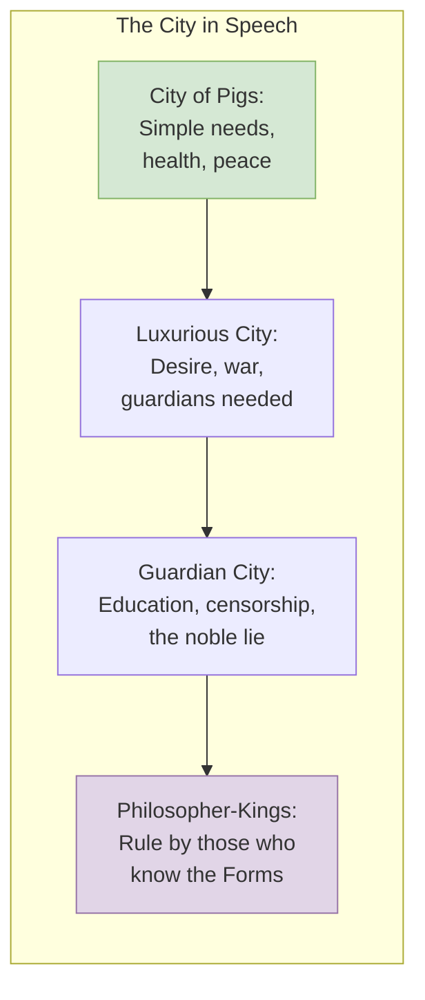
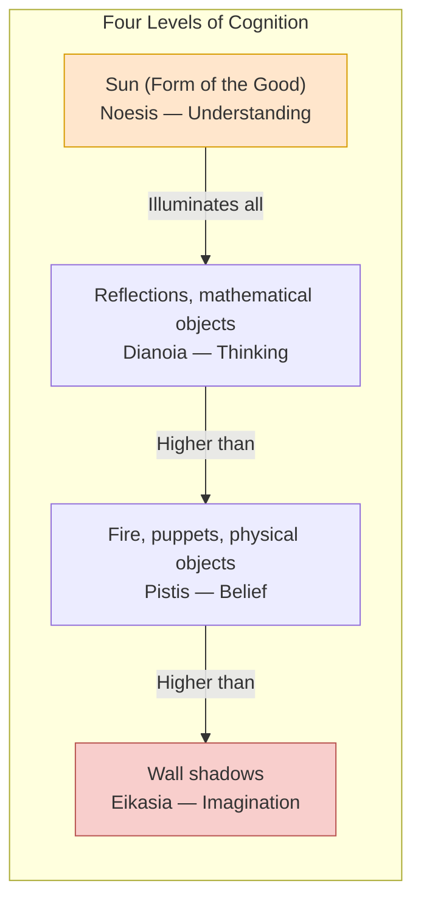

## Introduction

Welcome to BookAtlas. Today: *The Republic* by Plato. Written
around 375 BC. Ten books. Infinite commentary. The book that
invented political philosophy, then gave its critics the weapons
to attack it.

This conversation is between two readers. One is a Platonist who
thinks *The Republic* is the greatest work of philosophy ever
written — a vision of justice that still illuminates. The other
is a liberal democrat who thinks Plato is the founding father of
totalitarianism — brilliant, dangerous, and wrong.

Let's begin.

---

## The Opening: Why Justice?

The dialogue starts with Socrates at the Piraeus, Athens's port.
He's been attending a religious festival. Cephalus, an old
businessman, starts the conversation.

**Platonist:** Notice the setting. The Piraeus was a cosmopolitan,
democratic, commercial hub — everything Socrates (and Plato)
distrusted. The dialogue physically moves from the busy port into
the quiet home of Cephalus. That's the movement of philosophy:
away from noise, toward reflection.

**Liberal:** Sure, but the very first argument should make you
uncomfortable. Cephalus says justice is paying your debts and
telling the truth. Socrates destroys this with one counterexample:
returning a weapon to a madman. Fine. But then Polemarchus says
justice is helping friends and harming enemies, and Socrates
destroys that too. By the end of Book I, every conventional
definition of justice has been demolished. And what has Socrates
built? Nothing. He is purely destructive at this stage.

**Platonist:** That is the Socratic method. You have to clear
the ground before you build. But the real action starts in Book II,
when Glaucon and Adeimantus throw down the gauntlet.

---

## Glaucon's Challenge: The Ring of Gyges

Glaucon tells the story of a shepherd who finds a ring that makes
him invisible. He uses it to seduce the queen, kill the king, and
become tyrant. Glaucon's question: if you had this ring, would you
be just? If the only reason you are just is fear of getting caught,
you are not really just.

**Liberal:** This is the most powerful moment in the whole
dialogue. Glaucon is asking for a reason to be good that does not
depend on consequences. And the honest answer — for most people —
is: no, I would not be just if I could get away with anything.
That is a devastating fact about human nature. Plato never really
answers it. He changes the subject to building a city.

**Platonist:** He does not change the subject. He builds the city
precisely to answer Glaucon. Justice, Plato argues, is not a
cost-benefit calculation. It is the health of the soul. The tyrant
with the ring is not happy — he is the most miserable person alive,
because his soul is in chaos. The answer to Glaucon is the whole
rest of the book.

**Liberal:** But that only works if you accept Plato's premise
that the soul has parts and that reason *should* rule. Why should
I accept that? It is a metaphor, not an argument.

**Platonist:** It is a hypothesis that explains the data of moral
experience. You have experienced internal conflict — wanting to do
something and knowing you should not. That is the tripartite soul
in action. Plato gives a model of why you feel that way. What is
your alternative?

---

## Building the City: The Imagination of Utopia

Socrates builds a city from scratch. First a simple city of needs
("the city of pigs"), then a feverish, luxurious city that requires
war, then guardians, then philosopher-kings.

**Liberal:** And here is where it gets scary. Plato starts
censoring poets. He controls what stories children hear. He bans
certain kinds of music. He tells a "noble lie" to keep people in
their place. This is not a utopia. It is a thought-police state.

**Platonist:** You are reading it anachronistically. Plato is not
proposing legislation for 20th-century liberal democracy. He is
diagnosing what a city would need to be *just*. And his diagnosis
is: it needs citizens who are not corrupted by bad stories, who
believe in their city, who know their place. If you think that is
authoritarian, fine — but then you have to explain why a city can
be just if its citizens are raised on violent, misogynistic, or
materialistic media.

**Liberal:** Because in a free society, citizens choose their own
culture. And a free society will be messy, conflicted, and often
unjust — but it is better than a perfectly just prison.

---

## The Three Waves: Women, Family, Philosophers

Book V contains three "waves" — three shocking proposals.

**Platonist:** The first wave is the most radical thing in the
book. Plato says women can be guardians. They get the same
education, the same duties, the same status. This is 375 BC in
Athens — a city where women were barely citizens. Plato was a
feminist before feminism existed.

**Liberal:** It is not that simple. Plato says women are *equal in
nature* for guardianship, but then says they are *weaker*. And his
motivation is not gender justice — it is efficiency. He wants the
best guardians regardless of sex. Women are instruments of the
city, not ends in themselves.

**Platonist:** That is still a radical claim for its time. How
many ancient texts even acknowledge that women have the same souls
as men? It took Western civilization two thousand years to catch
up to this passage.

**Liberal:** And the second wave — the abolition of the family —
is where Plato loses me entirely. No private families for
guardians. Children raised collectively. Nobody knows their own
parents or children. That is not a community. It is a factory for
producing soldiers.

**Platonist:** Plato's reasoning is clear: the family creates
faction. "Mine" and "not mine" divide people. If no guardian says
"my child" versus "your child," the city is unified. It is the
logical conclusion of putting justice above everything else.

**Liberal:** And that is exactly what is wrong with it. Justice is
not the only good. Love, family, privacy, personal relationships —
these matter too. Plato sacrifices them all to one value.

---

## The Allegory of the Cave: The Heart of the Book

The most famous passage in Western philosophy.

**Platonist:** The Cave is the book in miniature. Prisoners watch
shadows — that is *eikasia*, imagination, the lowest level of
cognition. One prisoner turns, sees the puppets and fire — that is
*pistis*, belief. He ascends, sees reflections — *dianoia*,
thinking. He sees the sun itself — *noesis*, understanding. And
then he must return.

The return is the key. The philosopher does not want to go back.
He is happy in the light. But he goes anyway — because justice
demands it. That is Plato's ethical teaching: knowledge of the
Good creates an obligation to act for others.

**Liberal:** The Cave is beautiful, but it is also the most
dangerous metaphor in the history of philosophy. It implies that
most people live in illusion, that only a few can see the truth,
and that those few have the right — the duty — to rule the rest.
That is exactly the logic of every authoritarian regime: "we know
the truth, you do not, so we must govern you for your own good."

**Platonist:** That is a valid concern, but notice two things.
First, the philosopher returns *reluctantly*. He does not want
power. He takes it as a burden. That is different from the
power-seeker who grabs control. Second, Plato is not saying
"philosophers should rule because they are smarter." He is saying
"philosophers should rule because they know the Good." If you do
not believe in the Form of the Good, you will not be convinced.
But if the Good exists, why would you want anyone else to rule?

---

## The Decline of Regimes: The Prophecy

Books VIII-IX trace the descent from aristocracy to tyranny.

**Platonist:** This is Plato's most underrated contribution. He
moves from the ideal to the real. Every actual regime is a
corruption of the ideal, and he shows *how* each one falls into
the next. Timocracy values honor, which leads to the accumulation
of wealth (oligarchy). The poor resent the rich and revolt
(democracy). Democracy's freedom produces chaos, and a savior
rises (tyranny). It is a causal theory of political decay.

**Liberal:** It is a conspiracy theory, not a theory. Real
history is more complex. Democracies do not inevitably become
tyrannies. Britain, Canada, Australia — stable democracies for
centuries. Plato is describing Athenian democracy's self-destruction
and generalizing.

**Platonist:** Let us check in with the 21st century. How many
democracies are backsliding right now? How many strongmen have
risen through democratic processes? Plato's diagnosis of democracy's
vulnerability — that its love of freedom makes it susceptible to
tyranny — looks less like ancient prejudice and more like a warning
we ignored.

---

## The Myth of Er: Why Be Just?

The dialogue ends with a myth. A soldier named Er dies, sees the
afterlife, and returns. Souls choose their next lives. The just
are rewarded, the unjust punished.

**Liberal:** And with this, Plato proves my point. If you need
an afterlife to justify justice, you have failed to show that
justice is good in itself. You have fallen back on cosmic rewards.
Glaucon asked for a reason to be just without consequences, and
Plato ends up giving him consequences.

**Platonist:** The myth does more than that. The most famous
moment in the Myth of Er is when the soul who was just in the
previous life chooses tyranny in the next life — out of habit,
without philosophy. The message is that virtue is not automatic.
You must *study philosophy* to choose well. The myth reinforces
the central argument: only the philosophical soul knows how to
choose.

**Liberal:** But the myth says nothing about whether the
philosophical soul is happier. It says the just are rewarded in
the afterlife. That is piety, not philosophy.

**Platonist:** Or it is Plato being realistic. Arguments only go
so far. At the end of a ten-book dialogue, after three hundred
pages of argument, Plato tells a story. Maybe he knows that
argument alone cannot change a soul. Maybe that is the deepest
insight of all.

---

## The Verdict: Should You Read This Book?

**Platonist:** Yes. There is no book more important to read.
Not because Plato is right — he is often wrong — but because he
sets the questions that every philosopher since has tried to
answer. What is justice? Why be good? What is knowledge? What is
the best society? If you have not read *The Republic*, you do not
know where our intellectual world came from.

**Liberal:** Read it — but read it with your eyes open. Read it
alongside Popper's critique, Aristotle's critique, and the
experience of people who have actually lived under regimes that
claimed to know the truth. *The Republic* is a genius-level
argument for a society most of us would not want to live in.
That tension is what makes it worth reading.

**Platonist:** That is exactly right. A book that makes you
think harder about justice — even if you reject every specific
proposal — is a book that has done its job. *The Republic* has
been doing that job for 2,400 years. It is not done yet.

---

## Final Thoughts

*The Republic* is not a book you finish. It is a book you return
to at different stages of life. At twenty, you admire the radical
idealism. At thirty, you notice the authoritarian strain. At forty,
you wrestle with whether justice really is better than injustice.
At fifty, you wonder if Plato was describing the soul or prescribing
it.

The Cave allegory is not just a metaphor for knowledge. It is a
description of the reader's own situation. You start the dialogue
in darkness, seeing shadows. If you read carefully, you turn
toward the light. By the end, you have seen the sun — or at least
glimpsed it. And then you must return to the cave of ordinary life,
changed, seeing things differently.

That is what great philosophy does. It does not give you answers.
It turns your soul toward the light.

This has been a BookAtlas narration of *The Republic* by Plato.
Thanks for listening.
