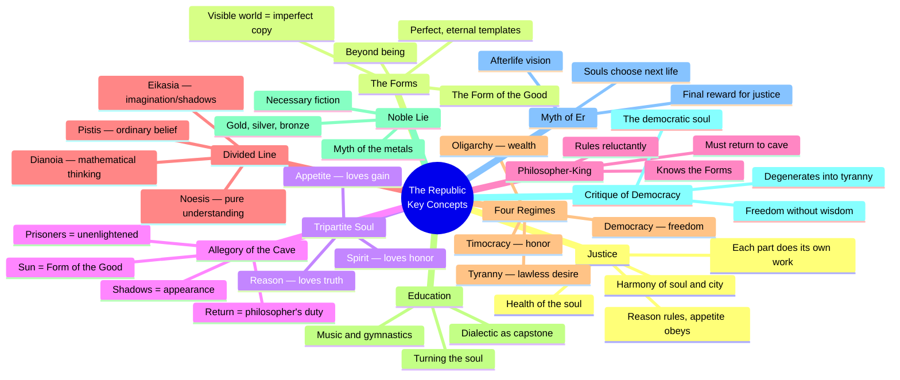
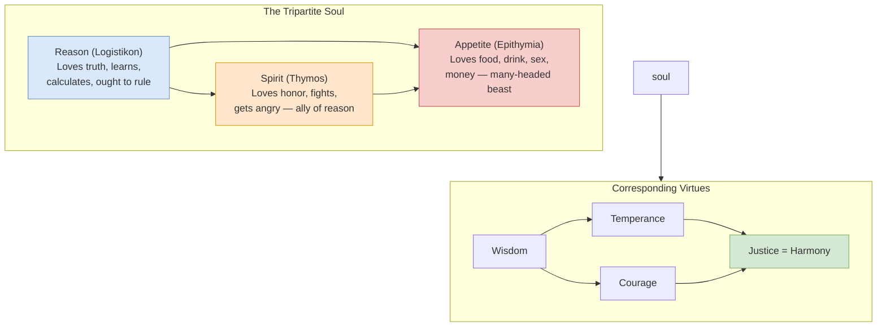
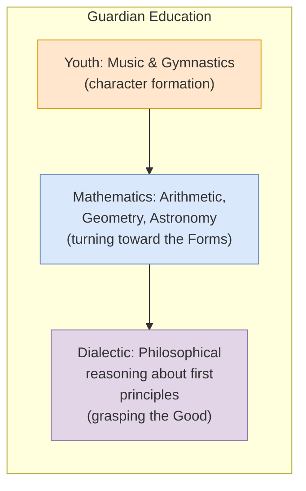
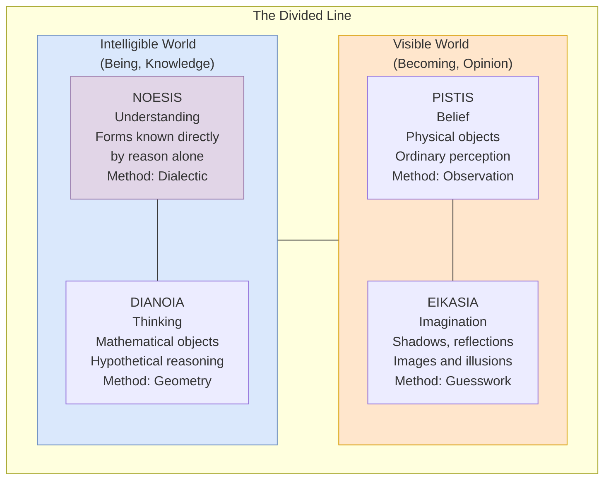

---

## 1. Justice as Harmony

The central concept of the entire dialogue. Justice is NOT
defined as giving each their due, obeying the law, or serving
the stronger. It is the *structural health* of a city or soul.

| Level | Justice | Injustice |
|-------|---------|-----------|
| **City** | Each class does its own work: rulers rule, auxiliaries defend, producers produce | Classes meddle: the mob rules, soldiers take over, merchants buy power |
| **Soul** | Reason rules, spirit supports, appetite obeys — harmony | Civil war: appetite rebels, spirit joins the wrong side, reason is enslaved |
| **Individual** | The just person is "one" — integrated, calm, self-mastered | The unjust person is "many" — conflicted, compulsive, self-deceived |

Justice is not primarily about how you treat others (though it
includes that). It is about who you *are*. A just person is a
well-ordered person. Justice is to the soul what health is to
the body.

---

## 2. The Theory of Forms

Plato's most famous metaphysical doctrine. The Forms (*eide* or
*ideai*) are perfect, eternal, unchanging templates of which
physical things are imperfect copies.

| Property | Forms | Physical Objects |
|----------|-------|------------------|
| **Being** | Truly real | Between being and non-being |
| **Change** | Eternal, unchanging | Always coming-to-be and passing-away |
| **Knowledge** | Known by reason (*noesis*) | Perceived by senses (*aisthesis*) |
| **Number** | One Form per quality | Many instances |
| **Purity** | Perfect, unmixed | Imperfect, mixed |

### The Form of the Good

The highest Form — the source of all reality, truth, and
knowledge. The sun analogy: as the sun makes visible things
visible, so the Good makes intelligible things intelligible.
It is "beyond being," not identical with any particular Form.

Critics (Nietzsche, Heidegger) have accused Plato of "slandering"
the physical world by devaluing it as mere appearance. Defenders
argue that the Forms are necessary to explain how knowledge,
moral judgment, and meaningful language are possible.

---

## 3. The Tripartite Soul

Three parts of the human psyche:

The soul is not a blank slate or a simple substance. It has
internal structure, and parts can be in harmony or conflict.
Plato's evidence: psychological conflict. The same person can
be thirsty but choose not to drink. That is reason fighting
appetite. The same person can get angry at their own desire.
That is spirit fighting appetite on reason's side.

---

## 4. The Allegory of the Cave (514a-520a)

The centerpiece of *The Republic* — a single extended metaphor
for the entire philosophical project.

### The Elements

| Element | Meaning | Level of Cognition |
|---------|---------|-------------------|
| Prisoners | Unenlightened humanity | *Eikasia* (imagination) |
| Shadows on wall | What we mistake for reality | *Eikasia* |
| Puppets and fire | Physical objects, opinions | *Pistis* (belief) |
| Turn toward the light | Philosophical awakening | Transition |
| Ascent | Education as turning | *Dianoia* (thinking) |
| Real things outside | The Forms | *Dianoia* |
| The Sun | The Form of the Good | *Noesis* (understanding) |
| Return to the cave | The philosopher's political duty | Justice in action |

### The Four Levels of Cognition

1. **Eikasia** (imagination): seeing shadows, taking appearance
   for reality. The state of most people most of the time.
2. **Pistis** (belief): ordinary perception of physical objects.
   Reliable for practical life but not knowledge proper.
3. **Dianoia** (thinking): mathematical and hypothetical reasoning.
   Uses models and assumptions to reach conclusions.
4. **Noesis** (understanding): pure intellection of the Forms.
   Grasping first principles without images.

---

## 5. The Philosopher-King

The most controversial proposal: "until philosophers rule as kings
or those who are now called kings and leading men genuinely and
adequately philosophize... there will be no rest from evils for
cities" (473c-d).

### Characteristics of the Philosophical Nature

| Virtue | Explanation |
|--------|-------------|
| Love of wisdom | Not just curiosity but passionate desire for truth |
| Love of truth | Refuses to accept falsehood, hates lies |
| High-mindedness | Contemplates all time and being; does not fear death |
| Justice | Gentle, measured, not greedy |
| Quickness to learn | Grasps Forms easily |
| Good memory | Retains what is learned |
| Proportion | Natural harmony of all these traits |

### The Philosopher's Return

The philosopher does not want to rule. Ruling is a burden
undertaken out of necessity, not desire. This is Plato's answer
to the problem of power: the best rulers are those who do not
want to rule. Those who want power are the least fit to have it.

---

## 6. The Four Corrupt Regimes

| Regime | Ruling Principle | Dominant Soul Part | Corresponding Person | How It Falls |
|--------|-----------------|--------------------|---------------------|--------------|
| **Timocracy** | Honor, ambition | Spirit | The honor-lover (like a Spartan) | Honor-seekers accumulate wealth, become oligarchs |
| **Oligarchy** | Wealth, property | Appetite (for money) | The miser (rich but uncultured) | Poor majority revolts against rich minority |
| **Democracy** | Freedom, equality | All appetites equal | The democratic man (lives by whim) | Chaos from unlimited freedom; people seek a strongman |
| **Tyranny** | Lawless desire | Lawless appetite | The tyrannical man (enslaved by his worst desires) | Cannot be worse — but somehow falls further into misery |

Plato's classification influenced Aristotle's *Politics*,
Polybius's cycle of constitutions, and Machiavelli's analysis
of principalities.

---

## 7. The Noble Lie

Socrates proposes a "Phoenician tale" — a myth to be taught to
all citizens:

> "While all of you in the city are brothers, the god, in molding
> those of you who are capable of ruling, mixed gold into their
> generation; in those who are auxiliaries, silver; and in those
> who are farmers and other craftsmen, iron and bronze."

Children may be moved up or down the hierarchy based on their
nature. The lie is "noble" because it serves the unity and
stability of the city.

### Criticism of the Noble Lie

- **Popper**: The prototype of political propaganda; the state
  tells citizens what to believe
- **Arendt**: The abolition of truth in politics — the rulers
  decide what is real
- **Defense**: Without a shared story, no community can cohere;
  all nations have founding myths

---

## 8. Critique of Democracy

Plato's critique is not merely aristocratic prejudice. It is
a structural argument:

1. Democracy values **freedom** above all
2. Freedom means **equality of desires** — no desire is better
   than any other
3. This leads to **anarchic individualism** — people do whatever
   they want, when they want
4. Law and authority weaken; demagogues exploit the chaos
5. The people, desperate for order, turn to a **strongman** —
   and democracy becomes tyranny

### The Democratic Person

The democratic soul is "beautiful and many-colored" — full of
diverse desires, impulses, and opinions. But lacking internal
hierarchy, the democratic person lives by whim. They cannot
commit, cannot be relied upon, and in their pursuit of total
freedom, they enslave themselves to their own appetites.

---

## 9. Education as Turning the Soul

Plato's theory of education is not about *putting* knowledge
into the soul. It is about *turning* the whole soul toward the
light — reorienting its desire from the visible to the
intelligible.

The curriculum: music (culture, stories, rhythm) for the soul,
gymnastics for the body, then mathematics (five mathematical
sciences: arithmetic, plane geometry, solid geometry, astronomy,
harmonics) to draw the mind away from the sensible world, and
finally dialectic to grasp the Forms without images.

---

## 10. The Myth of Er

The eschatological myth that concludes the dialogue. Er, a
soldier, dies on the battlefield, witnesses the judgment of
souls in the afterlife, and returns to tell the tale.

### Key Elements

- **Judgment**: Just souls ascend to heaven for reward; unjust
  souls descend for punishment (ten times the wrong)
- **The Spindle of Necessity**: The cosmic mechanism that turns
  the heavens; the Fates (Lachesis, Clotho, Atropos) spin destiny
- **The Lottery of Lives**: Souls choose their next life from a
  set of patterns. The choices reveal character: Orpheus chooses
  a swan (out of hatred for women), Ajax chooses a lion, Odysseus
  chooses the life of a private citizen
- **The Warning**: Virtue is not automatic. The soul that was
  just in its previous life may choose badly if it lacks
  philosophy. Only the philosophical soul can reliably choose
  well

### Meaning

The myth reinforces the dialogue's central argument in mythic
form: justice is not just for the rewards it brings (though it
brings them). It is about the *kind of soul you become*. The
philosophical life is the only life worth choosing — not because
of what it gets you, but because of who it makes you.

---

## 11. The Divided Line and the Sun

The epistemological-metaphysical framework of the dialogue:

The Form of the Good is "beyond being" — it is the condition for
the reality of all other Forms and for our knowledge of them.
The sun in the visible world is an image of the Good in the
intelligible world. Both provide light, growth, and the condition
for perception or intellection.

---

## 12. Plato's Influence on Subsequent Thinkers

| Thinker | What They Took from Plato |
|---------|--------------------------|
| **Aristotle** | The framework of political philosophy, the classification of regimes (critically adapted) |
| **Augustine** | The Forms as ideas in the mind of God; the just city as the City of God |
| **Plotinus** | The Forms as a hierarchy emanating from the One (a Neoplatonic reading) |
| **Renaissance** | The ideal state as a model for utopian literature (More's *Utopia*, Bacon's *New Atlantis*) |
| **Hegel** | The state as the realization of the Idea; history as the unfolding of reason |
| **Marx** | The critique of ideology (but Marx inverts Plato: material conditions shape consciousness, not Forms) |
| **Nietzsche** | Plato as the founder of "true world" philosophy — the target of Nietzsche's critique of otherworldliness |
| **Heidegger** | Plato as the beginning of Western metaphysics — the oblivion of Being in the turn toward the Forms |
| **Popper** | Plato as the enemy of the open society — the definitive liberal critique |
| **Rawls** | Justice as fairness as an alternative to justice as harmony; the original position vs. the divided line |
