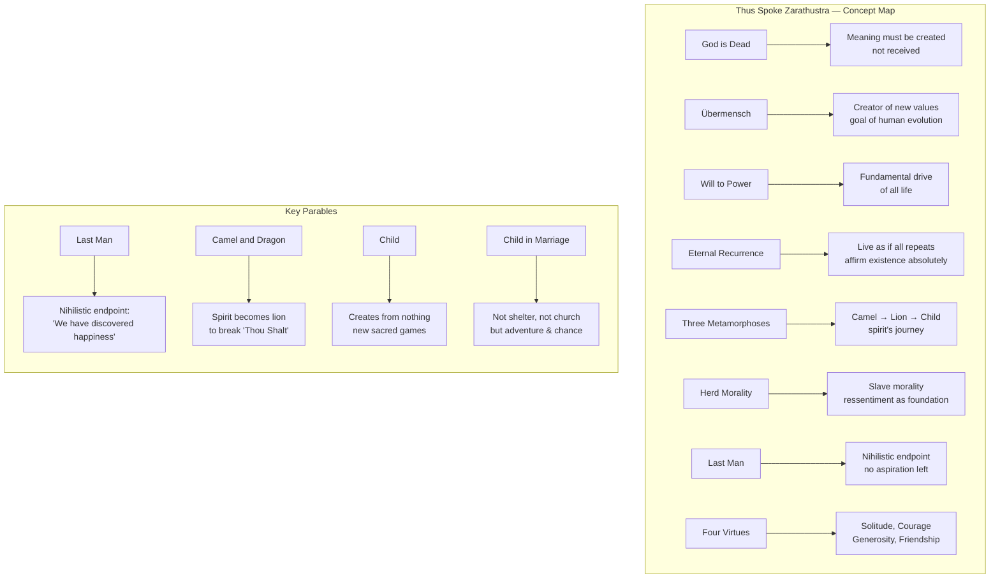
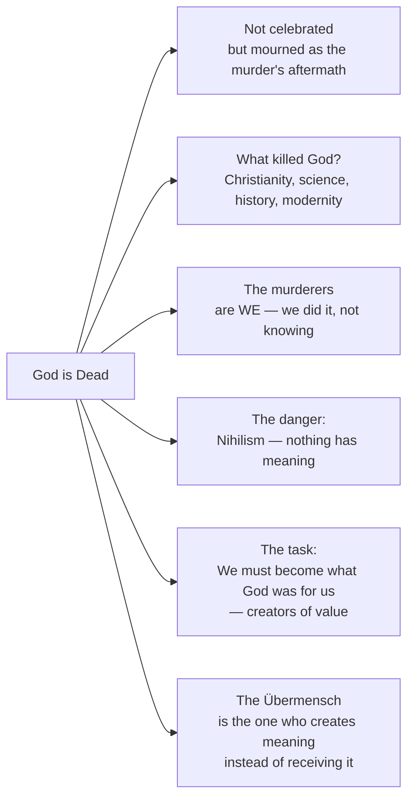
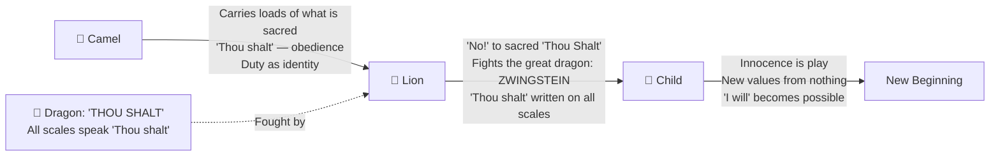
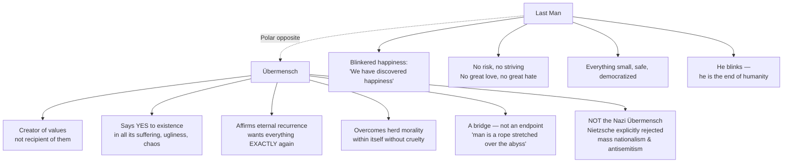
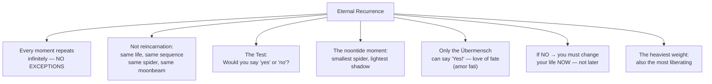
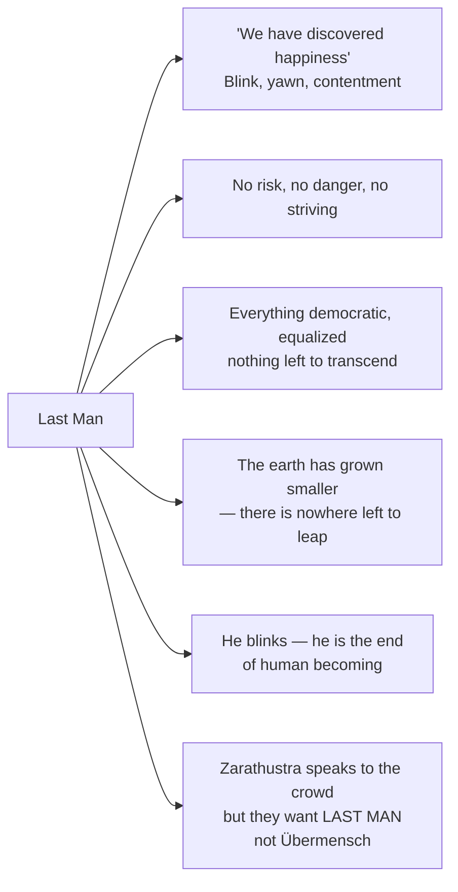

---

## The Death of God

Central to Zarathustra's entire mission is the announcement — already fully formed in *The Gay Science* (1882) but dramatized here as a sermon — that **God is dead**. Nietzsche's declaration is not an atheist boast but a diagnosis of cultural catastrophe:



The death of God is not liberating by default. It is **terrifying**. Without a transcendent source of value, all values become human constructs — and humanity is not yet equipped to create. Nihilism — the belief that nothing matters — is the default outcome. Zarathustra's role is to announce that the only alternative to nihilism is **active creation**: the Übermensch who dares to say "yes" to life as it is, without appeal to anything beyond it.

---

## The Three Metamorphoses of the Spirit

One of the book's most celebrated and structured teachings — the three metamorphoses of the spirit — maps spiritual development as a progression through three figures:



> **The Camel**: Laden with what tradition and duty demand — "thou shalt" — the spirit at the first metamorphosis carries its burden willingly, seeking out the hardest task, the hardest suffering. Obedience is its virtue.
>
> **The Lion**: Freed from duty's shame, the spirit rebels — "I will" cannot be fully formed yet because what it needs is first to free itself. The lion roars "no" into a face that no longer obligates it.
>
> **The Child**: The lion creates itself into child — innocence, playing, new beginnings. "Yes" is its sacred word. The child does not need justification or tradition; it creates values as it creates games.

---

## The Übermensch (Overman / Superman)

The Übermensch is not a biological next step in human evolution — it is a **philosophical and existential task**. It is not about being superior to others; it is about being capable of the life-affirming "yes" that most humans cannot yet say.



---

## The Will to Power

The will to power (*der Wille zur Macht*) is Nietzsche's proposed replacement for "the will to live" (Schopenhauer) and "survival instinct" (Darwin). Life is not primarily about self-preservation — it is about **self-overcoming and expansion**. Every living force seeks to grow, dominate, transform, and intensify itself:

```
flowchart LR
    WP[Will to Power] --> WP1["Fundamental drive of all life<br/>not just a psychological trait"]
    WP --> WP2["Not 'power over others'<br/>but power OVER ONESELF"]
    WP --> WP3["Creative force:<br/>growth, expansion, transformation"]
    WP --> WP4["Applies to all life<br/>from cells to civilizations"]
    WP --> WP5["Opposes both:<br/>Pessimism (Schopenhauer)<br/>and survival-naturalism (Darwin)"]
    WP --> WP6["The Übermensch<br/>fulfills the will to power<br/>by creating values"]
```

---

## Eternal Recurrence

Nietzsche's most demanding thought-experiment: *what if every moment of your life — every joy, every pain, every mistake, every triumph — repeated infinitely, exactly as it happened?* Could you say "yes" to that?



> *"What, if some day or night a demon were to steal after you into your loneliest loneliness and say to you: 'This life as you now live it and have lived it, you will have to live once more and innumerable times more.' ... Would you not throw yourself down and gnash your teeth and curse the demon who spoke thus? Or have you once experienced a tremendous moment when you would have answered him: 'You are a god and never have I heard anything more divine.'"*
> — *Nietzsche, The Gay Science* (the formulation Refined in Zarathustra as a lived image, not a proposition)

---

## The Four Virtues

Zarathustra redefines virtue not as obedience to law but as **spiritual powers of a free soul**. His four virtues (emerging throughout the book, especially Part II):

```
flowchart LR
    V[Zarathustra's Four Virtues] --> V1[Solitude]
    V --> V2[Courage]
    V --> V3[Generosity / Gift-Giving]
    V --> V4[Friendship]

    V1 --> V1D["The pure one who has<br/>always bathed in the sea of solitude<br/>has not been contaminated by the herd"]
    V2 --> V2D["Not fear of danger<br/>but fear of the comfortable<br/>fear of the 'already-felt'"]
    V3 --> V3D["Not accumulation<br/>but giving — the one who gives<br/>feels richest in giving away"]
    V4 --> V4D["Friendship as a middle country<br/>between love and solitude<br/>building bridges between overmen"]
```

---

## The Last Man

The **Last Man** is Zarathustra's negative vision of where humanity is headed — not toward the Übermensch, but away from it. He is the epitome of **nihilism as comfort**:



The Last Man is not a villain — he's simply the endpoint of herd morality taken to its logical conclusion. Nietzsche diagnoses his own age as one of Last Man consciousness. The Übermensch is the alternative: to risk everything, to suffer, to overflow, to become.

---

## Herd Morality (Slave Morality vs. Master Morality)

Nietzsche's genealogy of morals — most fully developed in *On the Genealogy of Morals* (1887) but originating in Zarathustra — identifies two fundamental moral systems:

```
flowchart TB
    MM[Morality Types] --> SM[Slave Morality]
    MM --> MM2[Master Morality]

    SM --> SM1["Origin: Ressentiment<br/>weakness moralized as virtue"]
    SM --> SM2["Values the weak = 'Good'<br/>Values the strong = 'Evil'"]
    SM --> SM3["Pity, equality, democracy,<br/>humility — all born of resentment"]
    SM --> SM4["Negates life:<br/>renounces, sublimates, denies"]

    MM2 --> MM2_1["Origin: Power and abundance<br/>strength as spontaneous self-affirmation"]
    MM2 --> MM2_2["Values noble = 'Good'<br/>Values base = 'Bad'"]
    MM2 --> MM2_3["Honor, courage, honesty,<br/>greatness — values of creators"]
    MM2 --> MM2_4["Affirms life:<br/>says YES without conditions"]

    HERD[Herd Morality] -.->|Identical with| SM
    HERD --> HERD1["Promotes the mediocre<br/>protects the collective ego"]
    HERD --> HERD2["Zarathustra: 'I do not want<br/>to rule. I do not want<br/>to serve. What is to me<br/>herd and herd-need?'"]
```

---

## Love as Destination, Not Achievement

In one of the book's most unexpectedly tender passages, Zarathustra teaches that **love is not something you win or earn — it is something you become the *destination* of**:

> *"You love yourself because you must love — and build altars to your own becoming. Love is the great temptation. But what is the nature of that love that is not a desire? The love that does not want to take, change, or own — the love that arrives as destination."*

---

## Publication History

| Part | Year | Context |
|------|------|---------|
| Part I | 1883 | Written after Nietzsche's crisis of health and his relationship with Lou Salomé fell apart |
| Part II | 1884 | Written in isolation; Nietzsche's only confidants were his sister Elisabeth and friend Peter Gast |
| Part III + IV | 1885 | Part III composed rapidly; Part IV written as a private gift for 5 friends, too idiosyncratic for public |
| First full edition | 1892 | After Nietzsche's total incapacitation in 1889 and death in 1900; Elisabeth Förster-Nietzsche edited and packaged |

The 1908 English translation by Thomas Common made Zarathustra accessible to English readers and profoundly influenced Modernist writers including Yeats, Shaw, Mann, Hesse, Lawrence, and Jung. Modern readers are advised to use translations by Walter Kaufmann (Vintage, 1961) or R.J. Hollingdale (Penguin Classics, 4th ed., 2003), which are the standard scholarly English versions.
