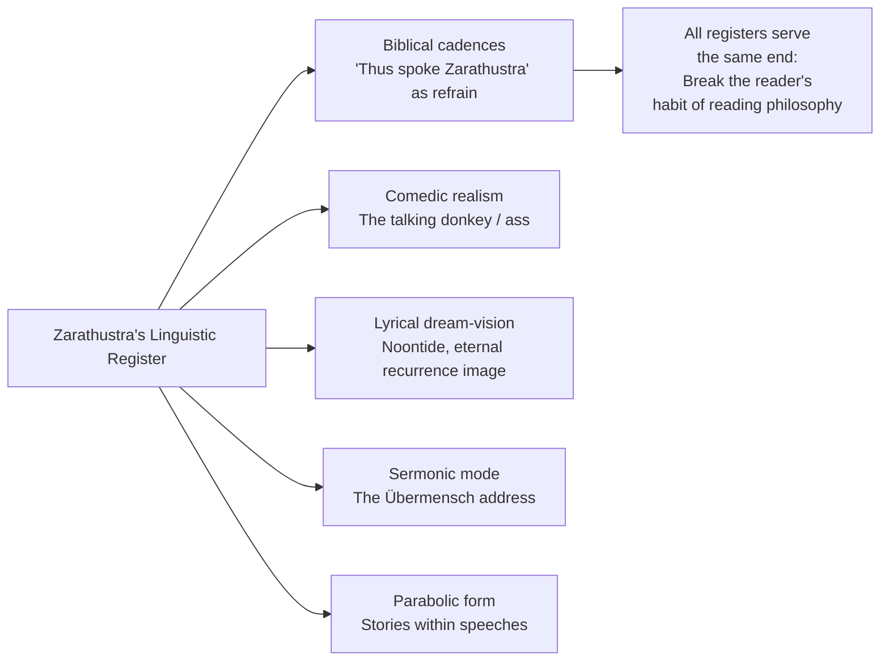
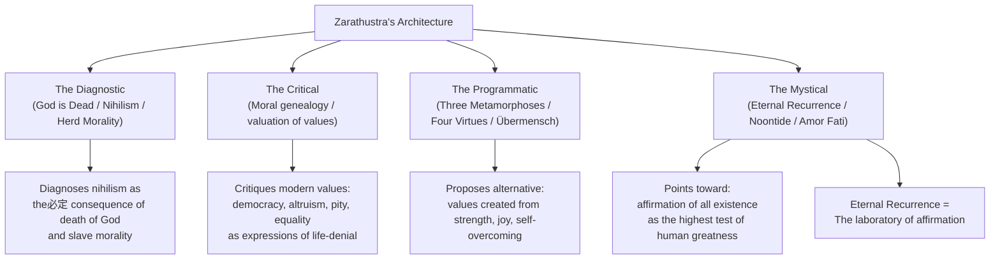
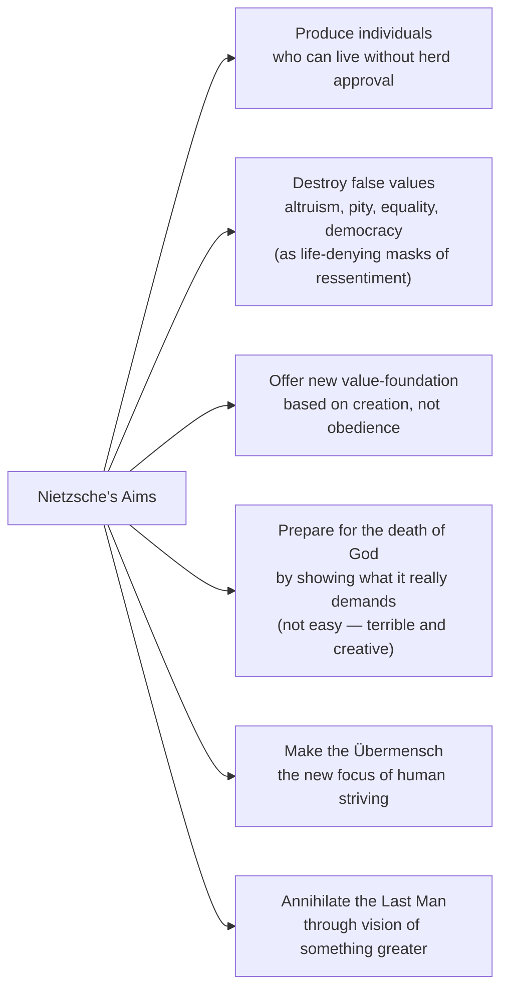

**Note**: This section builds on the core concepts in `01-content`. It does not re-explain the Übermensch, the three metamorphoses, eternal recurrence, or the four virtues.

---

## Literary Craft: A Philosophy in the Form of a Prophetic Romance

### Genre and Form

*Thus Spoke Zarathustra* does not fit comfortably into any single genre. It is:

- A **philosophical novel** in which the central "character" is a set of ideas voiced by a prophet
- A **dithyramb** (Bacchic song-form) drawing on ancient Greek and biblical prose rhythms
- **Allegory**: Zarathustra is not Nietzsche — he is a voice Nietzsche creates to say things he cannot himself declare
- **Philosophy as literature**: Nietzsche rejects the academic essay form; the book must be *lived*, not merely read

The prose moves between elevated biblical cadence ("Thus spoke Zarathustra"), comic realism (Zarathustra addressing an ass), and lyrical dream-vision (the noontide vision, eternal recurrence seen as light and shadow). This tonal instability is intentional: Nietzsche produces what he calls a **"transvaluation of all values"** (Umwertung aller Werte) through style itself, not just through argument.



### The Refrain: "Thus Spoke Zarathustra"

The repeated line — *"Thus spoke Zarathustra"* — anchors every speech as a voice, not a text. It creates orality, authority, and distance simultaneously: Zarathustra has spoken, and we are listening. But Nietzsche also undercuts this authority: Zarathustra is frequently ridiculous, contradictory, or simply silent. The refrain is genuine scripture for his characters and ironic frame for his readers.

### Zarathustra as Literary Character

Zarathustra is the **philosopher-prototype** — not a biography but a dramatic function. He:

- Descends from solitude to speak to people who cannot understand him
- Finds no real audience — the crowd wants the last man, his followers want only discipleship
- Undergoes his own spiritual crisis (the eternal recurrence vision in Part III)
- Becomes both teacher and student — he must learn what his own doctrine means

This is a profound move in Western literature: philosophy enacted *dramatically*, not argued *propositionally*.

---

## Philosophical Structure: What the Book Is Trying to Do

Nietzsche does not present Zarathustra as a system. His method is **aphoristic and qualitative** — each speech is a pitch, a provocation, a test of the reader's capacity to receive it. But beneath the surface, four interconnected philosophical structures run through all four parts:



### Part-by-Part Analysis

```mermaid
flowchart TB
    subgraph Part_I [Part I: Foundations]
        direction TB
        I1["Prologue: Descent from solitude"] --> I2["God is Dead: the murderer shapeshifting"]
        I1 --> I3["Three Metamorphoses<br/>(Camel → Lion → Child)"]
        I1 --> I4["Übermensch Sermon<br/>Man as rope, as bridge, as transition"]
        I1 --> I5["Last Man: positive vision of hell"]
        I5 -- rejected --> |The crowd wants Last Man| CONFLICT
    end

    subgraph Part_II [Part II: Virtues as Spiritual Powers]
        direction TB
        II1["Solitude — the pure one"]
        II2["Courage — not fear of danger, but fear of comfort"]
        II3["Generosity / Gift-Giving Virtue — giving riches"]
        II4["Friendship — the middle land between love and solitude"]
    end

    subgraph Part_III [Part III: The Spiritual Crisis]
        direction TB
        III1["The Vision and the Riddle<br/>(Eternal Recurrence prophecy)"]
        III2["Involuntary Bliss<br/>— the moment of Zarathustra's greatest affliction"]
        III3["On the Tarantulas<br/>— revenge named as virtue"]
        III4["On the Great Longing<br/>and need as creator"]
        III5["The spirit of gravity<br/>overcome through dancing"]
    end

    subgraph Part_IV [Part IV: The Ass, the Awakening, the Tables]
        direction TB
        IV1["The Higher Men gather"]
        IV2["The Ass who says 'I-A'<br/>ridicules the spirit of gravity"]
        IV3["The Awakening — Zarathustra rises"]
        IV4["The Voluntary Death of the Shepherd<br/>— transformation scene"]
        IV5["Old and New Tables<br/>— Zarathustra gives his final laws to himself"]
    end

    Part_I --> CONFLICT["CORE CONFLICT:<br/>Zarathustra's message<br/>vs. audience capacity"]
```

---

## Key Concepts in Depth

### The Will to Power

The will to power (*Wille zur Macht*) is Nietzsche's most fundamental philosophical concept, first appearing in philosophy in Zarathustra and becoming explicit in his notebooks. It is a critique of two existing framings:

1. **Schopenhauer's will-to-live**: Life seeks self-preservation — Nietzsche rejects this; life seeks *expansion and intensification*
2. **Darwinian survival of the fittest**: This reduces life to survival — Nietzsche proposes that life wants more power, not merely to survive

The will to power applies at all scales:
- Individual psychology: drives, ambition, self-overcoming
- Biological: all cells and organisms stretch toward greater expression
- Cultural: artistic creativity, scientific discovery, moral innovation
- Cosmic: "this world is the will to power — and nothing besides"

> *"And life itself told me this secret: 'Behold,' it said, 'I am that which must overcome itself again and again.'"* — Zarathustra

### Eternal Recurrence — The Great Affirmation

The doctrine of eternal recurrence is Nietzsche's most demanding thought experiment. Central to Zarathustra's spiritual crisis and Zarathustra's highest teaching:

**Proposition**: If every moment of your existence — with its most minute and seemingly trivial details — repeated eternally into the infinite future, exactly as it happened, could you love your life enough to say "Yes!"?

- This is not reincarnation. You do not become "someone else" in another life.
- This is not cosmic determinism — it is existentially *hypothetical* but existentially *binding*.
- To say "Yes!" is **amor fati** — love of fate, the highest spiritual achievement.
- The **Dionysian** perspective: arise and say "Yes!" not in spite of suffering, but because of it.

The eternal recurrence image appears dramatically in **Part III's "On the Vision and the Riddle"** when Zarathustra has a vision of a young shepherd with a black serpent biting into his throat — a figure who must break and become who he is.

---

## The Four Virtues: Detailed

### 1. Solitude

Zarathustra's solitude is not loneliness. Loneliness is the *absence* of others; solitude is a *positive spiritual condition* — the soul at home with itself, the pure one who has no need to be contaminated by the herd. He calls solitude "a virtue" precisely because it requires the strength to be oneself without audience or approval:

> *"Solitude gives the soul the capacity to nurse reveries and to create. In solitude the soul learns the virtue of patience and to steep itself in the essence of things."*

Solitude is also dangerous: it is the condition in which **ressentiment** simmers (the inverted hatred of the weak against the strong) unless one has the spiritual strength to transform it.

### 2. Courage

Zarathustrian courage is not bravery in combat. It is the **courage to be a creator** — to make values from nothing, to withstand the last man's sneering, to face the void that opens when you discover that no God and no tradition has already given you a path:

> *"Not to be a coward in deeds: so speak the starry heavens. But to be around in spirit — that is courage."*

### 3. the Gift-Giving Virtue (Generosity)

This is Nietzsche's most beautiful and most neglected concept — the virtue of giving **without need, without expectation of return, without duty**. It is creative abundance: the one who gives has more than the one who receives. Gift-giving is the Übermensch's primary moral act:

> *"The virtue that gives, that flows away like a well-spring from the mountain, that gives freely and has no rent-collector — that virtue is the gift-giving virtue."*

### 4. Friendship

Friendship, in Zarathustra's framing, is **the middle country** between the isolation of solitude and the suffocation of the herd. It is possible only among those who have enough character to seek each other out as towers — each standing on its own ground, making visible what the other cannot yet see:

> *"Friendship is the mirror of friendship … the mirror that is friendship reflects not yourself but it reflects to you what you are."*

---

## Nietzsche's Aims — What He Is Trying to Do

Nietzsche's stated goal in Zarathustra is the **transformation of humanity** through a philosophical teaching. He seeks no followers, no movement, no institution. He wants to produce **individuals who have the courage to affirm life as it is**:



He writes *for a future* — not for his own century, which is indeed the century of the Last Man, but for centuries still to come. He calls himself a *destiny* — not because he commands, but because his teaching is irreversible.

---

## Reception and Legacy

### Initial Reception

Zarathustra was largely ignored during Nietzsche's lifetime. Few critics took it as philosophy; most treated it as eccentric literary outpourings. When Nietzsche announced in his autobiography *Ecce Homo* (1888) that Zarathustra was "the greatest gift ever given to humanity," it was dismissed as megalomania.

### 20th Century Impact

The book's influence has been **disproportionate to its popularity** — the number of people who actually read Zarathustra is dwarfed by the number whose thinking it shaped:

- **Psychoanalysis**: Freud and especially Jung drew heavily on the Übermensch, eternal recurrence, and the shadow archetype
- **Existentialism**: Sartre, Camus, Heidegger — existential freedom is Nietzschean freedom without God
- **Literary Modernism**: Kafka, Mann, Hesse, Lawrence, and others found in Zarathustra's prophetic voice a template for modern spirituality
- **Philosophy**: Deleuze built a career around Nietzschean difference and affirmation; Foucault on power; Derrida on the death of God
- **Politics**: Unfortunately, Nietzsche was appropriated by the Nazis — though he explicitly rejected German nationalism, antisemitism, and mass political movements. Elisabeth Förster-Nietzsche's editing of his unpublished notebooks and her selective curation of passages shaped this misreading

### Critical Assessment

The book is widely considered **difficult, dense, and rewarding** in partial measure — only seemingly approachable on a first reading. It requires multiple readings and is often recommended alongside Kaufmann's or Hollingdale's translation notes. It has been reimagined in classical music (Strauss's tone poem *Also sprach Zarathustra*), philosophy, literature, and psychology.

---

## Music and Cultural Adaptation

Richard Strauss's tone poem *Also sprach Zarathustra* (1896) opens with the "Sunrise" fanfare — the *2001: A Space Odyssey* connection made visible. The Strauss orchestration captures the cosmic scale of Nietzsche's Zarathustra without any of the philosophy. The book's influence on **modernist poetry** (Rilke, Yeats, Lawrence) and **classical philosophy** (Heidegger's *Being and Time* opens by questioning the same nihilism Nietzsche diagnosed) continues to shape intellectual culture today.
