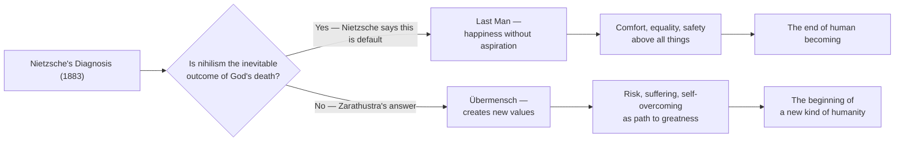
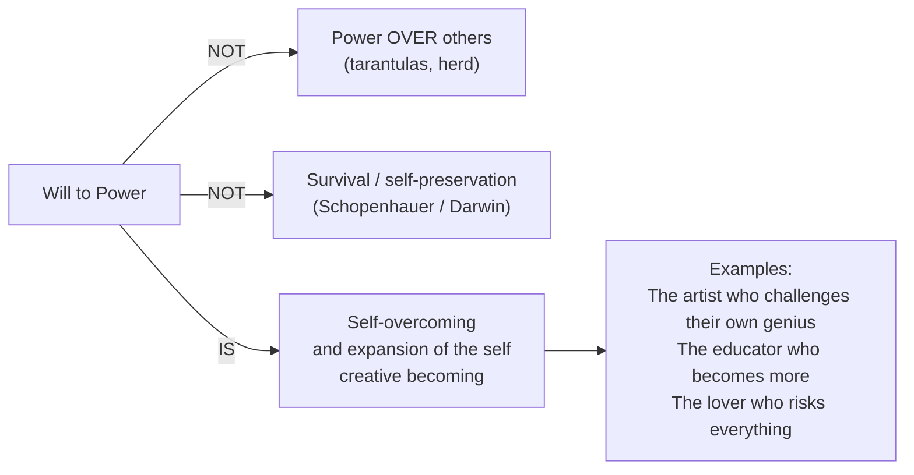
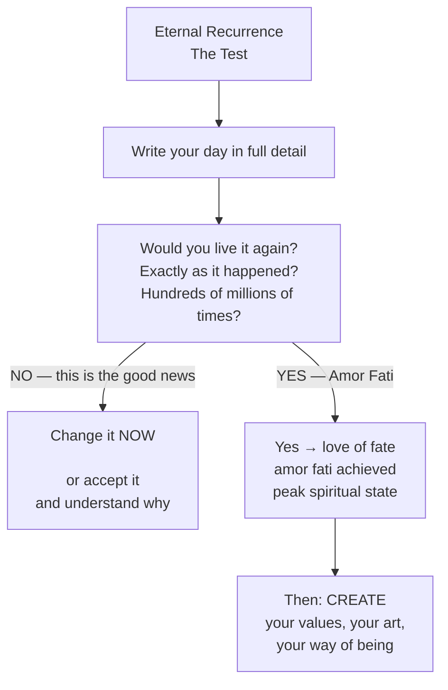
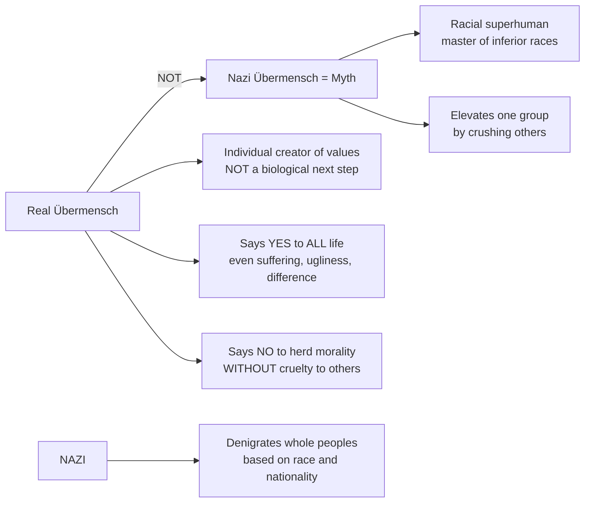

**[Host]**: Welcome to BookLab. Today we're discussing one of the most influential and most misunderstood books of the past two centuries: *Thus Spoke Zarathustra* by Friedrich Nietzsche. Our guests couldn't be more different in how they engage with his vision. Dr. Ananya Mehta is a professor of comparative literature at the University of Delhi. Welcome, Dr. Mehta.

**[Ananya]**: Thank you. I teach this book to people who assume it's a manifesto for dictators, and I spend the semester showing them it is actually a book about the hardest moral achievement a human can attempt: saying yes to existence without conditions.

**[Host]**: And joining us from Berlin is Dr. Lukas Voss, a philosopher and Nietzsche scholar who has spent fifteen years in Nietzsche's Nachlass. Welcome, Dr. Voss.

**[Lukas]**: What draws me back to Zarathustra is its prophetic character. Nietzsche announces the death of God in 1882 and then traces precisely what it would mean to live *after* that death — not nihilistically, but creatively. It's the most sustained attempt in Western philosophy to think beyond Christianity without becoming a nihilist.

---

## On the God-Aftermath

**[Host]**: Let's start at the beginning. Nietzsche famously declared "God is dead" — but what exactly did he mean, and do you think his diagnosis still holds?

**[Lukas]**: People quote "God is dead" as if Nietzsche were celebrating atheism. He isn't celebrating — he's grieving. The murderer shapeshifts. God didn't die from rational argument; He died because we stopped needing Him. Science, history, psychology — all the disciplines of modernity unmoored the moral universe God used to inhabit. Nietzsche's point is that once God is dead, as he says in the madman scene of *The Gay Science* and dramatizes in Zarathustra's opening, there is no longer any *explanation* for human existence other than the ones we invent. That's not liberating by default — it's terrifying.

**[Ananya]**: Let me add the Indian context here, because I teach this to students for whom the "God is dead" moment has a different resonance entirely. For many of my students, Nietzsche's announcement doesn't describe a moment that happened in 1882 — it describes a condition they already live in. They grew up in a world where grand narratives fractured, where state religions lost authority, where the internet gave everyone their own personal cosmology. The question for them is not "is God dead?" — it's "what do I do with the responsibility of meaning-making?"

---

## The Last Man as Our Present

**[Host]**: You both mentioned the Last Man. Dr. Voss, you've argued that Nietzsche's worst fears about the Last Man actually underdiagnosed the problem.

**[Lukas]**: The Last Man in Zarathustra is a creature of blinkered happiness — he yawns, he blinks, he says "we have discovered happiness." Everything is equalized, nothing transcended. But what Nietzsche couldn't imagine is a Last Man who also has infinite content at his fingertips. The human being who is simultaneously numb and overstimulated — who has every distraction and still no aspiration. That's our condition. The thought is unbearable.

**[Ananya]**: I disagree with Dr. Voss here — I think Nietzsche imagined exactly this. He just couldn't frame it in the language of algorithms. What he called "the herd" is now a global network. Herd morality isn't local anymore; it's the default texture of the internet. The pressure to be "nice," to perform caring, to not offend, to never say anything that could be truly generative of something new — that's pure last-man consciousness, mediated at scale.

---

## On the Will to Power

**[Host]**: The will to power. Let's tackle the most commonly misunderstood concept. Is this simply "power over people"?

**[Lukas]**: Absolutely not, and I wish this misreading would die. The will to power is the fundamental drive of all life — not domination over but *expansion of* oneself. It is the philosopher's will to think more deeply, the artist's will to create more fully, the educator's will to help another become who they are. Think of it this way: even a flower strains toward the sun — that is will to power at the most basic level. It is movement toward greater *intensity of being*, not domination of others. What Nietzsche attacks throughout Zarathustra is the *perversion* of the will to power — when the weak seek power *over* rather than *for* themselves, or when the strong, untransformed, seek power merely as accumulation. That's what the "tarantulas" passage is about.

---

## On Eternal Recurrence as Lived Practice

**[Host]**: Dr. Mehta, you've written about teaching eternal recurrence to engineering students in India — how do you help them engage with this thought experimentally rather than metaphysically?

**[Ananya]**: I give them an exercise. I ask them to write down one day of their life in as much detail as they can — from the moment they wake up, through the interactions, the small decisions, the tone of voice with their parents, the things they said that were untrue, the moments they chose safety over risk. Then I ask them: *if you had to live this exact day again, hundred of times — not as a different person in a different life, but exactly this person, in exactly this way — would you cheer or would you despair?* That's the burden of eternal recurrence applied to their own lives. It stops being a philosophical paradox and becomes an existential test.

**[Lukas]**: The noontide moment in Zarathustra is extraordinary precisely because it is the *smallest* thing — the lightest spider, the faintest moonbeam — that becomes the test of all existence. Nietzsche understood that the grand doctrine of eternal recurrence must be experienced at the level of daily living or it means nothing.

---

## The Three Metamorphoses Today

**[Host]**: Have either of you observed these metamorphoses in actual people — not as literary types but as real spiritual developments?

**[Ananya]**: Constantly. The camel appears in every student who comes to university carrying their family's weight of religious and cultural duty. They carry valiantly. The question is whether they ever become the lion. The lion, in my experience, is the rarest figure — the person who says "no" not bitterly but to *reach something beyond*. And the child... I have met maybe two or three people who clearly were living as children in Nietzsche's sense — creators of new value, not negators of old value. They are rare but unmistakable. They have no need to follow anything.

**[Lukas]**: The camel stage is where most people get stuck — and this is the problem Nietzsche keeps returning to. Modern moral education, religious formation, political propaganda all work to make people more effectively camel-like. We tell young people: find your calling, build your career, be responsible. These are all camel virtues. They're important — Nietzsche does not denigrate the camel. But if the camel stage becomes permanent, you get someone who never says "I will" — only "I ought."

---

## On the Übermensch and the Nazi Appropriation

**[Host]**: We have to address the elephant in every room where Zarathustra is discussed: the Nazi appropriation.

**[Ananya]**: It is important to say plainly: Nietzsche would have despised everything the Nazis stood for. He loathed German nationalism, antisemitism, mass movements, the state as such. He called anti-Semitism "the most repulsive phenomenon of the present time." The Nazis had their philosopher, Martin Heidegger, but they also had to *create* a Nietzsche who was not the same Nietzsche that existed. Elisabeth Förster-Nietzsche — Nietzsche's sister — edited his unpublished notebooks with exactly this outcome in mind, excising passages critical of nationalism and inserting passages that could be read in support of it.

**[Lukas]**: The Übermensch is, if anything, the enemy of every form of mass politics. The Übermensch is a *creator of values*, and mass politics — Nazism, but also any form of totalitarian democracy — requires people who *receive* values. The Nazis wanted *Massenmensch* (mass human beings), not *Übermensch*. And Nietzsche explicitly said, in his notebooks, that "the anti-Semite is my opposite."

---

## Zarathustra and Modern Life

**[Host]**: Dr. Mehta, let's ask a practical question. What would a contemporary person who has read Zarathustra actually *do differently*?

**[Ananya]**: I want to be careful here — Nietzsche is not a self-help figure, and Zarathustra is not advice. But if pressed: you would stop seeking universal approval. You would stop thinking your values have to be *argued* as true for everyone. You would create a way of living — style it, shape it, live it consistently — and defend it not by appealing to "what everyone thinks" but by making it beautiful, contagious, worth wanting. You would practice solitude not as loneliness but as spiritual nourishment. You would think twice before giving advice — because advice is almost always a form of herd morality. You would experiment with what you are, rather than simply being what you have always been.

**[Lukas]**: I'd add: you would read the book again, and again, without feeling you've "got it." That's part of the discipline. Zarathustra resists final interpretation intentionally. Nietzsche understood that if a book can be fully captured in a summary, it is not great philosophy. Reading Zarathustra is itself a practice of overcoming — overcoming the desire for easy answers, overcoming the wish that philosophy be comfortable. That discipline is perhaps the most Nietzschean thing about the book.

---

## The Obligation of the Light

**[Host]**: One passage that stays with me is when Zarathustra speaks of *the light*. Dr. Voss, what is the light?

**[Lukas]**: The light is Zarathustra's own teaching — and the sun itself, which is what Zarathustra names his highest symbol of creative power, self-generation, and giving warmth without condition. In Zarathustra's opening, the sun says: "I must go down, as I always do at evening — as one overburdened burns himself in light-giving warmth." The light is both the teaching and the danger of it: to shine is to burn. Zarathustra must descend from the mountain because light kept to itself does no good. But the descent is the start of tragedy — not because Zarathustra is mistaken, but because humanity is not yet equipped to receive the light he brings.

**[Ananya]**: The light is also why Zarathustra is sometimes called a "teacher" rather than a philosopher. He doesn't argue — he shines. The obligation of the light is to illuminate even where it hurts, even where the viewer would rather close their eyes. That's what makes Zarathustra a figure of the educator: the teacher's duty is not to comfort but to enlighten.

---

## Closing: Why This Book Still Matters

**[Host]**: To close — why read *Thus Spoke Zarathustra* in an age of TikTok and AI?

**[Ananya]**: Because it asks the question that no algorithm can answer: *what do you want your life to mean?* Every platform is designed to answer that question for you with content designed to maximize engagement. Zarathustra asks the opposite: *what would you affirm infinitely?* That question can only be answered in solitude — without algorithm, without audience, without approval. The book performs that solitude as an art.

**[Lukas]**: Zarathustra is the only major work of Western philosophy that begins not with an argument but with a voice. The book is the voice — a voice that demands a response, demands a transformation, demands a yes or a no. That's what makes it dangerous in the best sense. Dangerous to passivity, dangerous to comfort, dangerous to intellect without practice. If you finish it and say "that was interesting" — you haven't read it at all.
