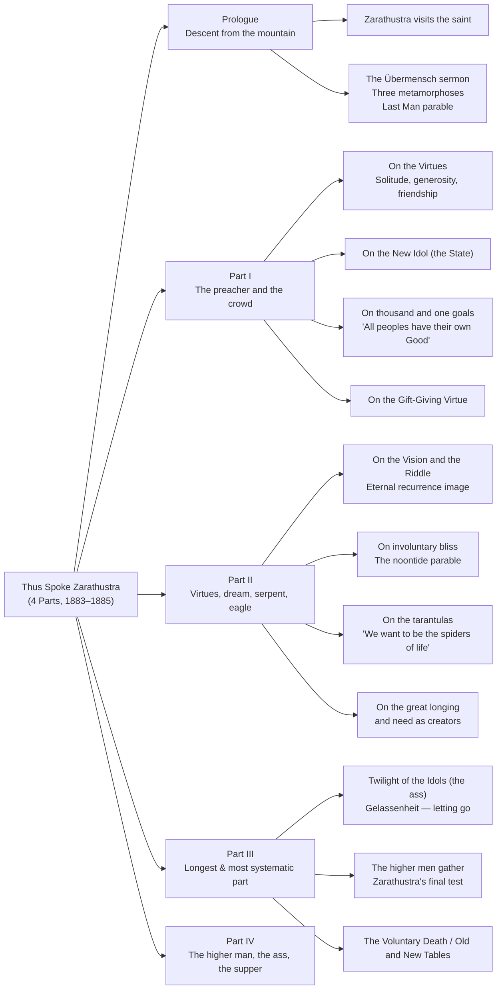

## Overview

*Thus Spoke Zarathustra: A Book for All and None* (German: *Also sprach Zarathustra*, 1883–1885) is Friedrich Nietzsche's most ambitious, literary, and philosophically concentrated work. It announces — in the voice of the ancient Persian prophet Zarathustra descending from ten years of mountain solitude — the most radical claim Nietzsche ever made: **God is dead**, and the consequences of that death are not a crisis to mourn but a task to complete. Humanity's highest vocation is no longer to serve a divine command but to become what it is capable of becoming: the *Übermensch* — the Overman, a creator of new values who says "yes" to life in its totality.

The book is structured as four loosely connected parts (the fourth written for intimate friends only, published 1892), each containing numbered speeches, parables, dreams, and encounters. Zarathustra travels among towns and markets, testifying, warning, jesting, and wrestling with his own mission. He is not a sage in the traditional mode: he teaches by image, by provocation, by what he leaves unsaid. The prose is biblical, operatic, and often dazzling — part sermon, part tragedy, part cosmic comedy.

Nietzsche called himself "the teacher of eternal recurrence" and *Zarathustra* is the book that earns that title. Every major concept in his philosophy — the will to power, herd morality, the last man, eternal recurrence, the three metamorphoses, the death of God, the four virtues — appears here first, not as dry philosophy but as enacted drama. It is simultaneously a story of spiritual becoming and an argument for a new kind of life.

---

## Executive Summary

```mermaid
graph TD
    A["Thus Spoke Zarathustra<br/>Also sprach Zarathustra<br/>1883–1885"] --> B["Author & Context"]
    A --> C["Core Philosophical Claims"]
    A --> D["The Four Parts"]
    A --> E["Zarathustra's Arc"]
    A --> F["Key Concepts"]
    A --> G["Style and Form"]

    B --> B1["Friedrich Nietzsche<br/>1844–1900"]
    B --> B2["German philosopher<br/>Philologist by training"]
    B --> B3["Mental collapse 1889<br/>Died 1900"]
    B --> B4["Influenced: Jung, Heidegger<br/>Sartre, Camus, Deleuze"]

    C --> C1["God is dead —<br/>meaning must be created"]
    C --> C2["The Übermensch is<br/>humanity's goal"]
    C --> C3["Eternal recurrence —<br/>live as if all repeats"]
    C --> C4["Will to power —<br/>life's fundamental drive"]

    D --> D1["Part I (1883)<br/>Prologue + foundational teachings"]
    D --> D2["Part II (1884)<br/>Virtues, speeches, encounters"]
    D --> D3["Part III (1885)<br/>Longest part, 60+ speeches"]
    D --> D4["Part IV (1885)<br/>Written for friends, private"]

    E --> E1["Descends from mountain"]
    E --> E2["Preaches to crowds — rejected"]
    E --> E3["Finds disciples — troubled by them"]
    E --> E4["Retreats to solitude again"]
    E --> E5["Undergoes the eternal recurrence test"]

    F --> F1["Three Metamorphoses:<br/>Camel → Lion → Child"]
    F --> F2["Four Virtues:<br/>Solitude, Courage, Generosity, Friendship"]
    F --> F3["Last Man vs. Übermensch"]
    F --> F4["Herd Morality / Slave Morality"]
    F --> F5["Overcoming = Selbstüberwindung"]
```



### The Prologue: Zarathustra Descends

The book opens with Zarathustra leaving his cave at age thirty after ten years of solitude. He encounters a saint who still prays to God; Zarathustra moves on, having learned that even God needed a saint to die for him. He then delivers the Sermon on the Mount that introduces the Übermensch:

> **"I teach you the overman. Man is something that shall be overcome. What have you done to overcome him?"**

Zarathustra describes three transformations of the spirit:

```
graph TB
    CAMEL["🐪 The Camel<br/>Burden-bearing<br/>'Thou shalt' — obeys tradition"] -->
    LION["🦁 The Lion<br/>Rebels:'No!'<br/>Creates freedom to create"] -->
    CHILD["👶 The Child<br/>Innocent creation<br/>'I will' — new values born"]

    CAMEL -.->|"Carries what is sacred"| CAMEL
    LION -.->|"Fights the great dragon"| LION_DRAGON["🐉 Dragon: 'Thou Shalt'<br/>Zwingstein — stone of duty"]
    CHILD -.->|"Sacred 'Yes'"| CHILD_NEW["Creation without justification<br/>New values from nothing"]
```

---

## Book Structure



---

## Across All Four Parts

```
flowchart TB
    subgraph Part I [Part I (1883) — 22 speeches]
        direction TB
        P1_1["Prologue: The Descent"] --> P1_2["Three Metamorphoses"] --> P1_3["Last Man"] --> P1_4["Übermensch Sermon"] --> P1_5["On the Bestowing Virtue"]
    end

    subgraph Part II [Part II (1884) — 22 speeches]
        direction TB
        P2_1["On the Child in Marriage"] --> P2_2["On the Free Death"] --> P2_3["On the Virtues: Solitude"] --> P2_4["On the Virtues: Courage"] --> P2_5["On the Gift-Giving Virtue"]
    end

    subgraph Part III [Part III (1885) — 60+ speeches]
        direction TB
        P3_1["On the Vision and the Riddle"] --> P3_2["Eternal Recurrence"] --> P3_3["On Involuntary Bliss"] --> P3_4["On the Tarantulas"] --> P3_5["On the Great Longing"]
    end

    subgraph Part IV [Part IV (1885) — private, 20+ speeches]
        direction TB
        P4_1["The Higher Man"] --> P4_2["The Shadow"] --> P4_3["The Ass"] --> P4_4["The Awakening"] --> P4_5["The Voluntary Death / Old & New Tables"]
    end

    P1_5 -.->|Evolution of ideas| P2_5
    P2_5 -.->|Philosophy intensifies| P3_5
    P3_5 -.->|Mystical conclusion| P4_5

    subgraph Zarathustra's Journey
        J1["☁️ Mountain Solitude (10 years)"] --> J2["⬇️ Descends to Preach"] --> J3["🏙️ Towns & Markets — rejected"] --> J4["👥 Finds disciples — troubled"] --> J5["🏔️ Returns to solitude"] --> J6["☀️ Noontide / Recurrence Test"]
    end
```
