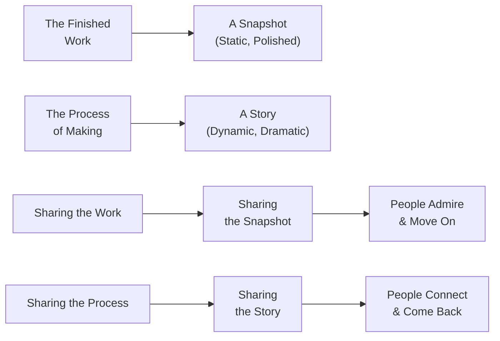
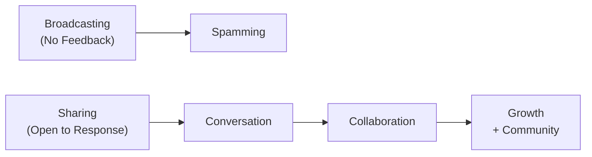

## Introduction: You Don't Have to Be a Genius

Austin Kleon opens *Show Your Work!* by telling the reader, before a single chapter of rules has arrived, that the book is not about being brilliant. It is about being *visible*. Creativity, he points out, has historically been associated with a small group of special people — the genius, the star, the prodigy — and the pressure to live up to that mythology has frozen more people than it has inspired.

The introduction offers Kleon's personal entry point: he was a writer and artist working in a cubicle, making things on nights and weekends, with no publisher, no gallery, no agent, no plan. He shared his blackout poems on Tumblr. He posted photographs of his sketches on Instagram. He wrote a blog about what he was reading and making. Slowly, people noticed. A publisher noticed. *Newspaper Blackout* became a book. *Steal Like an Artist* followed. The arc was not planned; it emerged from showing up consistently and sharing honestly.

The question the book sets out to answer is one Kleon received endlessly from readers after *Steal Like an Artist*: *"Okay, I've stolen from the masters and started making things. Now what? How do I get the world to see it?"*

---

## Rule 1: You Don't Have to Be a Genius

The first rule is a direct response to the genius myth. You are not a genius. The people you admire are not geniuses. The myth of the solitary, divinely inspired creator does not fit how creative work actually gets made. Creative work happens in community, in conversation, in the gap between what you know and what you're trying to figure out.

Sharing your process publicly has the effect of dissolving the genius illusion. When the world can see your references, your drafts, your failures, and your questions, you stop being a genius and start being a person. The paradox is that this makes your work more compelling, not less.

---

## Rule 2: Get on with the Process

You are not defined by the finished product. You are defined by — or more charitably, you are in active dialogue with — the *process of making*. The product is a snapshot of a moment in a longer conversation between you and your materials.

Kleon insists that process is a story with inherent drama: there are obstacles, discoveries, dead ends, breakthroughs. The finished product has none of this. A published poem is elegant; the three weeks of staring at a blank page that produced it is a story. And stories are what people connect with.

Process-sharing transforms the relationship between creator and audience. The audience stops being consumers of a product and starts being witnesses to a practice. People who watch a potter throw clay on Instagram do so not because the finished vases are the only possible reason to watch — they watch the throwing because it is absorbing, because it is honest, and because watching someone struggle with material is one of the most genuinely human things you can witness.

---

## Rule 3: Share Something Small Every Day

Kleon's third rule is about building a habit of disclosure. Not everything you share has to be a finished work. In fact, most of it should not be.

He recommends what he calls a "daily dispatch": a small, regular act of sharing that builds an archive of your creative life. This can be as minimal as a photograph of your workspace, a quote you wrote down in your notebook, a link to something you are reading, or a paragraph about what you are struggling with.

The purpose is twofold. First, it builds a body of public work that works for you while you sleep — searchable, findable, available to people you will never meet. Second, and more importantly, the discipline of sharing something small every day changes your relationship to your own practice. You start looking for the small moments worth sharing, and in doing so you start seeing your own creative life as something worth documenting rather than something private and incidental.

---

## Rule 4: Open Your Cabinet of Curiosities

Kleon's fourth rule addresses a central anxiety of the sharing era: *"If I show what I'm working on, someone will steal it."* His answer is direct and counterintuitive: sharing your sources does not weaken your work. It strengthens the connection between that work and the people who care about where it came from.

He celebrates **curation** as a creative act. A curator is not someone who passively collects. A curator is someone who selects, arranges, gives context, and tells a story through the juxtaposition of other people's work. Every great collection — from a museum to a Spotify playlist to a personal blog's list of links — is a creative product in its own right.

Your influences are not a secret. Talking about them publicly does two things. First, it signals to the people who share your influences that you belong to the same conversation — you are building a network without networking. Second, it makes your original work *legible*. When your audience understands what you are working within dialogue with, they understand your work more deeply.

---

## Rule 5: Tell Good Stories

People do not buy facts. They do not even buy products. They buy stories about who they are, or who they will become, if they engage with your work.

Kleon's storytelling advice is practical and grounded. Every creative act is already a story. Your process is a story. The making of a thing has a beginning (the idea), a middle (the struggle), and an end (the release). Most creators skip the middle — they show the finished work and pretend the struggle did not happen. But the middle is the only part people actually care about.

He takes aim at the language of social media pessimism — *"content," "engagement," "impressions"* — and replaces it with a richer vocabulary: *stories, conversations, gifts*. The shift is not semantic. It is a shift in how you relate to the people on the other side of the screen.

---

## Rule 6: Teach What You Know

To teach is to give away what you know, and Kleon is unambiguous that this is a strategic, life-affirming act. Teaching what you know partially does three things simultaneously: it clarifies your own understanding (you cannot teach what you do not truly understand); it positions you as a generous participant in a community rather than a competitor; and it creates a body of educational content that works for you indefinitely — every tutorial, every explainer, every "here's how I did this" post is a small gift that keeps giving to people you will never meet.

Kleon addresses the fear that drives people away from teaching: *"If I teach everyone what I know, what is left that makes my work distinctive?"* His answer is that knowing something and being able to articulate it are very different. The act of teaching deepens your own practice in ways that thinking alone cannot. The person who teaches a technique is almost always the person who has taken it furthest.

---

## Rule 7: Don't Turn into a Spammer

Sharing your work is not broadcasting. Broadcasting is what spammers do — they push information outward without listening. Sharing is a two-way exchange.

Kleon distinguishes between sharing and self-promotion. The key difference is *listening*. When you share your work, you are also opening a channel for response. The directions that response takes you — corrections, suggestions, collaboration proposals — are genuine inputs. Ignoring them turns sharing into broadcasting, and broadcasting at scale is what spamming is.

The antidote to spamming, Kleon says, is to actually *become* interested in the people who respond. Follow people back. Respond to comments. Read the work of people who are showing their work alongside yours. Treat the web as a place of conversation, not a market.

---

## Rule 8: Learn to Take a Punch

Once you share your work publicly, you expose yourself to criticism, dismissal, and outright hostility. Kleon does not pretend this is pleasant. He treats it as inevitable and offers practical guidance on how to handle it.

He distinguishes three kinds of feedback: constructive criticism from people who know your field and want your work to be better; general criticism from people who do not know your work but have an opinion about it; and *noise* — insults, trolling, bad-faith engagement that is not feedback of any kind, just performance by someone else.

Learning to take a punch starts with learning to tell the three apart. Constructive criticism should be taken seriously and acted on where it applies. General criticism should be noted, set aside, and occasionally revisited. Noise should be ignored entirely — do not respond to spammers, do not engage with trolls, do not explain yourself to people who have decided not to understand.

The deeper point is that the only way to build resilience is to share more, not less. The fear of criticism keeps more people in the VOID than any actual criticism ever has.

---

## Rule 9: Persistence Outlasts Resistance

The ninth rule is about duration. Creative careers are rarely made by one viral moment. They are made by showing up repeatedly over years, sharing work that gets better, refusing to interpret early silence as rejection.

Kleon shares the problem of **"Overnight Success Syndrome"**: the pervasive belief, sustained by media narrative, that great creative careers arrive as sudden, lucky breaks. The truth, he notes, is that almost every overnight success was preceded by years of invisible making. The person who seemed to come from nowhere was making in private for a long time.

Persistence in the face of silence is one of the hardest disciplines in creative life. The early period of sharing — when you have a small audience, little feedback, and no evidence that anyone cares — is also the period when most people stop. The community that eventually forms around your work is made of people who were there when the audience was small. Those are the people worth connecting with. And they came because you persisted long enough for them to find you.

---

## Rule 10: The Void Is Friendly

Kleon closes with a meditation on the void — the empty space between making and showing, between sharing and receiving, between who you are and who you are becoming. The void is not a failure state. It is the fundamental condition of the creative life.

The void has gifts. It offers freedom from the pressure of audience expectation. It offers space for new influences to arrive. It offers the chance to start again without the weight of what you have already made. Not every moment of making needs to be shared. Not every process needs an audience. The void is where you go when you need to remember why you make things in the first place — not for the audience, not for the metrics, but for the act itself.

> *"Share your work. And when in doubt, make."*

---

## Key Chapter Takeaways

| Rule | One-Sentence Summary |
|---|---|
| 1. You Don't Have to Be a Genius | Genius is a myth; sharing your process dissolves the illusion of perfection |
| 2. Get on with the Process | The process is the real story; the product is just the ending |
| 3. Share Something Small Every Day | A daily discipline of small shares builds a public archive and changes how you see your own practice |
| 4. Open Your Cabinet of Curiosities | Sharing your influences and collecting the work of others is itself creative work |
| 5. Tell Good Stories | Facts do not spread; stories do — make your process narrative |
| 6. Teach What You Know | Teaching deepens your own work, builds community, and creates gifts that keep giving |
| 7. Don't Turn into a Spammer | Sharing is a two-way exchange — listen before you broadcast |
| 8: Learn to Take a Punch | Distinguish constructive criticism from noise; resilience comes from sharing more, not less |
| 9. Persistence Outlasts Resistance | Creative careers are built through years of consistent sharing and making, not one lucky break |
| 10. The Void Is Friendly | The empty space between making and showing is not failure — it is freedom, space, and the origin of new work |
