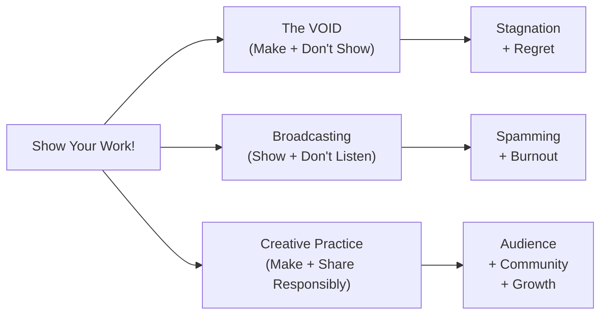

## Executive Summary

*Show Your Work!* makes a simple but profoundly countercultural argument for a generation of creators that has grown up online: **the best way to get discovered is not to polish your brand or chase algorithms, but to generously share the process of making before the product is ready.** Kleon's ten rules are not productivity hacks. They are a coherent philosophy of creative disclosure — one that reframes sharing from self-promotion (a distasteful act) into teaching and storytelling (a generous act). The book's most durable contribution is naming the VOID — the gap between making and showing that traps more creators than any other obstacle — and offering a clear, persistent, warm alternative to staying inside it.

---

## Analysis Framework

---

## Key Concepts

| Concept | Summary |
|---|---|
| **The VOID** | The gap between making something and sharing it; the space where most creative potential is wasted through inaction |
| **Process as Product** | The process of making — complete with failures, influences, drafts, and dead ends — is a story as compelling and valuable as the finished work |
| **Amateur Edge** | Amateurs have freedom professionals lack: no reputation to protect, no audience to disappoint, no habit to unlearn — and this freedom is a creative superpower |
| **The Think Quadrant** | 2×2 framework mapping Do/Don't Do against Share/Don't Share; the bottom-left quadrant (Do, Don't Share) is the VOID — enormously productive but invisible |
| **Curator as Creator** | Choosing, collecting, and arranging other people's work is itself a creative act; a well-curated collection is as valuable as an original piece |
| **Document as You Go** | Making a daily habit of documenting — photographs, notes, recordings, fragments — creates an archive that future you and future audiences will value |
| **Teach to Learn** | The act of explaining what you know deepens your own understanding in ways solitary thinking cannot |
| **Generosity as Strategy** | Giving away what you have builds connection; creative success is not zero-sum — generosity amplifies what you receive back |
| **Shut Up and Listen** | After sharing, the practice becomes listening — not to respond, but to learn. Responding to criticism is not the same as receiving it |
| **Persistence > Virality** | Most "overnight successes" are preceded by years of invisible work; duration outlasts any single moment of attention |
| **Curation as Sense-Making** | A curated collection — links, references, influences — is the most honest form of self-expression available to a beginning creator |
| **The Gifts of the Void** | Emptiness, white space, silence — the void is not a failure state but the source of new work and new directions |
| **SEO for Your Soul** | Optimize your sharing for the people who actually care, not for algorithmic metrics; authenticity as its own reward |
| **Stories Over Stats** | People connect to narrative, not metrics. Your process supplies the arc that facts alone cannot carry |

---

## Chapter-Level Summary

| The Ten Rules | Core Content |
|---|---|
| **1: You Don't Have to Be a Genius** | Genius is a myth that freezes people into inaction; sharing your process dissolves the perfection myth |
| **2: Get on with the Process** | You are defined by the work of making, not the finished product; process has inherent drama and narrative |
| **3: Share Something Small Every Day** | Build a discipline of small, regular disclosure to build a findable, archive-worthy body of public work |
| **4: Open Your Cabinet of Curiosities** | Share your influences, collect other people's work, treat curation as a creative act |
| **5: Tell Good Stories** | Facts do not viral-share; stories do — make your process narrative by framing it with conflict, discovery, and arc |
| **6: Teach What You Know** | Teaching deepens your own understanding, builds community, and creates value before you require anything return |
| **7: Don't Turn into a Spammer** | Sharing is exchange, not broadcast — listen to the people who engage before you push more content outward |
| **8: Learn to Take a Punch** | Distinguish constructive criticism from noise; resilience grows from sharing more, not less |
| **9: Persistence Outlasts Resistance** | Duration beats virality; the creative community forms around the people who persist through the early silence |
| **10: The Void Is Friendly** | Empty space between making and showing is not failure; it is the origin of new work and the source of creative freedom |

---

## Author & Publication

| Field | Value |
|---|---|
| Slug | `show-your-work-austin-kleon` |
| Author | Austin Kleon |
| Born | 1983, Circleville, Ohio |
| ISBN (hardcover) | 9780761178972 (Workman, 2014) |
| ISBN (10th Anniv.) | 9781523506982 (Workman, 2024) |
| Publisher | Workman Publishing |
| First Published | 2014 (10th Anniversary Edition, 2024) |
| Page Count | ~224 pages |
| Format | Compact, illustrated hardcover; short chapters; black-and-white hand-drawn artwork throughout |
| Genre | Creativity / Self-Help / Art Practice / Personal Development |
| Series | Part of a loose trilogy: *Steal Like an Artist* → *Show Your Work!* → *Keep Going* |

---

## Critical Evaluation

### Strengths

- **Moral clarity.** Kleon's argument is uncontaminated by cynical influencer-logic. The book genuinely believes generosity is not a losing strategy, and that belief is rare enough on the self-improvement shelf to be itself valuable.
- **Practical accessibility.** The ten-rule format makes the book highly skimmable and quotable. The prose is short, the chapters are brief, and the illustrations provide constant visual relief and reinforcement.
- **The VOID as a named phenomenon.** Before Kleon, the gap between making and sharing was discussed as procrastination, fear, or perfectionism. Naming it as the VOID — a structured space with both hazards and gifts — gives readers a handle on it.
- **Curation elevated.** The book treats curation as creative work in its own right, which remains an underappreciated idea and one that is increasingly relevant in an age of information abundance.
- **Range of applicability.** Though aimed at visual artists and writers, the principles apply equally to programmers, musicians, chefs, academics, and anyone whose work has a process worth sharing.

### Weaknesses

- **Platform agnosticism wears thin after 2014.** The book is ecstatic about Tumblr, Twitter, and Instagram at a moment before those platforms' darker dynamics were fully apparent. The enthusiasm is genuine, but readers in 2024+ will notice the gap.
- **Depth is traded for accessibility.** Kleon's commitment to brevity means some rules are explored more as aphorisms than as worked-through arguments. Readers who want a philosophically rigorous account of why sharing process builds trust will need to look elsewhere.
- **Silence on structural barriers.** *Show Your Work!* takes for granted that having a safe, stable environment in which to make and share is the default. For creators who face precarity, surveillance, or workplace retaliation for disclosure, the assumption that sharing is universally wise is not accurate.
- **Virality not addressed honestly.** The book's subtitle promises "get discovered," but the actual advice — be consistent, be generous, build in public — is a long-game strategy that almost never produces virality. The gap between the subtitle and the philosophy is a source of mild reader frustration.

### Overall Assessment

*Show Your Work!* has become a quiet classic of the creative internet era — cited by countless bloggers, YouTubers, and maker-educators as the book that changed their relationship to their own process. Its influence has been wide and deep, and it has aged far better than most of its contemporaries in the social-media-optimism subgenre. The core insight — that generosity about process creates connection more reliably than polished branding — is one that the next decade of creative practice will need as badly as this one did.

**Rating: 9/10** — The most generous and actionable creative manifesto of the internet era. Essential reading for any creator who wants to be seen.
