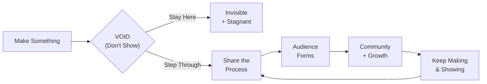
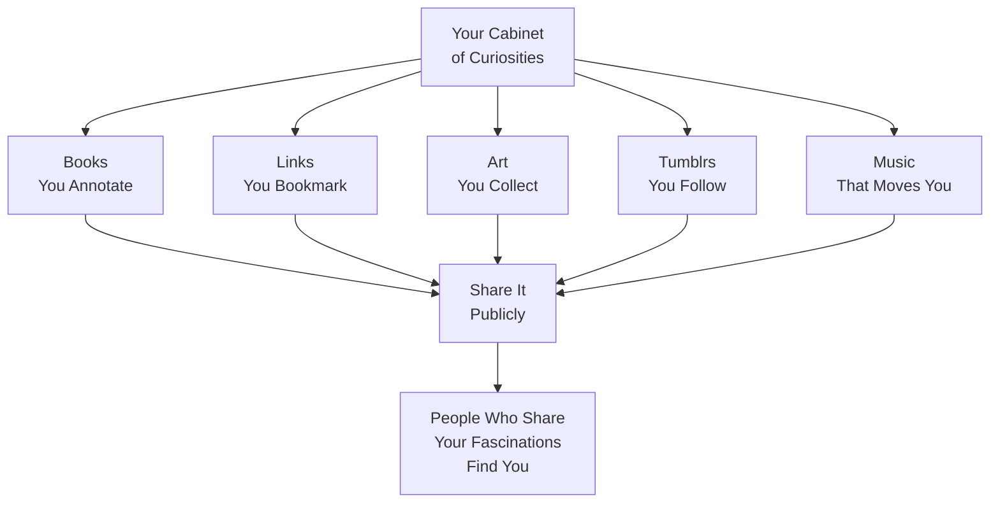
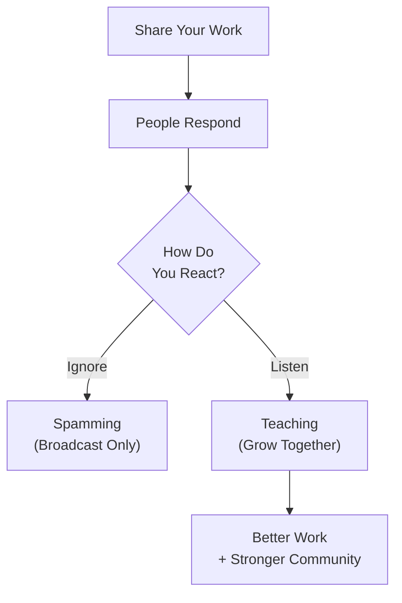

# Narration Script: *Show Your Work!* by Austin Kleon

---

**Narrator:** In 2014, a strange, small, illustrated book appeared on the creativity shelf. It was called *Show Your Work!: 10 Ways to Share Your Creativity and Get Discovered*. Its author was a thirty-one-year-old artist named Austin Kleon who had recently found his own audience by crossing out words from newspaper articles with a black marker and posting the results on Tumblr. The book he wrote next — *Steal Like an Artist* — had already made him a New York Times bestseller. *Show Your Work!* answered the question his readers kept sending him: *"I get it. I need to make things. But how do I get anyone to see them?"*

*(pause)*

The answer he gives is not what most people expect. It is not a social media strategy. It is not a personal brand framework. It is not a list of tactics for acquiring followers. The answer is: show your work. Not the finished work — the *work*. The process. The messy middle. The failed drafts, the abandoned ideas, the three weeks of staring at a blank page. The world is not short of polished products. It is short of honest process.

---

## The Diagnosis: The VOID

**Narrator:** Kleon begins with a diagnosis that resonates with a striking accuracy for anyone who has ever made something and hidden it. He calls it the **VOID**.

The VOID is the gap between making and showing. You write the poem, but you do not publish it. You paint the canvas, but you do not photograph it. You build the website, but you do not launch it. You are productive — you make things — but you are not *visible*. The world does not see what you are capable of because you have not let it.

Most explanations for the VOID are variations on the same idea: fear. Fear of judgment, fear of not being good enough, fear of being ignored or dismissed or misunderstood. Kleon does not dispute this. But he reframes it. The VOID is not a personality defect. It is a structural position — and like all structural positions, it can be exited by changing behavior, not by fixing character.

---

## Rule 1: You Don't Have to Be a Genius

**Narrator:** The first rule takes direct aim at the mythology that blocks more people than any other: the genius myth. The idea that creative work requires a special kind of person — a genius, a prodigy, a star — is not just false. Kleon treats it as actively harmful.

The history of creativity is not the history of solitary geniuses struck by divine lightning. It is the history of people who absorbed what came before them, worked at it consistently, and — crucially — showed their work to other people, who then responded to it, contributed to it, and spread it.

Sharing your process has an additional benefit: it destroys the genius illusion. When people can see your references, your drafts, your failures, and your questions, the gap between you and them closes. You are not a genius. You are someone who makes things and cares enough to show the making. That is enough.

---

## Rule 2: Get on with the Process

**Narrator:** Rule Two reframes what you are. You are not your products. You are your *process*. The poem you publish is a snapshot. The act of writing it — the three weeks of failure, the breakthrough sentence, the revision — is a story with stakes, conflict, and resolution.

And stories are what people connect with. Not polished products. Stories.

Kleon's point here is not remotely new — artists, writers, and teachers have been making it for centuries — but his presentation is distinctive. He does not call it a *backstory*. He calls it your *process*. A word that implies action, forward momentum, and continuing engagement with materials and ideas. Process is not something that happened in the past and got packaged into a product. It is something that is happening right now.

> *"If your work isn't showing, it's hiding."*

*(pause)*

One of the most useful reframings in the book: the empty space between finished works is not a failure of productivity. It is the creative life in progress, and it is worth sharing exactly as it is.

---

## Rule 3: Share Something Small Every Day

**Narrator:** Rule Three is the book's most actionable discipline, and it is also the one most widely adopted by the creators who read the book. Kleon suggests building a **daily dispatch**: a small, consistent act of sharing — a photograph of your desk, a quote from what you are reading, a paragraph about what you are stuck on, a link to something that inspired you.

The discipline of sharing small things daily changes how you see your own creative life. You start looking for the small moments worth sharing rather than collapsing weeks of invisible work into a single announcement. The small, daily posts also accumulate into something larger — a public archive of your creative life that is findable, searchable, and worth something to people you will never meet.

Kleon does not promise that a daily dispatch will make you an overnight sensation. It will not. But it will change the texture of your relationship to your own practice, and over time it will create a body of work that works on your behalf.

---

## Rule 4: Open Your Cabinet of Curiosities

**Narrator:** Rule Four is where Kleon's curatorial instincts come to the fore. A **Cabinet of Curiosities** — or Wunderkammer — was historically a room or collection where naturalists and scholars displayed their specimens, books, and rare objects. It was not organized by systematic taxonomy. It was organized by fascination. Each object was chosen because it interested the collector, and the collection as a whole told a story about that person's mind.

Kleon's version is identical in spirit. Open your analog and digital collections — the Tumblr blogs you have followed for years, the Pinterest boards, the physical notebooks, the browser bookmarks, the annotated books on your shelf — and share them. Tell people what you love and why.

That last point — *"people who share your fascinations find you"* — is unusually durable. Most sharing advice is about finding your audience. Kleon's version is about *being found by* your audience — a subtle but important distinction. The people who respond to a genuine, specific collection of fascinations are not followers. They are the start of a community.

---

## Rule 5: Tell Good Stories

**Narrator:** Once you start sharing, the question becomes: what do you say? Kleon's answer: tell stories about what you are making. Not marketing copy. Not a personal brand summary. An honest narrative of what you are doing and why.

Media scholar Marshall McLuhan — one of Kleon's cited references — pointed out that *the medium is the message*. Kleon's version is: *the story is the medium*. The story you tell about your process is the vehicle through which people understand and relate to your work.

He makes a sharp distinction between *content* — a word that has come to mean anything produced specifically for distribution channels — and *story* — a word that implies character, change, and meaning. Content is manufactured. Stories emerge from genuine experience. The most shareable, findable, memorable thing you can post about your work is the version of it that is already a story.

---

## Rules 6 & 7: Teach and Listen

**Narrator:** Rules Six and Seven form a pair. Rule Six — *Teach What You Know* — is one of Kleon's most counterintuitive arguments, because it contradicts a deep creative instinct: *"If I teach my technique, someone will learn it and make better work than mine."*

Kleon's answer is that teaching does not diminish your originality. It clarifies your own thinking, deepens your own practice, and builds a community around the specific problems you are working on. Every person you teach becomes a person who understands your work more deeply, which means they are more likely to engage with it seriously and refer others to it.

Rule Seven — *Don't Turn into a Spammer* — is the necessary correction. Sharing is not broadcasting. When you share without listening, you are not showing your work. You are performing confidence.

Kleon's practical advice here is straightforward: follow people back. Respond to comments. Read the work of the people who are showing their work alongside yours. Treat the web as a public square, not a market, and act accordingly.

---

## Rules 8 & 9: Resilience and Persistence

**Narrator:** Rule Eight — *Learn to Take a Punch* — addresses the darker side of public sharing: the responses that are not useful, not kind, not even feedback. Criticism, dismissal, trolling — Kleon does not sugarcoat any of it.

His taxonomy of responses is useful. There is **constructive criticism** from people who know your field and want your work to be better. There is **general criticism** from well-meaning people who simply do not connect with what you are doing. And there is **noise** — trolling, insults, and bad-faith engagement that is not feedback of any kind, only the critic's own performance.

Learning to take a punch is mostly about learning to tell the three apart and responding only to the first category. But it is also — more quietly — about remembering why you shared in the first place. If the work was made for you, then your judgment of it still matters more than anyone else's.

Rule Nine — *Persistence Outlasts Resistance* — is Kleon's longest and most deeply considered chapter. It addresses what comes after the first six months of modestly shared work: the silence. The slow accumulation. The sense that nothing is happening.

What happens next, if you persist through it, is a slow compounding of attention. Not virality. Not an overnight break. Something quieter and more durable: the gradual formation of a community of people who have been paying attention to your work for a long time. These are not followers. They are witnesses.

---

## Rule 10: The Void Is Friendly

**Narrator:** Kleon chooses to close not on the theme of persistence or community, but with the theme of the void itself. Rules One through Nine are about what to do: share, teach, listen, persist. Rule Ten is a meditation on what the void is and why it should not be feared.

The void is the empty space between making and showing. It is also the empty space within a work — the quiet moments in a composition, the pauses in a sentence, the silence between notes. Kleon does not recommend filling it. He recommends being friends with it.

The void is the source of new work. It is where influences arrive when you are not pushing for output. It is where failure lives before it becomes a lesson. It is where you go when you need to remember why you make things, not for an audience, not for a metric, but for the act itself.

> *"Share your work. And when in doubt, make."*

*(heavy pause)*

---

## Conclusion: The Practice of Showing

**Narrator:** *Show Your Work!* is the kind of book that makes you want to do something — not because it is a motivational manual, but because it makes doing something feel like an act of connection rather than a performance.

Kleon's central insight — that sharing your process is an act of generosity, not self-promotion — has proved remarkably durable. A decade after publication, the creative internet is full of people who found their first audience by showing their sketchbooks, their code-in-progress, their reading notes, and their failed drafts. They are not a minority. They are the norm now.

The book's limitations are gentle. Its enthusiasm for social platforms that have, in the years since, shown their darker faces — surveillance, algorithmic manipulation, attention extraction — is not naive but it is dated. Kleon would likely update his platform-specific examples today; his principles, though, would remain unchanged.

**Narrator:** If you are a creator who has something to show — a painting, a poem, a codebase, a recipe, a song — and you have been waiting for the right moment, the right size of audience, the right level of polish, Austin Kleon has this to say: the right moment is right now, the audience is already there, and polish is the last thing they want.

Show your work.

*(pause)*

Make something. Email one person you admire and tell them what you made. Write three sentences about what you are struggling with and publish them. Take a photograph of your desk. Post a link to someone else's work you love. The void is waiting. Step through it. And when you are ready to show, show generously.

**Narrator:** Thanks for listening. *Show Your Work!* is not a strategy. It is a practice. The kind that, kept up steadily over time, turns a person who hides in the VOID into a person the world can see, can learn from, and is grateful to have found.

*(fade)*
