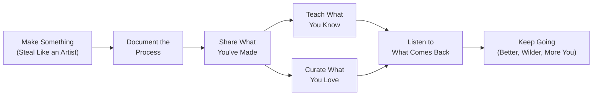

## 📚 Overview

*Show Your Work!: 10 Ways to Share Your Creativity and Get Discovered* (2014, 10th Anniversary Edition 2024) by Austin Kleon is the book that gave a generation of writers, artists, designers, programmers, and creative professionals permission to stop waiting for permission. At roughly 224 pages and arranged as a sequence of twenty compact, illustrated chapters, it functions as both a creative philosophy and a set of actionable rules for anyone who makes things and wants those things to reach other people.

Kleon, an artist and writer based in Austin, Texas, first found a broad audience through his *Newspaper Blackout* poetry — poems he made by crossing out words from newspaper articles with a permanent marker and leaving only the remaining text. That practice became the basis of his first book, *Steal Like an Artist* (2012), which argued that all creativity is combinatorial and that young artists should learn from their influences rather than chase originality prematurely. *Show Your Work!* is its natural sequel: if *Steal Like an Artist* is about what to make, *Show Your Work!* is about how, when, and why to share it.

The book struck a chord because it named a problem that social media had made urgent while traditional institutions had not solved it: the *VOID*. Young creators have always faced a version of this question — how do I get seen when I have no credentials, no contacts, no gallery show, no publisher? — but the internet changed the question's shape. The answer, Kleon insists, is not to network strategically, acquire followers, or cultivate a brand. The answer is to document your process, share what you love, teach what you know, and, above all, be generous.

---

## 👤 About the Author

Austin Kleon was born in 1983 in Circleville, Ohio, and lives in Austin, Texas, where he works as a writer and artist. He came to public attention through *Newspaper Blackout*, a visual poetry series created by crossing out words from the *Austin American-Statesman* with a black marker, leaving only the remaining words to form accidental, often surrealist mini-poems. The work was shared widely online before becoming his first book — *Newspaper Blackout* (2010).

Kleon's follow-up, *Steal Like an Artist* (2012), exploded into a New York Times bestseller by translating the artist's practice of apprenticeship and influence into a manifesto for the digitally connected young creator. *Show Your Work!* (2014) extended the argument from *what to create* to *how to share it*. *Keep Going* (2019) addressed the long-term question of sustaining a creative practice over a lifetime. His books are known for a distinctive visual style — handwritten text, hand-lettered typography, and minimalist black-and-white illustrations — and for a voice that is warm, irreverent, and unusually free of competitive anxiety.

---

## 🎯 The Book's Thesis

Kleon's central argument is deceptively simple, and it has two parts.

**First:** the gatekeepers are gone and the audience is already there, but most creators miss the opportunity because they are waiting for a kind of *ritual acceptance* — an agent, a publisher, a blue checkmark, a gallery show — before they let anyone see their work. The gatekeepers did not just protect creators from a cruel world; they also gave creators an excuse for not sharing. Kleon calls this the *amateur paradigm*, and he treats it not as a flaw but as an enormously generative position.

**Second:** the way to share is not to package a finished, perfected result and push it outward as a brand asset. It is to share the *process* of making — the sources that inspired you, the drafts that failed, the materials you are working with, the questions you cannot answer. Process-sharing does three things simultaneously: it builds an audience around the work before the polished product is ready; it creates an archive of your own development that future you will be grateful for; and it invites other people into the act of making rather than simply consuming its output.

> *"If you want to be successful, you have to share your work."*

The gap between *Steal Like an Artist* and *Show Your Work!* is the gap between the studio and the room outside it. *Steal Like an Artist* says go make something. *Show Your Work!* says let us watch you make it. Together they form a nearly complete developmental arc: absorb influences, make work, share the making, keep going.

---

## 💡 Core Concepts

| Concept | Summary |
|---|---|
| **Process as Product** | Share the journey, not the destination. The story of how you made something can be as compelling as the finished thing itself. |
| **The Amateur's Edge** | Amateurs have the advantage — no professional habits to unlearn, no brand to protect, no audience to disappoint. Freedom to experiment is their greatest creative asset. |
| **The VOID** | The space between making something and showing it. Most people stay in the VOID too long, waiting for permission that will never arrive. |
| **Document the Process** | Keep a daily log, photograph the studio, write about what you're learning. Your process is the story, and documentation is the medium. |
| **Give Away the Secrets** | The instinct is to protect what makes your work unique. Kleon's counterintuitive point: sharing your methods builds connection, not competition. |
| **Teach What You Know** | Teaching is the highest form of sharing. When you teach, you clarify your own thinking, build community, and create value before you need anything in return. |
| **The Think Quadrant** | A 2×2 framework: Do/Don't Do × Share/Don't Share. The Think quadrant (Do, Don't Share) is where creators waste their lives — making but not disclosing. |
| **Curation as Creativity** | Choosing, collecting, and organizing the work of others is itself a creative act. A well-curated collection is as valuable as an original piece. |
| **Shut Up and Listen** | After you share, the real work begins: listening to what comes back. Not to respond — to learn. |
| **The Gifts of the Void** | Creating empty space, white space, silence. Not every moment needs output. The void is where new ideas arrive. |
| **Stickiness of Stories** | People do not remember facts; they remember stories. Sharing your process supplies the narrative arc that facts alone cannot. |
| **Generosity Breeds Success** | Success is not a zero-sum game. Giving away what you have — ideas, techniques, introductions — multiplies what you get back. |
| **SEO for Your Soul** | Optimize your work and sharing for the people who care, not for the algorithms. Authentic documentation is its own reward. |
| **Don't Turn into a Spammer** | Share work, not noise. Broadcasting without listening or contributing is not showing work — it is self-promotion. |
| **Re: What You Love** | The most honest creative work comes from genuine personal obsession. If you do not love it, do not expect anyone else to care. |

---

## 👥 Who Should Read

- Anyone who has made something — art, writing, code, music, food, photography — and wondered why nobody sees it
- Young artists and writers who feel stuck waiting for a publisher, agent, or gallery
- Designers, developers, and makers who want to build an audience around their process
- Professionals in creative industries who want to build a personal practice alongside their day job
- Teachers and coaches who want to model vulnerability by sharing their own unfinished work
- Anyone who finds the idea of "personal branding" exhausting and is looking for a more generous, authentic alternative
- *Steal Like an Artist* readers who absorbed the philosophy and now want the practical next step

---

## 🚫 Who Should Skip

- Readers looking for a comprehensive social-media strategy guide — Kleon works at the philosophy level, not the platform tactics level
- Anyone who fundamentally disagrees with the premise that sharing your process is valuable (i.e., traditionalists who believe art should emerge fully formed)
- Businesspeople seeking a marketing playbook framed around ROI, funnels, and metrics — this book is anti-funnel from first principles
- Readers who have no creative practice to document and no intention of starting one

---

## 📖 Related Books

- *Steal Like an Artist* — Austin Kleon. Prequel to *Show Your Work!*; covers influences, apprenticeship, and the combinatorial nature of creativity.
- *Keep Going* — Austin Kleon. Follow-up; addresses the long arc of sustaining creative practice through rest, routine, and returning to the work.
- *The War of Art* — Steven Pressfield. The book on creative resistance that Kleon builds upon; a deeper exploration of the internal forces that block making.
- *Big Magic* — Elizabeth Gilbert. Creative living from the perspective of wonder and curiosity rather than hustle and productivity.
- *Deep Work* — Cal Newport. A counterweight: Kleon celebrates accessible, generous sharing; Newport defends the value of focused, undistracted solitude.
- *On Writing Well* — William Zinsser. Classic writing craft that shares Kleon's instinct for simplicity and authenticity.
- *Rework* — Jason Fried and David Heinemeier Hansson. Shares Kleon's impatience with credential-bragging and enthusiasm for shipping freely.
- *Daily Rituals* — Mason Currey. A companion on how creative people structure their days — the documentation Kleon recommends but shown at scale.
- *In Praise of Shadows* — Junichirō Tanizaki. Aesthetic philosophy of subtraction and the beauty of emptiness; Kleon's "gifts of the void" concept echoes directly.
- *The Artist's Way* — Julia Cameron. A twelve-week creative practice program that shares Kleon's emphasis on process over product.

---

## ⭐ Final Verdict

*Show Your Work!* is the rare book that is both small enough to read in a single afternoon and large enough to change the trajectory of a creative career. Kleon's voice is warm, unpretentious, and free of the competitive anxiety that plagues much of the self-improvement shelf. His ten rules are not hacks — they are reorientations, each one nudging the reader away from *waiting to be discovered* and toward *making yourself discoverable through the quality of your attention*.

The book's most radical claim — that the best way to build an audience is to stop building it and instead start showing your process honestly — has been validated repeatedly by the decade of content creation that followed its publication. Every authentic YouTube teacher, every code tutorial writer, every process-sharing visual artist who found an audience through Instagram or a blog before they had a product to sell — they are all operating within Kleon's framework.

Its limitations are modest: the book leans into social media enthusiasm that has cooled for many readers since 2014, and its brevity means some chapters stop where deeper thinking could continue. But brevity is also its strength. *Show Your Work!* is not a textbook; it is a provocation wrapped in an invitation. You do not need to finish it changed. You just need to be nudged toward sharing something today.

**Rating: 9/10** — The most generous and actionable creative manifesto of the social-media era. Read it once a year, and share what you make.
