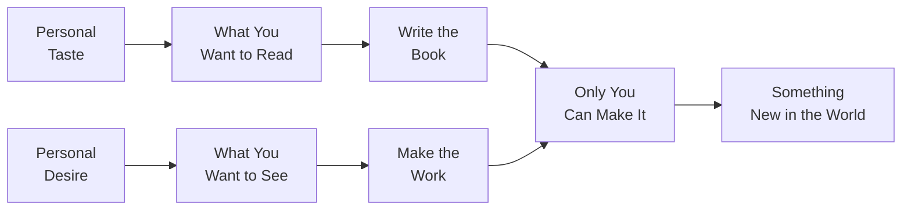
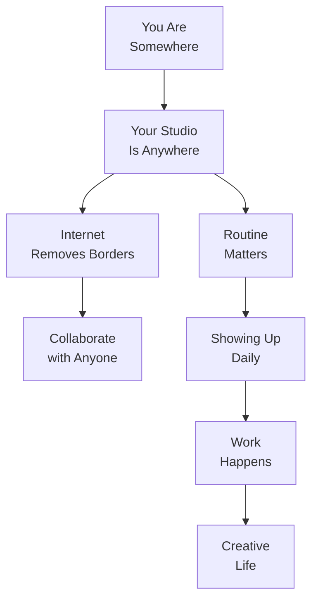
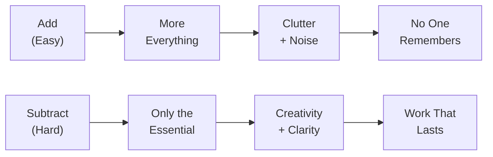

## Principle 1: Steal Like an Artist

Austin Kleon opens with a radical reframing: every act of creativity is an act of recombination. Nothing is original. The writer who admires a poet, the musician who collects a guitarist's solos, the designer who traces magazine layouts — every artist begins inside someone else's work before finding their own voice.

Kleon draws on advice he received from a mentor early in his career: steal like an artist. What he means by "steal" is not plagiarism or uncredited copying. It is the opposite. To steal like an artist is to study a chosen influence so thoroughly that you absorb it completely, understand it from the inside, and then continue past it. The good artists borrow. The great artists steal. The distinction is transformation, not imitation.

The genealogical metaphor is important. Every creative person descends from a lineage. Your job is to know your family tree — to know who came before you, what they contributed, and where you sit in that line. Kleon insists the question is never "Is this original?" but rather "Who is this for? And what tradition does it continue?" Originality is not the absence of influence. It is influence so thoroughly digested that it becomes new in the act of being spoken again by a different person.

---

## Principle 2: Start Copying

Before you have a style — before you know what you want to say — copy those you admire. Kleon is unambiguous: this is how every artist begins. The painter copies the old masters. The musician learns existing songs. The writer imitates the sentences of writers they love. Copying is not the goal. It is the training ground.

The crucial move in this chapter is distinguishing between copying as practice and copying as fraud. Kleon's argument: as long as you are copying to *learn*, you are doing honest work. The fraud begins when you present the copy as original. But the copy stage is not fraud. It is the necessary apprenticeship that every artist undergoes — usually silently and privately — before they have anything of their own to say.

Kleon quotes Pablo Picasso: *"It is not your job to be original. It is your job to be yourself."* The only way to become yourself, he argues, is to work through enough other people's styles that you emerge on the other side with something unmistakably your own.

---

## Principle 3: Create the Work You Want to See in the World

The third principle is a direct rejection of waiting. The world does not need more people who have a good idea but are waiting for the right moment, the right audience, or the right permission slip. It needs the work that *you* wish existed and that no one else will make for you. That specificity — the work you personally want to see — is the seed of originality.

Kleon draws on his own experience as a writer-collage artist frustrated by the absence of the kind of work he wanted to read. Rather than waiting for someone else to make it, he made it himself. The work that emerges from personal want is inherently distinctive because desire is not generic. Ten thousand people may want a better thriller novel. One person may want a thriller novel that treats birds as symbols of embodied freedom. That second desire produces specific, findable, genuinely original work — not because it came from nowhere, but because it came from a specific want that no algorithm or commissioning editor could replicate.

---

## Principle 4: Write the Book You Want to Read

Principle Four deepens Principle Three by addressing the critic's objection: what if what I want to see in the world is bad? What if my tastes are wrong? Kleon's answer is that taste is not the enemy of making — it is its precondition. The fact that you can identify a gap, an absence, a dissatisfaction with what currently exists means you have the critical faculty that makes making possible.

This principle also addresses a form of creative paralysis specific to readers and writers: the belief that the world already has enough books. Kleon's response is that the world has enough generic books. It does not have enough books written by *you*, about *your* specific obsessions, shaped by *your* specific reading history. The book you want to read — a memoir structured as a letter to your younger self, a poetry collection organized around bird species, a manual for a craft no one seems to care about — is a book no one else can write.

---

## Principle 5: Use Your Hands

Kleon's fifth principle returns to the body as a site of creativity. Creativity is not entirely mental. It is also physical, material, tactile. Kleon celebrates the maker's hands: the woodworker running fingers across a sanded surface, the potter judging clay consistency by touch, the writer circling and crossing out on paper before the work ever arrives on a screen.

The computer, Kleon argues, is a tool for finishing work — not for beginning it. Beginning work requires physical materials, analog friction, the small accidents that happen when your hand is moving through space and material rather than clicking a mouse. He points to his own practice: every *Steal Like an Artist* page began as a physical scrap — a newspaper clipping, a handwritten list, a photograph taped into a notebook. The computer was the last place the work arrived, not the first.

This principle carries an implicit warning: do not start on the screen if you do not have to. The screen is efficient. Efficiency is the enemy of beginning.

---

## Principle 6: Side Projects Are Not Optional

The sixth principle makes perhaps the book's most directly practical argument: the work you do for no one — the work that has no audience, no deadline, no market — is the work that will define you. Professional obligations feed your livelihood. Side projects feed your creative life. Without the latter, the former becomes a treadmill.

Kleon treats side projects as essential infrastructure. They are the places where you experiment without consequence, follow obsessions that no one is paying you to pursue, and produce work that is genuinely yours rather than work that has been commissioned, shaped, and finalized for someone else's purposes. Side projects are where you practice being the artist you want to become rather than the artist someone else has hired.

The fatal mistake is to let side projects starve because you are too busy surviving. Kleon does not underestimate the difficulty of this — he acknowledges that many people genuinely do not have the time or energy for unpaid creative work. But for those who do have even a sliver of time and space, the side project is not an indulgence. It is the investment with the highest creative return.

---

## Principle 7: Make It Happen

The seventh principle is about logistics — the unglamorous, practical, physical conditions of creative life. Where you work. When you work. Under what constraints. Kleon argues that location is no longer destiny. The empire of creative life has fallen. You do not need to live in New York or Paris or Berlin to have a creative career. You can be anywhere — and with the internet, you can collaborate with anyone.

But having a location — any location, one you have chosen or one that has chosen you — matters more than which location it is. What matters is that you have a place where work happens, a routine that supports it, and a commitment to showing up even when conditions are imperfect. The studio is where you make it happen. The studio is wherever you are when you decide to begin.

Kleon also addresses the question of travel and dislocation. Sometimes changing your geography changes your work in fundamental ways. A new environment breaks habits, disrupts routines, and forces new associations. Not everyone needs to move. But for people who have been stuck for a long time, a change of address — even a temporary one — is sometimes the creative act that unlocks everything else.

---

## Principle 8: Be Nice

"Be nice" sounds like afterthought, a kindness appended to a book about creativity. Kleon means it as a strategic principle. The world of creative work is smaller than it appears. The person you dismiss today may be the person who introduces you to your next collaborator, or your next publisher, or the person who reads your work when no one else is paying attention.

Kleon's point is not that you should be nice to get ahead — though it does have that effect. His point is that the creative life is sustained by networks of generosity, small exchanges, references, recommendations, and people who remember that you treated them well the last time you crossed paths. Hostility, competition, dismissiveness — these are expensive in a world where reputation travels faster than work.

"Be nice" is also an instruction to yourself. The inner voice that criticizes, envies, and compares is not your friend. The practice of treating others well begins with treating yourself with the same courtesy: assuming your own work has value, assuming your own process matters, refusing to let comparison with others paralyze you before you have even started.

---

## Principle 9: Be Boring

Principle Nine is Kleon's defense of the ordinary, the routine, the unglamorous structure that makes creative life sustainable over the long term. The creative life is romanticized as a life of inspiration, impulse, and ecstatic breakthrough. Real creative life is mostly this: you show up, you do the work, you show up again.

Kleon insists that boring is a feature, not a bug. Boring provides stability. Stability provides the conditions under which risk becomes possible. If your life is chaotic, unpredictable, and precarious, your creative practice will be too — and not in a good way. The routine that some people find suffocating is the scaffolding that makes it possible to take creative risks without also risking your livelihood, your relationships, or your sense of self.

"Be boring" is also an argument against the myth of the tortured, self-destructive artist. You do not need to suffer to make good work. You do not need chaos. You need a decent bed, a regular meal, a quiet room, and the willingness to show up in it every day.

---

## Principle 10: Creativity Is Subtraction

The final principle returns to the book's most paradoxical claim. The subtitle promises ten things nobody told you about being creative. The final thing is this: creativity is subtraction, not addition. The common mythology says you need more ideas, more influence, more reference, more stimulation. Kleon's argument throughout, and his closing synthesis, is the opposite. Creativity lives in what you remove.

The creative person is a curator, an editor, a cutter. The sculptor removes stone to reveal the form. The poet removes words to find the sentence. The designer removes elements until only the essential remains. Subtraction is harder than addition. Adding is easy. Knowing what to leave out is where the work lives.

---

## Cumulative Arc

The ten principles do not form a linear ladder. They form a system. Stealing provides the material. Copying provides the training. Making what you want provides the motivation. Writing what you want provides the voice. Using your hands provides the process. Side projects provide the freedom. Making it happen provides the structure. Being nice provides the network. Being boring provides the stability. Subtraction provides the art.

Together they add up to a single argument: creativity is not a gift. It is a practice. It is available to anyone willing to locate their influences, work through them, show up consistently, and keep only what matters.

> *"You are a mashup of everything you've ever read, seen, or heard. Stop waiting to be original. Start remixing."*
