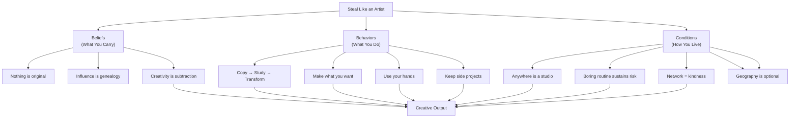

## Executive Summary

_Steal Like an Artist_ makes a single, tightly argued case: the era of the solitary genius is over. What replaced it — creatively, culturally, and economically — is the lineage-aware remix artist who knows their influences, works them through, and emerges with something that is at once new and recognizably theirs. Kleon's ten principles are not ten independent tips. They form a coherent, weight-bearing structure that addresses a creator's full creative life: influences (Principles 1–2), motivation (Principles 3–4), process (Principles 5–6), conditions (Principles 7–9), and craft (Principle 10).

The book matters because it catches a specific cultural moment — the rise of internet culture, remix aesthetics, and Tumblr-era creative sharing — and gives it a name, a genealogy, and a set of practices. It is both a how-to and a philosophy, and its brevity (160 pages, heavily illustrated) reflects Kleon's own commitment to the principle of subtraction.

---

## Analysis Framework

---

## Key Concepts

| Concept | Summary |
|---|---|
| **Creativity as Recombination** | All creative work is a remix of prior work; originality is not the absence of influence but the presence of a particular, recognizably human synthesis |
| **The Genealogy Model** | Creative lineage is not theft; knowing your artistic family tree, absorbing your influences deeply, is how you find your voice |
| **Steal vs. Borrow** | Borrowing keeps the original intact; stealing digests and transforms it into something new — the great artist steals |
| **Taste as Premise** | Knowing what you do not like, and what you wish existed, is the precondition for making anything original |
| **Side Projects as Creative Infrastructure** | Uncommissioned, unmarketable work done for no audience is the primary site of genuine artistic development |
| **The Analog Advantage** | Physical, tactile, unhurried creative work (hands, paper, materials) produces beginnings that screens cannot replicate |
| **Geography Optional** | The internet eliminates location as a barrier to creative community and distribution; your studio is anywhere you practice |
| **Boring as Creative Strategy** | Stability and routine are not enemies of art; they are the scaffolding that makes long-term creative risk possible |
| **Network of Kindness** | The creative world is small; generosity compounds, and reputation travel is faster than portfolio traffic |
| **Subtraction as Craft** | Creativity is as much about what you remove as what you add; editing, cutting, and curating are the artist's most essential acts |

---

## Chapter-Level Analysis

| Principle | Structural Role | Core Mechanism |
|---|---|---|
| 1. Steal Like an Artist | **Orientation** — redefines the creator's relationship to the past | Genealogical absorption of influences rather than defensive originality |
| 2. Start Copying | **Training** — explains the necessary apprenticeship all artists undergo | Practice copying as learning; distinguishes it from plagiarism-by-presentation |
| 3. Make What You Want | **Motivation** — grounds creative work in personal desire | Specific want produces original work because desire cannot be manufactured |
| 4. Write What You Want to Read | **Voice** — deepens intentionality through the filter of personal taste | Taste as generative constraint; the book only you can write |
| 5. Use Your Hands | **Process** — returns creativity to the body | Analog beginning; the mistake of starting on a screen; physical friction produces thinking |
| 6. Side Projects | **Freedom** — defends the uncommissioned work day | Side projects are where real artistic development occurs; professional work sustains, not creates |
| 7. Make It Happen / Geography | **Structure** — location has fallen; what replaces it is intentional space | Anywhere as studio; internet as border-remover; routine over inspiration |
| 8. Be Nice | **Network** — treats relationships as infrastructure | The creative world is small; kindness builds durable access and community |
| 9. Be Boring | **Sustainability** — logo(ized) creativity requires stable conditions | Routine, health, and stability are the scaffolding for long-term creative risk |
| 10. Subtraction | **Craft** — closes with the practice that unifies all nine | Creativity is editing; the sculptor removes; the essential act is cutting away |

---

## Author & Publication

| Field | Value |
|---|---|
| Slug | `steal-like-an-artist-austin-kleon` |
| Author | Austin Kleon |
| Born | 1983, Circleville, Ohio |
| ISBN | 9780761169253 (Workman, 2012) |
| Page Count | 160 |
| Format | Compact, heavily illustrated; hand-lettered, hand-drawn, collage-style; 10 brief chapters in two-page spreads |
| Genre | Creativity / Self-Help / Art Practice / Manifesto |
| Series | First of a trilogy: _Steal Like an Artist_ → _Show Your Work!_ → _Keep Going_ |
| Language | English (translated into 40+ languages) |
| Dedicated Audiences | Writers, designers, artists, musicians, programmers, students, anyone beginning a creative practice |

---

## Critical Evaluation

### Strengths

- **Counterintuitive framing of theft as generative.** Kleon's rehabilitation of "stealing" — the decentered, genealogical, recombinatorial act — is at once intellectually honest and culturally resonant. The book removes shame from imitation by reframing it as apprenticeship, and that reframing is genuinely useful for the beginning creator frozen by the originality myth.
- **Structural elegance.** Ten principles. Each one page-turn. Each one illustrated. The book's form enacts its content: kleon subtracts everything that is not essential to the argument. The design is not decoration. It is proof of concept.
- **Practical without being prescriptive.** Kleon says what to do — copy. Sketch. Keep a logbook. Make side projects. Be boring. — without dictating the when, where, and how in ways that would collapse under real life. The principles respect the reader's context rather than assuming a studio, a schedule, or a safety net.
- **Durability across platforms.** Written in the Tumblr era, the book's principles have survived the transition to Instagram, Twitter/X, TikTok, and Substack without losing their core argument. That is unusual for a platform-era creativity book and speaks to the generality of Kleon's claims.
- **The subtraction thesis.** Principle Ten is the book's intellectual heart, and it is the least conventional idea in the book. Creativity as subtraction rather than addition is a claim with both aesthetic and ethical dimensions, and Kleon makes it without overclaiming.

### Weaknesses

- **Brevis as aesthetic, but also as limitation.** Kleon's commitment to economy means that the book is occasionally aphoristic where readers might want an argument. _Creativity is recombination_ is a thesis that deserves sociological unpacking; Kleon gives it two pages and a drawing. Readers who want the unpacking will need to look elsewhere.
- **Silence on structural constraints.** The advice to keep side projects, to be boring, to find a studio anywhere — all of this assumes a baseline of stability that many beginning creators do not have. Kleon acknowledges this tension briefly but does not develop it. The book's greatest blind spot is the precarity that makes boredom impossible and side projects a luxury.
- **The "steal" vocabulary has been stripped of its nuance.** Kleon's argument is careful: steal like an artist means absorb and transform, not plagiarize. The book's cultural influence has spread the word "steal" far beyond the context that makes it meaningful, sometimes to the point where "steal" is used to justify actual, bad-faith appropriation. The book is not responsible for this flattening, but it does not fully inoculate against it.
- **Platform optimism, lightly dated.** The book's energy about the internet as a borderless creative commons reflects the Tumblr era — a moment when the platforms' extractive logic was not yet fully manifest. Kleon's argument survives, but his specific examples are now artifacts of a more optimistic moment.

### Overall Assessment

_Steal Like an Artist_ is the rare creative-advice book that is at once personally useful, culturally catalytic, and formally coherent as a work of its own. Its central argument — influence is genealogical, not thiefy; creativity is subtraction, not accumulation; your job is not to be original but to be yourself through the work of remix — is deceptively simple and has proven durable over more than a decade. The book's brevity is a feature. It can be read in an hour, and it will unlock something. That is enough.

**Rating: 8/10** — Short, sharp, and culturally formative. Read it before anyone else tells you to. Then copy the things in it that matter to you, work through them, and make something new.
