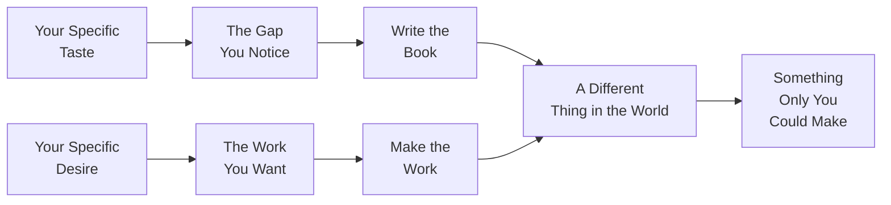
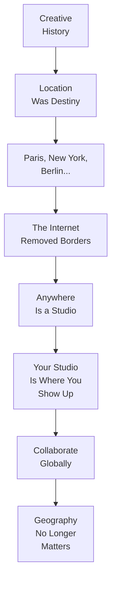
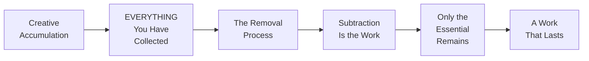

---

**Narrator:** In 2012, Workman Publishing released a very small, very illustrated book that would go on to change the way a generation of artists thinks about where ideas come from. Its title was _Steal Like an Artist: 10 Things Nobody Told You About Being Creative_. Its author was Austin Kleon — a writer and artist from Circleville, Ohio, then living in Austin, Texas, making blackout poetry on newspaper clippings and sharing them on the internet. The book is 160 pages. It can be read in an hour. It takes much longer to unlearn what it asks you to unlearn: the idea that you must be original before you begin.

*(pause)*

---

This is the narration of that book. What follows is a guided reading of all ten principles, the argument that holds them together, and the practice they invite. It is not a reading of every word on every page. Kleon's illustrations carry their own meaning. The narration covers the argument as it unfolds and uses the diagrams and artwork as landmarks along the way.

---

**Narrator:** Principle One: *Steal like an artist.* Kleon opens with a genealogical claim. Nothing is original. Every act of human creative making is an act of recombination — of collecting, arranging, selecting, and speaking again the accumulated weight of everything that came before. The writer loves a poet who loved a poet who loved a poet. The musician imitates a guitarist who was imitating a guitarist. The designer traces a layout that was itself a trace.

To "steal like an artist" is not to plagiarize. It is the opposite of plagiarism. Plagiarism hides its sources. Kleon's theft reveals them. The good artist borrows. The great artist steals. And the difference between the two is transformation: the great artist absorbs the influence so completely that it ceases to be someone else's work and becomes the soil in which something new grows.

Kleon recommends knowing your creative family tree. Go backward. Find the people who shaped the people who shaped the person you admire. Track your influences backward through time, through generations of makers, until you begin to see the full shape of the tradition you have entered. That shape is not a cage. It is a map. It tells you where you are, and it tells you that you are not alone in having arrive there.

*(pause)*

---

**Narrator:** Principle Two: *Start copying.* Before you have a style — before you have anything to say — you will not know what you want to say until you have tried saying a thousand things that other people said first. The painter who spends months copying the old masters does not do so because she expects to become a Vermeer. She does so because copying teaches the hand and eye what quality looks like. Copying builds muscle memory in the aesthetic body.

The crucial distinction Kleon makes in this chapter is between copying as learning and copying as fraud. As long as the copy is private, a study, a step in a longer process, it is honest practice. The fraudulent moment arrives when the copy is presented as original work — when the hand that copied is not yet ready and tries to pass the copy off as something it is not. But that moment is a failure of honesty, not a failure of copying. Copying itself is never the problem.

Kleon quotes Picasso, or attributes to Picasso, something close to: *"It is not your job to be original. It is your job to be yourself."* And the only way to become yourself through your work is to work through enough of what came before you that you emerge on the other side of it with something that could not have been predicted by any single influence on its own.

*(pause)*

---

**Narrator:** Principle Three: *Make the work you want to see in the world.* This is the book's motivational center, and it is rooted in a simple observation: the world is full of people who had a good idea and waited. Waiting for the right moment, the right audience, the right publisher, the right set of conditions. The work that you want to see in the world — the specific, personal, idiosyncratic work you wish existed — will not come into existence unless you make it. No one else will make it for you. No one else has your specific want.

Your want is not generic. It is shaped by everything you have ever read, seen, heard, and loved. Ten thousand people may want a thriller novel. One hundred of them may want a thriller novel structured around bird migration patterns. One person may want a thriller novel that treats birds as symbols of embodied freedom. That one person's desire is specific, findable, and worth acting on. The work that emerges from it will be original not in the sense of having no influences, but in the sense of having a particular, unmistakable center that no one else could have supplied.

*(pause)*

---

**Narrator:** Principle Four: *Write the book you want to read.* Kleon returns to the same idea from a slightly different angle: now the medium is language and the question is why the specific book you want to read does not already exist. The answer, almost always, is that no one with exactly your taste, your reading history, and your obsessions has written it yet. The gap is not evidence that the book is unnecessary. It is evidence that the book is waiting for you to write it.

There is a resistance here that Kleon names: *what if my tastes are wrong? What if I want to write something bad?* His answer is that taste itself is not the problem. Taste is what makes making possible. The ability to see what is missing, to feel dissatisfied with what currently exists, to imagine a specific alternative — that is the critical faculty in action, and it is the precondition for all original making. You do not correct your taste by ignoring it. You refine it by listening to it and making the thing it asks for.

---

**Narrator:** Principle Five: *Use your hands.* Creativity is not entirely a mental event. The hand moving across paper, the woodworker's fingers judging a surface, the potter's hands feeling clay — all of these are forms of thinking that a screen cannot replicate. Kleon's argument here is that the computer is a tool for finishing work, not for beginning it. Beginning requires a different kind of friction: paper, glue, scissors, ink, the small accidents that happen when you are working with materials rather than clicking a mouse.

Every page in _Steal Like an Artist_ began its life as a physical object — a newspaper clipping, a handwritten list, a photograph torn from a magazine, an index card. Kleon built the book from scraps before he ever opened a design program. The creative process, at its beginning, needs the resistance that only a physical material can provide. Resistance is not a bug in the system. It is the system. It is what makes thought happen.

*(pause)*

---

**Narrator:** Principle Six: *Side projects and hobbies are not optional.* Kleon treats side projects not as indulgences but as creative infrastructure. The work you do for a paycheck sustains your life. The work you do for no one sustains your creative life. The former is necessary. The latter is where development actually happens — in the uncommissioned, unmarketable, unhurried practice that no one is paying you to do.

The fatal error, Kleon says, is to let the paying work starve the unpaid work until it disappears. A week becomes two weeks becomes a month becomes a year. One day you wake up and realize you have not made anything for yourself in so long that you no longer remember how. Side projects protect against this. They are the practice space where you follow obsessions that no editor, no client, no algorithm is asking you to pursue. And it is there — in those uncommissioned enthusiasms — that the voice you are looking for eventually surfaces.

---

**Narrator:** Principle Seven: *Geography is no longer our master.* For most of creative history, location was destiny. You had to live in Paris to be in the avant-garde. You had to live in New York to be in publishing. You had to live in Berlin to make the kind of music people noticed. That era is over. The internet removed borders from creative community. Collaboration can happen across time zones, across oceans, across languages.

What has not changed is the need for a place to work. Your studio is wherever you show up and make things. It does not need to be a dedicated room. It can be a dining table in the evening, a corner of a kitchen, a laptop on a park bench. What matters is that you have a space — however temporary, however improvised — where the conditions for beginning exist: a surface, a light, some time. The creativity is not in the address. It is in the showing up.

---

**Narrator:** Principle Eight: *Be nice.* Kleon places this principle alongside the others not as a pleasant afterthought but as a structural insight about how creative communities actually function. The art world is smaller than it looks. The people you treat well today are the people who will introduce you, recommend you, or remember your name when you are not in the room. Hostility compounds. So does generosity.

"Be nice" is also an instruction to yourself. The inner voice — the one that compares, envies, dismisses — is not your friend. Treating other people well begins with treating your own creative impulses with the same courtesy: the impulse that seems unoriginal, the project that seems small, the idea that arrives unfinished and messy. Those impulses deserve patience, not contempt. The work that eventually becomes something worth showing almost always arrives wearing something worth ignoring.

*(pause)*

---

**Narrator:** Principle Nine: *Be boring.* This is Kleon's quiet manifesto against the myth of the tortured, self-destructive, iconically spontaneous creative genius. Creative life is romanticized as a series of inspirations. Real creative life is mostly attendance: showing up, doing the work, showing up again.

What boring provides is stability. And stability provides the conditions under which risk becomes possible. If your life is chaotic, precarious, unpredictable, your creative practice will be too — in a defensive, reactive way. The routine that other people find suffocating is the scaffolding that makes it possible to take creative risks without simultaneously risking your livelihood, your relationships, or your sense of who you are.

Kleon is not asking you to be passionate about bureaucracy. He is asking you to protect the unglamorous parts of creative life — regular sleep, a regular meal, a regular place to work, a regular showing-up schedule — because those are the things that make long-term making possible. Passion is not a strategy. Routine is.

---

**Narrator:** Principle Ten: *Creativity is subtraction.* Kleon closes with the most counterintuitive idea in the book, and the one that most directly contradicts the default mythology of creative abundance. We are told, constantly, that creativity is about adding: more ideas, more references, more influence, more stimulation. Kleon's argument, sustained across all ten principles and crystallized in this final one, is the opposite. Creativity is what remains when you have removed everything that is not essential.

The sculptor removes stone. The poet removes words. The designer removes elements. The musician removes notes. Every creative act that matters is as much a process of elimination as it is a process of addition. Subtraction is harder than addition. Adding is easy. Knowing what to leave out is the real art — and it is the art that continues long after the creative moment has passed, in the years of revision, editing, and cutting that transform the messy accumulation of a project into something with a discernible center.

---

**Narrator:** And with that, the ten principles are complete.

The cumulative argument of this short book, repeated in ten different registers, is that creativity is not a gift from the gods. It is a practice available to anyone willing to know their influences, work through them, show up consistently, make side projects, protect a place to make, be kind, protect the stability that sustains the work, and — most of all — keep nothing that does not earn its place in the finished thing.

The argument is simple. It is not easy. And perhaps that is why the book has endured.

*(pause)*

---

Thank you for listening to this narration of _Steal Like an Artist_ by Austin Kleon. If any of these principles found a purchase in you — a particular chapter that made you sit up a little straighter, a principle that named a resistance you have been feeling for a long time — the next step is not to absorb more. It is to practice. Copy someone you admire. Make the thing you wish existed. Show your hands a piece of paper and ask them to make something. Steal from the best. Transform it until it is yours.

*(pause)*

The world is waiting for the work only you can make.

*(fade)*
