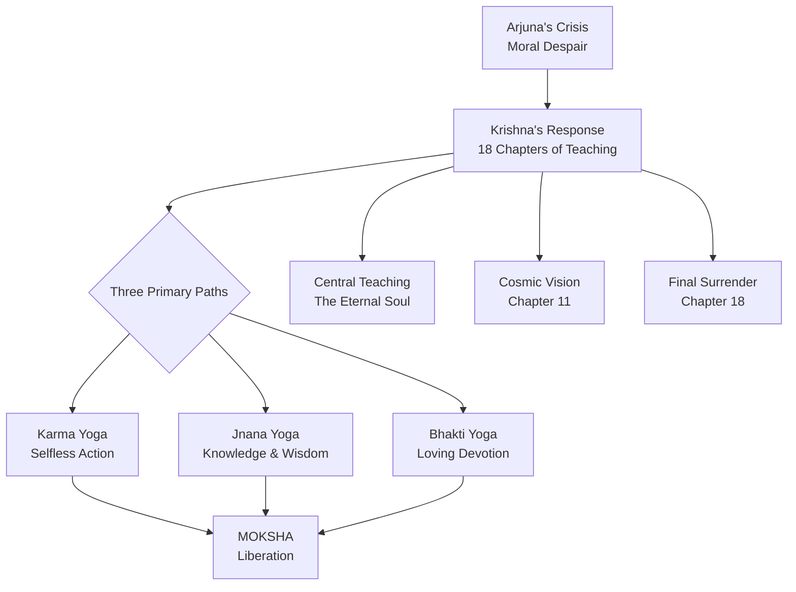
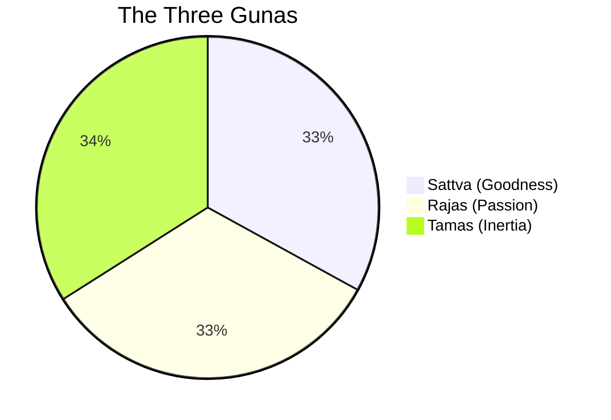
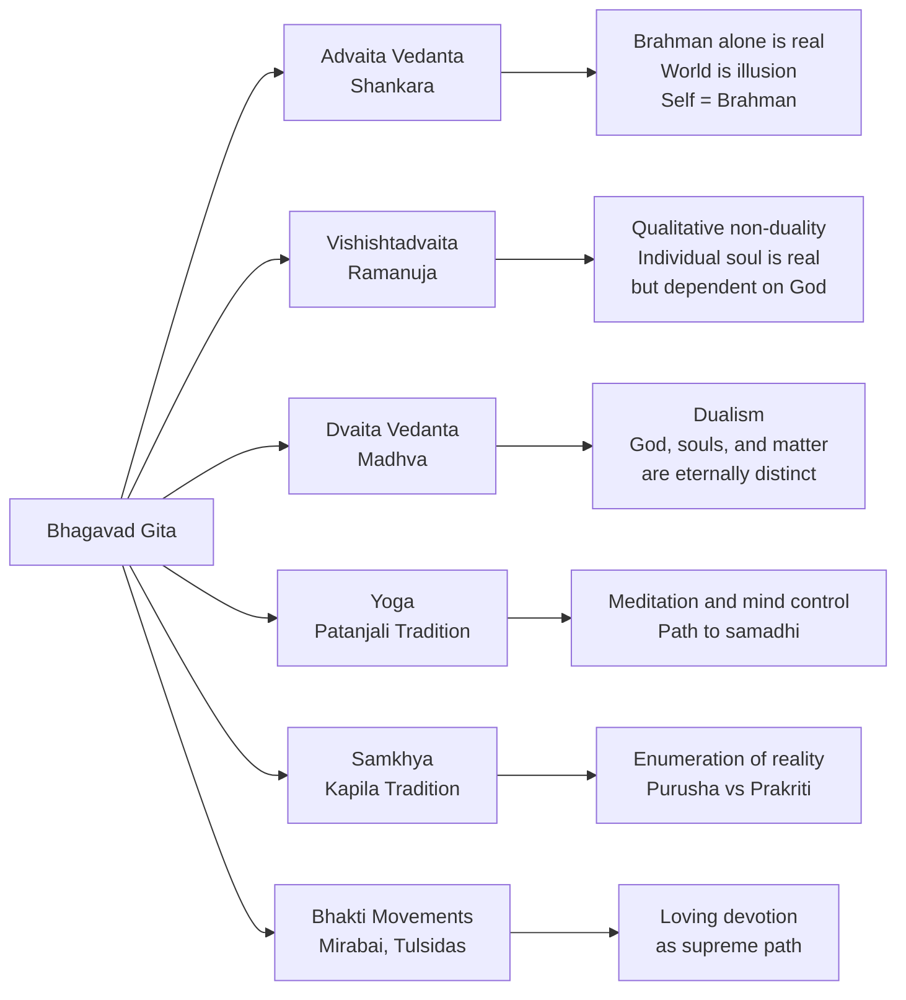

## The Narrative Framework

The Bhagavad Gita is set on the battlefield of Kurukshetra, the plain between the cities of Hastinapura and Indraprastha in modern-day Haryana, India. The Pandava princes—Yudhishthira, Bhima, Arjuna, Nakula, and Sahadeva—face their one hundred Kaurava cousins in a struggle for the throne. On the morning of battle, Arjuna asks Krishna to drive his chariot to the center of the field. When he sees his own people arrayed against him—grandfathers, teachers, uncles, brothers, sons—he falls into despair and refuses to fight.

This crisis is the dramatic occasion for the entire philosophical discourse. The battlefield serves as both a literal historical setting and a metaphor for the inner struggle that every human being faces. As Swami Krishnananda writes, "The whole of the Mahabharata is a story of conflict... The practice of Yoga resolves itself into a simple system of the overcoming and the balancing of forces for the purpose of resolving all conflicts."

## Dharma: The Moral Backbone

Dharma is the organizing principle of the entire Gita. The very first verse of the text refers to the battlefield as "Dharmakshetra" (field of dharma), signaling that the entire dialogue will explore what righteous action means.

Dharma in the Gita encompasses multiple dimensions:

| Dimension | Meaning | Example in the Gita |
|-----------|---------|---------------------|
| Cosmic Order | The fundamental law governing the universe | The cycles of creation and dissolution |
| Social Duty | One's obligations according to varna (social role) | Arjuna's duty as a kshatriya (warrior) |
| Moral Law | Ethical principles that guide conduct | Non-harming, truthfulness, compassion |
| Individual Purpose | One's svadharma, shaped by nature and circumstance | Each person's unique path to the divine |

Krishna's instruction to Arjuna is direct: "It is better to perform one's own duty imperfectly than to perform another's duty well" (Gita 3.35). This principle recognizes that moral life is not one-size-fits-all. What is right for a warrior may not be right for a priest, and what is right for a renunciant may not be right for a householder.

The Gita redefines dharma as an internal orientation rather than merely a set of external rules. True dharmic action comes from self-knowledge, detachment, and devotion. A person who performs their duty without ego, without attachment to results, and with awareness of the divine is living in accordance with dharma in its deepest sense.

## The Three Paths (Yogas)

### Karma Yoga: The Path of Selfless Action

Karma Yoga is the most practically accessible of the Gita's teachings. It transforms ordinary action into spiritual practice through detachment from results. The foundational verse is Gita 2.47:

> "You have the right to perform your prescribed duties, but you are not entitled to the fruits of your actions. Never consider yourself the cause of the results of your activities, and never be attached to inaction."

This is not a call to act carelessly. The karma yogi works with full commitment and diligence, but remains internally free from anxiety about success or failure. Krishna himself serves as the model: even though he has nothing to accomplish, he continues to act for the welfare of the world (lokasamgraha).

The five factors of action, as outlined in Chapter 18, are: the body, the doer (the person acting), the senses, the effort (the individual's striving), and destiny (divine providence or past karma). Understanding these factors helps the practitioner recognize that they are not the sole controller of outcomes.

### Jnana Yoga: The Path of Knowledge

Jnana Yoga is the path of philosophical inquiry and discriminative wisdom. It involves penetrating the illusions of material existence to perceive the unchanging reality beneath. The jnana yogi systematically analyzes experience, distinguishing between the permanent (eternal soul) and the impermanent (body, mind, and material world).

The Gita's Chapter 4 is dedicated to the exposition of jnana yoga. Krishna describes it as "the fire of knowledge" that burns away all karmic bondage. Knowledge here is not intellectual information but direct realization—the kind of understanding that transforms the knower.

The relationship between knowledge and action is a central theme. The Gita argues that knowledge without action is incomplete, and action without knowledge is blind. As Chapter 4 states: "Even as a blazing fire turns firewood to ashes, O Arjuna, so does the fire of knowledge turn all karmas to ashes."

### Bhakti Yoga: The Path of Devotion

Bhakti Yoga is described as the most direct and accessible spiritual path, focusing on loving devotion to the Divine. Krishna declares in Chapter 12:

> "Those who fix their minds on me and always engage in my devotion with great faith, I consider them to be the most perfect."

Bhakti Yoga harnesses our natural capacity for love and redirects it toward the Supreme. It transforms emotions that typically bind us to the material world—love, attachment, desire—into vehicles for spiritual liberation. The path includes practices such as kirtan (devotional singing), prayer, deity worship, and constant remembrance of the divine.

The Gita's position on bhakti is radical in its inclusivity. Krishna declares that anyone who surrenders to the divine with sincere love—regardless of social background, gender, or past actions—will find liberation. This is a striking departure from the caste-bound ritualism of the Vedic tradition.

### Raja Yoga: The Path of Meditation

Chapter 6 of the Gita provides detailed instructions on meditation (dhyana yoga). Krishna describes the ideal conditions, posture, and mental attitudes for practice. He acknowledges that the mind is restless and difficult to control—"like the wind"—but through practice (abhyasa) and detachment (vairagya), it can be mastered.

The famous image of the steady flame in a windless place illustrates the goal of meditation: a mind that is steady, focused, and free from agitation. This chapter contains some of the earliest systematic instructions on what we now call meditation practice.

## The Three Gunas (Modes of Nature)

According to the Gita, all of material existence operates through three fundamental qualities or modes (gunas):

| Guna | Quality | Manifestation | Spiritual Effect |
|------|---------|---------------|-----------------|
| **Sattva** | Goodness, purity, knowledge | Clarity, harmony, light, wisdom | Purifies consciousness, leads to spiritual seeking |
| **Rajas** | Passion, activity, desire | Restlessness, ambition, attachment | Creates restlessness and craving, binds through action |
| **Tamas** | Inertia, darkness, ignorance | Laziness, confusion, delusion | Causes ignorance, stupor, and bondage |

Everything in the material world—our bodies, minds, foods, activities, and environments—exhibits these qualities in various combinations. Understanding which modes influence us at any given time is the first step toward transcending them. Liberation comes through transcending the three modes and the cycle of desire.

## The Eternal Soul (Atman)

The Gita's most fundamental teaching concerns the nature of the self. In Chapter 2, Krishna tells Arjuna:

> "The soul is never born, nor does it die. It has not come into being, does not come into being, and will not come into being. It is unborn, eternal, ever-existing, and primeval. It is not slain when the body is slain." (Gita 2.20)

This understanding forms the foundation upon which all spiritual practice rests. The body is temporary, subject to birth, aging, and death, but the soul (atman) is eternal and indestructible. Just as a person discards old clothes and wears new ones, the soul discards old bodies and takes new ones at death.

In Chapter 13, Krishna introduces the metaphor of the field and the knower of the field. The body (kshetra) is the field where all experiences occur, while the soul (kshetrajna) is the conscious self who observes and experiences. Those who understand this distinction attain liberation.

## The Cosmic Vision (Vishvarupa)

Chapter 11 is the dramatic climax of the Gita. Arjuna requests to see Krishna's true form, and Krishna grants him celestial vision. What Arjuna sees is overwhelming: countless faces, mouths, and eyes; the entire universe with all its beings contained within one cosmic body; brilliant like a thousand suns rising simultaneously.

Krishna speaks:

> "I am become Time, the destroyer of worlds." (Gita 11.32)

Arjuna is both terrified and awestruck. He recognizes Krishna as the source and destroyer of all creation. Unable to bear the sight, he begs Krishna to return to his human form. Krishna complies, explaining that this vision is extremely rare—it cannot be attained through study, austerity, or sacrifice, but only through single-minded devotion.

The Vishvarupa is one of the most famous passages in all of world literature. It has inspired artists, poets, and philosophers for millennia, and it remains one of the most powerful depictions of the divine in any religious tradition.

## Interpretive Traditions

The Gita has been interpreted through numerous philosophical schools, each emphasizing different aspects of its teaching.

### Advaita Vedanta (Shankara)

Adi Shankara's commentary (8th century CE) interprets the Gita through the lens of Advaita (non-duality). In this view, Brahman alone is real, the world is appearance (maya), and the individual soul is ultimately identical with Brahman. Liberation comes through jnana (knowledge) of this identity. Shankara's commentary was instrumental in establishing the Gita as a central text of Vedanta, and it remains the most influential philosophical interpretation.

### Vishishtadvaita (Ramanuja)

Ramanuja (11th-12th century CE) interpreted the Gita through Vishishtadvaita (qualified non-duality). In this view, the individual soul is real but eternally dependent on and distinct from God (Vishnu/Narayana). The soul's essence is knowledge, and liberation comes through bhakti (loving devotion) that transforms the soul's very nature. For Ramanuja, bhakti yoga is the direct path to moksha, though it presupposes the inner preparation achieved through karma yoga and jnana yoga.

### Dvaita Vedanta (Madhva)

Madhva (13th century CE) interpreted the Gita through Dvaita (dualism), arguing that God, individual souls, and material nature are eternally distinct. Liberation comes through devotion to Vishnu, and the relationship between God and soul is one of eternal difference, not identity. Madhva's interpretation emphasizes the supremacy of Vishnu and the eternal dependence of souls upon him.

### Modern Interpretations

**Mahatma Gandhi** made the Gita his lifelong companion, translating it into Gujarati and interpreting it as a manual for nonviolent selfless action. He wrote that "the message of the Gita is that spiritual fulfillment comes from selfless work; we must cultivate non-attachment to the outcome of our action." For Gandhi, Krishna's teaching was fundamentally about ahimsa (nonviolence) and satya (truth).

**B.R. Ambedkar**, the architect of India's Constitution and a leader of the Dalit community, offered a sharply critical reading. He argued that the Gita was "a philosophical defence of counter-revolution," a Brahmanical response to the rising fortunes of Buddhism and its message of equality. He saw the Gita's justification of war and its reinforcement of the caste system as morally regressive.

**Eknath Easwaran**, whose translation is the most widely read in English, interpreted the Gita as a universal spiritual manual. He emphasized its practical teachings on meditation, selfless action, and the cultivation of inner peace, reading it as applicable across religious traditions.

## Caste and the Varṇa System

The Gita contains verses that have been interpreted as supporting the four-fold varna (social class) system. In Chapter 4, Verse 13, Krishna states:

> "The four-fold order was created by me according to the divisions of guna (quality) and karma (action)."

The traditional interpretation holds that these categories are based on innate qualities and actions, not birth. A Brahmin is one who possesses the qualities of wisdom and austerity; a Kshatriya possesses courage and leadership; a Vaishya engages in commerce; a Shudra performs service. This reading suggests a meritocratic rather than hereditary system.

However, critics argue that in practice, the varna system has functioned as a rigid hereditary caste system, with Brahmins at the top and Shudras (and "untouchables") at the bottom. The Gita's apparent validation of this hierarchy has been a major source of controversy. B.R. Ambedkar and other reformers have argued that the text reinforces social inequality and has been used to justify oppression.

Modern interpreters generally emphasize that the Gita's teaching on svadharma (one's own duty) is about individual spiritual purpose rather than social stratification. The text's radical inclusivity—its declaration that anyone, regardless of background, can attain liberation through devotion—suggests a more egalitarian vision than the caste system implies.

## The Avatar Doctrine

Chapters 4.7-4.8 contain one of the most famous passages in Hindu theology:

> "Whenever dharma declines and adharma rises, I manifest myself. To protect the good, to destroy the wicked, to re-establish dharma, I take birth age after age."

This is the doctrine of divine descent (avatar), which holds that God incarnates in human form whenever the cosmic balance is threatened. Krishna is presented not merely as a teacher but as a divine being who has chosen to manifest on earth for the purpose of restoring righteousness.

The avatar doctrine serves multiple functions in the Gita. It establishes Krishna's authority as a divine teacher, provides a theological framework for understanding the purpose of divine intervention in human affairs, and connects the specific events of the Mahabharata to the larger cosmic order.

## The Five Topics (Pancha Vidya)

The Gita addresses five fundamental topics that provide a comprehensive framework for spiritual understanding:

1. **Ishvara** (God) — The Supreme Being who pervades all existence yet remains beyond it
2. **Jiva** (the living entity) — The eternal soul that transmigrates through bodies
3. **Prakriti** (material nature) — The three gunas that constitute the material world
4. **Kala** (time) — The force of change and transformation
5. **Karma** (action) — The mechanism of cause and effect that governs existence

These five topics are interrelated and mutually illuminating. Understanding any one of them leads to understanding the others, and together they provide a complete picture of reality as the Gita conceives it.

## The Gita's Structure

The 700 verses are divided into 18 chapters, each called a "Yoga" (discipline or path of union). The chapters progress from Arjuna's crisis through increasingly profound teachings, culminating in the cosmic vision and the final instruction of complete surrender.

| Chapter | Title | Verses | Core Teaching |
|---------|-------|--------|---------------|
| 1 | Arjuna Vishada Yoga | 47 | Arjuna's moral crisis and despair |
| 2 | Sankhya Yoga | 72 | The eternal soul; Karma Yoga introduced |
| 3 | Karma Yoga | 43 | Selfless action as spiritual practice |
| 4 | Jnana Karma Sanyasa Yoga | 42 | Knowledge and renunciation of action |
| 5 | Karma Sanyasa Yoga | 29 | Action vs. renunciation; both lead to liberation |
| 6 | Dhyana Yoga | 47 | Meditation and mind control |
| 7 | Jnana Vijnana Yoga | 30 | Knowledge of the Absolute |
| 8 | Akshara Brahma Yoga | 28 | The imperishable Brahman; death and rebirth |
| 9 | Raja Vidya Raja Guhya Yoga | 34 | Royal knowledge; the most confidential teaching |
| 10 | Vibhuti Yoga | 42 | Divine glories and manifestations |
| 11 | Vishvarupa Darshana Yoga | 55 | The cosmic universal form |
| 12 | Bhakti Yoga | 20 | The path of loving devotion |
| 13 | Kshetra Kshetrajna Vibhaga Yoga | 35 | Field and knower of the field |
| 14 | Gunatraya Vibhaga Yoga | 27 | The three modes of nature |
| 15 | Purushottama Yoga | 20 | The Supreme Person |
| 16 | Daivasura Sampad Vibhaga Yoga | 24 | Divine and demonic natures |
| 17 | Shraddhatraya Vibhaga Yoga | 28 | Three kinds of faith |
| 18 | Moksha Sanyasa Yoga | 78 | Liberation and complete surrender |

## The Synthesis

What makes the Bhagavad Gita philosophically exceptional is that it does not treat its three principal paths as rivals. Instead, it presents them as dimensions of a single integrated spiritual life. A person can act selflessly (karma yoga), pursue self-knowledge (jnana yoga), and cultivate devotion to the divine (bhakti yoga) simultaneously. The paths reinforce one another: selfless action purifies the mind for knowledge, knowledge deepens the quality of action, and devotion provides the emotional and spiritual energy that sustains both.

This synthesis is the Gita's most enduring contribution to world philosophy. It recognizes the diversity of human temperament and offers a path for everyone—the intellectual, the activist, the devotee, the contemplative—while pointing all paths toward the same ultimate truth: the realization of the eternal self and its relationship with the divine.
