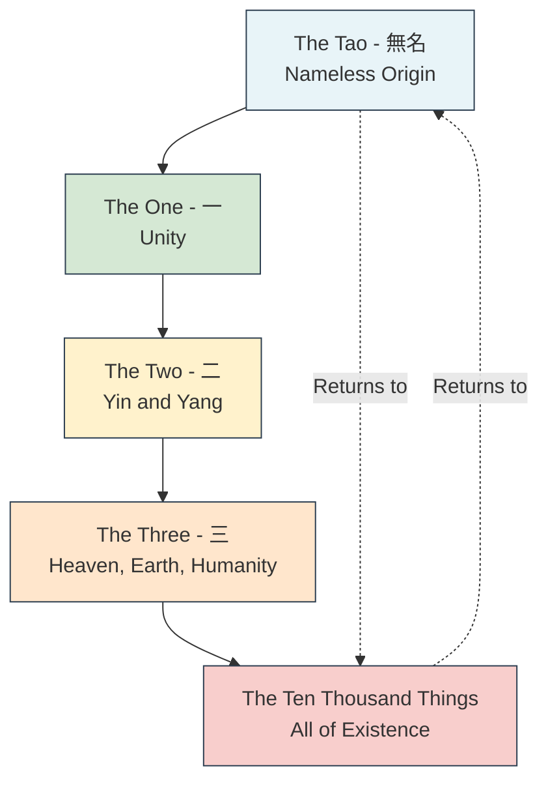
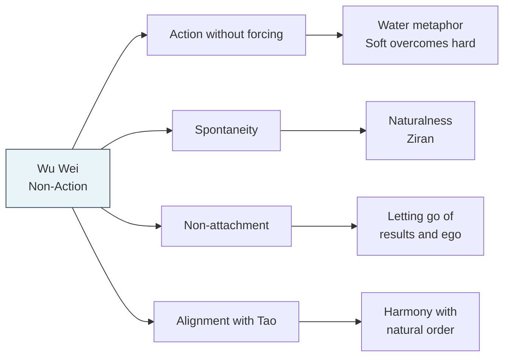
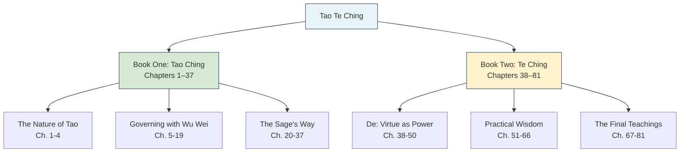

# Tao Te Ching — Deep Content Guide

## The Text at a Glance

The *Tao Te Ching* (道德經) is a compact text of approximately 5,000–5,500 Chinese characters, divided into 81 chapters (*zhang*). It is structured in two parts:

| Part | Chinese Title | Chapters | Focus |
|------|--------------|----------|-------|
| Book One | 道經 (Tao Ching) | 1–37 | The nature of the Tao — the Way, the source, the unnamed |
| Book Two | 德經 (Te Ching) | 38–81 | De — virtue, power, and its manifestation in human conduct |

The division may be artificial — some scholars believe the original text was continuous, and the Guodian bamboo slips (c. 300 BCE) and Mawangdui silk manuscripts (168 BCE) present the *Te Ching* section first, suggesting the title may originally have been *Te Tao Ching*.

---

## Core Concepts

### 1. Tao (道) — The Way

The Tao is the central concept of the entire text and of Taoism itself. It is simultaneously:

- The **origin** of all things ("The Tao gives birth to One. One gives birth to Two. Two gives birth to Three. Three gives birth to the ten thousand things." — Chapter 42)
- The **underlying pattern** or principle of the universe
- The **process** of change and transformation
- An **ineffable mystery** that precedes all names and concepts

The opening chapter establishes the paradox at the heart of the text:

> *The Tao that can be told is not the eternal Tao.*
> *The name that can be named is not the eternal name.*
> *The nameless is the beginning of heaven and earth.*
> *The named is the mother of ten thousand things.*
> — Chapter 1 (Stephen Mitchell translation)

The Tao is not a god, not a creator, not a being with intentions. It is more like the fundamental "suchness" of reality — the way things are when they are not distorted by human desire, ambition, and conceptual thinking. It is compared to water, the void, the uncarved block, and the valley.

### 2. De (德) — Virtue / Power / Integrity

*De* is the second key term in the title. It is commonly translated as "virtue," but this is misleading — it does not carry the moral overtones of the English word. Better translations include:

- **Power** or **potency** — the inherent capacity of a thing to act according to its nature
- **Integrity** — the state of being whole, undivided, true to one's nature
- **Virtue** in the original Latin sense of *virtus* — inner strength, excellence

*De* is what happens when a being is in alignment with the Tao. A tree growing toward sunlight is expressing its *De*. A sage governing without forcing is expressing their *De*. The *Te Ching* section (chapters 38–81) explores how *De* manifests in human life — through simplicity, humility, non-contention, and compassion.

### 3. Wu Wei (無為) — Non-Action / Effortless Action

*Wu wei* is perhaps the most famous and most misunderstood Taoist concept. It does **not** mean passivity, laziness, or doing nothing. Rather, it describes action that is:

- **Effortless** — like water flowing downhill, or a skilled artisan whose hand moves without conscious thought
- **Non-coercive** — acting without forcing outcomes, without struggling against the grain of reality
- **Spontaneous** — arising naturally from the situation rather than from plans, ambitions, or calculations
- **Unattached** — acting without clinging to results or seeking recognition

The classic metaphor is water:

> *The softest things of the world*
> *Override the hardest things of the world.*
> — Chapter 43

> *Nothing in the world is as soft and yielding as water.*
> *Yet for dissolving the hard and inflexible, nothing can surpass it.*
> — Chapter 78 (Stephen Mitchell translation)

### 4. Ziran (自然) — Naturalness / Spontaneity

Closely related to wu wei, *ziran* literally means "self-so" or "of itself so." It describes the state of things when they are left to be as they are — without artificial interference, social conditioning, or ego-driven modification. A forest growing undisturbed is *ziran*. A child playing freely is *ziran*. The Taoist ideal is to return to this original, natural state.

### 5. Pu (朴) — The Uncarved Block

*Pu* is a metaphor for the original, unadulterated state of being — before names, categories, desires, and ambitions carve it into fragments. The uncarved block has unlimited potential; once carved into specific forms, it loses its wholeness. Chapter 19 captures this:

> *Cut off peculiarity! Discard cleverness!*
> *And the people will benefit a hundredfold.*
> — Chapter 19

### 6. The Sage (聖人)

Throughout the text, the *shengren* (sage or holy person) serves as the ideal of Taoist practice. The sage:

- Leads without dominating
- Speaks without lecturing
- Gives without expecting return
- Acts without contending
- Remains humble and self-effacing
- Embraces simplicity and the uncarved block
- Is "like an infant not yet smiling" (Chapter 20)

The sage is not an ascetic or a recluse but a model of how to live in the world — a ruler, parent, or individual who has aligned themselves with the Tao and thereby benefits all around them without effort.

---

## Chapter Themes and Groupings

The 81 chapters can be grouped by recurring themes:

| Theme | Representative Chapters | Key Ideas |
|-------|------------------------|-----------|
| **The Nature of the Tao** | 1, 4, 14, 21, 25, 34, 40, 42 | Origin, invisibility, infinity, naming paradox |
| **Wu Wei (Non-Action)** | 2, 3, 10, 29, 37, 43, 48, 57, 60 | Effortless action, non-coercion, spontaneity |
| **The Sage as Ruler** | 3, 17, 22, 28, 32, 49, 57, 60, 62, 66, 68, 78 | Governing by non-interference, leading by yielding |
| **Simplicity and Humility** | 5, 8, 11, 15, 19, 20, 22, 28, 33, 38, 41, 44, 45, 46, 58, 64, 67, 69, 71 | The uncarved block, modesty, the value of emptiness |
| **Water as Metaphor** | 7, 8, 43, 66, 76, 78 | Softness overcomes hardness, yielding is strength |
| **Reversal and Paradox** | 2, 16, 22, 28, 36, 40, 41, 58, 65, 78 | What is full becomes empty; what is strong becomes weak |
| **Desire and Contentment** | 1, 9, 12, 33, 34, 44, 46, 48, 52, 80 | Dangers of desire, power of knowing sufficiency |
| **Knowledge vs. Wisdom** | 19, 33, 41, 47, 56, 71, 81 | True knowledge is intimate, not accumulated |
| **The Return** | 16, 25, 40, 47, 52, 54, 59 | Returning to the source, to the Tao, to the root |

---

## The 81 Chapters — A Structural Map

---

## Political Philosophy

The *Tao Te Ching* is not merely a spiritual text — it is profoundly concerned with governance. Laozi was writing during a period of political chaos, and many chapters address rulers directly. His political philosophy is radical:

**The ideal ruler governs so lightly that the people barely know they exist.**

> *The highest type of ruler is one of whose existence the people are barely aware.*
> *When his work is done, his aim fulfilled, they will say: we did it ourselves.*
> — Chapter 17 (D.C. Lau translation)

**Laws, punishments, and taxes are signs of failure, not of good governance:**

> *The more prohibitions there are, the poorer the people become.*
> *The sharper the weapons, the more troubled the state.*
> *The more clever the people, the more odd contrivances appear.*
> — Chapter 57

**War is to be avoided:**

> *Those who use force against others will themselves be undone by force.*
> *Where armies are, thorns and brambles grow.*
> *After a great battle, the fields are all barren.*
> — Chapter 30

This political vision influenced the Chinese tradition of Huang-Lao (Yellow Emperor–Laozi) governance, which emphasised minimal intervention and was practiced during the early Han dynasty (206 BCE – 220 CE).

---

## Spiritual Practice

While the *Tao Te Ching* does not prescribe specific meditation techniques or rituals, it points toward a spiritual practice of:

1. **Returning to the source** — withdrawing from the distractions of the senses and desires to reconnect with the Tao (Chapters 16, 47, 52)
2. **Embracing emptiness** — the bowl is useful because of its emptiness; the room is habitable because of its empty space (Chapters 11, 16)
3. **Observing the natural** — watching the cycles of the seasons, the patterns of growth and decay, the rhythm of contraction and expansion (Chapters 25, 40)
4. **Cultivating stillness** — "Return to the stillness of the root" (Chapter 16); the sage "sits in oblivion" (*zuowang*)
5. **Practising contentment** — knowing when enough is enough; "He who knows that he has enough is rich" (Chapter 44)

---

## Key Passages

### Chapter 1 — The Ineffable Tao
> The Tao that can be told is not the eternal Tao.
> The name that can be named is not the eternal name.
> The nameless is the beginning of heaven and earth.
> The named is the mother of ten thousand things.
> Ever desireless, one can see the mystery.
> Ever desiring, one can see the manifestations.
> These two spring from the same source but differ in name;
> this appears as darkness.
> Darkness within darkness.
> The gate to all mystery.

### Chapter 8 — Water as Virtue
> The highest goodness is like water.
> Water benefits all things and does not compete with them.
> It dwells in places that all disdain.
> This is why it is so near to the Tao.

### Chapter 11 — The Utility of Emptiness
> Thirty spokes share the wheel's hub;
> It is the center hole that makes it useful.
> Shape clay into a vessel;
> It is the space within that makes it useful.
> Cut doors and windows for a room;
> It is the holes which make it useful.
> Therefore profit comes from what is there;
> Usefulness from what is not there.

### Chapter 37 — Non-Action and Order
> The Tao never does anything,
> Yet through it all things are done.
> If kings and lords could keep to it,
> The myriad things would transform of themselves.

### Chapter 40 — Reversal
> Reversal is the movement of the Tao.
> Yielding is the way of the Tao.
> The ten thousand things are born of being.
> Being is born of not-being.

### Chapter 67 — The Three Treasures
> I have just three things to teach:
> Simplicity, patience, compassion.
> These three are your greatest treasures.
> Simple in actions and in thoughts,
> you return to the source of being.
> Patient with both friends and enemies,
> you accord with the way things are.
> Compassionate toward yourself,
> you reconcile all beings in the world.

---

## The Paradox of the Text

The *Tao Te Ching* deliberately undermines its own authority. Chapter 1 warns that the Tao cannot be named; yet the text proceeds to name it 76 times. The opening chapter declares that knowledge is impossible; yet the text offers extensive guidance. This is not hypocrisy but a deliberate strategy:

- **Language points beyond itself**: Like a finger pointing at the moon, the words are tools to be used and then discarded
- **Paradox forces contemplation**: The contradictions prevent the reader from settling into easy understanding, keeping the mind active and open
- **The text enacts its own teaching**: By being simultaneously profound and playful, authoritative and self-deprecating, it models the Tao's own nature — always present, never fixed

As the Zen tradition would later express it: "If you meet the Buddha on the road, kill him." The *Tao Te Ching* teaches the same lesson — do not mistake the teaching for the reality it points toward.

---

## Influence on Later Traditions

### Taoism
The text became the central scripture of religious Taoism. The Celestial Masters sect (founded 142 CE) used it in rituals and ethical instruction. The Quanzhen school (founded 12th century) incorporated its teachings into alchemical and meditative practice. Laozi was deified as Daode Tianzun, one of the Three Pure Ones.

### Buddhism
When Buddhism entered China (1st–2nd century CE), Taoist concepts — particularly *wu wei* and *kong* (emptiness) — provided the interpretive framework through which Buddhist ideas were understood. Chan (Zen) Buddhism, which emphasised direct experience over scripture, shows clear Taoist influence. The concept of "no-mind" (*wuxin*) parallels Taoist wu wei.

### Confucianism
While Confucianism and Taoism are often seen as opposed, they also complement each other. The Confucian tradition of *daotong* (the Way of the sages) engaged with Taoist ideas. Neo-Confucian thinkers like Zhou Dunyi drew on Taoist metaphysics. The common saying captures it: "In private, follow the Tao; in public, follow the Confucians."

### Western Thought
The *Tao Te Ching* influenced the American Transcendentalists (Emerson, Thoreau), who found in it confirmation of their intuitions about nature, self-reliance, and the limits of conventional morality. In the 20th century, the text became central to the counterculture movement, the environmental movement, and contemporary mindfulness practice. Alan Watts, Joseph Campbell, and the beat poets all drew deeply from its wells.

### Martial Arts and Medicine
The principles of wu wei and yielding over force pervade Chinese martial arts, particularly Tai Chi Chuan, Aikido, and Baguazhang. Traditional Chinese medicine — including acupuncture, herbal medicine, and qigong — is grounded in Taoist concepts of qi, yin-yang, and harmony with natural cycles.
